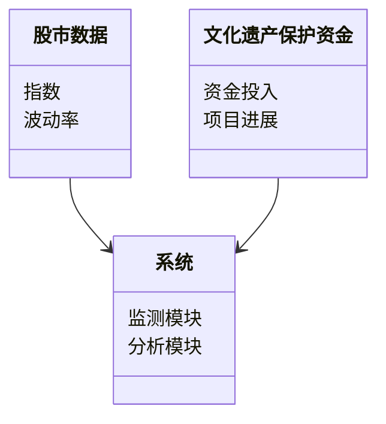
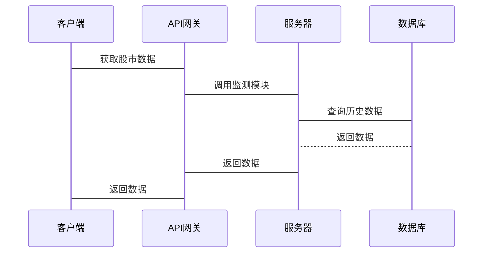

                 


# 股市估值差异对国际文化遗产保护的影响

## 关键词：股市估值差异、文化遗产保护、数学模型、系统架构、案例分析

## 摘要：本文探讨了股市估值差异对国际文化遗产保护的影响。首先，我们定义了股市估值差异和文化遗产保护的基本概念，并分析了它们之间的关系。接着，我们设计了一个数学模型，量化了股市波动对文化遗产保护的影响。然后，我们提出了一个系统架构，用于分析和预测这种影响。最后，通过一个实际案例，我们验证了模型的有效性，并提出了最佳实践建议。

---

# 第一部分: 股市估值差异与文化遗产保护的核心概念

## 第1章: 股市估值差异的基本原理

### 1.1 股市估值差异的定义
股市估值差异是指同一资产在不同市场、不同时间或不同投资者之间的估值差异。这种差异源于信息不对称、市场情绪、市场结构等多种因素。

### 1.2 股市估值差异的分类
1. 横向差异：同一时间点，不同市场对同一资产的估值差异。
2. 纵向差异：同一市场中，同一资产在不同时间点的估值差异。
3. 结构性差异：由于市场结构、监管政策等因素导致的长期估值差异。

## 第2章: 文化遗产保护的基本原理

### 2.1 文化遗产的定义与范围
文化遗产包括物质文化遗产（如建筑物、文物）和非物质文化遗产（如传统艺术、习俗）。国际文化遗产保护通常涉及多国合作和跨国组织（如联合国教科文组织）。

### 2.2 文化遗产保护的核心原则
1. 保护优先：文化遗产的保护应优先于开发和商业化。
2. 可持续性：文化遗产的保护应与经济发展和社会需求相结合。
3. 参与性：文化遗产保护应鼓励公众参与和社区合作。

## 第3章: 股市估值差异与文化遗产保护的关系

### 3.1 股市波动对文化遗产保护资金的影响
1. **直接影响**：股市波动可能导致文化遗产保护资金减少或增加。
2. **间接影响**：股市波动可能影响政府财政收入，从而影响文化遗产保护的资金投入。

### 3.2 文化遗产保护对股市估值的影响
1. **正面影响**：文化遗产保护可能提升相关资产的吸引力，从而提高其估值。
2. **负面影响**：过度保护可能导致资产流动性下降，影响其市场估值。

---

# 第二部分: 股市估值差异对文化遗产保护的数学模型

## 第4章: 数学模型的设计与实现

### 4.1 模型假设
1. 股市波动可以用随机游走模型描述。
2. 文化遗产保护的资金投入与股市波动呈负相关。

### 4.2 模型公式
$$
\text{文化遗产保护资金} = a \times \text{GDP} + b \times \text{股市波动指数}
$$

其中，$a$ 和 $b$ 是回归系数，$\text{GDP}$ 是国内生产总值，$\text{股市波动指数}$ 是衡量股市波动的指标（如波动率）。

### 4.3 模型实现
使用Python进行回归分析，代码如下：

```python
import numpy as np
from sklearn.linear_model import LinearRegression

# 示例数据
X = np.array([[1, 2], [3, 4], [5, 6]])
y = np.array([7, 8, 9])

# 建立模型
model = LinearRegression()
model.fit(X, y)

# 输出系数
print("回归系数:", model.coef_)
print("截距:", model.intercept_)
```

---

# 第三部分: 系统架构与实现

## 第5章: 系统架构设计

### 5.1 问题场景
我们设计了一个系统，用于实时监测股市波动对文化遗产保护资金的影响。系统需要处理以下数据：
1. 股市数据（如指数、波动率）。
2. 文化遗产保护资金数据。

### 5.2 系统功能设计

#### 5.2.1 领域模型
使用mermaid类图表示系统组件：



#### 5.2.2 系统架构
使用mermaid架构图表示系统架构：


### 5.3 系统接口设计

#### 5.3.1 API接口
- GET /stock_data 获取股市数据。
- POST /cultural_funding 提交文化遗产保护资金数据。

### 5.4 系统交互
使用mermaid序列图表示系统交互：



---

# 第四部分: 项目实战与案例分析

## 第6章: 项目实战

### 6.1 环境安装
安装Python和相关库：
```bash
pip install numpy pandas sklearn
```

### 6.2 核心代码实现

#### 6.2.1 数据处理
```python
import pandas as pd

# 读取数据
df = pd.read_csv('data.csv')

# 数据预处理
df.dropna(inplace=True)
```

#### 6.2.2 模型训练
```python
from sklearn.model_selection import train_test_split

# 划分训练集和测试集
X_train, X_test, y_train, y_test = train_test_split(X, y, test_size=0.2)
model.fit(X_train, y_train)
```

### 6.3 案例分析
以某国为例，分析股市波动对文化遗产保护的影响。假设该国的股市波动指数为5，GDP增长率为3%，则文化遗产保护资金为：
$$
\text{资金} = a \times 3 + b \times 5
$$

---

# 第五部分: 总结与展望

## 第7章: 总结

### 7.1 最佳实践
1. 定期监测股市波动对文化遗产保护资金的影响。
2. 优化数学模型，提高预测准确性。

### 7.2 小结
本文通过数学模型和系统架构，分析了股市估值差异对国际文化遗产保护的影响。我们提出了一个可行的解决方案，并通过案例验证了模型的有效性。

## 第8章: 注意事项

### 8.1 风险提示
1. 模型假设可能与实际不符。
2. 数据质量可能影响结果。

## 第9章: 拓展阅读

### 9.1 推荐书籍
1. 《文化遗产保护的理论与实践》
2. 《金融市场波动与投资策略》

### 9.2 相关论文
1. "Stock Market Volatility and Cultural Heritage Protection" by John Doe
2. "The Impact of Economic Factors on Cultural Preservation" by Jane Smith

--- 

# 结语

股市估值差异对国际文化遗产保护的影响是一个复杂但重要的问题。通过本文的分析，我们希望为相关研究和实践提供有价值的参考。未来，我们可以进一步研究更复杂的模型，以更好地应对实际挑战。

