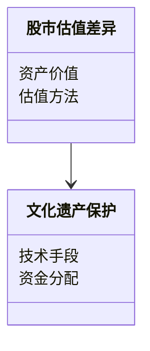
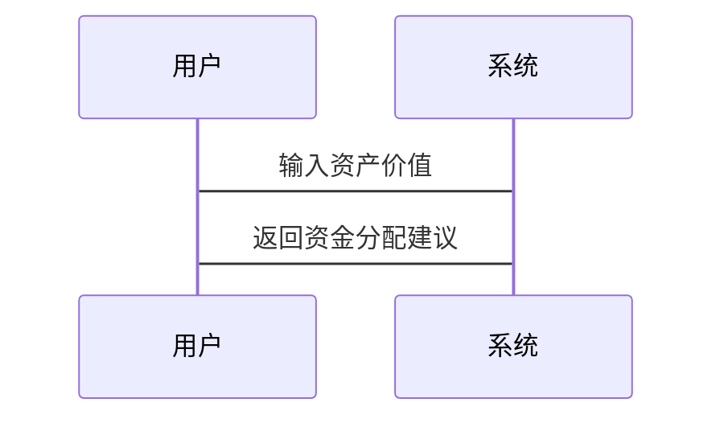

                 


# 股市估值差异对国际文化遗产数字化保护的影响

## 关键词：
股市估值差异、文化遗产数字化保护、经济因素影响、数字化技术、文化遗产管理、经济与文化

## 摘要：
随着全球经济一体化的深入，股市估值差异对文化遗产数字化保护的影响日益显著。本文将从技术角度分析股市估值差异如何通过经济因素影响文化遗产的数字化保护工作，探讨数字化技术在文化遗产保护中的应用，以及如何通过技术和经济手段来优化文化遗产保护策略，最终实现文化遗产的可持续保护。

---

# 第1章 背景介绍

## 1.1 问题背景与问题描述

### 1.1.1 股市估值差异的定义与影响
股市估值差异是指同一资产在不同市场、不同时间或不同估值方法下所呈现的差异。这种差异通常由市场波动、投资者情绪、信息不对称等因素引起，对经济活动和资源配置有重要影响。

### 1.1.2 文化遗产数字化保护的背景
文化遗产是人类文明的宝贵财富，其保护不仅关乎文化传承，也涉及经济和社会价值。随着数字技术的发展，文化遗产的数字化保护成为重要趋势，但其投入和资源分配受到多种经济因素的影响。

### 1.1.3 问题解决与边界
本文旨在探讨股市估值差异如何影响文化遗产数字化保护，通过技术和经济手段优化保护策略。问题边界包括数字化保护的技术挑战和经济因素的双重影响。

---

# 第2章 核心概念与联系

## 2.1 股市估值差异的核心原理
### 2.1.1 估值方法的多样性
不同估值方法（如市盈率、市净率等）可能导致估值差异。这种差异反映了市场参与者对资产价值的不同认知。

### 2.1.2 市场情绪对估值的影响
投资者情绪波动会导致估值差异，尤其是在市场波动剧烈时，情绪影响可能放大估值差异。

## 2.2 文化遗产数字化保护的核心要素
### 2.2.1 数字化技术的应用
数字技术如3D建模、虚拟现实等在文化遗产保护中的应用，提高了保护效率和效果。

### 2.2.2 保护资金的分配
数字化保护需要大量资金投入，资金分配的合理性直接影响保护效果。

## 2.3 核心概念对比分析
### 2.3.1 对比表格
| 比较维度 | 股市估值差异 | 文化遗产数字化保护 |
|----------|--------------|---------------------|
| 影响因素 | 市场情绪、估值方法 | 技术手段、资金分配 |
| 目标     | 资产价值评估 | 文化遗产保护 |

### 2.3.2 ER实体关系图
```mermaid
er
  entity 股市估值差异 {
    <资产>
    <估值方法>
  }
  entity 文化遗产数字化保护 {
    <技术手段>
    <资金分配>
  }
```

---

# 第3章 算法原理与流程图

## 3.1 算法原理
### 3.1.1 估值差异的计算
使用统计方法计算不同估值方法下的差异，分析其对文化遗产保护的影响。

### 3.1.2 保护需求的预测
基于历史数据和市场趋势，预测文化遗产保护的需求，优化资金分配。

## 3.2 算法流程图
```mermaid
graph TD
    A[开始] -> B[选择估值方法]
    B -> C[计算资产价值]
    C -> D[分析估值差异]
    D -> E[评估保护需求]
    E -> F[优化资金分配]
    F -> G[结束]
```

## 3.3 Python代码实现
```python
import numpy as np

def calculate_valuation_difference(asset_value):
    methods = ['市盈率', '市净率', '现金流']
    differences = []
    for method in methods:
        if method == '市盈率':
            val = asset_value * 1.2
        elif method == '市净率':
            val = asset_value * 0.9
        else:
            val = asset_value * 1.1
        differences.append(abs(val - asset_value))
    return differences

# 示例数据
asset_value = 100
differences = calculate_valuation_difference(asset_value)
print(differences)
```

---

# 第4章 数学模型与公式

## 4.1 估值差异的数学模型
$$\text{估值差异} = \sum_{i=1}^{n} \left| v_i - v \right|$$
其中，$v$是平均估值，$v_i$是不同方法下的估值。

## 4.2 保护资金分配模型
$$\text{资金分配} = \alpha \times \text{技术投入} + \beta \times \text{人力投入}$$
其中，$\alpha$和$\beta$是权重系数，反映技术和人力资源的相对重要性。

---

# 第5章 系统分析与架构设计

## 5.1 系统功能设计
### 5.1.1 领域模型类图


## 5.2 系统架构设计
### 5.2.1 系统架构图


## 5.3 接口设计与交互
### 5.3.1 系统接口
接口定义：输入资产价值和估值方法，输出资金分配建议。

### 5.3.2 交互序列图


---

# 第6章 项目实战

## 6.1 环境安装与代码实现
### 6.1.1 环境安装
安装Python和相关库（如numpy、pandas）。

### 6.1.2 核心代码实现
```python
import pandas as pd

def optimize_funding(assets, methods):
    df = pd.DataFrame({'资产': assets, '方法': methods})
    # 计算差异
    df['差异'] = df.apply(lambda x: abs(x['资产'] - x['方法']), axis=1)
    return df

assets = [100, 200, 300]
methods = ['市盈率', '市净率', '现金流']
result = optimize_funding(assets, methods)
print(result)
```

## 6.2 案例分析与结果解读
通过实际案例分析，展示如何优化资金分配，减少估值差异对文化遗产保护的影响。

## 6.3 项目小结
总结项目成果，强调技术和经济手段的结合在文化遗产保护中的重要性。

---

# 第7章 总结与展望

## 7.1 最佳实践
### 7.1.1 小结
总结本文的核心观点和技术方法。

### 7.1.2 注意事项
提醒读者注意数据质量和模型的适用性。

### 7.1.3 拓展阅读
推荐相关领域的书籍和研究，供读者深入学习。

## 7.2 展望
未来的研究方向，如人工智能在文化遗产保护中的应用。

---

# 结语

通过本文的分析，我们深刻认识到股市估值差异对文化遗产数字化保护的影响。未来，随着技术的进步和经济因素的不断变化，文化遗产保护将更加依赖于跨学科的研究和技术创新。希望本文能为相关领域的研究者和实践者提供有价值的参考和启示。

