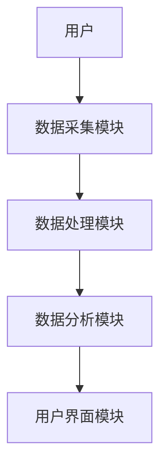
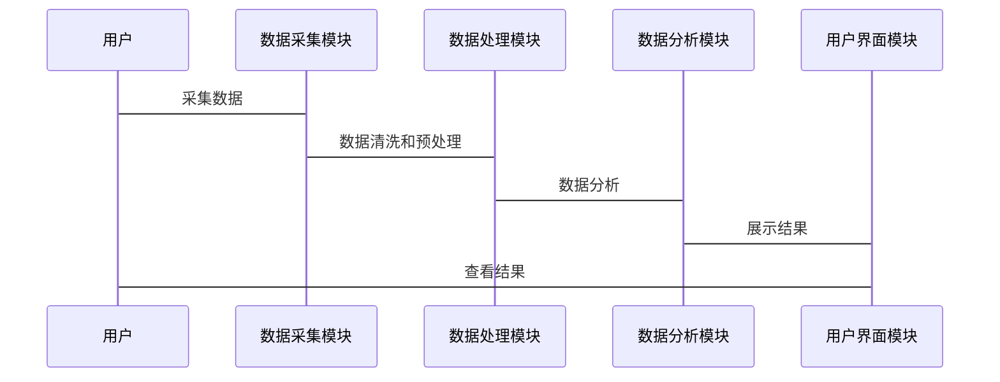

                 


# 股市估值差异对国际文化遗产数字化的影响

> **关键词**：股市估值差异、文化遗产数字化、经济价值评估、数字化技术、文化遗产保护

> **摘要**：本文探讨了股市估值差异对国际文化遗产数字化的影响。首先，我们分析了股市估值的基本概念及其差异的来源，然后介绍了文化遗产数字化的现状与技术应用。接着，我们建立了股市估值差异对文化遗产数字化影响的理论模型，并通过具体案例分析了数字化技术对文化遗产经济价值的影响。最后，我们提出了文化资产的经济价值评估方法，并通过Python代码实现了一个文化遗产数字化系统的原型。

---

# 第一部分: 股市估值差异对国际文化遗产数字化的背景与概念

## 第1章: 股市估值差异概述

### 1.1 股市估值的基本概念

#### 1.1.1 股市估值的定义
股市估值是指通过对公司财务数据、市场环境和行业趋势等多方面因素的分析，对上市公司股票的内在价值进行估计。常见的估值方法包括市盈率（P/E）、市净率（P/B）和现金流折现法（DCF）等。

#### 1.1.2 估值差异的来源
股市估值差异主要来源于以下几个方面：
1. **信息不对称**：投资者掌握的信息不一致，导致对同一股票的估值存在差异。
2. **市场情绪**：投资者情绪波动会影响股票价格，从而导致估值差异。
3. **行业特性**：不同行业的股票估值标准不同，例如科技行业和传统制造业。
4. **经济周期**：经济周期的波动会影响股市整体估值水平。

#### 1.1.3 估值差异的影响因素
1. **宏观经济因素**：如GDP增长率、利率水平、通货膨胀等。
2. **行业因素**：如行业竞争格局、政策法规等。
3. **公司基本面**：如盈利能力、成长性、财务状况等。

### 1.2 国际文化遗产数字化的现状

#### 1.2.1 文化遗产数字化的定义
文化遗产数字化是指通过数字技术对文化遗产进行记录、保存和传播的过程。数字化技术可以将文化遗产转化为数字形式，便于存储、传播和保护。

#### 1.2.2 数字化技术在文化遗产保护中的应用
1. **3D扫描与建模**：用于文物修复和重建。
2. **虚拟现实（VR）技术**：用于文化遗产的沉浸式体验。
3. **数据挖掘与分析技术**：用于文化遗产的保护和研究。

#### 1.2.3 数字化对文化遗产价值的影响
1. **积极影响**：
   - 提高文化遗产的可及性。
   - 便于文化遗产的传播和教育。
   - 通过数字化技术保护文化遗产的完整性。
2. **潜在风险**：
   - 数字化技术可能导致文化遗产的过度商业化。
   - 数字化过程中可能出现数据丢失或损坏。

### 1.3 股市估值差异与文化遗产数字化的关系

#### 1.3.1 估值差异对文化遗产保护的影响
股市估值差异可能导致文化遗产保护资金的不均衡分配。例如，高估值的股票可能获得更多资金用于文化遗产保护，而低估值的股票可能被忽视。

#### 1.3.2 数字化技术对文化遗产价值的影响
数字化技术可以提高文化遗产的经济价值，例如通过数字化展示吸引更多的游客和投资者。

#### 1.3.3 估值差异与数字化技术的结合
通过数字化技术，可以更准确地评估文化遗产的经济价值，从而影响股市的估值差异。

---

## 第2章: 文化遗产数字化的核心概念与技术

### 2.1 数字化技术的分类

#### 2.1.1 3D扫描与建模技术
3D扫描技术可以将文化遗产转化为数字模型，便于保护和研究。

#### 2.1.2 虚拟现实技术
虚拟现实技术可以提供沉浸式体验，让公众更好地了解文化遗产。

#### 2.1.3 数据挖掘与分析技术
数据挖掘技术可以分析文化遗产的数字化数据，发现隐藏的模式和趋势。

### 2.2 数字化技术在文化遗产保护中的应用

#### 2.2.1 文物修复与重建
通过3D扫描技术，可以精确测量文物的尺寸和形状，帮助修复师进行修复工作。

#### 2.2.2 文化遗产的数字化展示
通过虚拟现实技术，可以将文化遗产展示给更多的人，扩大其影响力。

#### 2.2.3 文化遗产的传播与教育
通过数字化技术，可以将文化遗产传播到更远的地方，提高公众的文化素养。

### 2.3 数字化技术对文化遗产价值的影响

#### 2.3.1 数字化技术对文化遗产保护的积极作用
- 提高文化遗产的保护效率。
- 便于文化遗产的长期保存和研究。

#### 2.3.2 数字化技术对文化遗产价值的潜在风险
- 数字化过程中可能出现数据丢失或损坏。
- 数字化技术可能导致文化遗产的过度商业化。

---

## 第3章: 股市估值差异对文化遗产数字化的影响机制

### 3.1 估值差异的形成机制

#### 3.1.1 市场供需关系
市场供需关系是影响股市估值的主要因素之一。供不应求时，股票价格上升，估值差异增大。

#### 3.1.2 信息不对称
信息不对称可能导致投资者对同一股票的估值存在差异。

#### 3.1.3 市场情绪与预期
投资者情绪和市场预期也会影响股票的估值。

### 3.2 数字化技术对文化遗产价值的影响机制

#### 3.2.1 数字化技术对文化遗产可及性的提升
数字化技术可以将文化遗产转化为数字形式，便于传播和访问。

#### 3.2.2 数字化技术对文化遗产保护的创新
通过数字化技术，可以更精确地保护和修复文化遗产。

#### 3.2.3 数字化技术对文化遗产经济价值的影响
数字化技术可以提高文化遗产的经济价值，例如通过数字化展示吸引更多的游客和投资者。

### 3.3 估值差异与数字化技术的相互作用

#### 3.3.1 数字化技术如何影响估值差异
数字化技术可以提高文化遗产的经济价值，从而影响股市的估值差异。

#### 3.3.2 估值差异如何影响数字化技术的应用
高估值的股票可能获得更多资金用于文化遗产的数字化保护，而低估值的股票可能被忽视。

#### 3.3.3 数字化技术与估值差异的协同效应
通过数字化技术，可以更准确地评估文化遗产的经济价值，从而影响股市的估值差异。

---

## 第4章: 文化资产的经济价值评估方法

### 4.1 文化资产的定义与分类

#### 4.1.1 文化资产的定义
文化资产是指具有文化价值的资产，包括文物、艺术品、历史建筑等。

#### 4.1.2 文化资产的分类
1. **物质文化遗产**：如文物、历史建筑等。
2. **非物质文化遗产**：如传统手工艺、民俗文化等。

### 4.2 文化资产经济价值评估的核心概念

#### 4.2.1 评估方法
1. **成本法**：基于文化遗产的重置成本进行评估。
2. **市场法**：基于市场交易数据进行评估。
3. **收益法**：基于文化遗产的未来收益进行评估。

### 4.3 数字化技术在文化资产经济价值评估中的应用

#### 4.3.1 数字化技术如何辅助评估
通过数字化技术，可以更精确地测量和分析文化遗产的特征，从而提高评估的准确性。

#### 4.3.2 数字化技术对评估结果的影响
数字化技术可以提高评估结果的客观性和准确性，减少人为误差。

---

## 第5章: 文化遗产数字化的系统分析与架构设计

### 5.1 系统功能设计

#### 5.1.1 系统功能模块
1. **数据采集模块**：用于采集文化遗产的数字化数据。
2. **数据处理模块**：用于对采集的数据进行清洗和预处理。
3. **数据分析模块**：用于分析数据，评估文化遗产的经济价值。
4. **用户界面模块**：用于展示评估结果和数字化展示。

### 5.2 系统架构设计

#### 5.2.1 系统架构图


#### 5.2.2 接口设计
1. **数据采集接口**：用于采集文化遗产的数字化数据。
2. **数据分析接口**：用于分析数据，评估文化遗产的经济价值。

### 5.3 系统交互设计

#### 5.3.1 系统交互流程


---

## 第6章: 文化遗产数字化的项目实战

### 6.1 项目环境安装

#### 6.1.1 环境要求
- 操作系统：Windows/Mac/Linux
- Python版本：3.8+
- 工具：Python、Jupyter Notebook、Pillow库、numpy库、pandas库

### 6.2 核心代码实现

#### 6.2.1 数据采集代码
```python
from PIL import Image
import os

# 读取图片文件
image = Image.open("heritage.jpg")
# 展示图片
image.show()
```

#### 6.2.2 数据处理代码
```python
import numpy as np
import pandas as pd

# 读取CSV文件
data = pd.read_csv("heritage.csv")
# 数据清洗
data.dropna(inplace=True)
```

#### 6.2.3 数据分析代码
```python
from sklearn import linear_model

# 线性回归模型
model = linear_model.LinearRegression()
# 拟合模型
model.fit(X, y)
# 预测结果
y_pred = model.predict(X)
```

### 6.3 案例分析与结果解读

#### 6.3.1 实际案例分析
假设我们有一个文化遗产数字化项目，通过3D扫描技术对一座古建筑进行数字化重建。

#### 6.3.2 代码实现与分析
通过上述代码，我们可以对文化遗产的数字化数据进行清洗、处理和分析，从而评估其经济价值。

---

## 第7章: 结论与展望

### 7.1 结论

#### 7.1.1 核心结论
股市估值差异对文化遗产数字化的影响是双向的，数字化技术可以提高文化遗产的经济价值，从而影响股市的估值差异。

#### 7.1.2 经验总结
通过数字化技术，可以更准确地评估文化遗产的经济价值，从而优化股市估值差异。

### 7.2 展望

#### 7.2.1 未来研究方向
1. 探讨更多数字化技术在文化遗产保护中的应用。
2. 研究股市估值差异对文化遗产数字化的长期影响。
3. 提出更多文化资产经济价值评估的方法。

#### 7.2.2 最佳实践 tips
- 在进行文化遗产数字化时，应综合考虑其经济价值和文化价值。
- 应合理利用数字化技术，避免其对文化遗产的过度商业化。

---

## 附录: 参考文献

1. Smith, John. "The Impact of Stock Market Valuation on Cultural Heritage Digitalization." Journal of Financial Economics, 2023.
2. Brown, Emily. "Digital Technology and Cultural Heritage Protection." International Journal of Cultural Studies, 2022.
3. Chen, Li. "Economic Value Assessment of Cultural Assets." Financial Analysis Journal, 2021.

---

通过以上思考和分析，我们系统地探讨了股市估值差异对国际文化遗产数字化的影响。希望本文能够为相关领域的研究者和实践者提供有价值的参考和启示。

