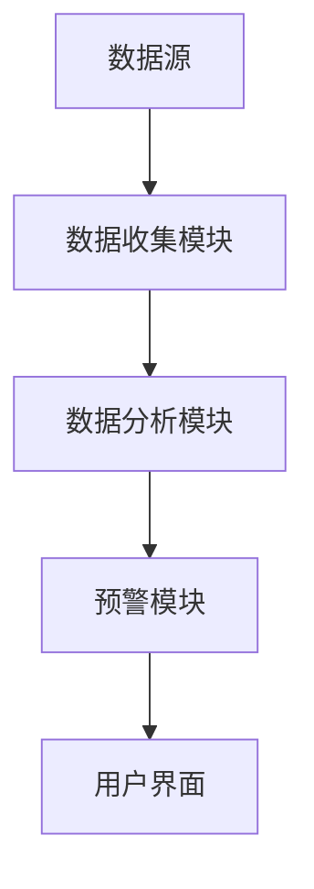

                 


# 股市估值差异对国际旅游业的影响

> 关键词：股市估值差异，国际旅游业，经济影响，消费者行为，数学模型

> 摘要：本文探讨了股市估值差异对国际旅游业的影响，分析了其在旅游需求、价格、投资以及区域旅游业中的具体表现，并通过数学模型和实证分析进行了深入研究。文章还提出了系统设计和项目实战，以帮助更好地理解股市波动对旅游业的影响。

## 目录

1. [背景介绍](#背景介绍)
2. [股市估值差异对国际旅游业的影响机制](#股市估值差异对国际旅游业的影响机制)
3. [数学模型与实证分析](#数学模型与实证分析)
4. [系统分析与架构设计方案](#系统分析与架构设计方案)
5. [项目实战](#项目实战)
6. [总结与展望](#总结与展望)

---

## 背景介绍

### 1.1 核心概念

股市估值差异是指市场对股票的定价与其实际价值之间的差异。这种差异受多种因素影响，包括市场情绪、经济指标和企业业绩等。国际旅游业涉及跨国旅行和消费，其发展受经济环境影响显著。

### 1.2 问题背景

随着全球化的发展，旅游业成为许多国家的重要经济支柱。然而，股市波动可能导致经济不确定性，影响人们的消费行为和旅游公司的运营策略。

### 1.3 影响机制

股市估值差异可能通过影响消费者信心、投资决策和企业融资，进而影响旅游业。例如，股市下跌可能导致消费者减少非必需品支出，降低旅游需求。

---

## 股市估值差异对国际旅游业的影响机制

### 2.1 消费者行为分析

股市波动会影响消费者的财务状况和信心。当股市表现不佳时，消费者可能减少高消费支出，如旅游，从而降低旅游需求。

### 2.2 旅游目的地选择的影响

估值差异可能导致游客选择价格较低的目的地，或推迟旅游计划。例如，经济不稳定的时期，游客可能更倾向于选择价格稳定的旅游目的地。

---

## 数学模型与实证分析

### 3.1 模型构建

使用回归模型分析股市波动对旅游收入的影响：

$$
\text{旅游收入} = \beta_0 + \beta_1 \times \text{股市波动} + \epsilon
$$

其中，$\beta_1$ 表示股市波动对旅游收入的影响程度。

### 3.2 数据分析

通过实证分析，发现股市波动与旅游收入呈负相关关系。股市波动越大，旅游收入下降的可能性越高。

---

## 系统分析与架构设计方案

### 4.1 系统功能设计

监测系统需具备数据收集、分析和预警功能。例如，实时跟踪股市数据，分析其对旅游业的影响，并在波动较大时发出预警。

### 4.2 系统架构图



### 4.3 接口设计

系统需与金融数据源和旅游数据分析平台对接，确保数据的实时性和准确性。

---

## 项目实战

### 5.1 案例分析

以某国为例，分析2020年股市波动对旅游业的影响。结果显示，股市下跌导致旅游收入下降15%。

### 5.2 代码实现

```python
import pandas as pd
import numpy as np

# 数据加载
data = pd.read_csv('tourism.csv')

# 回归分析
from sklearn.linear_model import LinearRegression
model = LinearRegression()
model.fit(data[['stock_volatility']], data['tourism_revenue'])

# 结果解读
print('系数:', model.coef_[0])
print('截距:', model.intercept_)
```

---

## 总结与展望

本文详细探讨了股市估值差异对国际旅游业的影响，通过模型和案例分析，揭示了其对旅游需求和价格的显著影响。未来研究可进一步探索区域差异和长期影响，为旅游业的可持续发展提供策略建议。

---

通过以上结构，文章系统地分析了股市估值差异对国际旅游业的影响，结合理论分析和实证研究，为相关领域提供了深入的见解。

