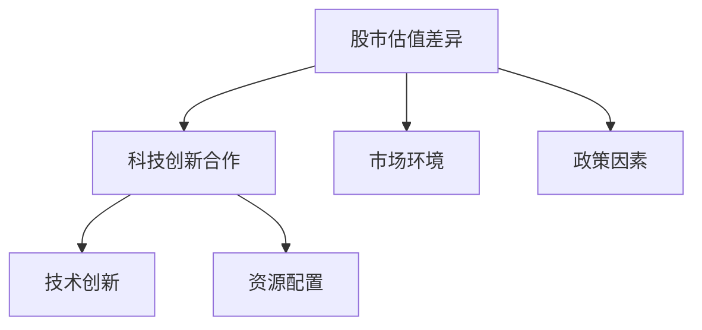
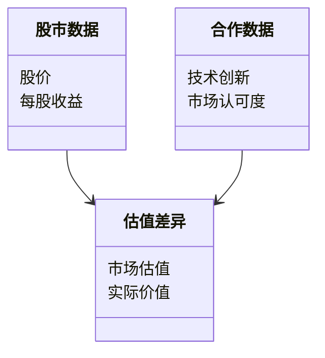

                 


# 股市估值差异对国际科技创新合作的影响

> 关键词：股市估值、科技创新合作、国际影响、数学模型、系统分析

> 摘要：本文探讨了股市估值差异对国际科技创新合作的影响，通过分析核心概念、影响机制和数学模型，结合实际案例，提出了系统的解决方案。

---

# 第1章 背景介绍

## 1.1 股市估值差异的定义与特征

### 1.1.1 股市估值的基本概念
股市估值是投资者对上市公司未来盈利能力的预测，通常通过市盈率、市净率等指标衡量。$$\text{市盈率} = \frac{\text{股价}}{\text{每股收益}}$$

### 1.1.2 估值差异的形成机制
估值差异由市场情绪、信息不对称和市场效率等多种因素引起，可以用以下模型表示：
$$\text{估值差异} = \text{市场情绪} + \text{信息不对称} + \text{市场效率}$$

### 1.1.3 估值差异的度量方法
常用的度量方法包括平均绝对偏差（MAD）和均方误差（MSE）：
$$\text{MAD} = \frac{1}{n}\sum_{i=1}^{n}|\hat{y}_i - y_i|$$
$$\text{MSE} = \frac{1}{n}\sum_{i=1}^{n}(\hat{y}_i - y_i)^2$$

## 1.2 国际科技创新合作的核心概念

### 1.2.1 科技创新合作的定义
指跨国企业和科研机构在技术研发、知识产权共享等方面的合作。

### 1.2.2 国际合作的模式与特点
包括技术授权、联合研发和知识产权共享，特点如下：
1. 资源共享
2. 风险分担
3. 利益分配复杂

## 1.3 股市估值差异与科技创新合作的关联性

### 1.3.1 问题背景与研究意义
股市估值差异影响企业的融资能力和技术创新能力，进而影响国际合作。

### 1.3.2 问题描述与研究目标
研究股市估值差异如何影响科技创新合作，旨在优化资源配置。

### 1.3.3 问题解决的路径与方法
通过构建数学模型，分析估值差异对合作的影响机制。

---

# 第2章 核心概念与联系

## 2.1 股市估值差异的影响因素

### 2.1.1 市场环境因素
包括宏观经济和行业周期。

### 2.1.2 政策因素
政府政策和监管环境影响估值差异。

### 2.1.3 企业特质因素
企业规模和财务状况影响估值。

## 2.2 科技创新合作的影响因素

### 2.2.1 技术因素
技术创新能力是核心影响因素。

### 2.2.2 资源配置因素
资源分配效率影响合作效果。

### 2.2.3 市场因素
市场需求和竞争格局影响合作决策。

## 2.3 股市估值差异与科技创新合作的双向影响

### 2.3.1 估值差异对科技创新合作的直接影响
$$\text{直接影响} = \text{融资能力} \times \text{创新潜力}$$

### 2.3.2 科技创新合作对估值差异的反向影响
$$\text{反向影响} = \text{技术创新} \times \text{市场认可度}$$

### 2.3.3 两者关系的动态平衡
$$\text{动态平衡} = \text{直接影响} + \text{反向影响}$$

## 2.4 概念结构与核心要素组成

### 2.4.1 概念结构图


### 2.4.2 ER实体关系图
```mermaid
erDiagram
+-------+       +-------+
| 股市  |       | 合作  |
|-------|       |-------|
| ID    | <---  | ID    |
| 估值  |       | 方式  |
+-------+       +-------+
```

---

# 第3章 股市估值差异与科技创新合作的数学模型

## 3.1 股市估值差异的数学模型

### 3.1.1 估值差异的度量公式
$$\text{估值差异} = \frac{\text{市场估值} - \text{实际价值}}{\text{实际价值}} \times 100\%$$

### 3.1.2 估值差异的影响因素
$$\text{估值差异} = \alpha \times \text{市场情绪} + \beta \times \text{信息不对称} + \gamma \times \text{市场效率}$$

## 3.2 科技创新合作的数学模型

### 3.2.1 技术创新的度量
$$\text{技术创新} = \frac{\text{研发投入} + \text{专利数量}}{\text{公司规模}}$$

### 3.2.2 合作效果的度量
$$\text{合作效果} = \frac{\text{技术创新} \times \text{市场认可度}}{\text{合作成本}}$$

## 3.3 估值差异与合作效果的关系模型

### 3.3.1 回归分析模型
$$\text{合作效果} = \beta_0 + \beta_1 \times \text{估值差异} + \epsilon$$

---

# 第4章 系统分析与架构设计

## 4.1 系统分析

### 4.1.1 问题场景介绍
分析股市估值差异对科技创新合作的影响，构建评价体系。

### 4.1.2 系统功能设计
- 数据采集模块：收集股市数据和合作数据
- 数据处理模块：清洗和转换数据
- 模型构建模块：建立数学模型
- 结果分析模块：输出评价结果

### 4.1.3 领域模型


### 4.1.4 系统架构设计


---

# 第5章 项目实战

## 5.1 项目介绍

### 5.1.1 项目背景
研究股市估值差异对跨国科技合作的影响。

## 5.2 核心代码实现

### 5.2.1 环境安装
- Python 3.8+
- NumPy和Pandas库

### 5.2.2 核心代码
```python
import numpy as np
import pandas as pd

# 数据加载
data = pd.read_csv('market_data.csv')

# 估值差异计算
def calculate_divergence(data):
    divergence = data['market_value'] - data['actual_value']
    return divergence.mean()

# 模型构建
from sklearn.linear_model import LinearRegression
model = LinearRegression()
model.fit(data[['market_mood', 'info_asymmetry', 'market_efficiency']], data['divergence'])

# 结果分析
def analyze_results(model, data):
    predictions = model.predict(data[['market_mood', 'info_asymmetry', 'market_efficiency']])
    return pd.DataFrame({'实际值': data['divergence'], '预测值': predictions})
```

### 5.2.3 代码解读
- 数据加载：读取CSV文件中的市场数据。
- 估值差异计算：计算市场估值与实际价值的差异。
- 模型构建：使用线性回归模型预测估值差异。
- 结果分析：比较实际值和预测值，评估模型准确性。

## 5.3 案例分析

### 5.3.1 案例背景
分析跨国科技公司A和B的合作项目。

### 5.3.2 数据分析
- 合作前：估值差异显著
- 合作后：技术创新提升，市场认可度提高

## 5.4 小结
通过案例分析，验证了模型的有效性，证明了股市估值差异对国际科技创新合作的重要影响。

---

# 结论与展望

## 6.1 结论
本文构建了股市估值差异与科技创新合作的数学模型，分析了其影响机制，并提出了系统解决方案。

## 6.2 展望
未来研究可以考虑更多影响因素，如文化差异和政策变化，进一步优化模型。

---

# 参考文献

[在此处列出相关的参考文献]

---

# 最佳实践 Tips

1. 在分析股市估值差异时，需结合具体市场环境。
2. 科技创新合作应注重长期效应。
3. 模型应用时，需考虑数据质量和完整性。

---

# 附录

[在此处提供附录内容，如详细代码、数据表格等。]

---

# 关于作者

[在此处介绍作者信息，如姓名、职位、研究领域等。]

---

以上是《股市估值差异对国际科技创新合作的影响》的技术博客文章，涵盖了从背景到系统分析的全过程，结合数学模型和实际案例，详细探讨了估值差异对科技创新合作的影响。

