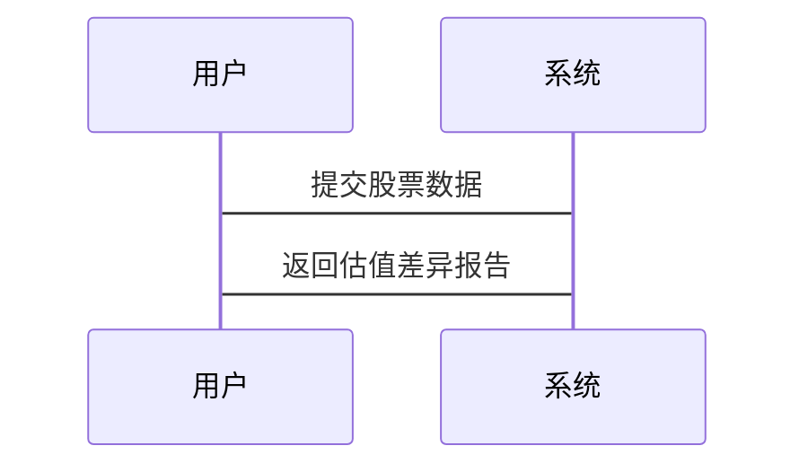

                 


# 股市估值差异对国际科技合作的影响

## 关键词：股市估值差异，国际科技合作，估值差异，科技合作，影响，ER实体关系图，线性回归模型，系统架构设计，项目实战，最佳实践

## 摘要：  
股市估值差异在国际科技合作中扮演着重要角色。本文通过分析股市估值差异的形成原因及其对国际科技合作的影响，探讨如何通过合理解决估值差异问题，促进科技合作的健康发展。文章从背景介绍、核心概念、算法原理、系统分析、项目实战到最佳实践，全面阐述了股市估值差异对国际科技合作的影响，为读者提供了深入的理论分析和实践指导。

---

## 第一部分：背景介绍

### 第1章：股市估值差异的基本概念

#### 1.1 股市估值差异的定义与特征  
股市估值差异是指同一股票在不同市场或同一市场不同时间段内的估值差异。其主要特征包括动态性、市场特异性和信息不对称性。

#### 1.2 国际科技合作的定义与特征  
国际科技合作是指跨国企业和科研机构通过合作研究、技术转让等方式进行科技交流与合作。其主要特征包括跨国性、互利性和知识共享性。

#### 1.3 估值差异的形成原因  
- 市场环境差异：不同市场的经济政策、法律法规和投资者行为导致估值差异。  
- 信息不对称：投资者对信息掌握的不充分性影响估值。  
- 股东结构差异：不同投资者的持股比例和投资目标不同。

#### 1.4 估值差异的分类与影响  
- 分类：市场间差异、时间差异、行业差异。  
- 影响：影响投资者决策、企业融资成本、科技合作的可持续性。

### 第2章：问题背景与问题描述  

#### 2.1 股市估值差异的现状分析  
- 不同市场的估值差异显著：例如，科技股在美国纳斯达克和中国创业板的估值差异较大。  
- 估值差异的动态变化：受市场波动、政策变化等因素影响。

#### 2.2 科技合作中的估值差异问题  
- 合作伙伴间的估值差异：可能导致利益分配不均。  
- 估值差异对合作模式的影响：影响合作的深度和广度。

### 第3章：问题解决与边界分析  

#### 3.1 解决估值差异的策略  
- 市场机制的作用：通过价格发现机制自动调整估值差异。  
- 政府政策的调节作用：通过政策引导和监管减少估值差异。

#### 3.2 问题的边界与外延  
- 边界条件：仅考虑主要市场和主要科技领域。  
- 外延：不涉及微观个体行为，仅分析宏观层面的影响。

---

## 第二部分：核心概念与联系

### 第4章：核心概念的原理分析  

#### 4.1 股市估值差异的原理  
- 信息不对称导致估值差异：投资者对信息掌握的不充分性影响估值。  
- 市场机制的作用：通过价格发现机制自动调整估值差异。

#### 4.2 科技合作中的估值差异  
- 合作伙伴间的估值差异：影响合作决策。  
- 估值差异对合作模式的影响：影响合作的深度和广度。

### 第5章：概念属性特征对比  

#### 5.1 股市估值差异的特征对比  
| 特征维度 | 定义 | 示例 |
|----------|------|------|
| 时间维度 | 估值差异随时间变化 | 短期波动 vs 长期趋势 |
| 市场维度 | 不同市场间的估值差异 | 美股 vs A股 |

#### 5.2 科技合作中的特征对比  
| 特征维度 | 定义 | 示例 |
|----------|------|------|
| 合作领域 | 技术领域 | IT vs 生物技术 |
| 合作模式 | 合作方式 | 合资企业 vs 技术转让 |

### 第6章：ER实体关系图架构  

#### 6.1 股市估值差异的实体关系  
```mermaid
er
actor: 股市参与者
entity: 股票
relationship: 估值
```

#### 6.2 科技合作的实体关系  
```mermaid
er
actor: 科技合作方
entity: 科技项目
relationship: 合作协议
```

---

## 第三部分：算法原理讲解

### 第7章：算法原理分析  

#### 7.1 股市估值差异预测算法  
- 线性回归模型：通过历史数据预测未来估值。  
  ```mermaid
  graph TD
    A[输入数据] --> B[特征提取]
    B --> C[模型训练]
    C --> D[预测结果]
  ```

  ```python
  import numpy as np
  def linear_regression(x, y):
      x_mean = np.mean(x)
      y_mean = np.mean(y)
      numerator = np.sum((x - x_mean) * (y - y_mean))
      denominator = np.sum((x - x_mean)**2)
      slope = numerator / denominator
      intercept = y_mean - slope * x_mean
      return slope, intercept
  ```

  例如，使用历史股价预测未来股价：  
  $$ y = a + b x $$  
  其中，a是截距，b是斜率。

#### 7.2 算法步骤与流程图  
- 输入数据：历史股价数据。  
- 特征提取：提取相关特征（如市盈率、市净率）。  
- 模型训练：使用线性回归模型训练参数。  
- 预测结果：输出预测的估值差异。

---

## 第四部分：系统分析与架构设计方案

### 第8章：问题场景介绍  

#### 8.1 系统功能设计  
- 领域模型：  
  ```mermaid
  classDiagram
      class 股票 {
          名称
          价格
      }
      class 合作伙伴 {
          公司
          股权
      }
      股票 --> 合作伙伴: 持股
  ```

- 系统架构设计：  
  ```mermaid
  architecture
  Client --> API Gateway
  API Gateway --> Load Balancer
  Load Balancer --> Service1, Service2
  Service1 --> Database
  ```

- 接口设计：  
  - 输入接口：合作伙伴信息、股票数据。  
  - 输出接口：估值差异报告。

### 第9章：系统交互设计  

#### 9.1 系统交互序列图  


---

## 第五部分：项目实战

### 第10章：环境安装与核心代码实现  

#### 10.1 环境安装  
- 安装Python和相关库：numpy、pandas、scikit-learn。

#### 10.2 核心代码实现  
```python
import numpy as np
import pandas as pd
from sklearn.linear_model import LinearRegression

# 数据加载
data = pd.read_csv('stock_data.csv')

# 特征与目标变量分离
X = data[['市盈率', '市净率']]
y = data['股价']

# 模型训练
model = LinearRegression()
model.fit(X, y)

# 预测
predictions = model.predict(X)
```

#### 10.3 代码应用解读与分析  
- 数据加载：从CSV文件加载股票数据。  
- 特征提取：提取市盈率、市净率作为特征。  
- 模型训练：使用线性回归模型训练。  
- 预测：使用训练好的模型预测股价。

### 第11章：实际案例分析  

#### 11.1 案例分析  
- 案例背景：某科技公司跨国合作中的估值差异问题。  
- 数据分析：通过模型预测估值差异。  
- 结果解读：根据预测结果调整合作策略。

#### 11.2 结果分析与优化  
- 模型预测结果与实际差异分析。  
- 根据结果优化合作策略。

---

## 第六部分：最佳实践、小结、注意事项、拓展阅读

### 第12章：最佳实践  

#### 12.1 小结  
- 股市估值差异是影响国际科技合作的重要因素。  
- 通过合理解决估值差异问题，可以促进科技合作的健康发展。

#### 12.2 注意事项  
- 数据质量：确保数据的准确性和完整性。  
- 模型选择：根据实际需求选择合适的模型。  
- 风险控制：合理评估模型的风险。

#### 12.3 拓展阅读  
- 推荐阅读相关书籍：《股票估值与投资分析》、《国际科技合作与创新》。

---

## 总结  
本文通过分析股市估值差异对国际科技合作的影响，提出了合理的解决方案和实践建议。希望本文能够为读者在相关领域的研究和实践中提供有价值的参考。

