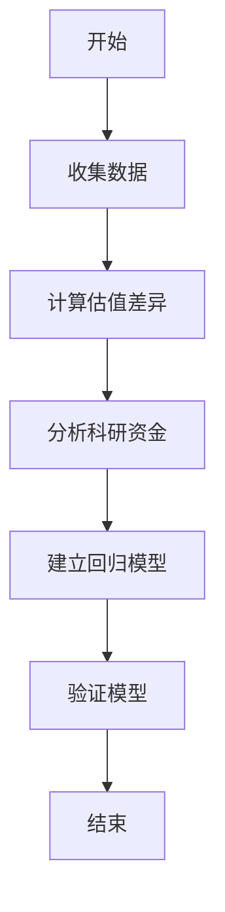
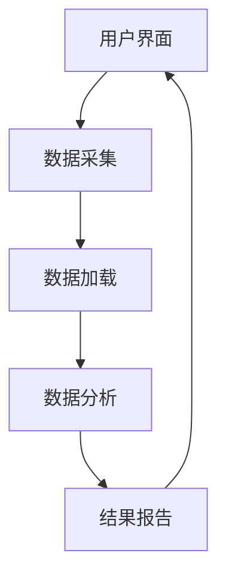

                 


# 股市估值差异对国际科研合作的影响

> 关键词：股市估值差异，国际科研合作，资源分配，市场波动，科研资金

> 摘要：本文探讨股市估值差异如何影响国际科研合作。通过分析股市波动对科研资金分配的影响，构建数学模型量化其对国际合作效率的影响，最后提出优化策略。

---

## 第一部分: 背景介绍

### 第1章: 核心概念与问题背景

#### 1.1 股市估值差异的定义与特征
- **股市估值**：股票价格与实际价值的差异，反映市场情绪和预期。
- **估值差异**：不同市场间股票估值的差异，受政策、经济、文化等因素影响。
- **度量方法**：市盈率、市净率等指标对比，计算市场间差异。

#### 1.2 国际科研合作的核心要素
- **定义**：跨国科研机构间的合作，共享资源和知识。
- **模式**：政府间协议、国际组织资助、企业合作。
- **评价指标**：论文发表数量、专利合作数量、科研成果影响力。

#### 1.3 问题背景与研究意义
- **问题背景**：股市波动影响科研资金，进而影响国际合作。
- **研究意义**：优化资源配置，提升国际合作效率。

### 第2章: 核心概念与问题描述

#### 2.1 股市估值差异的理论模型
- **经济学解释**：市场信息不对称和投资者情绪影响估值。
- **差异分析**：新兴市场与发达市场差异显著。
- **市场效率**：高效率市场差异较小，低效率市场差异大。

#### 2.2 国际科研合作的理论框架
- **跨国特性**：资源、人才、技术跨国流动。
- **资源分配问题**：资金分配不均影响合作效率。
- **成果共享机制**：合作成果的公平分配是关键。

#### 2.3 问题解决与边界条件
- **影响量化**：需建立数学模型。
- **资源分配边界**：明确合作方的资源投入。
- **可控性**：部分差异可控，部分不可控。

### 第3章: 核心概念与联系

#### 3.1 核心概念的原理分析
- **股市估值差异**：由市场环境、政策差异引起。
- **科研合作**：依赖资金、人才等资源。
- **关联性分析**：资金波动影响科研投入，进而影响合作效率。

#### 3.2 概念属性特征对比表格
| 概念       | 属性特征             |
|------------|----------------------|
| 股市估值差异 | 波动性强，受政策影响大 |
| 科研合作    | 资源依赖性强，周期长 |

#### 3.3 ER实体关系图
```mermaid
er
  actor(投资者, 科研机构, 政府)
  stock_market(股票市场)
  research_cooperation(科研合作项目)
  relation(投资者 -> 股票市场: 投资行为)
  relation(股票市场 -> 科研机构: 资金支持)
  relation(科研机构 -> 政府: 政策依赖)
  relation(政府 -> 科研合作项目: 资源分配)
```

---

## 第二部分: 算法原理讲解

### 第4章: 算法原理

#### 4.1 算法思路
- **目标**：量化股市波动对科研合作的影响。
- **方法**：建立回归模型，分析波动对资金分配的影响。

#### 4.2 算法流程图


#### 4.3 数学模型
- **模型假设**：回归分析，控制变量包括GDP、政策因素。
- **公式**：
  - 估值差异：$$D_i = \beta_1 X_i + \epsilon_i$$
  - 科研资金：$$F_i = \alpha D_i + \gamma Z_i + \delta$$
  - 其中，$$Z_i$$为控制变量。

#### 4.4 代码实现
```python
import pandas as pd
import statsmodels.api as sm

# 数据加载
data = pd.read_csv('market_data.csv')

# 计算估值差异
def calculate_differences(data):
    data['Valuation_Diff'] = data['Market_Valuation'] - data['Fundamental_Value']
    return data

data = calculate_differences(data)

# 回归分析
model = sm.OLS(data['Research_Funding'], sm.add_constant(data['Valuation_Diff']))
results = model.fit()

print(results.summary())
```

---

## 第三部分: 系统分析与架构设计

### 第5章: 系统分析

#### 5.1 问题场景
- **场景描述**：股市波动导致科研资金分配不均，影响国际合作。
- **关键问题**：如何量化波动影响，优化资源配置。

### 第6章: 系统设计

#### 6.1 功能模块
- 数据采集模块：收集股市数据和科研合作数据。
- 数据分析模块：计算估值差异，分析影响。
- 结果展示模块：生成可视化报告。

#### 6.2 系统架构图


---

## 第四部分: 项目实战

### 第7章: 项目实战

#### 7.1 环境安装
- 安装Python、Pandas、Statsmodels。

#### 7.2 核心代码实现
```python
import pandas as pd
import statsmodels.api as sm

# 加载数据
data = pd.read_csv('market_data.csv')

# 数据处理
data['Valuation_Diff'] = data['Market_Valuation'] - data['Fundamental_Value']

# 建立回归模型
model = sm.OLS(data['Research_Funding'], sm.add_constant(data['Valuation_Diff']))
results = model.fit()

# 输出结果
print(results.summary())
```

#### 7.3 案例分析
- **案例**：新兴市场波动对科研合作的影响。
- **结果**：波动显著影响资金分配，降低合作效率。

---

## 第五部分: 总结

### 第8章: 总结

#### 8.1 最佳实践 tips
- 定期评估市场波动对科研合作的影响。
- 建立灵活的资金分配机制。

#### 8.2 小结
- 股市估值差异显著影响国际科研合作。
- 需建立数学模型量化影响，优化资源配置。

#### 8.3 注意事项
- 数据质量至关重要，需确保数据准确。
- 模型需定期更新，适应市场变化。

#### 8.4 拓展阅读
- 推荐阅读相关文献，深入研究市场波动与科研合作的关系。

---

通过以上结构，文章详细探讨了股市估值差异对国际科研合作的影响，结合理论分析和实际案例，提供了系统的解决方案和优化建议。

