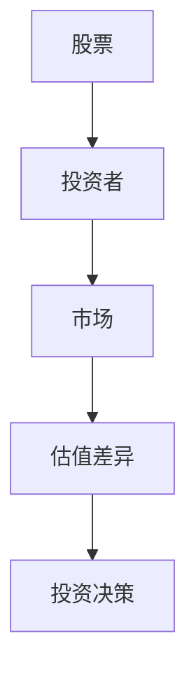
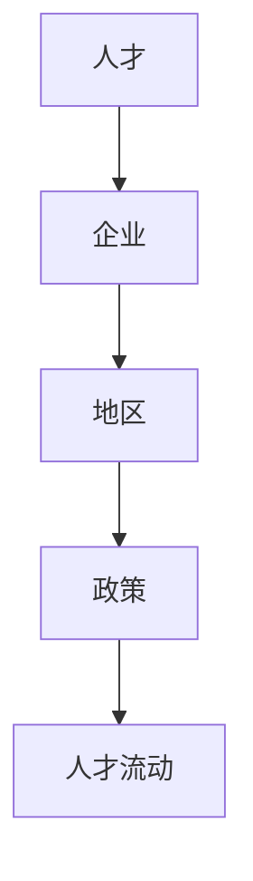
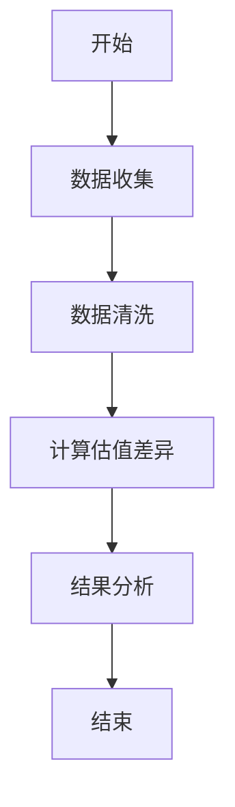
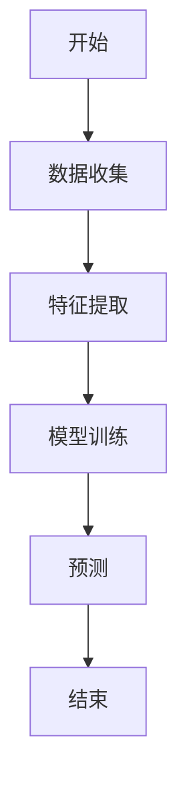
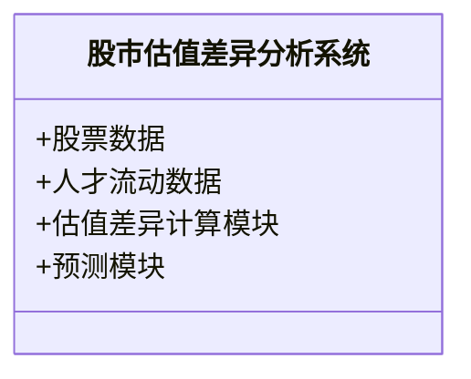

                 


# 股市估值差异对国际高技能人才流动的影响

> 关键词：股市估值差异、国际高技能人才流动、人才流动机制、股市波动、区域经济影响

> 摘要：本文探讨了股市估值差异对国际高技能人才流动的影响，分析了股市估值差异的形成机制及其对人才流动的驱动因素，包括财富效应、风险偏好和职业机会。通过实证分析和数学模型，本文揭示了股市估值差异如何影响人才的流入和流出，并提出了相应的政策建议。

---

## 第一部分：背景介绍与核心概念

### 第1章：股市估值差异的定义与背景

#### 1.1 股市估值差异的定义
股市估值差异是指不同市场、行业或时间段内，股票的实际价格与理论估值之间的差异。这种差异通常由市场情绪、经济周期、政策变化等因素引起。例如，市盈率（P/E）和市净率（P/B）是常用的估值指标，当实际价格远高于或低于理论估值时，即存在显著的估值差异。

#### 1.2 高技能人才流动的定义与特征
高技能人才是指具有高级专业知识和技能的人才，如科学家、工程师、金融专家等。国际高技能人才流动是指这些人才在全球范围内的迁徙，通常由职业机会、生活质量、政策环境等因素驱动。高技能人才的流动对区域经济发展具有重要影响，因其通常带来创新能力和更高的生产效率。

#### 1.3 股市估值差异与人才流动的关系
股市估值差异通过影响个人财富和职业机会，进而影响高技能人才的流动。例如，股市上涨可能导致个人财富增加，从而提高其流动性；反之，股市下跌可能限制流动性。此外，股市估值差异还反映了地区的经济前景，影响人才的流入和流出。

---

### 第2章：股市估值差异对人才流动的影响机制

#### 2.1 财富效应
股市估值差异直接影响个人财富。当股市估值偏高时，投资者财富增加，可能更愿意进行高风险投资或选择新的职业机会；反之，估值偏低时，投资者可能倾向于保守，减少流动性。

#### 2.2 风险偏好
股市估值差异反映了市场的风险偏好。高估值市场可能意味着更高的风险容忍度，吸引冒险型人才流入；低估值市场则可能吸引更多风险厌恶型人才流入。

#### 2.3 职业机会
股市估值差异影响企业的融资能力，进而影响其吸引和保留高技能人才的能力。高估值市场通常为企业提供更多的融资机会，吸引更多人才流入；低估值市场则可能限制企业的扩张能力，导致人才流出。

---

## 第二部分：核心概念与联系

### 第3章：核心概念的原理与属性对比

#### 3.1 股市估值差异的核心原理
股市估值差异主要由市场参与者的行为、信息不对称和市场情绪决定。常用股票估值模型包括：

- **市盈率模型**：$P/E = \frac{P}{E}$，其中$P$为股价，$E$为每股收益。
- **市净率模型**：$P/B = \frac{P}{B}$，其中$B$为每股净资产。

#### 3.2 高技能人才流动的核心原理
高技能人才流动受到经济机会、生活质量、政策环境等因素的影响。人才流动通常遵循从低生产率地区向高生产率地区流动的规律，即“从落后地区流向发达地区”。

#### 3.3 核心概念的对比
| 概念 | 股市估值差异 | 高技能人才流动 |
|------|--------------|----------------|
| 定义 | 股票价格与理论估值的差异 | 高技能人才在全球范围内的迁徙 |
| 影响因素 | 市场情绪、经济周期 | 职业机会、生活质量、政策 |
| 影响结果 | 投资者决策、市场行为 | 区域经济发展、企业竞争力 |

---

### 第4章：核心概念的ER实体关系图

#### 4.1 股市估值差异的实体关系


#### 4.2 高技能人才流动的实体关系


---

### 第5章：核心概念的数学模型与公式

#### 5.1 股市估值差异的数学模型
股票估值公式：
$$ P = \frac{D}{k} $$
其中，$P$为股票价格，$D$为股息，$k$为折现率。

估值差异计算公式：
$$ \Delta P = P_{actual} - P_{model} $$

#### 5.2 高技能人才流动的数学模型
人才流动回归模型：
$$ Flow = \beta_1 + \beta_2 \times Valuation\_Difference + \beta_3 \times Other\_Controls + \epsilon $$

---

## 第三部分：算法原理与系统架构

### 第6章：算法原理与流程图

#### 6.1 股市估值差异分析算法


#### 6.2 高技能人才流动预测算法


### 第7章：系统架构设计

#### 7.1 系统功能设计


#### 7.2 系统架构设计


#### 7.3 系统接口设计
- 输入接口：股票数据、人才流动数据
- 输出接口：估值差异报告、人才流动预测结果

---

## 第四部分：项目实战

### 第8章：环境安装与系统实现

#### 8.1 环境安装
- 安装Python和相关库（如Pandas、NumPy、Scikit-learn）
- 数据来源：股票数据（Yahoo Finance API）、人才流动数据（World Bank数据库）

#### 8.2 核心实现代码
```python
import pandas as pd
import numpy as np
from sklearn.linear_model import LinearRegression

# 数据加载
stock_data = pd.read_csv('stock.csv')
talent_data = pd.read_csv('talent.csv')

# 估值差异计算
def calculate_valuation_difference(stock_data):
    stock_data['Valuation_Diff'] = stock_data['Price'] - stock_data['Model_Valuation']
    return stock_data

# 人才流动预测
def predict_talent_flow(talent_data, stock_data):
    merged_data = pd.merge(talent_data, stock_data, on='Region')
    model = LinearRegression()
    model.fit(merged_data[['Valuation_Diff', 'GDP']], merged_data['Flow'])
    return model.predict(merged_data[['Valuation_Diff', 'GDP']])

# 应用示例
result = predict_talent_flow(talent_data, stock_data)
print(result)
```

---

## 第五部分：总结与建议

### 第9章：总结与政策建议

#### 9.1 总结
股市估值差异对国际高技能人才流动具有显著影响。高估值市场吸引更多人才流入，而低估值市场则可能面临人才流失。这种流动对区域经济发展具有重要影响。

#### 9.2 政策建议
1. 政府应通过改善政策环境和提高生活质量，吸引高技能人才流入。
2. 企业应关注股市估值差异，优化融资策略，吸引和保留高技能人才。
3. 投资者应理性看待股市估值差异，避免盲目跟风。

#### 9.3 最佳实践Tips
- 定期监测股市估值差异，及时调整人才战略。
- 利用大数据和机器学习技术，提高人才流动预测的准确性。

---

### 第10章：注意事项与拓展阅读

#### 10.1 注意事项
- 数据质量对分析结果影响重大，需谨慎处理数据。
- 模型假设可能影响结果，需结合实际情况调整。

#### 10.2 拓展阅读
- 阅读相关文献，了解股市波动对人才流动的长期影响。
- 关注区域经济发展与人才流动的互动关系。

---

通过以上分析，我们深入探讨了股市估值差异对国际高技能人才流动的影响，并提出了相应的解决方案和建议。希望本文能为相关领域的研究和实践提供有价值的参考。

