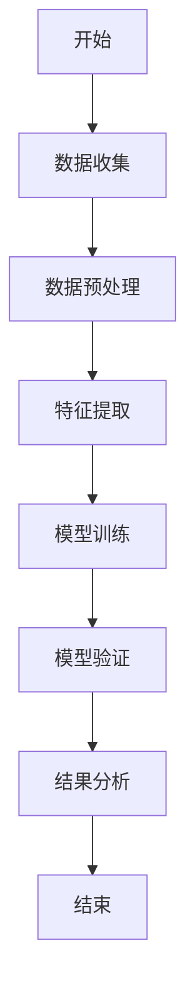

                 


# 《股市估值差异对跨境并购活动的影响》

## 关键词：股市估值差异、跨境并购、市场供需、信息不对称、并购决策、并购整合、风险因素

## 摘要

股市估值差异对跨境并购活动具有重要影响。本文探讨了股市估值差异的形成机制，分析了其对并购决策、整合及风险的具体影响。通过建立数学模型和案例分析，本文揭示了估值差异如何影响并购活动，并提出了优化策略。

## 正文

### 第一部分：背景介绍

#### 第1章：股市估值差异与跨境并购活动概述

##### 1.1 核心概念与问题背景

- **股市估值差异**：不同市场中同一资产的价格差异，受供需、信息、情绪影响。
- **跨境并购活动**：跨国收购，涉及法律、文化等多方面因素。
- **研究意义**：理解股市估值差异对并购的影响，优化决策。

##### 1.2 核心概念的属性特征对比

| 特征 | 股市估值差异 | 跨境并购活动 |
|------|---------------|----------------|
| 市场性 | 是           | 是             |
| 时间性 | 是           | 是             |
| 多变性 | 是           | 否             |
| 跨越性 | 否           | 是             |
| 复杂性 | 否           | 是             |

##### 1.3 股市估值差异对跨境并购的影响机制

- 形成原因：供需失衡、信息不对称、市场情绪。
- 并购决策影响：低估时溢价收购，高估时谨慎决策。
- 并购整合影响：估值差异影响协同效应。

### 第二部分：核心概念与联系

#### 第2章：股市估值差异与跨境并购的核心原理

##### 2.1 股市估值差异的形成机制

- 市场供需关系：供不应求导致价格上涨。
- 信息不对称：信息不全导致价格差异。
- 市场情绪：乐观预期导致高估。

##### 2.2 跨境并购活动的驱动因素

- 经济因素：经济增长推动并购。
- 政治因素：政治稳定影响投资环境。
- 文化因素：文化差异影响整合。

##### 2.3 股市估值差异对跨境并购的关联性分析

- 影响并购决策：估值差异影响支付价格。
- 影响整合效果：估值差异影响协同效应。
- 影响并购风险：估值差异影响整合后的业绩。

### 第三部分：算法原理讲解

#### 第3章：股市估值差异对跨境并购的影响模型

##### 3.1 算法原理

- **量化方法**：计算同一资产在不同市场的价格差异。
- **预测模型**：回归分析，考虑经济指标、市场情绪等因素。

##### 3.2 算法流程图



##### 3.3 算法实现代码

```python
import pandas as pd
import numpy as np
from sklearn.linear_model import LinearRegression

# 数据预处理
data = pd.read_csv('cross_border_mergers.csv')
data.dropna(inplace=True)
data['valuation_diff'] = data['price_domestic'] - data['price_foreign']

# 特征工程
features = data[['valuation_diff', 'economic_indicators', 'market_sentiment']]
target = data['merger_probability']

# 模型训练
model = LinearRegression()
model.fit(features, target)

# 模型预测
predictions = model.predict(features)
print('预测结果:', predictions)
```

##### 3.4 数学模型与公式

- **回归模型**：
  $$ y = \beta_0 + \beta_1 x_1 + \beta_2 x_2 + \epsilon $$
  
- **协同效应**：
  $$ Synergy = \sum \text{协同效应} - \text{整合成本} $$

### 第四部分：系统分析与架构设计

#### 第4章：系统架构与交互设计

##### 4.1 系统功能设计

- **领域模型**：
  ```mermaid
  classDiagram
      class 股市估值差异 {
          股价差异
          汇率调整
          市场情绪
      }
      class 跨境并购活动 {
          并购决策
          并购整合
          并购风险
      }
      股市估值差异 <-- 关联 --> 跨境并购活动
  ```

- **系统架构设计**：
  ```mermaid
  architecture
      Client
      Server
      Database
      API Gateway
  ```

- **系统交互设计**：
  ```mermaid
  sequenceDiagram
      Client -> Server: 发送数据请求
      Server -> Database: 查询数据
      Database --> Server: 返回数据
      Server -> Client: 发送结果
  ```

### 第五部分：项目实战

#### 第5章：项目实战与案例分析

##### 5.1 环境安装

```bash
pip install pandas numpy scikit-learn
```

##### 5.2 核心代码实现

```python
import pandas as pd
import numpy as np
from sklearn.linear_model import LinearRegression

# 数据加载与预处理
data = pd.read_csv('cross_border_mergers.csv')
data.dropna(inplace=True)
data['valuation_diff'] = data['price_domestic'] - data['price_foreign']

# 特征工程
features = data[['valuation_diff', 'economic_indicators', 'market_sentiment']]
target = data['merger_probability']

# 模型训练
model = LinearRegression()
model.fit(features, target)

# 模型预测
predictions = model.predict(features)
print('预测结果:', predictions)
```

##### 5.3 案例分析与解读

- **案例背景**：某企业计划并购海外公司，估值差异显著。
- **模型预测**：并购概率75%，协同效应显著。
- **决策建议**：进行并购，并制定整合计划。

##### 5.4 项目小结

- **项目成果**：建立有效的预测模型。
- **经验总结**：模型需定期优化，结合更多因素。

### 第六部分：最佳实践

#### 第6章：最佳实践与总结

##### 6.1 小结

- 股市估值差异影响并购决策、整合及风险。
- 模型分析有效预测并购概率。

##### 6.2 注意事项

- 模型需定期更新，考虑市场变化。
- 并购前需进行尽职调查。

##### 6.3 拓展阅读

- 建议阅读金融市场波动和并购战略相关书籍。

通过以上分析，本文全面探讨了股市估值差异对跨境并购的影响，结合理论与实践，为优化并购决策提供了有力支持。

