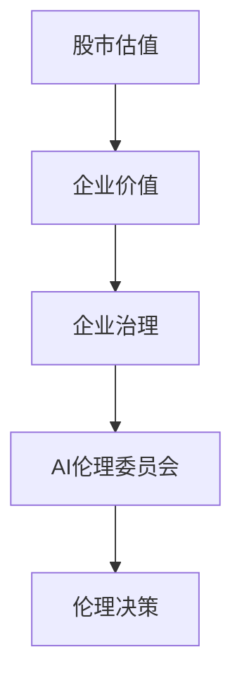
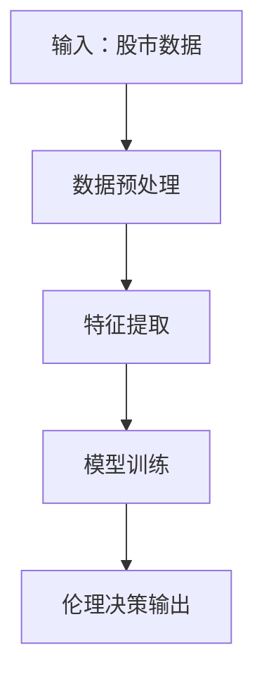
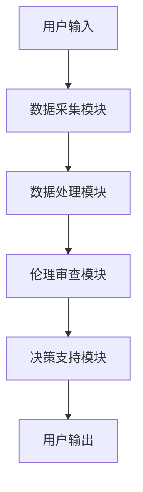

                 


# 股市估值高低对企业AI伦理委员会构成的影响

> 关键词：股市估值、企业价值、AI伦理委员会、伦理治理、企业治理

> 摘要：本文探讨了股市估值对企业AI伦理委员会构成的影响。通过分析股市估值的核心概念、AI伦理委员会的组织结构，以及两者之间的相互作用，本文揭示了股市估值如何影响企业的伦理治理和决策机制。结合实际案例和算法模型，本文进一步提出了企业如何根据股市估值优化AI伦理委员会的构建方法，为企业的可持续发展提供参考。

---

## 第一部分：背景介绍

### 第1章：股市估值与AI伦理委员会的背景

#### 1.1 股市估值的基本概念
- **1.1.1 股市估值的定义与计算方法**
  股市估值是市场对企业价值的评估，常用的指标包括市盈率（P/E）、市净率（P/B）和市值等。市盈率 = 股价 / 每股收益，市净率 = 股价 / 每股净资产。这些指标反映了市场对公司未来盈利能力的预期。
  
- **1.1.2 股市估值的核心影响因素**
  包括宏观经济环境、行业发展趋势、公司财务状况、管理团队能力和市场情绪等。例如，经济衰退可能导致整体股市估值下降，而技术创新则可能提升科技公司的估值。

- **1.1.3 股市估值与企业价值的关系**
  股市估值是企业价值的市场反映，高估值意味着市场对公司未来增长的看好，低估值则可能暗示市场对其前景的担忧。

#### 1.2 AI伦理委员会的定义与构成
- **1.2.1 AI伦理委员会的核心概念**
  AI伦理委员会是企业内设的专门机构，负责监督和指导AI技术的应用，确保其符合伦理规范。其核心职责包括审查AI算法的公平性、隐私保护、透明性等。

- **1.2.2 AI伦理委员会的组织架构**
  通常包括伦理学家、法律顾问、技术专家和相关业务部门代表。委员会的运作需要跨学科合作，确保伦理决策的全面性。

- **1.2.3 AI伦理委员会的职责与功能**
  包括制定伦理准则、审查AI项目、评估风险、提供伦理建议等。委员会的存在旨在平衡技术创新与社会责任。

#### 1.3 股市估值与AI伦理委员会的关系
- **1.3.1 股市估值对企业治理的影响**
  高估值企业通常有更多的资金和资源投入治理结构优化，包括伦理委员会的建设。低估值企业可能在治理投入上不足，影响伦理合规性。

- **1.3.2 AI伦理委员会在企业治理中的作用**
  通过规范AI应用，降低伦理风险，提升企业形象和投资者信心，从而影响股市估值。

- **1.3.3 股市估值对AI伦理委员会构成的影响**
  高估值企业可能更倾向于建立专业、全面的伦理委员会，而低估值企业可能在资源有限的情况下，难以维持有效的伦理治理机制。

---

## 第二部分：核心概念与联系

### 第2章：股市估值与AI伦理委员会的核心概念

#### 2.1 核心概念的原理
- **2.1.1 股市估值的核心原理**
  股市估值反映了市场对公司未来盈利能力和成长性的预期。高估值意味着市场对公司前景的乐观，低估值则可能反映市场对其前景的担忧。

- **2.1.2 AI伦理委员会的运行机制**
  伦理委员会通过制定伦理准则、审查AI项目、评估风险等方式，确保企业AI应用的合规性。其运行机制依赖于跨学科合作和高效的沟通机制。

- **2.1.3 两者之间的相互作用**
  股市估值影响企业的资源分配和治理投入，而AI伦理委员会的构建又反过来影响企业的伦理风险和市场形象，从而进一步影响股市估值。

#### 2.2 概念属性特征对比
下表对比了股市估值和AI伦理委员会的核心属性特征：

| 属性 | 股市估值 | AI伦理委员会 |
|------|----------|---------------|
| 核心目标 | 反映企业价值 | 规范AI应用 |
| 主要影响因素 | 经济环境、行业趋势 | 伦理风险、技术发展 |
| 衡量方式 | 财务指标（如市盈率） | 组织结构、审查流程 |
| 目标受众 | 投资者、市场 | 企业内部 |
| 作用 | 影响企业融资、并购 | 影响企业声誉、合规性 |

#### 2.3 ER实体关系图
以下为股市估值与AI伦理委员会的实体关系图：



---

## 第三部分：算法原理讲解

### 第3章：股市估值与AI伦理委员会的算法模型

#### 3.1 算法原理
- **3.1.1 股市估值预测算法**
  使用回归分析预测企业的未来估值。回归模型可以基于历史数据，预测未来估值的变化趋势。

- **3.1.2 AI伦理决策模型**
  通过网络模型评估AI项目的伦理风险，模型包括输入层（项目信息）、隐藏层（风险评估）和输出层（决策建议）。

- **3.1.3 两者的结合算法**
  将股市估值与伦理风险评估结果结合，预测不同估值水平下伦理委员会的构成变化。

#### 3.2 算法流程图
以下是股市估值预测与伦理决策的流程图：



#### 3.3 核心代码实现
以下为回归分析预测股市估值的Python代码示例：

```python
import pandas as pd
import numpy as np
from sklearn.linear_model import LinearRegression

# 数据准备
data = pd.DataFrame({
    '市盈率': [15, 20, 25, 18, 30],
    '市净率': [1.5, 2.0, 1.8, 1.2, 3.0],
    '估值': [100, 120, 130, 90, 150]
})

# 特征矩阵
X = data[['市盈率', '市净率']]
# 标签向量
y = data['估值']

# 模型训练
model = LinearRegression()
model.fit(X, y)

# 预测
new_data = np.array([[20, 2.5]])
predicted_valuation = model.predict(new_data)
print("预测估值为:", predicted_valuation)
```

#### 3.4 数学模型与公式
- **回归分析模型**
  $$ y = \beta_0 + \beta_1 x_1 + \beta_2 x_2 + \epsilon $$
  其中，$y$ 是预测估值，$x_1$ 和 $x_2$ 是市盈率和市净率，$\beta_0, \beta_1, \beta_2$ 是回归系数，$\epsilon$ 是误差项。

- **网络模型**
  $$ f(x) = \sigma(w_2 \cdot \sigma(w_1 x + b_1) + b_2) $$
  其中，$w_1, w_2$ 是权重矩阵，$b_1, b_2$ 是偏置，$\sigma$ 是激活函数。

---

## 第四部分：系统分析与架构设计方案

### 第4章：系统分析与架构设计

#### 4.1 问题场景介绍
企业需要根据股市估值调整AI伦理委员会的构成，以应对不同的伦理风险。例如，高估值企业可能需要更专业的伦理审查流程，而低估值企业则需要优化现有资源的利用效率。

#### 4.2 系统功能设计
- **数据采集模块**
  收集企业的财务数据、市场数据和AI项目信息。

- **伦理审查模块**
  对AI项目进行伦理评估，生成审查报告。

- **决策支持模块**
  根据估值和审查结果，提供伦理委员会优化建议。

#### 4.3 系统架构设计
采用分层架构：

1. **数据层**
   - 数据存储：数据库存储企业数据和审查记录。
   
2. **业务逻辑层**
   - 数据处理：对数据进行清洗、转换和分析。
   - 伦理评估：使用算法模型评估AI项目的伦理风险。

3. **表现层**
   - 用户界面：展示评估结果和优化建议。

#### 4.4 接口设计
- **输入接口**
  从数据库读取企业数据和AI项目信息。
  
- **输出接口**
  生成审查报告和优化建议，输出至用户界面。

#### 4.5 交互流程图


---

## 第五部分：项目实战

### 第5章：项目实战

#### 5.1 环境安装
- 安装Python和相关库（如pandas、scikit-learn）。
- 安装Mermaid图表工具。

#### 5.2 核心代码实现
以下是AI伦理委员会构成优化的Python代码示例：

```python
import pandas as pd
import numpy as np
from sklearn.cluster import KMeans

# 数据准备
data = pd.DataFrame({
    '部门': ['技术', '法务', '市场', '财务'],
    '人员数量': [10, 5, 8, 7],
    '职责': ['技术审核', '法律合规', '市场沟通', '财务支持']
})

# 模型训练
model = KMeans(n_clusters=2)
model.fit(data[['人员数量']])

# 预测结果
predicted_clusters = model.predict(data[['人员数量']])
print("预测簇为:", predicted_clusters)
```

#### 5.3 实际案例分析
以某科技公司为例，分析其AI伦理委员会的构成与股市估值的关系。通过对比不同估值水平下的伦理委员会规模和结构，总结经验教训。

---

## 第六部分：最佳实践

### 第6章：总结与建议

#### 6.1 小结
股市估值影响企业AI伦理委员会的构成，高估值企业更倾向于建立专业的伦理委员会，而低估值企业需要优化现有资源。

#### 6.2 注意事项
- 定期评估伦理委员会的构成和效果。
- 结合企业实际需求，灵活调整伦理委员会的规模和结构。

#### 6.3 未来展望
- 开发更智能化的伦理审查工具，提高委员会的工作效率。
- 探索AI伦理治理的新模式，如引入第三方评估机构。

---

## 结语

股市估值与企业AI伦理委员会的构成密切相关，高估值企业需要投入更多资源优化伦理治理，而低估值企业则需要通过优化资源配置实现合规。企业应根据自身的估值水平和实际需求，合理配置伦理委员会的资源和结构，确保在技术创新的同时，承担社会责任，实现可持续发展。

