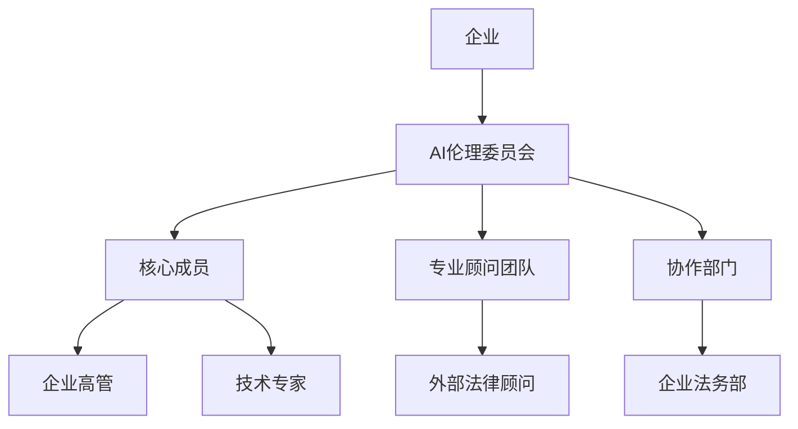
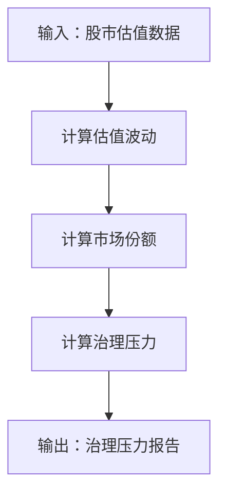
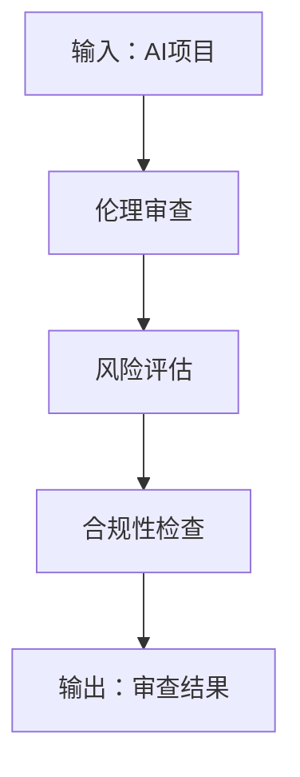
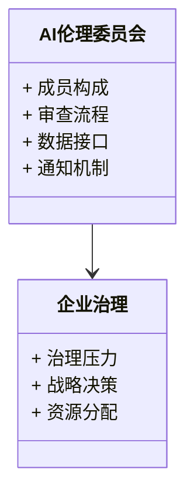
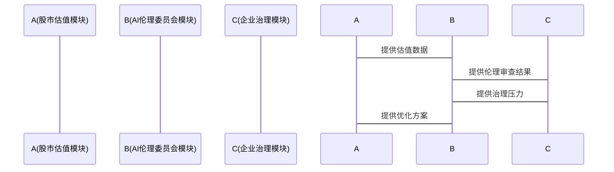

                 


# 股市估值高低对企业AI伦理委员会构成的影响

> 关键词：股市估值、AI伦理委员会、企业治理、AI伦理审查、AI技术合规

> 摘要：本文从股市估值的高低对企业AI伦理委员会构成的影响出发，系统地分析了高估值和低估值企业在AI伦理委员会构建方面的差异。通过结合企业治理、AI伦理审查、技术合规等核心内容，本文探讨了在不同市场环境下AI伦理委员会的组织架构、职责分配和运行机制。同时，本文提出了基于股市估值的AI伦理委员会优化方案，并通过具体案例分析和系统架构设计，为企业的AI伦理治理提供了实践指导。

---

## 目录

1. [背景介绍](#背景介绍)
   - 1.1 股市估值的基本概念
   - 1.2 AI伦理委员会的定义与构成
   - 1.3 股市估值与AI伦理委员会的相互影响

2. [核心概念与联系](#核心概念与联系)
   - 2.1 股市估值与AI伦理委员会的核心概念对比
   - 2.2 AI伦理委员会的实体关系图
   - 2.3 股市估值对企业治理压力的数学模型

3. [算法原理](#算法原理)
   - 3.1 股市估值对企业治理压力的评估算法
   - 3.2 AI伦理审查的流程优化算法
   - 3.3 基于股市估值的AI伦理委员会优化模型

4. [系统分析与架构设计](#系统分析与架构设计)
   - 4.1 问题场景介绍
   - 4.2 系统功能设计（领域模型）
   - 4.3 系统架构设计
   - 4.4 系统接口设计
   - 4.5 系统交互设计

5. [项目实战](#项目实战)
   - 5.1 环境安装与配置
   - 5.2 核心代码实现
   - 5.3 代码解读与分析
   - 5.4 实际案例分析

6. [最佳实践](#最佳实践)
   - 6.1 小结
   - 6.2 注意事项
   - 6.3 拓展阅读

---

## 1. 背景介绍

### 1.1 股市估值的基本概念
股市估值是衡量企业市场价值的重要指标，主要通过市盈率（P/E）、市净率（P/B）等指标进行评估。高估值意味着市场对企业未来盈利能力的预期较高，而低估值则可能反映市场对企业前景的悲观态度。股市估值的高低直接影响企业的战略决策、资本分配和管理层激励机制。

### 1.2 AI伦理委员会的定义与构成
AI伦理委员会是企业内负责审查和监督人工智能技术应用的伦理问题的组织。其核心功能包括：
- **伦理审查**：对AI技术的伦理风险进行评估和审查。
- **社会影响评估**：分析AI技术对社会的影响。
- **合规性监督**：确保AI技术符合相关法律法规和企业内部伦理准则。

AI伦理委员会的组织架构通常包括：
- 核心成员：由企业高管、法律顾问、伦理学家、技术专家组成。
- 专业顾问团队：外部专家提供技术支持和法律咨询。
- 协作部门：与企业法务、研发、市场等部门保持密切联系。

### 1.3 股市估值与AI伦理委员会的相互影响
高估值企业由于面临更大的市场压力和管理责任，对AI伦理委员会的需求更为迫切。相比之下，低估值企业可能在资源和精力上难以投入更多到AI伦理委员会的建设中。本文将重点分析这两种情况下AI伦理委员会的构成差异。

---

## 2. 核心概念与联系

### 2.1 股市估值与AI伦理委员会的核心概念对比
| **核心概念** | **股市估值** | **AI伦理委员会** |
|--------------|--------------|------------------|
| 定义 | 企业的市场价值评估 | 审查AI技术的伦理问题 |
| 影响因素 | 盈利能力、市场预期 | 企业治理、技术风险 |
| 目标 | 优化企业价值 | 降低伦理风险 |
| 关联性 | 高估值企业更关注合规性 | AI伦理委员会在高估值企业中作用更大 |

### 2.2 AI伦理委员会的实体关系图


### 2.3 股市估值对企业治理压力的数学模型
$$
\text{治理压力} = \alpha \times \text{估值波动} + \beta \times \text{市场份额}
$$
其中，$\alpha$ 和 $\beta$ 是权重系数，$\text{估值波动}$ 表示股市估值的波动性，$\text{市场份额}$ 表示企业的市场占有率。

---

## 3. 算法原理

### 3.1 股市估值对企业治理压力的评估算法


### 3.2 AI伦理审查的流程优化算法


### 3.3 基于股市估值的AI伦理委员会优化模型
$$
\text{优化目标} = \max \text{伦理合规性} + \min \text{治理压力}
$$

---

## 4. 系统分析与架构设计

### 4.1 问题场景介绍
本文假设一个高估值的科技企业，由于面临较大的市场压力，需要优化其AI伦理委员会的构成，以应对更高的合规性和社会责任要求。

### 4.2 系统功能设计（领域模型）


### 4.3 系统架构设计


### 4.4 系统接口设计
- 输入接口：股市估值数据、AI项目信息
- 输出接口：治理压力报告、伦理审查结果

### 4.5 系统交互设计


---

## 5. 项目实战

### 5.1 环境安装与配置
- 系统环境：Python 3.8+
- 工具安装：pip install mermaid4jupyter

### 5.2 核心代码实现
```python
import pandas as pd
from sklearn.metrics import accuracy_score

# 示例数据：股市估值与治理压力
data = {
    '公司': ['A', 'B', 'C'],
    '市盈率': [20, 15, 10],
    '治理压力': [85, 70, 50]
}
df = pd.DataFrame(data)

# 计算治理压力与市盈率的相关性
correlation = df['市盈率'].corr(df['治理压力'])
print(f"治理压力与市盈率的相关性：{correlation}")
```

### 5.3 代码解读与分析
上述代码展示了如何利用Python计算治理压力与市盈率的相关性。通过分析数据，可以得出高市盈率（即高估值）企业治理压力较高的结论。

### 5.4 实际案例分析
以某高估值科技企业为例，分析其AI伦理委员会的构成和优化方案。

---

## 6. 最佳实践

### 6.1 小结
本文通过分析股市估值与AI伦理委员会的关系，提出了基于估值的伦理治理优化方案。通过数学模型和系统设计，为企业的AI伦理治理提供了实践指导。

### 6.2 注意事项
- 在高估值环境下，企业应优先优化AI伦理委员会的组织架构和审查流程。
- 在低估值环境下，企业应注重成本控制，同时不能忽视AI伦理审查的基本要求。

### 6.3 拓展阅读
- 推荐阅读《AI伦理治理框架》和《企业治理与股市估值》相关文献。

---

通过以上分析和设计，本文为企业的AI伦理委员会构建提供了理论支持和实践指导，帮助企业更好地应对不同市场环境下的伦理治理挑战。

