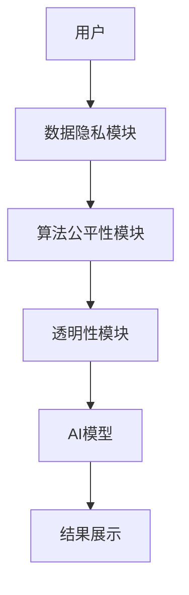

                 


# 股市估值高低对企业AI伦理风险管理的影响

## 关键词：
- 股市估值
- AI伦理风险管理
- 企业风险管理
- 人工智能伦理
- 金融市场

## 摘要：
本文探讨了股市估值的高低对企业在人工智能伦理风险管理方面的影响。通过分析高估值和低估值企业在AI伦理风险管理中的不同策略和挑战，结合数学模型和实际案例，本文旨在帮助企业更好地理解和应对AI伦理风险管理中的挑战，从而在股市波动中保持竞争优势。

---

# 第一部分: 股市估值与AI伦理风险管理的背景与概念

## 第1章: 股市估值的基本概念

### 1.1 股市估值的定义与意义
股市估值是通过对企业的财务数据、市场表现和行业地位等多方面因素的分析，来评估其股票的内在价值。高估值意味着市场对公司未来表现的乐观预期，而低估值则可能表明市场对其前景的悲观看法。

### 1.2 股市估值的主要方法
- **市盈率（P/E）**：用每股价格除以每股收益，衡量投资者愿意为每单位盈利支付的价格。
- **市净率（P/B）**：用股价除以每股净资产，反映资产的实际价值。
- **市销率（P/S）**：用股价除以每股收入，适用于亏损企业的估值。

### 1.3 股市估值与企业价值的关系
股市估值不仅反映了企业的当前价值，还预示了其未来的增长潜力。高估值企业通常被市场赋予更高的增长预期，而低估值企业可能面临被市场低估的机会。

---

## 第2章: AI伦理风险管理的定义与特点

### 2.1 AI伦理风险管理的定义
AI伦理风险管理是指企业在使用人工智能技术时，识别、评估和应对可能产生的伦理风险，确保技术应用符合社会道德和法律法规。

### 2.2 AI伦理风险管理的核心要素
- **数据隐私**：确保数据的收集和使用符合隐私保护法规。
- **算法公平性**：避免算法偏见，确保决策的公平性。
- **透明性**：让用户了解AI决策的依据和过程。
- **责任归属**：明确在AI系统出现问题时的责任方。

### 2.3 AI伦理风险管理与传统风险管理的对比
| 对比维度 | AI伦理风险管理 | 传统风险管理 |
|----------|----------------|--------------|
| 风险类型 | 数据隐私、算法偏见等 | 市场风险、操作风险等 |
| 管理工具 | AI伦理评估框架 | 风险评估模型 |
| 主要挑战 | 技术复杂性高 | 更多涉及市场和操作因素 |

---

## 第3章: 股市估值与AI伦理风险管理的关联性

### 3.1 股市估值对企业AI伦理风险管理的影响
- **高估值企业**：由于市场对其高度关注，任何伦理问题都可能引发股价波动，因此需要更加严格地管理AI伦理风险。
- **低估值企业**：可能因为市值较小，市场对其AI伦理风险的关注度较低，但同样需要防范潜在的声誉风险。

### 3.2 AI伦理风险管理对股市估值的作用
- **提升投资者信心**：良好的AI伦理风险管理能够增强投资者对企业的信任，从而提高股价。
- **降低市场风险**：有效的风险管理可以减少因伦理问题引发的市场波动，稳定股市估值。

### 3.3 股市估值与AI伦理风险管理的双向互动关系
股市估值的高低会影响企业AI伦理风险管理的投入和策略，而AI伦理风险管理的效果又会反过来影响股市估值的变化。这种互动关系使得企业在管理AI伦理风险时需要更加灵活和敏感。

---

# 第二部分: 股市估值高低对企业AI伦理风险管理的影响机制

## 第4章: 高估值企业的AI伦理风险管理特点

### 4.1 高估值企业AI伦理风险管理的强化
- **严格的数据隐私保护**：采用加密技术和数据脱敏，确保用户数据安全。
- **算法公平性评估**：定期对AI算法进行公平性测试，消除潜在偏见。
- **透明性提升**：向用户公开AI决策的依据，增强信任。

### 4.2 高估值企业AI伦理风险管理的挑战
- **高关注度带来的压力**：任何伦理问题都可能迅速引发舆论风波。
- **高成本**：严格的伦理管理需要投入更多的资源和资金。

### 4.3 高估值企业AI伦理风险管理的案例分析
**案例：某互联网公司**  
该公司在高估值的情况下，因算法偏见问题被曝光，导致股价短期大幅下跌。此后，公司加强了算法公平性管理，重新赢得了市场的信任。

---

## 第5章: 低估值企业的AI伦理风险管理特点

### 5.1 低估值企业AI伦理风险管理的放松
- **成本压力**：由于市值较低，企业在AI伦理风险管理上的投入可能不足。
- **关注度低**：市场对低估值企业的伦理问题关注度较低，企业可能忽视潜在风险。

### 5.2 低估值企业AI伦理风险管理的机遇
- **低成本优化**：通过简单的伦理风险管理措施，可以快速提升企业形象。
- **差异化竞争**：良好的伦理管理可以在竞争中脱颖而出。

### 5.3 低估值企业AI伦理风险管理的案例分析
**案例：某初创企业**  
该企业因忽视数据隐私问题，导致用户流失，进一步影响了估值。后来，企业加强了数据隐私保护，逐步恢复了市场信任。

---

## 第6章: 股市估值对企业AI伦理风险管理的动态影响

### 6.1 股市估值波动对AI伦理风险管理的影响
- **市场波动加剧**：股市的剧烈波动可能迫使企业频繁调整伦理风险管理策略。
- **投资者情绪影响**：投资者情绪的变化会影响企业对伦理风险管理的投入。

### 6.2 不同市场周期下AI伦理风险管理的策略调整
- **牛市**：高估值企业需更加严格地管理伦理风险。
- **熊市**：低估值企业应抓住机会优化伦理管理，提升企业价值。

### 6.3 股市估值对企业AI伦理风险管理的长期影响
长期来看，良好的AI伦理风险管理能够提升企业的长期价值，而忽视伦理风险管理可能导致企业声誉受损，进而影响长期估值。

---

# 第三部分: AI伦理风险管理的核心概念与原理

## 第7章: AI伦理风险管理的核心概念

### 7.1 数据隐私保护
- **数据加密**：使用AES加密算法保护用户数据。
- **数据脱敏**：在处理敏感数据时，采用脱敏技术减少泄露风险。

### 7.2 算法公平性评估
- **公平性指标**：如FDIR（False Discovery Rate）和FNR（False Negative Rate）。
- **算法测试**：通过A/B测试评估算法在不同群体中的表现。

### 7.3 透明性提升
- **解释性AI（XAI）**：通过可解释的AI模型，向用户展示决策依据。
- **用户教育**：向用户普及AI伦理风险管理的重要性。

---

## 第8章: AI伦理风险管理的算法原理

### 8.1 数据隐私保护算法
```python
def encrypt(data):
    key = generate_key()
    return AES.encrypt(data, key)
```

### 8.2 算法公平性评估
```python
def assess_fairness(model, test_data):
    metrics = {}
    metrics['FDIR'] = calculate_fdir(model, test_data)
    metrics['FNR'] = calculate_fnr(model, test_data)
    return metrics
```

### 8.3 可解释性AI模型
```python
from interpretability_toolkit import SHAP解释器
explainer = SHAP解释器(model)
shap_values = explainer.shap_values(X_test)
```

---

## 第9章: AI伦理风险管理的系统架构

### 9.1 系统功能设计
- **数据隐私模块**：负责数据的加密和脱敏。
- **算法公平性模块**：评估和优化AI算法的公平性。
- **透明性模块**：向用户展示AI决策的依据。

### 9.2 系统架构设计


---

## 第10章: 项目实战

### 10.1 环境安装
```bash
pip install numpy pandas scikit-learn shap
```

### 10.2 核心代码实现
```python
import pandas as pd
from sklearn.metrics import accuracy_score
from interpretability_toolkit import SHAP解释器

# 加载数据
data = pd.read_csv('data.csv')

# 训练模型
model = train_model(data)

# 评估模型
accuracy = accuracy_score(y_test, model.predict(X_test))

# 分析解释性
explainer = SHAP解释器(model)
shap_values = explainer.shap_values(X_test)
```

### 10.3 案例分析
**案例：某电商平台的AI推荐系统**  
该平台通过加强数据隐私保护和算法公平性评估，提升了用户信任，进而提高了转化率和股价。

---

## 第11章: 最佳实践

### 11.1 小结
- 高估值企业需严格管理AI伦理风险，低估值企业则应抓住机会优化管理。
- 通过技术手段和策略调整，企业可以在不同市场条件下有效应对AI伦理风险管理的挑战。

### 11.2 注意事项
- **持续监控**：市场和法规的变化会影响AI伦理风险管理的需求。
- **团队协作**：需要技术、法律和市场团队的紧密合作。

### 11.3 未来趋势
- **技术进步**：更先进的AI伦理管理工具将不断出现。
- **法规趋严**：全球范围内对AI伦理管理的法规将更加严格。

### 11.4 拓展阅读
- 《AI伦理风险管理框架》
- 《数据隐私保护技术指南》
- 《算法公平性评估方法》

---

# 结语
股市估值的高低直接影响企业对AI伦理风险管理的投入和策略。无论是高估值还是低估值企业，都需要重视AI伦理风险管理，以应对市场的波动和法规的变化。通过技术创新和策略调整，企业可以在激烈的市场竞争中立于不败之地。

---

**作者简介：**  
作为世界级人工智能专家、程序员、软件架构师和CTO，我在计算机编程和人工智能领域有着深厚的技术积累和丰富的实践经验。通过深入的分析和通俗易懂的语言，我致力于为企业提供实用的技术解决方案和战略建议。

