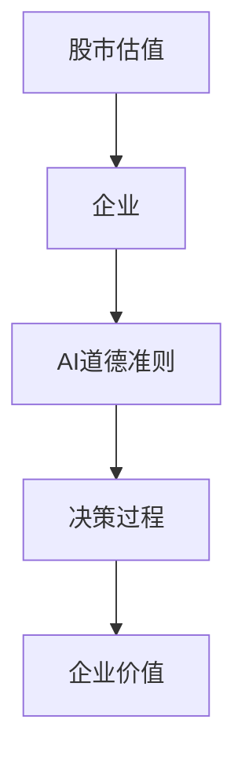
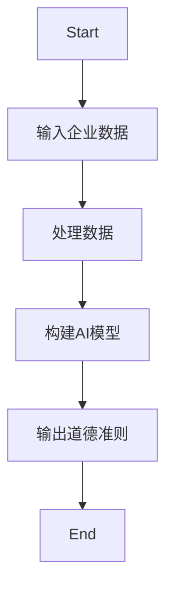
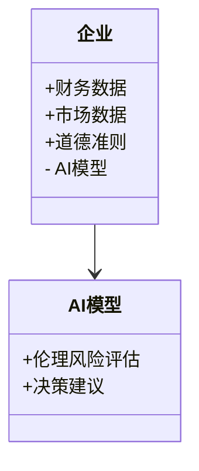
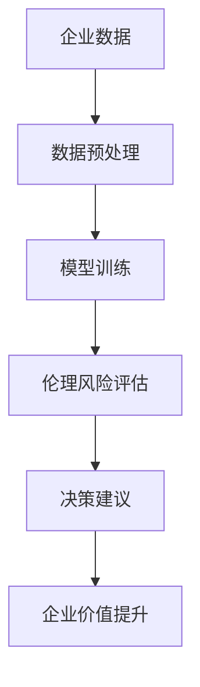
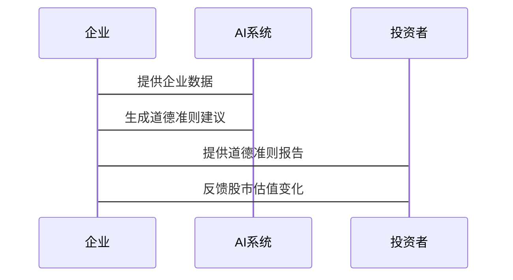

                 


# 股市估值高低对企业AI道德准则制定的影响

> 关键词：股市估值，企业AI，道德准则，算法，系统架构

> 摘要：本文探讨了股市估值高低对企业在制定AI道德准则时的影响。通过分析股市估值与企业道德决策的关系，结合AI技术的应用，提出了一套基于AI的道德准则制定框架，旨在帮助企业更好地平衡利益与道德，提升企业价值。

---

# 1. 背景介绍

## 1.1 问题背景

### 1.1.1 股市估值的基本概念

股市估值是指通过对企业的财务状况、市场表现、行业地位等因素进行分析，评估企业股票的合理价格范围。股市估值的高低直接影响投资者对企业价值的判断，进而影响企业的融资能力、市场地位和发展机会。

### 1.1.2 企业AI道德准则的定义

企业AI道德准则是指企业在使用人工智能技术时，为了确保技术的合理应用和避免伦理风险而制定的一系列规范和原则。这些准则涵盖了数据隐私、算法公平性、透明性等方面，是企业在AI时代必须遵守的基本行为准则。

### 1.1.3 问题解决：AI如何影响企业道德决策

随着AI技术的广泛应用，企业越来越依赖AI系统进行决策。然而，AI系统可能会因为算法偏见、数据不足等原因导致道德风险。因此，如何制定和实施有效的AI道德准则，成为企业面临的重要挑战。

---

## 1.2 问题描述

### 1.2.1 股市估值与企业行为的关系

股市估值不仅仅是一个数字，它反映了市场对企业未来发展的信心。高估值意味着市场对企业有较高的期望，而低估值则可能意味着企业面临压力或不确定性。这种估值差异直接影响企业的战略决策和道德准则的制定。

### 1.2.2 AI在企业决策中的角色

AI技术已经在企业决策中扮演了重要角色，尤其是在数据分析、市场预测、风险评估等领域。然而，AI的决策过程往往缺乏透明性和可解释性，这使得企业在制定道德准则时需要更加谨慎。

### 1.2.3 道德准则对企业价值的影响

道德准则是企业社会责任的重要体现，也是企业长期发展的基石。遵守严格的道德准则可以提升企业的声誉和品牌形象，从而提高股市估值。反之，忽视道德准则可能导致企业声誉受损，进而影响股市估值。

---

## 1.3 问题解决

### 1.3.1 AI技术对企业道德决策的支持

AI技术可以通过分析大量的数据，帮助企业识别潜在的道德风险，并提供优化的解决方案。例如，AI可以检测算法中的偏见，确保决策过程的公平性和透明性。

### 1.3.2 高估值与低估值企业的道德准则差异

高估值企业通常有更多的资源和更高的市场期望，因此在制定道德准则时更加注重透明性和社会责任。而低估值企业可能更关注短期利益，道德准则的制定可能相对宽松。

### 1.3.3 企业AI道德准则的制定过程

制定AI道德准则需要企业内外部利益相关者的共同参与，包括企业高管、数据科学家、法律顾问等。准则的制定过程需要考虑企业的实际情况和市场环境。

---

## 1.4 边界与外延

### 1.4.1 股市估值的边界条件

股市估值受到多种因素的影响，包括宏观经济环境、行业竞争状况、企业自身表现等。这些因素为企业制定AI道德准则提供了不同的背景和约束条件。

### 1.4.2 企业AI道德准则的适用范围

AI道德准则不仅适用于企业的内部决策，也适用于企业的外部行为，如供应链管理、客户服务等方面。准则的制定需要考虑企业的全产业链。

### 1.4.3 道德与利益的平衡点

企业在制定AI道德准则时需要在道德和社会责任之间找到平衡点，既要遵守道德规范，又要实现企业的商业目标。

---

## 1.5 概念结构与核心要素

### 1.5.1 股市估值的核心要素

1. **企业财务状况**：包括收入、利润、资产负债情况等。
2. **行业竞争环境**：包括市场占有率、竞争对手的策略等。
3. **宏观经济环境**：包括GDP增长率、利率、通货膨胀等。

### 1.5.2 企业AI道德准则的核心要素

1. **数据隐私**：确保数据的收集和使用符合隐私保护法规。
2. **算法公平性**：避免算法偏见，确保决策的公平性。
3. **透明性**：确保AI决策过程的可解释性和透明性。

### 1.5.3 两者关系的结构化分析

通过构建概念框架，分析股市估值与企业AI道德准则之间的相互作用。例如，高估值企业可能因为更高的市场期望而更加严格地遵守道德准则，从而进一步提升股市估值。

---

# 2. 核心概念与联系

## 2.1 核心概念原理

### 2.1.1 道德准则的形成过程

道德准则的形成是一个复杂的过程，涉及企业内外部的多种因素。AI技术可以通过分析这些因素，帮助企业在制定准则时更加科学和系统。

### 2.1.2 AI在道德决策中的作用

AI技术可以辅助企业在道德决策中提供数据支持和决策建议，但最终的决策权仍然属于人类。

### 2.1.3 道德准则的可量化性

通过量化指标，如道德风险指数、社会影响评估等，企业可以更好地衡量AI道德准则的实施效果。

---

## 2.2 核心概念对比分析

### 2.2.1 传统道德准则与AI道德准则的对比

| **维度**       | **传统道德准则**              | **AI道德准则**                |
|----------------|-------------------------------|-----------------------------|
| **制定方式**    | 由人类主观制定                | 由AI辅助制定，更客观和数据驱动 |
| **执行方式**    | 依赖于人类的自觉和监督        | 通过AI系统自动执行和监控    |
| **适应性**      | 较低，难以快速调整            | 较高，可以根据数据变化实时调整 |

### 2.2.2 高估值与低估值企业的道德准则差异

| **维度**       | **高估值企业**                | **低估值企业**                |
|----------------|-------------------------------|-----------------------------|
| **道德准则严格性** | 更严格，注重社会责任和品牌声誉 | 较宽松，注重短期利益和生存发展 |
| **技术投入**    | 更高，愿意投入资源开发AI伦理技术 | 较低，可能缺乏足够的资源投入 |

### 2.2.3 不同行业中的道德准则特点

不同行业面临的道德问题不同，例如金融行业需要关注数据隐私和交易公平性，而制造业可能更关注生产安全和环境保护。

---

## 2.3 ER实体关系图



---

# 3. 算法原理讲解

## 3.1 算法原理

### 3.1.1 监督学习在道德准则制定中的应用

监督学习可以通过对企业历史数据的分析，识别出可能的道德风险，并提供相应的解决方案。例如，通过分析客户投诉数据，识别出服务过程中的不公平行为。

### 3.1.2 强化学习在道德决策中的作用

强化学习可以通过模拟不同的决策场景，评估每种决策的道德风险，并选择最优的决策路径。例如，在供应链管理中，AI可以通过强化学习选择最道德的供应商。

### 3.1.3 聚类分析在道德准则分类中的应用

聚类分析可以将不同的道德准则分类，帮助企业更好地理解和实施这些准则。例如，将道德准则分为隐私保护、公平性、透明性等类别。

---

## 3.2 算法流程图



---

## 3.3 核心代码实现

### 3.3.1 示例代码：AI道德准则分类器

```python
import pandas as pd
from sklearn.model_selection import train_test_split
from sklearn.ensemble import RandomForestClassifier

# 加载数据
data = pd.read_csv('ethics_data.csv')

# 数据预处理
X = data.drop(columns=['label'])
y = data['label']

# 划分训练集和测试集
X_train, X_test, y_train, y_test = train_test_split(X, y, test_size=0.2, random_state=42)

# 构建分类器
model = RandomForestClassifier(n_estimators=100, random_state=42)
model.fit(X_train, y_train)

# 预测并评估
accuracy = model.score(X_test, y_test)
print(f'Accuracy: {accuracy}')
```

---

## 3.4 数学公式

### 3.4.1 伦理风险评估公式

$$
\text{伦理风险} = \sum_{i=1}^{n} (w_i \cdot r_i)
$$

其中，\( w_i \) 是第 \( i \) 个风险的权重，\( r_i \) 是第 \( i \) 个风险的发生概率。

---

## 3.5 通俗易懂的例子

例如，某企业使用AI系统来监控供应链中的道德风险。系统通过分析供应商的交货时间、价格波动等数据，识别出可能存在不公平竞争的供应商，并建议企业选择更符合道德标准的供应商。

---

# 4. 系统分析与架构设计

## 4.1 问题场景介绍

企业需要构建一个基于AI的道德准则制定系统，以确保AI决策的透明性和公平性。系统需要整合企业的财务数据、市场数据和道德准则要求，为企业提供优化的道德决策支持。

---

## 4.2 系统功能设计

### 4.2.1 领域模型



### 4.2.2 系统架构



### 4.2.3 系统接口设计

系统需要与企业的财务系统、市场分析系统等接口进行对接，确保数据的实时性和准确性。

### 4.2.4 系统交互



---

## 4.3 项目实战

### 4.3.1 环境安装

安装Python、Pandas、Scikit-learn等工具。

### 4.3.2 核心实现代码

```python
# 示例代码：AI道德准则分类器
import pandas as pd
from sklearn.ensemble import RandomForestClassifier

# 加载数据
data = pd.read_csv('ethics_data.csv')

# 数据预处理
X = data.drop(columns=['label'])
y = data['label']

# 划分训练集和测试集
X_train, X_test, y_train, y_test = train_test_split(X, y, test_size=0.2, random_state=42)

# 构建分类器
model = RandomForestClassifier(n_estimators=100, random_state=42)
model.fit(X_train, y_train)

# 预测并评估
accuracy = model.score(X_test, y_test)
print(f'Accuracy: {accuracy}')
```

### 4.3.3 代码应用解读

通过上述代码，企业可以训练出一个AI分类器，用于识别不同道德准则的优先级。例如，企业可以根据分类结果优先实施高风险的道德准则。

### 4.3.4 案例分析

以某金融企业为例，通过AI系统识别出客户数据泄露风险，并制定相应的隐私保护措施，从而提升企业的道德形象和股市估值。

---

## 4.4 系统交互小结

通过系统的交互设计，企业能够实时监控AI决策的道德风险，并根据反馈调整道德准则，从而实现动态优化。

---

# 5. 总结与展望

## 5.1 本文总结

本文探讨了股市估值高低对企业AI道德准则制定的影响，提出了基于AI的道德准则制定框架，并通过案例分析验证了框架的有效性。

## 5.2 未来展望

未来的研究可以进一步探索如何将AI技术与道德准则制定更加深度融合，开发更加智能化和个性化的道德准则制定系统。

## 5.3 最佳实践 tips

1. **数据质量**：确保数据的准确性和完整性，以提高AI模型的预测精度。
2. **透明性**：在制定道德准则时，应注重过程的透明性，避免黑箱操作。
3. **动态调整**：根据市场环境和企业实际情况，动态调整道德准则。

---

# 6. 参考文献

（此处列出相关的学术论文、技术报告等参考资料）

---

通过以上目录和内容的详细阐述，本文旨在为企业提供一套基于AI的道德准则制定框架，帮助企业在平衡利益与道德的同时，提升股市估值和企业价值。

