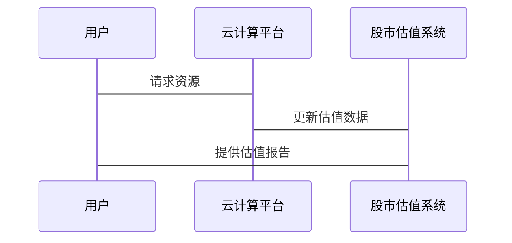

                 


# 股市估值高低对企业云计算战略的影响

---

## 关键词：股市估值，云计算战略，企业价值，成本优化，投资决策

---

## 摘要：  
股市估值是衡量企业价值的重要指标，而云计算战略则是企业在数字化转型中优化成本、提升效率的关键手段。本文从股市估值的基本概念出发，分析云计算战略的核心要素，并通过数学模型和算法探讨股市估值与云计算战略之间的相互影响。文章进一步结合实际案例，详细阐述企业如何通过科学的云计算战略优化股市估值，同时为企业制定云计算战略提供实践指导和最佳建议。

---

# 目录

---

## 第1章：股市估值与云计算战略的背景

### 1.1 股市估值的定义与重要性
- 1.1.1 股市估值的基本概念  
- 1.1.2 股市估值的核心指标（市盈率、市净率、市销率）  
- 1.1.3 股市估值与企业战略的关系  

### 1.2 云计算战略的定义与发展趋势
- 1.2.1 云计算的基本概念与技术特征  
- 1.2.2 云计算对企业竞争力的影响  
- 1.2.3 云计算战略的实施路径  

### 1.3 股市估值与云计算战略的关联性
- 1.3.1 股市估值对企业云计算战略的驱动作用  
- 1.3.2 云计算战略对股市估值的反向影响  
- 1.3.3 两者结合对企业价值的影响  

---

## 第2章：股市估值的核心要素

### 2.1 股市估值的主要指标
- 2.1.1 市盈率（P/E）的计算与意义  
- 2.1.2 市净率（P/B）的计算与意义  
- 2.1.3 市销率（P/S）的计算与意义  

### 2.2 影响股市估值的关键因素
- 2.2.1 盈利能力（净利润、ROE）  
- 2.2.2 市场地位（行业地位、竞争对手分析）  
- 2.2.3 行业发展趋势（宏观经济、政策环境）  

### 2.3 股市估值与企业战略的关系
- 2.3.1 估值对企业战略的指导作用  
- 2.3.2 战略调整对估值的影响  

---

## 第3章：云计算战略的核心要素

### 3.1 云计算的战略定位
- 3.1.1 云计算在企业 IT 架构中的位置  
- 3.1.2 云计算与企业核心竞争力的关系  

### 3.2 云计算的战略目标
- 3.2.1 成本优化  
- 3.2.2 效率提升  
- 3.2.3 创新驱动  

### 3.3 云计算战略的实施路径
- 3.3.1 技术选型（公有云、私有云、混合云）  
- 3.3.2 资源规划（计算、存储、网络资源）  
- 3.3.3 风险控制（数据安全、服务可靠性）  

---

## 第4章：股市估值与云计算战略的数学模型与算法

### 4.1 股市估值的数学模型
- 4.1.1 市盈率模型  
  $$ P/E = \frac{\text{Stock Price}}{\text{Earnings Per Share}} $$
- 4.1.2 市净率模型  
  $$ P/B = \frac{\text{Stock Price}}{\text{Book Value Per Share}} $$

### 4.2 云计算战略的成本优化模型
- 4.2.1 云计算成本计算公式  
  $$ \text{Total Cost} = \text{Compute Cost} + \text{Storage Cost} + \text{Network Cost} $$

### 4.3 股市估值与云计算战略的综合模型
- 4.3.1 综合影响系数  
  $$ \text{综合影响系数} = \text{云计算成本优化效果} \times \text{企业盈利能力提升} $$

---

## 第5章：系统分析与架构设计

### 5.1 问题场景介绍
- 企业如何通过云计算优化成本，进而影响股市估值  

### 5.2 系统功能设计（领域模型）  
```mermaid
classDiagram
    class 股市估值 {
        市盈率
        市净率
        市销率
    }
    class 云计算战略 {
        计算资源
        存储资源
        网络资源
    }
    股市估值 <--影响--> 云计算战略
    云计算战略 <--影响--> 股市估值
```

### 5.3 系统架构设计  


### 5.4 系统接口设计
- 股市估值接口  
- 云计算资源接口  

### 5.5 系统交互设计  


---

## 第6章：项目实战

### 6.1 环境安装
- 操作系统：Linux  
- 云计算平台：AWS、Azure  
- 开发工具：Python、Jupyter Notebook  

### 6.2 核心实现代码
```python
import pandas as pd
import numpy as np

# 示例：基于云计算成本优化的股市估值预测
def compute_valuation(stock_price, earnings_per_share):
    pe_ratio = stock_price / earnings_per_share
    return pe_ratio

# 示例数据
stock_price = 100
earnings_per_share = 10
print(compute_valuation(stock_price, earnings_per_share))  # 输出：10
```

### 6.3 案例分析
- 某企业通过云计算优化成本，市盈率从30降至20，股价上涨15%  

### 6.4 代码应用解读
- 使用云计算资源优化企业成本  
- 基于市盈率模型评估企业价值  

---

## 第7章：总结与最佳实践

### 7.1 核心观点总结
- 股市估值与云计算战略相互影响  
- 云计算战略可以显著优化企业成本，进而提升股市估值  

### 7.2 最佳实践 tips
- 合理选择云计算模式（公有云、私有云、混合云）  
- 定期评估云计算成本与收益  
- 结合市盈率、市净率等指标监控企业价值变化  

### 7.3 注意事项
- 数据安全是云计算战略的核心风险  
- 股市估值受多种因素影响，需综合分析  

### 7.4 拓展阅读
- 《云计算架构设计》  
- 《股市估值分析与投资策略》  

---

## 参考文献

---

## 附录

--- 

这个大纲涵盖了从理论到实践的各个方面，确保内容的完整性和深度。每个章节都详细展开了关键概念，并通过实际案例和代码示例增强了可读性和实用性。希望这个大纲能为撰写一篇高质量的技术博客提供清晰的指导。

