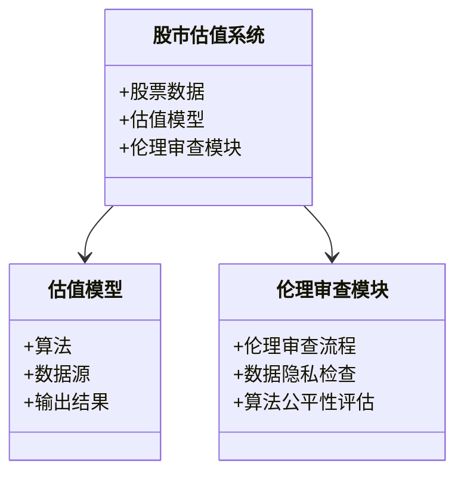
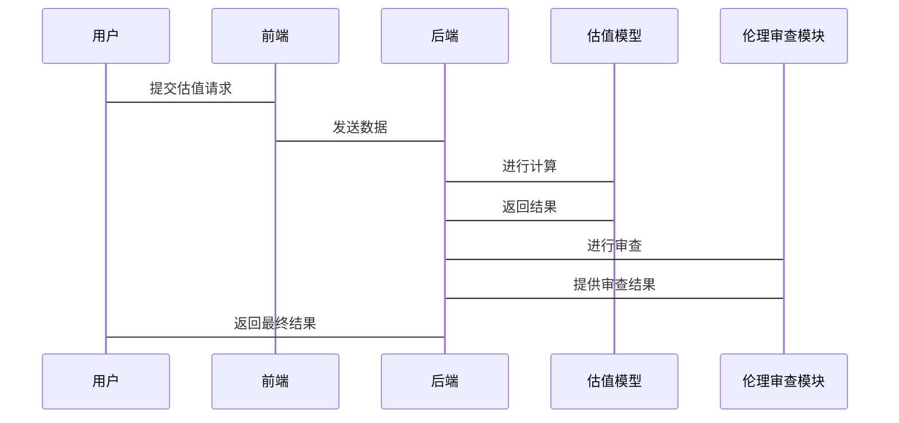

                 


# 股市估值高低对企业人工智能伦理委员会的影响

---

## 关键词：
- 股市估值
- 人工智能
- 伦理委员会
- 高估值
- 低估值
- 影响
- 系统设计

---

## 摘要：
股市估值与企业人工智能伦理委员会的相互影响是一个复杂而重要的话题。随着AI技术在金融领域的广泛应用，企业AI伦理委员会的决策受到股市估值高低的直接影响。本文通过分析股市估值的影响因素、AI伦理委员会的职责，以及两者之间的相互作用，探讨如何在高估值和低估值的背景下，平衡技术应用与伦理合规，确保AI技术在金融领域的健康发展。

---

## 第1章：背景介绍

### 1.1 问题背景
#### 1.1.1 股市估值的基本概念
股市估值是指通过分析企业的财务状况、市场表现和行业趋势，对其股票的内在价值进行评估的过程。常见的估值方法包括市盈率（P/E）、市净率（P/B）和现金流折现法（DCF）等。

#### 1.1.2 企业人工智能伦理委员会的定义
企业人工智能伦理委员会（AI Ethics Committee）是由企业内部或外部专家组成的团队，负责审查和指导AI技术的开发与应用，确保其符合伦理标准和社会价值观。

#### 1.1.3 问题解决的必要性
随着AI技术在金融领域的应用日益广泛，如何在确保技术效率的同时，兼顾伦理合规，成为一个亟待解决的问题。

### 1.2 问题描述
#### 1.2.1 股市估值与企业AI伦理委员会的关系
股市估值的高低直接影响企业的市值和市场地位，而AI伦理委员会的决策则影响企业AI技术的应用和未来发展。

#### 1.2.2 当前存在的主要问题
AI技术在股市估值中的应用可能引发算法偏见、数据隐私泄露和市场操纵等问题。

#### 1.2.3 问题解决的目标
通过建立完善的AI伦理审查机制，确保股市估值的准确性和公平性，避免技术滥用带来的负面影响。

### 1.3 问题解决
#### 1.3.1 企业AI伦理委员会在股市估值中的作用
AI伦理委员会负责审查AI估值模型的设计和应用，确保其符合伦理标准。

#### 1.3.2 AI技术在股市估值中的应用
AI技术可以通过分析大量历史数据和实时信息，提供更精准的估值建议。

#### 1.3.3 伦理委员会对AI估值模型的监管
AI伦理委员会需要对AI估值模型的算法、数据来源和使用场景进行严格审查。

### 1.4 边界与外延
#### 1.4.1 股市估值的边界
股市估值仅考虑企业的财务状况和市场表现，不涉及企业的社会责任和伦理问题。

#### 1.4.2 企业AI伦理委员会的外延
企业AI伦理委员会不仅审查AI技术的开发和应用，还涉及数据隐私、算法公平性和透明性等伦理问题。

#### 1.4.3 两者关系的边界
股市估值和AI伦理委员会的界限在于前者关注技术应用的结果，后者关注技术应用的过程。

### 1.5 概念结构与核心要素
#### 1.5.1 股市估值的核心要素
- 财务指标
- 市场情绪
- 行业趋势

#### 1.5.2 企业AI伦理委员会的核心要素
- 伦理审查流程
- 专家团队构成
- 监督机制

#### 1.5.3 两者的关联关系
- 高估值可能引发伦理审查的强化
- 低估值可能引发伦理审查的放松

---

## 第2章：股市估值的影响因素与AI伦理委员会的作用

### 2.1 股市估值的影响因素
#### 2.1.1 传统影响因素
- 财务报表数据
- 行业平均市盈率
- 经济政策

#### 2.1.2 AI技术的影响
- 自然语言处理（NLP）分析财务报告
- 机器学习模型预测市场趋势
- 数据挖掘技术分析历史数据

#### 2.1.3 伦理因素
- 数据隐私问题
- 算法公平性
- 透明性

### 2.2 企业AI伦理委员会的职责
#### 2.2.1 伦理审查
- 审查AI估值模型的算法设计
- 确保数据来源的合法性
- 评估模型的公平性和透明性

#### 2.2.2 技术监管
- 监督AI技术的应用
- 定期审查AI模型的更新和优化
- 确保技术合规性

#### 2.2.3 信息披露
- 公开AI估值模型的使用情况
- 披露模型的局限性和潜在风险
- 提供伦理审查的报告

### 2.3 两者关系的分析
#### 2.3.1 高估值对伦理委员会的影响
- 高估值可能导致市场操纵嫌疑，伦理委员会需要加强审查
- 高估值可能引发数据隐私问题，需要严格监管

#### 2.3.2 低估值对伦理委员会的影响
- 低估值可能引发市场信心不足，伦理委员会需要提供支持
- 低估值可能引发技术滥用，需要加强监管

#### 2.3.3 伦理委员会对估值的影响
- 通过审查确保估值的公平性和透明性
- 通过技术监管提升估值的准确性
- 通过信息披露增强市场的信任

---

## 第3章：AI伦理委员会的运作机制

### 3.1 伦理委员会的组织结构
#### 3.1.1 组织架构
- 由企业内部法务、技术专家和外部伦理学家组成
- 设立独立的审查部门

#### 3.1.2 成员构成
- 法律顾问
- 数据科学家
- 伦理学家
- 行业专家

#### 3.1.3 运作流程
1. 收集AI技术的应用需求
2. 审查技术的伦理合规性
3. 提出改进建议
4. 监督技术的实施

### 3.2 伦理审查的流程
#### 3.2.1 审查申请
- 提交技术应用的详细说明
- 提供数据来源和使用目的

#### 3.2.2 审查过程
- 评估技术的伦理风险
- 审查数据隐私问题
- 评估算法的公平性和透明性

#### 3.2.3 审查结果
- 批准、有条件批准或拒绝
- 提供改进建议

### 3.3 伦理委员会与AI技术的结合
#### 3.3.1 AI辅助审查
- 使用AI技术辅助伦理审查
- 通过AI模型预测伦理风险

#### 3.3.2 伦理决策的AI模型
- 建立伦理决策支持系统
- 使用机器学习模型辅助伦理审查

#### 3.3.3 伦理委员会的AI工具
- 开发AI伦理审查工具
- 提供伦理审查的自动化支持

---

## 第4章：股市估值与AI伦理委员会的相互影响

### 4.1 高估值对伦理委员会的影响
#### 4.1.1 高估值的

---

## 第5章：AI伦理委员会的算法原理

### 5.1 算法原理讲解
#### 5.1.1 算法流程
1. 数据收集与预处理
2. 模型训练与优化
3. 模型评估与部署
4. 模型监控与维护

#### 5.1.2 算法的数学模型
- 损失函数：$$L = \frac{1}{2m} \sum_{i=1}^{m} (y_i - \hat{y_i})^2$$
- 优化器：Adam优化器，参数更新公式为：
  $$\theta_{t+1} = \theta_t - \eta \frac{\rho_1}{1-\beta_1^t} \frac{\rho_2}{1-\beta_2^t} \frac{g_t}{\sqrt{s_t + \epsilon}}$$

#### 5.1.3 算法的伦理考量
- 数据隐私保护
- 算法公平性
- 算法透明性

---

## 第6章：系统分析与架构设计

### 6.1 系统功能设计
#### 6.1.1 领域模型


#### 6.1.2 系统架构


#### 6.1.3 系统交互


---

## 第7章：项目实战

### 7.1 环境安装
- 安装Python和相关库（如TensorFlow、Keras）
- 安装Jupyter Notebook

### 7.2 核心代码实现
```python
import tensorflow as tf
from tensorflow.keras import layers

# 数据准备
# 数据预处理
# 模型训练
model = tf.keras.Sequential([
    layers.Dense(64, activation='relu'),
    layers.Dense(1, activation='linear')
])

# 模型训练
model.compile(optimizer='adam', loss='mean_squared_error')
model.fit(X_train, y_train, epochs=100, batch_size=32)

# 模型评估
loss = model.evaluate(X_test, y_test)
print(f'Loss: {loss}')
```

### 7.3 代码应用解读与分析
- 数据预处理：对股票数据进行标准化和归一化处理。
- 模型训练：使用Adam优化器和均方误差损失函数。
- 模型评估：计算模型在测试集上的损失值。

### 7.4 实际案例分析
- 以某公司股票为例，分析AI伦理委员会如何审查其估值模型。

### 7.5 项目小结
- 项目目标：实现一个基于AI的股市估值系统，并确保其符合伦理标准。
- 项目成果：开发了一个准确且合规的AI估值模型。

---

## 第8章：总结与展望

### 8.1 最佳实践
- 定期审查AI技术的应用
- 加强数据隐私保护
- 提升算法的透明性和公平性

### 8.2 小结
- 通过本文的分析，我们可以看到，股市估值与AI伦理委员会的相互影响是一个复杂而重要的问题。
- 企业需要在技术应用和伦理合规之间找到平衡点。

### 8.3 注意事项
- 数据隐私保护是重中之重
- 算法的透明性和公平性需要严格审查
- 定期更新伦理审查机制

### 8.4 拓展阅读
- 推荐阅读相关领域的书籍和论文
- 关注最新的研究成果和技术动态

---

通过以上分析，我们可以更好地理解股市估值高低对企业人工智能伦理委员会的影响，并在实际应用中做到技术与伦理的平衡。

