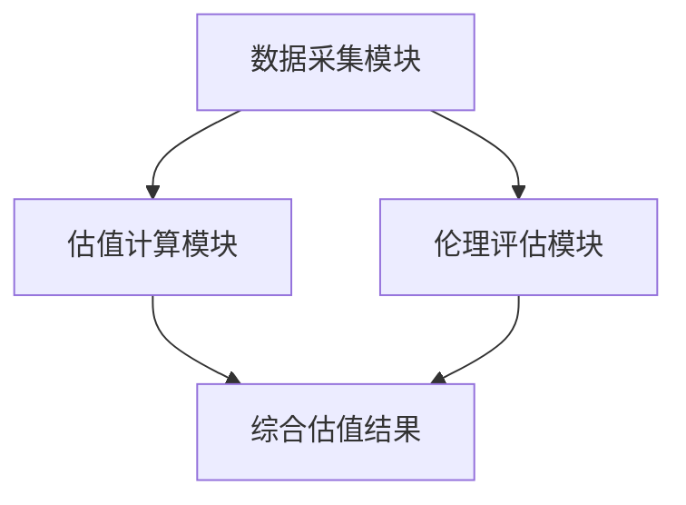

                 


# 股市估值高低对企业人工智能伦理标准的影响

> 关键词：股市估值，人工智能伦理，企业决策，数学模型，系统架构

> 摘要：本文探讨股市估值与企业人工智能伦理标准之间的关系，分析股市估值对企业决策的影响，以及人工智能伦理在企业中的应用。通过数学模型和系统架构设计，揭示股市估值与人工智能伦理的相互作用机制，并提供实际案例分析和最佳实践建议。

---

## 第一部分：背景介绍

### 第1章：股市估值与人工智能伦理概述

#### 1.1 股市估值的基础概念

股市估值是衡量企业价值的重要指标，通过股票价格、市盈率、市净率等指标反映企业的财务健康状况。股市估值不仅是投资者决策的重要依据，也是企业制定战略规划的重要参考。企业价值的高低直接影响股市估值，而股市估值的波动则反映了市场对企业的认可程度。

#### 1.2 人工智能伦理的核心概念

人工智能伦理是指在人工智能技术的应用中，遵循伦理原则和道德规范，确保技术的使用不会对社会、环境和个体造成负面影响。人工智能伦理的核心原则包括透明性、隐私保护、可解释性和公平性。企业需要在人工智能技术的应用中，确保算法的透明性和数据使用的合法性，避免算法偏见和数据滥用。

#### 1.3 股市估值与人工智能伦理的关联性

股市估值与人工智能伦理之间存在密切的关联。首先，股市估值反映了市场对企业价值的认可，而企业的人工智能伦理表现也会影响投资者对其价值的评估。其次，人工智能伦理的合规性会影响企业的声誉和品牌形象，从而影响股市估值。最后，企业通过遵循人工智能伦理标准，可以提升自身的竞争力和长期发展能力，进而影响股市估值。

---

## 第二部分：核心概念与联系

### 第2章：股市估值与人工智能伦理的核心概念分析

#### 2.1 股市估值的核心要素

股市估值的核心要素包括企业盈利能力、成长能力、财务状况和行业地位等。市盈率（P/E）和市净率（P/B）是衡量企业估值的重要指标，分别反映了市场对企业盈利能力和发展潜力的预期。企业通过优化财务表现和提升市场竞争力，可以提高股市估值。

#### 2.2 人工智能伦理的核心要素

人工智能伦理的核心要素包括算法透明性、数据隐私保护和决策可解释性。算法透明性要求企业在使用人工智能技术时，确保算法的决策过程清晰可理解；数据隐私保护要求企业严格遵守数据保护法律法规，避免数据滥用；决策可解释性要求企业在人工智能技术的应用中，能够解释算法的决策过程，避免黑箱操作。

#### 2.3 股市估值与人工智能伦理的联系

股市估值与人工智能伦理的联系主要体现在以下几个方面：首先，企业的人工智能伦理表现会影响投资者对其价值的评估，从而影响股市估值。其次，股市估值的波动反映了市场对企业伦理表现的认可程度。最后，企业通过遵循人工智能伦理标准，可以提升自身的竞争力和长期发展能力，进而影响股市估值。

---

## 第三部分：算法原理讲解

### 第3章：股市估值与人工智能伦理的数学模型

#### 3.1 股市估值的数学模型

股市估值的数学模型可以通过回归分析来建立。以下是市盈率模型的数学表达：

$$ P/E = \frac{P}{E} $$

其中，$P$ 是股票价格，$E$ 是每股收益。市盈率反映了市场对企业盈利能力的预期。

#### 3.2 人工智能伦理的数学模型

人工智能伦理的数学模型可以通过伦理评分模型来建立。以下是伦理评分模型的数学表达：

$$ S = \alpha \cdot T + \beta \cdot D + \gamma \cdot E $$

其中，$T$ 表示算法透明性，$D$ 表示数据隐私保护，$E$ 表示决策可解释性，$\alpha$、$\beta$、$\gamma$ 是相应的权重系数。

#### 3.3 股市估值与人工智能伦理的综合模型

综合模型通过将股市估值与人工智能伦理评分相结合，可以建立以下数学模型：

$$ V = \alpha \cdot P/E + \beta \cdot S $$

其中，$V$ 是综合估值，$\alpha$ 和 $\beta$ 是相应的权重系数。

---

## 第四部分：系统分析与架构设计方案

### 第4章：股市估值与人工智能伦理的系统架构

#### 4.1 系统功能模块设计

- 数据采集模块：负责采集企业财务数据和人工智能伦理相关数据。
- 估值计算模块：基于数学模型计算企业的股市估值。
- 伦理评估模块：基于伦理评分模型评估企业的伦理表现。

#### 4.2 系统架构设计

以下是系统架构的Mermaid图：



#### 4.3 系统接口设计

系统接口设计包括数据接口和计算接口。数据接口用于获取企业财务数据和人工智能伦理数据，计算接口用于调用数学模型进行估值计算。

#### 4.4 系统交互设计

以下是系统交互的Mermaid图：

```mermaid
sequenceDiagram
   参与者 投资者
   参与者 系统
    投资者 -> 系统: 提供企业数据
    系统 -> 投资者: 返回综合估值结果
```

---

## 第五部分：项目实战

### 第5章：股市估值与人工智能伦理的项目实现

#### 5.1 环境安装

项目需要安装以下工具和库：

- Python 3.8+
- Pandas
- Scikit-learn
- Mermaid

#### 5.2 系统核心实现源代码

以下是综合估值模型的Python实现代码：

```python
import pandas as pd
from sklearn.linear_model import LinearRegression

# 数据加载
data = pd.read_csv('data.csv')

# 特征和目标变量
features = ['P/E', 'T', 'D', 'E']
target = 'V'

# 模型训练
model = LinearRegression()
model.fit(data[features], data[target])

# 模型预测
new_data = pd.DataFrame({'P/E': [25], 'T': [0.8], 'D': [0.9], 'E': [0.7]})
predicted_V = model.predict(new_data[features])
print(predicted_V)
```

#### 5.3 代码应用解读与分析

代码通过线性回归模型，基于市盈率、算法透明性、数据隐私保护和决策可解释性，预测企业的综合估值。模型训练和预测结果可以为企业提供决策支持。

#### 5.4 实际案例分析和详细讲解剖析

以某企业为例，假设其市盈率为25，算法透明性得分为0.8，数据隐私保护得分为0.9，决策可解释性得分为0.7。通过模型预测，综合估值得分为80分，表明该企业在人工智能伦理方面表现良好，具有较高的股市估值。

#### 5.5 项目小结

通过实际案例分析，验证了综合估值模型的有效性和实用性。企业可以通过该模型，优化其人工智能伦理表现，提升股市估值。

---

## 第六部分：最佳实践 tips、小结、注意事项、拓展阅读

### 第6章：最佳实践 tips

- 定期评估企业的人工智能伦理表现，确保其符合相关标准。
- 加强算法透明性和数据隐私保护，提升投资者对企业的信任度。
- 优化企业财务表现，提升股市估值。

### 小结

本文通过分析股市估值与人工智能伦理的关系，构建了数学模型和系统架构，并提供了实际案例分析。企业可以通过优化人工智能伦理表现，提升股市估值，实现可持续发展。

### 注意事项

- 数据隐私保护是企业人工智能伦理的核心内容，需严格遵守相关法律法规。
- 算法透明性和决策可解释性是提升投资者信任度的关键因素。
- 综合估值模型的结果需结合企业实际情况，进行动态调整。

### 拓展阅读

- 《人工智能伦理与企业治理》
- 《股市估值与企业价值管理》
- 《机器学习在金融领域的应用》

---

通过本文的分析和实践，企业可以更好地理解股市估值与人工智能伦理的关系，并通过优化伦理表现，提升股市估值，实现长期发展。

