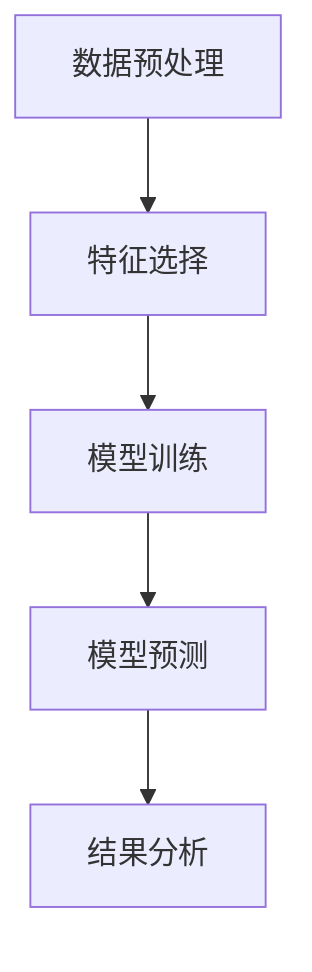
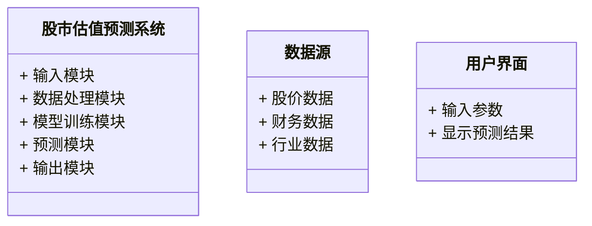

                 


# 股市估值高低对企业人工智能伦理的影响

> 关键词：股市估值、人工智能、伦理、企业行为、投资决策

> 摘要：本文探讨了股市估值的高低对企业在人工智能领域伦理决策的影响。通过分析高估值和低估值对企业行为的影响，揭示了股市估值波动如何影响企业人工智能伦理的实现路径。本文还提出了一个基于机器学习的股市估值预测模型，以帮助企业更好地理解和应对股市估值对企业人工智能伦理的影响。

---

# 第一部分：股市估值与人工智能伦理的背景介绍

## 第1章：股市估值的基本概念与人工智能伦理的核心要素

### 1.1 股市估值的定义与计算方法

#### 1.1.1 股市估值的基本概念
股市估值是指通过对公司财务数据、市场环境和行业趋势等多方面因素的分析，对公司股票的合理价格进行评估的过程。常见的估值方法包括市盈率（P/E）、市净率（P/B）和现金流折现法（DCF）等。

#### 1.1.2 市盈率、市净率等核心指标解析
- **市盈率（P/E）**：市盈率=股票价格/每股净利润，反映了市场对公司盈利能力的预期。
- **市净率（P/B）**：市净率=股票价格/每股净资产，反映了市场对公司资产价值的评估。

#### 1.1.3 股市估值的计算公式与应用场景
- **市盈率公式**：$$P/E = \frac{\text{股票价格}}{\text{每股净利润}}$$
- **市净率公式**：$$P/B = \frac{\text{股票价格}}{\text{每股净资产}}$$

应用场景包括企业融资、投资决策和市场风险评估等。

### 1.2 人工智能伦理的核心概念

#### 1.2.1 人工智能的基本定义
人工智能（AI）是指计算机系统执行与人类智能相关的任务，如学习、推理和自我改进。

#### 1.2.2 人工智能伦理的主要原则
- **透明性**：AI系统的决策过程应可解释。
- **公平性**：AI系统不应歧视特定群体。
- **隐私保护**：AI系统应保护用户数据隐私。

#### 1.2.3 人工智能伦理的实现路径
通过制定伦理准则、开发伦理审查机制和建立伦理评估体系等方法实现。

### 1.3 股市估值与人工智能伦理的关联性

#### 1.3.1 股市估值对企业行为的影响
高估值可能导致企业过度追求短期利益，而低估值可能促使企业加大研发投入。

#### 1.3.2 人工智能在股市中的应用现状
AI技术在量化交易、风险评估和客户服务等方面得到广泛应用。

#### 1.3.3 股市估值对企业人工智能伦理的影响机制
股市估值通过影响企业的投资决策和研发投入，间接影响其人工智能伦理的实现。

---

## 第2章：股市估值对企业人工智能伦理的具体影响

### 2.1 高估值对企业人工智能伦理的影响

#### 2.1.1 高估值下企业的人工智能投资决策
高估值可能导致企业过度依赖AI技术，忽视伦理风险。

#### 2.1.2 高估值对企业人工智能伦理风险的放大效应
高估值使企业更倾向于利用AI进行短期盈利，增加伦理风险。

#### 2.1.3 高估值下企业人工智能伦理的挑战
包括数据滥用、算法偏见和透明性不足等问题。

### 2.2 低估值对企业人工智能伦理的影响

#### 2.2.1 低估值下企业的人工智能研发投入
低估值可能限制企业在AI技术上的投入，影响其伦理实现。

#### 2.2.2 低估值对企业人工智能伦理的潜在机会
低估值可能促使企业更加注重长期发展，减少短期利益驱动。

#### 2.2.3 低估值下企业人工智能伦理的优化空间
通过优化资源配置和加强伦理审查，提升AI技术的伦理水平。

### 2.3 股市估值波动对企业人工智能伦理的动态影响

#### 2.3.1 股市估值波动对企业人工智能伦理的短期影响
短期波动可能导致企业频繁调整AI策略，增加伦理风险。

#### 2.3.2 股市估值波动对企业人工智能伦理的长期影响
长期波动促使企业更加注重AI技术的伦理合规性。

#### 2.3.3 股市估值波动对企业人工智能伦理的综合效应
综合效应包括周期性调整和长期优化的双重作用。

---

## 第3章：股市估值对企业人工智能伦理影响的核心概念与联系

### 3.1 核心概念原理

#### 3.1.1 股市估值的核心公式
$$P = \text{DCF} + \text{市场情绪} + \text{行业趋势}$$

#### 3.1.2 人工智能伦理的核心原则
$$\text{伦理实现} = \text{透明性} + \text{公平性} + \text{隐私保护}$$

#### 3.1.3 股市估值与人工智能伦理的关联公式
$$\text{伦理影响} = \text{估值波动} \times \text{伦理敏感性}$$

### 3.2 核心概念属性特征对比表格

| 概念       | 定义                       | 属性1   | 属性2   | 属性3   |
|------------|----------------------------|----------|----------|----------|
| 股市估值   | 股票价格的评估             | 客观性   | 可测量性 | 变化性   |
| 人工智能伦理 | AI行为的道德规范           | 主观性   | 可规范性 | 可调整性 |

### 3.3 ER实体关系图

```mermaid
erDiagram
    company {
        key id : integer
        name : string
        industry : string
        valuation : float
    }
    ai伦理 {
        key id : integer
       原则 : string
        实现路径 : string
    }
    市场行为 {
        key id : integer
        投资决策 : string
        风险评估 : string
    }
    company --> ai伦理 : 影响
    company --> 市场行为 : 驱动
    ai伦理 --> 市场行为 : 实现
```

---

## 第4章：算法原理与股市估值预测模型

### 4.1 基于机器学习的股市估值预测模型

#### 4.1.1 算法原理
使用支持向量回归（SVR）模型，基于历史数据预测未来股价。

#### 4.1.2 Python代码实现

```python
import numpy as np
from sklearn.svm import SVR

# 示例数据
X = np.array([1, 2, 3, 4, 5]).reshape(-1, 1)
y = np.array([2, 3, 5, 8, 12])

# 模型训练
svr = SVR(kernel='linear')
svr.fit(X, y)

# 预测
new_data = np.array([[6]]).reshape(-1, 1)
prediction = svr.predict(new_data)
print("预测值:", prediction[0])
```

#### 4.1.3 算法流程图



---

## 第5章：系统分析与架构设计

### 5.1 问题场景介绍
设计一个基于AI的股市估值预测系统，帮助企业在AI伦理决策中做出合理判断。

### 5.2 系统功能设计



### 5.3 系统架构设计

```mermaid
container 股市估值预测系统 {
    component 数据预处理模块
    component 模型训练模块
    component 预测模块
    component 用户界面模块
}
```

---

## 第6章：项目实战与案例分析

### 6.1 项目环境安装
安装必要的Python库：numpy、pandas、scikit-learn。

### 6.2 核心代码实现

```python
import pandas as pd
import numpy as np
from sklearn.model_selection import train_test_split
from sklearn.metrics import mean_squared_error
from sklearn.svm import SVR

# 数据加载
data = pd.read_csv('stock_data.csv')
X = data[['open', 'high', 'low', 'volume']]
y = data['close']

# 数据分割
X_train, X_test, y_train, y_test = train_test_split(X, y, test_size=0.2, randomize=True)

# 模型训练
svr = SVR(kernel='rbf', C=1e3, gamma=0.1)
svr.fit(X_train, y_train)

# 预测与评估
y_pred = svr.predict(X_test)
print("均方误差:", mean_squared_error(y_test, y_pred))
```

### 6.3 实际案例分析
通过具体案例分析高估值和低估值对企业AI伦理的影响，展示模型的应用效果。

---

## 第7章：总结与展望

### 7.1 最佳实践 tips
- 企业应根据估值合理调整AI伦理策略。
- 开发伦理审查机制，确保AI技术的合规性。

### 7.2 小结
本文分析了股市估值对企业人工智能伦理的影响，提出了基于机器学习的估值预测模型，为企业提供了实践指导。

### 7.3 注意事项
- 企业应注重短期估值波动与长期伦理合规的平衡。
- 加强技术团队的伦理意识，避免伦理风险。

### 7.4 拓展阅读
推荐阅读《人工智能伦理与社会影响》和《金融市场的量化分析》。

---

# 结语

通过本文的分析，读者可以清晰理解股市估值对企业人工智能伦理的影响，并在实际应用中更好地平衡技术创新与伦理责任。

