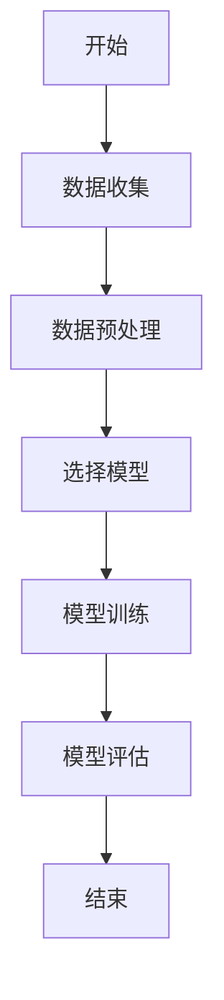
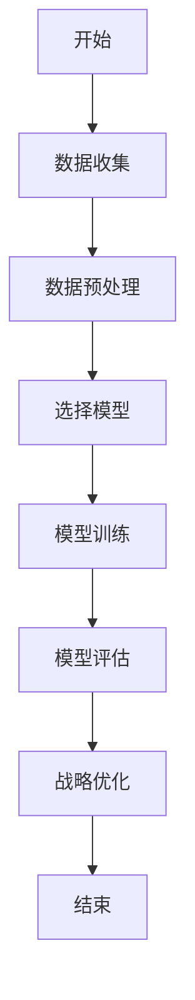
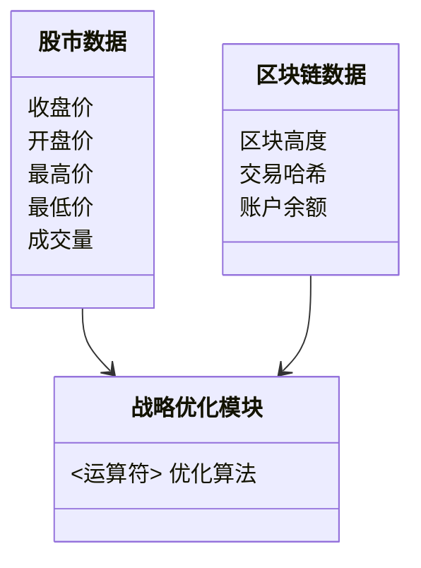
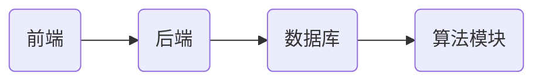

                 


# 股市估值高低对企业区块链战略的影响

> 关键词：股市估值，区块链战略，企业战略，股市数据，区块链技术，算法原理，系统架构

> 摘要：本文探讨了股市估值高低对企业区块链战略的影响，分析了高估值和低估值环境下企业如何通过区块链技术优化业务、管理和价值创造。文章结合实际案例，详细讲解了算法原理、系统架构设计，并提出了最佳实践建议。

---

## 第一部分：背景介绍

### 第1章：股市估值的基本概念与重要性

#### 1.1 股市估值的定义与意义
股市估值是衡量企业市场价值的重要指标，反映了投资者对企业的信心和对其未来表现的预期。企业可以通过合理的估值策略优化资本结构，吸引投资者，提升市场竞争力。

#### 1.2 区块链技术的基本原理
区块链是一种分布式账本技术，具有去中心化、不可篡改和透明性等特点。它在企业中可以应用于供应链管理、数据安全、智能合约等领域，提升效率和信任度。

#### 1.3 股市估值与区块链战略的结合
企业的区块链战略需要根据股市估值的高低进行调整。高估值环境下，企业可能面临更高的期望和压力，而低估值环境下则可能有更多的机会通过技术创新提升价值。区块链技术的应用可以帮助企业在不同估值环境下优化战略。

---

## 第2章：股市估值对企业的影响

### 2.1 高估值环境下的企业区块链战略
在高估值环境下，企业需要快速实现价值增长，区块链技术可以帮助提升效率和透明度，增强投资者信心。例如，通过区块链实现供应链透明化，提升产品溯源能力，增强品牌信任度。

### 2.2 低估值环境下的企业区块链战略
在低估值环境下，企业可以通过区块链技术降低成本，提升运营效率。例如，利用区块链优化供应链管理，减少中间环节，降低交易成本，提升利润空间。

### 2.3 不同估值环境下区块链战略的对比
通过对比高估值和低估值环境下的区块链战略，可以发现其在目标、实施路径和预期效果上的差异。高估值环境下更注重外部形象和市场竞争力，低估值环境下更注重内部效率和成本控制。

---

## 第3章：区块链技术对企业估值的影响机制

### 3.1 区块链技术对企业价值的提升作用
区块链技术可以提升企业的透明度和信任度，增强投资者信心，从而提升企业估值。例如，通过区块链实现数据共享和透明化，减少信息不对称，提升市场对企业的认可度。

### 3.2 区块链技术对企业风险的降低作用
区块链技术可以降低企业的运营风险和数据泄露风险，提升企业抗风险能力，从而增强投资者对企业的信心，推动企业估值上升。

---

## 第4章：算法原理与企业区块链战略

### 4.1 股市估值预测算法
使用回归分析和时间序列分析等算法，对股市估值进行预测，帮助企业制定合理的区块链战略。

#### 4.1.1 算法流程图


#### 4.1.2 Python代码示例
```python
import pandas as pd
import numpy as np
from sklearn.linear_model import LinearRegression

# 数据预处理
data = pd.read_csv('stock_data.csv')
X = data[['市盈率', '市净率']]
y = data['股价']

# 模型训练
model = LinearRegression()
model.fit(X, y)

# 模型预测
new_data = pd.DataFrame({'市盈率': [15], '市净率': [2]})
predicted_price = model.predict(new_data)
print(predicted_price)
```

### 4.2 区块链战略优化算法
基于股市估值预测结果，优化企业区块链战略的实施路径。

#### 4.2.1 优化算法流程图


---

## 第5章：系统分析与架构设计

### 5.1 系统功能设计
- **数据采集模块**：收集股市数据和企业区块链相关数据。
- **数据处理模块**：对数据进行清洗和预处理。
- **算法模块**：应用回归分析和时间序列分析进行估值预测。
- **战略优化模块**：基于预测结果，优化企业区块链战略。

#### 5.1.1 领域模型类图


### 5.2 系统架构设计
- **前端架构**：提供用户友好的界面，展示估值预测结果和战略建议。
- **后端架构**：处理数据和算法计算，返回结果。
- **数据库设计**：存储股市数据和区块链数据。

#### 5.2.1 系统架构图


---

## 第6章：项目实战

### 6.1 环境安装
- 安装Python和必要的库（如Pandas、NumPy、Scikit-learn）。
- 安装区块链开发框架（如Ethereum、Hyperledger Fabric）。

### 6.2 核心代码实现
```python
import pandas as pd
from sklearn.linear_model import LinearRegression

# 数据预处理
data = pd.read_csv('stock_data.csv')
X = data[['市盈率', '市净率']]
y = data['股价']

# 模型训练
model = LinearRegression()
model.fit(X, y)

# 模型预测
new_data = pd.DataFrame({'市盈率': [15], '市净率': [2]})
predicted_price = model.predict(new_data)
print(predicted_price)
```

### 6.3 案例分析
以某公司为例，分析其在高估值环境下的区块链战略优化过程，展示如何通过区块链技术提升企业估值。

---

## 第7章：最佳实践与小结

### 7.1 最佳实践
- 定期监控股市估值变化，及时调整区块链战略。
- 结合企业实际情况选择合适的区块链技术方案。

### 7.2 小结
本文详细探讨了股市估值高低对企业区块链战略的影响，分析了不同环境下的策略优化方法，并通过实际案例展示了如何将区块链技术应用于企业估值管理中。

---

## 第8章：注意事项与未来研究

### 8.1 注意事项
- 区块链技术的实施需要充分考虑企业内部资源和外部环境。
- 战略制定过程中需平衡技术创新与实际效果。

### 8.2 未来研究
- 研究更复杂的算法模型，提升股市估值预测的准确性。
- 探讨区块链技术在更多领域的应用潜力。

---

## 第9章：拓展阅读

### 9.1 推荐书籍
- 《区块链：新经济的蓝图》
- 《股市分析与投资策略》

### 9.2 在线资源
- 区块链开发框架文档
- 金融数据分析工具教程

---

# 结语

通过本文的分析和探讨，读者可以全面理解股市估值高低对企业区块链战略的影响，并掌握如何利用区块链技术优化企业价值。未来，随着技术的不断发展，区块链在企业战略中的应用将更加广泛和深入。

