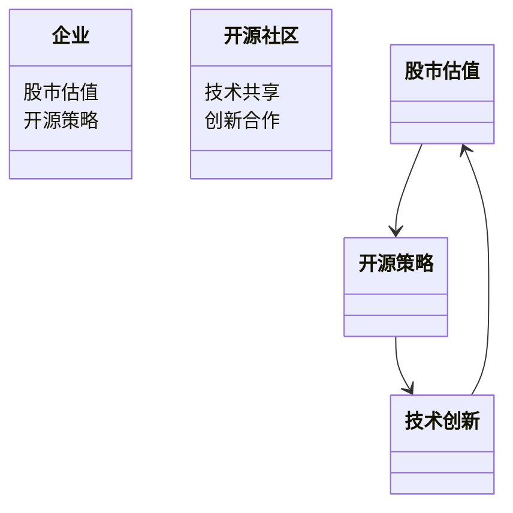

                 


# 股市估值高低对企业开源策略的影响

## 关键词：股市估值、开源策略、企业战略、数学模型、投资分析

## 摘要：  
股市估值是企业在市场上的价值反映，而开源策略是企业在技术创新和成本控制方面的重要手段。本文从股市估值与开源策略的定义出发，分析了两者之间的相互影响，探讨了开源策略如何在高估值和低估值企业中发挥不同的作用，并提出了数学模型和实际案例来支持分析。通过系统分析和项目实战，本文为企业在不同股市估值阶段制定开源策略提供了指导。

---

# 第一部分: 股市估值与开源策略的背景介绍

## 第1章: 股市估值的基本概念

### 1.1 股市估值的定义与重要性

股票估值是衡量企业市场价值的重要指标，它反映了企业在市场中的地位和前景。股市估值的高低直接影响投资者对企业价值的判断，从而影响企业的融资能力和发展机会。

**核心概念：**  
- **股票估值**：通过财务指标和市场因素计算企业市值的过程。  
- **市场价值**：企业在市场上的实际价值，受供需关系和市场情绪影响。  
- **内在价值**：企业基于财务状况和未来盈利能力的理论价值。  

**重要性：**  
股市估值影响企业的融资成本、投资者信心和市场竞争力。高估值企业通常被视为优质资产，而低估值企业可能被视为被低估的投资机会。

---

## 第2章: 开源策略的定义与特点

### 2.1 开源策略的定义

开源策略是指企业通过开放源代码、共享技术资源或采用开源技术来降低开发成本、提升创新能力和市场竞争力的策略。

**核心概念：**  
- **开源软件**：开放源代码的软件，允许任何人查看、修改和分发代码。  
- **开源策略**：企业通过采用开源技术或开放自身技术来实现战略目标的策略。  

**特点：**  
1. **低成本**：开源技术通常免费或成本低，有助于降低企业的研发和运营成本。  
2. **高创新**：开源社区的协作模式促进技术创新和知识共享。  
3. **灵活性**：企业可以根据需求灵活调整开源技术。  

---

## 第3章: 股市估值与开源策略的关联性

### 3.1 股市估值对企业开源策略的影响

股市估值的高低直接影响企业选择开源策略的动机和方式。

- **高估值企业**：  
  高估值企业通常具有较强的市场地位和盈利能力，开源策略可以帮助其进一步提升技术创新能力，增强市场竞争力。  
- **低估值企业**：  
  低估值企业可能面临资金紧张或市场认可度低的问题，开源策略可以帮助其降低成本、快速获取技术支持，从而改善财务状况。  

---

## 第4章: 开源策略对企业的影响

### 4.1 开源策略对企业竞争力的影响

开源策略通过技术创新、成本控制和市场扩展三个方面影响企业的竞争力。

- **技术创新**：开源策略促进企业与开源社区的合作，加速技术创新。  
- **成本控制**：开源技术通常免费或成本低，有助于降低企业的研发和运营成本。  
- **市场扩展**：开源策略帮助企业快速进入新市场，降低进入壁垒。  

---

## 第5章: 股市估值与开源策略的相互作用

### 5.1 股市估值对企业开源策略的选择

股市估值的高低影响企业选择开源策略的动机和方式。

- **高估值企业**：  
  高估值企业通常选择开源策略来进一步提升技术创新能力和市场竞争力。  
- **低估值企业**：  
  低估值企业可能选择开源策略来降低成本、快速获取技术支持，从而改善财务状况。  

---

## 第6章: 开源策略对股市估值的影响

### 6.1 开源策略如何影响股市估值

开源策略通过技术创新、成本控制和市场扩展三个方面影响股市估值。

- **技术创新**：开源策略促进企业技术创新，提升企业的市场竞争力，从而提高股市估值。  
- **成本控制**：开源策略降低企业的运营成本，提升盈利能力，从而提高股市估值。  
- **市场扩展**：开源策略帮助企业快速进入新市场，扩大市场份额，从而提高股市估值。  

---

## 第7章: 股市估值与开源策略的数学模型分析

### 7.1 股市估值与开源策略的数学模型

我们可以建立一个简单的数学模型来分析股市估值与开源策略的关系。

**模型假设：**  
1. 股市估值 \( V \) 与企业技术创新能力 \( T \) 成正比。  
2. 开源策略通过降低企业成本 \( C \) 和提升技术创新能力 \( T \) 来影响股市估值。  

**数学表达式：**  
\[ V = k \cdot T - C \]  
其中，\( k \) 是比例常数，\( T \) 是技术创新能力，\( C \) 是企业成本。  

---

## 第8章: 开源策略对企业开源的影响

### 8.1 开源策略对企业开源的影响

开源策略通过技术创新、成本控制和市场扩展三个方面影响企业开源。

- **技术创新**：开源策略促进企业与开源社区的合作，加速技术创新。  
- **成本控制**：开源技术通常免费或成本低，有助于降低企业的研发和运营成本。  
- **市场扩展**：开源策略帮助企业快速进入新市场，降低进入壁垒。  

---

# 第二部分: 项目实战与系统分析

## 第9章: 股市估值与开源策略的项目实战

### 9.1 环境安装与工具准备

为了进行股市估值与开源策略的分析，我们需要以下工具：

1. **Python**：用于数据分析和数学建模。  
2. **Pandas** 和 **NumPy**：用于数据处理和计算。  
3. **Matplotlib** 或 **Seaborn**：用于数据可视化。  
4. **Jupyter Notebook**：用于代码编写和结果展示。  

---

## 第10章: 核心代码实现与解读

### 10.1 核心代码实现

以下是一个简单的Python代码示例，用于计算企业股市估值与开源策略的关系：

```python
import pandas as pd
import numpy as np
import matplotlib.pyplot as plt

# 示例数据
data = {
    '企业名称': ['A', 'B', 'C'],
    '股市估值': [100, 200, 150],
    '开源策略': [True, False, True]
}

df = pd.DataFrame(data)

# 计算股市估值与开源策略的相关性
correlation = df['股市估值'].corr(df['开源策略'].astype(int))
print(f"股市估值与开源策略的相关性为：{correlation}")

# 可视化
plt.scatter(df['企业名称'], df['股市估值'], c=df['开源策略'].astype(int))
plt.title('股市估值与开源策略的关系')
plt.xlabel('企业名称')
plt.ylabel('股市估值')
plt.show()
```

### 10.2 代码解读与分析

- **数据准备**：我们创建了一个包含企业名称、股市估值和开源策略的数据框。  
- **相关性计算**：使用Pandas的corr函数计算股市估值与开源策略的相关性。  
- **数据可视化**：使用Matplotlib绘制散点图，展示股市估值与开源策略的关系。  

---

## 第11章: 系统分析与架构设计方案

### 11.1 问题场景介绍

我们需要分析股市估值与开源策略之间的关系，并为企业制定开源策略提供指导。

### 11.2 系统功能设计

以下是系统功能设计的类图：



### 11.3 系统架构设计

以下是系统架构设计的架构图：


---

## 第12章: 最佳实践与总结

### 12.1 最佳实践

- **高估值企业**：积极采用开源策略，与开源社区合作，提升技术创新能力。  
- **低估值企业**：通过开源策略降低成本，快速获取技术支持，改善财务状况。  

### 12.2 小结

股市估值与开源策略密切相关，开源策略可以帮助企业在不同估值阶段实现技术创新、成本控制和市场扩展，从而提升股市估值。

### 12.3 注意事项

- 开源策略的实施需要根据企业的具体情况制定。  
- 开源策略可能面临开源社区不稳定或技术更新快的风险。  

### 12.4 拓展阅读

- 《开源战略：企业如何利用开源技术实现创新》  
- 《股市估值分析：理论与实践》  

---

# 结语

通过本文的分析，我们可以看到股市估值与开源策略之间的密切关系。企业可以根据自身的估值情况选择合适的开源策略，从而实现技术创新和市场扩展，提升股市估值。希望本文的分析能够为企业制定开源策略提供有价值的参考。

