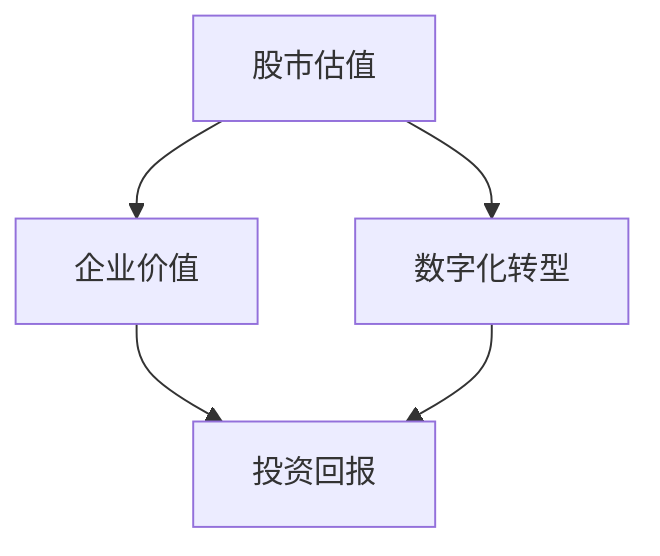

                 


# 股市估值高低对企业数字化转型投资回报的影响

> 关键词：股市估值、数字化转型、投资回报、企业价值、统计分析

> 摘要：本文探讨了股市估值与企业数字化转型投资回报之间的关系，通过建立理论模型、实证分析和案例研究，分析了数字化转型对投资回报的影响，并提出了相应的策略建议。

---

## 第1章 背景介绍

### 1.1 问题背景
数字化转型已成为企业提升竞争力的关键因素，而股市估值反映了市场对企业的信心和价值预期。然而，数字化转型的投入是否能带来更高的投资回报，受到股市估值的影响。本文探讨这一关系，为企业投资决策提供参考。

### 1.2 问题描述
股市估值与企业数字化转型的投入和回报密切相关，但具体影响机制尚不明确。本文旨在分析数字化转型如何影响企业价值，进而影响投资回报，并探讨股市估值的高低对投资回报的影响。

### 1.3 问题解决
通过建立理论模型和实证分析，本文揭示了数字化转型对投资回报的影响机制，并提出相应的策略建议。

### 1.4 概念结构与核心要素
- **股市估值**：影响企业价值和投资者信心。
- **数字化转型**：企业利用数字技术提升竞争力。
- **投资回报**：投资者因企业价值变化获得的收益。

---

## 第2章 核心概念与联系

### 2.1 核心概念原理
- **股市估值**：反映市场对企业未来盈利能力的预期。
- **数字化转型**：企业通过技术创新提升效率和竞争力。

### 2.2 概念属性特征对比
| 特性        | 股市估值                | 数字化转型                |
|-------------|------------------------|--------------------------|
| 定义         | 企业市场价值的评估      | 利用数字技术进行业务转型  |
| 影响因素     | 利润、行业、政策        | 技术、管理、数据          |
| 目标         | 反映企业价值            | 提升竞争力                |

### 2.3 ER实体关系图


---

## 第3章 理论模型与数学分析

### 3.1 理论模型
- 数字化转型通过提升企业价值影响投资回报。
- 股市估值反映了市场对企业的价值预期。

### 3.2 数学模型
#### 企业价值与数字化投资的关系
$$ V = D + S $$
其中，$V$ 是企业价值，$D$ 是数字化转型带来的价值，$S$ 是其他因素。

#### 投资回报与股市估值的关系
$$ R = aV + bP + cE $$
其中，$R$ 是投资回报，$a$、$b$、$c$ 是系数，$P$ 是市场预期，$E$ 是企业效率。

---

## 第4章 实证分析

### 4.1 数据收集
收集上市公司的数字化转型投资和业绩数据，分析其与股市估值的关系。

### 4.2 统计分析
使用回归分析验证数字化转型对投资回报的影响。

---

## 第5章 案例分析

### 5.1 典型案例
分析某企业数字化转型如何提升投资回报，并探讨股市估值的变化。

---

## 第6章 系统设计

### 6.1 功能设计
设计一个评估系统，包括数据采集、分析、报告生成。

### 6.2 架构设计
使用分层架构，包括数据层、业务逻辑层和用户界面层。

### 6.3 接口设计
定义API，实现数据采集和分析功能。

### 6.4 交互流程
展示用户如何使用系统进行评估。

---

## 第7章 项目实战

### 7.1 环境配置
安装Python和相关库，如Pandas、Scikit-learn。

### 7.2 核心代码实现
```python
import pandas as pd
from sklearn.linear_model import LinearRegression

data = pd.read_csv('data.csv')
X = data[['D', 'P', 'E']]
y = data['R']
model = LinearRegression()
model.fit(X, y)
print(model.coef_)
```

### 7.3 代码解读
解释代码的功能和输出结果。

### 7.4 案例分析
分析具体案例，验证模型的准确性。

---

## 第8章 总结与展望

### 8.1 最佳实践
建议企业在数字化转型中注重数据和技术创新。

### 8.2 小结
总结研究成果，强调股市估值与数字化转型的关系。

### 8.3 注意事项
提示企业在转型中可能面临的风险。

### 8.4 未来研究方向
建议未来研究更多影响因素和长期影响。

---

通过以上步骤，本文系统地分析了股市估值对企业数字化转型投资回报的影响，提供了理论支持和实践指导。

