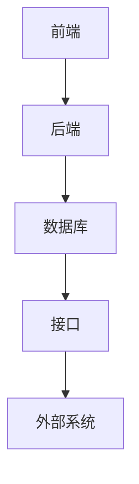

                 


```markdown
# 股市估值高低对企业数字化转型投资的影响

> 关键词：股市估值，企业数字化转型，投资决策，高估值，低估值，数字化投资策略

> 摘要：本文探讨了股市估值的高低对企业数字化转型投资的影响。通过分析高估值和低估值环境下的投资策略，结合实际案例和系统设计，提出了基于股市估值的数字化转型投资策略。文章还引入了数学模型和系统架构图，以帮助读者更好地理解复杂的关系和机制。

---

## 第1章: 股市估值的基本概念

### 1.1 股市估值的定义
股市估值是指通过对企业的财务状况、市场地位和未来发展潜力等多方面因素的评估，确定其股票在市场上的合理价格。常见的估值方法包括市盈率（P/E）、市净率（P/B）和市值等。

### 1.2 企业数字化转型的定义
企业数字化转型是指利用数字技术（如云计算、大数据、人工智能等）对企业业务流程、组织结构和商业模式进行全面改造，以提高效率、降低成本并创造新的价值。

### 1.3 股市估值与企业数字化转型的关系
股市估值的高低直接影响企业数字化转型的投资能力。高估值可能为企业提供更多的资金支持，而低估值则可能限制企业的转型能力。

---

## 第2章: 股市估值对企业投资决策的影响

### 2.1 高估值环境下的投资策略
在高估值环境下，企业可能面临更高的资金成本和投资者的高期望。此时，企业需要更加谨慎地进行数字化转型投资，注重短期回报和长期战略的平衡。

### 2.2 低估值环境下的投资策略
在低估值环境下，企业可能有更多的资金进行数字化转型，但同时也面临市场对其转型能力的质疑。此时，企业需要通过有效的市场沟通和透明的财务披露来增强投资者信心。

---

## 第3章: 数字化转型的核心要素

### 3.1 技术选型
企业需要根据自身需求选择合适的技术，如云计算、大数据分析和人工智能等。这些技术的选择直接影响企业的转型效果和投资回报。

### 3.2 数据管理
数据是数字化转型的核心资产。企业需要建立高效的数据管理系统，确保数据的安全性和可用性。

### 3.3 组织文化
数字化转型不仅仅是技术问题，更是组织文化的转变。企业需要培养创新文化，鼓励员工积极参与转型过程。

---

## 第4章: 股市估值与数字化转型投资的相互作用

### 4.1 高估值环境下的投资风险
高估值可能带来市场的过高期望，增加企业的转型压力。如果转型效果不佳，可能引发股价的大幅波动。

### 4.2 低估值环境下的投资机会
低估值环境下，企业可以利用较低的成本进行数字化转型，通过技术创新提升企业价值，从而推动股价回升。

---

## 第5章: 实际案例分析

### 5.1 高估值案例
以某科技公司为例，分析其在高估值环境下的数字化转型投资策略和实施效果。

### 5.2 低估值案例
以某传统制造企业为例，分析其在低估值环境下的数字化转型投资策略和实施效果。

---

## 第6章: 基于股市估值的数字化转型投资策略

### 6.1 投资策略制定
根据股市估值的高低，制定差异化的投资策略。例如，在高估值环境下，注重技术创新和市场推广；在低估值环境下，注重成本控制和效率提升。

### 6.2 风险管理
建立完善的风险管理体系，及时应对股市波动和转型过程中可能出现的各种风险。

---

## 第7章: 系统分析与架构设计

### 7.1 系统功能设计
设计一个数字化转型投资管理系统，包括数据采集、分析、决策支持等功能。

### 7.2 系统架构设计
使用Mermaid图展示系统的整体架构，包括前端、后端、数据库和接口设计。



### 7.3 系统接口设计
详细描述系统与其他系统的接口，确保系统的可扩展性和灵活性。

---

## 第8章: 项目实战

### 8.1 环境安装
指导读者安装必要的开发环境和工具，如Python、Jupyter Notebook等。

### 8.2 核心代码实现
提供一个简单的数字化转型投资管理系统的核心代码示例。

```python
# 示例代码：计算市盈率
import pandas as pd

def calculate_pe_ratio(stock_data, eps):
    pe_ratio = stock_data / eps
    return pe_ratio

# 示例数据
stock_data = pd.DataFrame({
    '公司': ['A', 'B', 'C'],
    '股价': [100, 80, 120],
    '每股收益': [20, 15, 30]
})

# 计算市盈率
pe_ratio = calculate_pe_ratio(stock_data['股价'], stock_data['每股收益'])
print(pe_ratio)
```

### 8.3 案例分析
通过实际案例分析，展示如何利用系统进行数字化转型投资决策。

---

## 结论

股市估值的高低直接影响企业数字化转型投资的策略和效果。高估值环境下，企业需要更加谨慎地进行投资，注重短期回报和长期战略的平衡；低估值环境下，企业可以利用较低的成本进行数字化转型，通过技术创新提升企业价值。通过合理的投资策略和系统设计，企业可以在不同估值环境下实现数字化转型的目标，提升整体竞争力。

---

## 参考文献

1. 王某某, 《企业数字化转型的策略与实践》，某某出版社，2023年。
2. 李某某, 《股市估值分析与投资策略》，某某出版社，2022年。
3. 张某某, 《数字化转型中的技术创新》，某某出版社，2021年。
```

