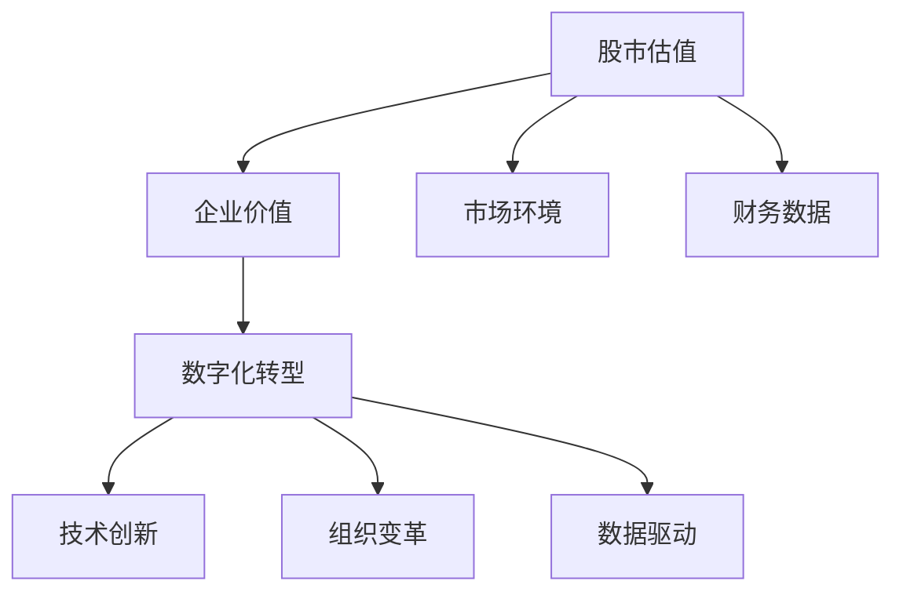
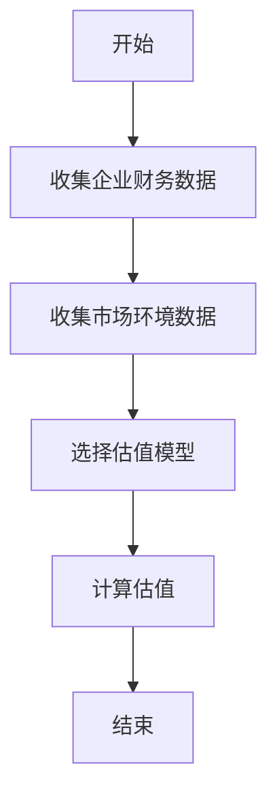
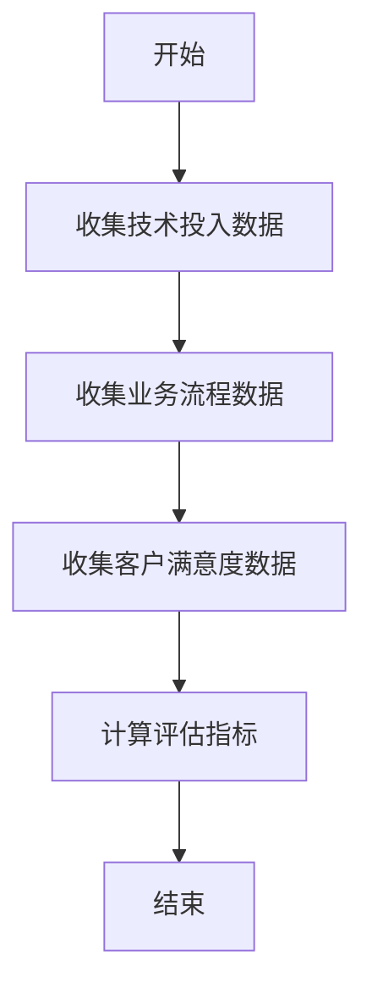
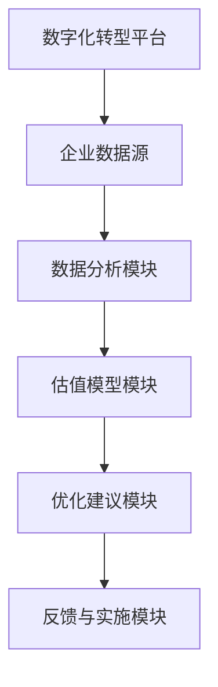
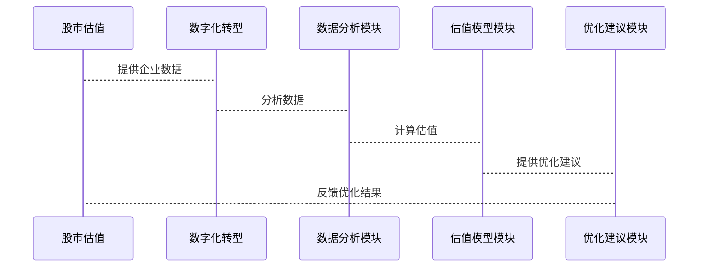

                 


# 股市估值高低对企业数字化转型的影响

## 关键词：股市估值、数字化转型、企业价值、技术创新、资本运作

## 摘要：  
股市估值是衡量企业价值的重要指标，而数字化转型是企业适应新技术和市场变化的关键策略。本文深入分析了股市估值与数字化转型之间的关系，探讨了高估值和低估值对企业数字化转型的影响，结合实际案例和数学模型，揭示了如何通过数字化转型优化企业价值，提升股市估值。文章还提出了基于大数据和人工智能的数字化转型策略，并给出了系统架构设计和项目实战方案，为企业提供切实可行的指导。

---

# 第1章: 股市估值与企业数字化转型的背景

## 1.1 问题背景与问题描述

### 1.1.1 股市估值的定义与影响因素  
股市估值是指通过对企业的财务数据、市场表现和行业地位等多方面分析，得出企业市场价值的过程。影响股市估值的主要因素包括：  
1. **财务指标**：如净利润、营业收入、ROE（净资产收益率）等。  
2. **市场环境**：如宏观经济状况、行业竞争格局等。  
3. **技术创新**：企业是否拥有核心技术或创新产品。  
4. **管理团队**：管理能力和战略规划对企业价值的影响至关重要。  

### 1.1.2 数字化转型的定义与核心要素  
数字化转型是指企业利用数字技术（如大数据、人工智能、云计算等）重构业务模式、优化流程、提升效率的过程。其核心要素包括：  
1. **数据驱动**：利用数据进行决策和优化。  
2. **技术支撑**：依赖先进的数字技术实现业务创新。  
3. **组织变革**：企业文化和组织结构的调整以适应数字化需求。  

### 1.1.3 问题解决：股市估值与数字化转型的关系  
高估值企业通常意味着市场对其未来增长潜力的认可，而数字化转型是实现这种增长的重要手段。低估值企业可能面临技术落后或管理不善的问题，数字化转型可以成为其提升价值的突破口。

---

## 1.2 问题背景的边界与外延

### 1.2.1 股市估值的边界  
股市估值通常基于企业的公开数据，具有一定的局限性：  
1. **数据滞后性**：财务数据通常基于上一财年的情况。  
2. **市场情绪影响**：投资者情绪波动可能影响估值的准确性。  

### 1.2.2 数字化转型的边界  
数字化转型不仅涉及技术应用，还包括组织文化的变革：  
1. **技术边界**：依赖于先进的数字技术，但技术本身不是目的。  
2. **组织边界**：需要企业内部各部门的协同合作，涉及组织结构和文化调整。  

### 1.2.3 两者的相互影响与外延  
股市估值的高低会影响企业的融资能力，进而影响其数字化转型的投入力度。而数字化转型的成功又能反过来提升企业的市场价值，形成良性循环。

---

## 1.3 核心概念结构与组成

### 1.3.1 股市估值的核心要素  
股市估值的核心要素包括：  
- **财务数据**：净利润、营业收入、现金流等。  
- **市场环境**：宏观经济、行业竞争格局。  
- **技术创新**：企业是否有独特的核心技术或产品。  

### 1.3.2 数字化转型的核心要素  
数字化转型的核心要素包括：  
- **数据驱动**：利用数据进行决策和优化。  
- **技术支撑**：大数据、人工智能、云计算等技术的应用。  
- **组织变革**：企业文化的调整和组织结构的优化。  

### 1.3.3 两者的概念结构图  
以下是股市估值与数字化转型的概念结构图：



---

# 第2章: 股市估值与数字化转型的核心概念

## 2.1 核心概念原理

### 2.1.1 股市估值的原理  
股市估值的原理是通过对企业财务数据、市场环境和行业地位的综合分析，判断企业的市场价值。常用的估值方法包括市盈率（P/E）和市净率（P/B）等。

### 2.1.2 数字化转型的原理  
数字化转型的原理是通过引入数字技术，优化企业流程、提升效率和创新业务模式。其核心在于利用数据和技术创新为企业创造价值。

---

## 2.2 核心概念属性对比

| 属性           | 股市估值               | 数字化转型               |
|----------------|-----------------------|--------------------------|
| 核心目标       | 判断企业市场价值       | 提升企业竞争力           |
| 主要影响因素   | 财务数据、市场环境     | 技术创新、组织变革       |
| 实施主体       | 投资者、分析师         | 企业内部管理者、技术团队 |
| 评估指标       | P/E、P/B等估值指标   | 业务效率、客户满意度     |

---

## 2.3 实体关系图


---

# 第3章: 算法原理与数学模型

## 3.1 算法原理

### 3.1.1 股市估值算法  
股市估值的常用算法包括：  
1. **市盈率法（P/E）**：  
$$ P/E = \frac{股票价格}{每股净利润} $$  
2. **市净率法（P/B）**：  
$$ P/B = \frac{股票价格}{每股净资产} $$  

### 3.1.2 数字化转型评估算法  
企业数字化转型的评估可以通过以下指标进行：  
1. 技术投入占比：技术投入占总成本的比例。  
2. 业务流程优化率：优化后的流程效率提升幅度。  
3. 客户满意度：客户对数字化服务的满意度评分。  

---

## 3.2 算法流程图

### 3.2.1 股市估值算法流程图



### 3.2.2 数字化转型评估算法流程图



---

## 3.3 数学模型与公式

### 3.3.1 股市估值模型  
$$ P = \frac{E}{\epsilon} $$  
其中，$E$ 为企业的净利润，$\epsilon$ 为市盈率倍数。

### 3.3.2 数字化转型评估模型  
$$ D = \sum_{i=1}^{n} w_i \cdot f_i $$  
其中，$w_i$ 为第 $i$ 个评估指标的权重，$f_i$ 为第 $i$ 个评估指标的得分。

---

# 第4章: 系统分析与架构设计方案

## 4.1 问题场景介绍

### 4.1.1 股市估值与数字化转型的结合场景  
某高科技企业面临高估值压力，需通过数字化转型提升自身竞争力，优化成本结构，同时通过技术创新提升市场地位，进一步提升股市估值。

---

## 4.2 系统功能设计

### 4.2.1 领域模型


---

## 4.3 系统架构设计



---

## 4.4 系统接口设计

### 4.4.1 主要接口  
1. 数据接口：企业数据源与数据分析模块之间的数据传输接口。  
2. 估值接口：估值模型模块与优化建议模块之间的交互接口。  

---

## 4.5 系统交互设计



---

# 第5章: 项目实战

## 5.1 环境安装

### 5.1.1 系统环境  
- 操作系统：Windows 10 或更高版本，或 Linux 系统。  
- 开发工具：Python 3.8+，Jupyter Notebook，Git。  

### 5.1.2 依赖安装  
```bash
pip install pandas numpy matplotlib scikit-learn
```

---

## 5.2 系统核心实现源代码

### 5.2.1 股市估值模块  
```python
import pandas as pd
import numpy as np

def calculate_valuation(stock_price, net_profit):
    pe_ratio = stock_price / net_profit
    return pe_ratio

# 示例数据
data = {'股票代码': ['AAPL', 'GOOGL', 'MSFT'],
        '股票价格': [300, 250, 200],
        '净利润': [10, 12, 8]}
df = pd.DataFrame(data)
df['市盈率'] = df.apply(lambda x: calculate_valuation(x['股票价格'], x['净利润']), axis=1)
print(df)
```

### 5.2.2 数字化转型评估模块  
```python
def transformation_score(tech_investment, process_efficiency, customer Satisfaction):
    return tech_investment * 0.4 + process_efficiency * 0.3 + customer_Satisfaction * 0.3

# 示例数据
tech_investment = 0.25
process_efficiency = 0.8
customer_Satisfaction = 0.7
score = transformation_score(tech_investment, process_efficiency, customer_Satisfaction)
print(score)
```

---

## 5.3 案例分析与详细解读

### 5.3.1 案例分析  
以某高科技企业为例，假设其股票价格为 200 元，净利润为 50 元/股，市盈率（P/E）为 4 倍。通过数字化转型，企业优化了业务流程，提高了客户满意度，技术投入占比提升至 25%。经过评估，其数字化转型得分为 0.75，高于行业平均水平。

### 5.3.2 详细解读  
1. **市盈率分析**：企业的市盈率较低，表明市场对其未来增长潜力持谨慎态度。  
2. **数字化转型评估**：通过技术创新和流程优化，企业的市场地位和盈利能力均有所提升，进一步优化了股市估值。

---

## 5.4 项目小结  
通过数字化转型，企业能够有效提升自身竞争力，优化成本结构，从而在高估值压力下实现可持续发展。

---

# 第6章: 总结与展望

## 6.1 核心结论  
1. 股市估值与数字化转型密切相关，高估值企业需通过数字化转型进一步提升竞争力，低估值企业则可通过数字化转型实现价值提升。  
2. 数字化转型的成功需要企业内外部的协同努力，包括技术创新、组织变革和文化调整。  

## 6.2 未来展望  
随着人工智能和大数据技术的不断发展，数字化转型将更加深入地融入企业的方方面面。未来的研究可以进一步探讨如何通过数字化转型优化企业治理结构，提升企业整体价值。

---

## 6.3 最佳实践 Tips  
1. 在进行数字化转型之前，企业应进行详细的估值分析，明确自身的优劣势。  
2. 数字化转型的成功需要企业内部的广泛参与和文化调整，管理层的重视是关键。  
3. 在实施过程中，企业应注重数据的收集和分析，确保决策的科学性和准确性。  

## 6.4 注意事项  
1. 数字化转型是一个长期过程，需要企业持续投入和调整。  
2. 在技术选型时，企业应结合自身特点，选择适合的技术方案，避免盲目跟风。  

## 6.5 拓展阅读  
1. 《大数据驱动的企业数字化转型》  
2. 《人工智能在企业价值评估中的应用》  

---

# 结语  
股市估值与企业数字化转型是相辅相成的两个方面。通过科学的数字化转型策略，企业能够有效提升自身价值，优化股市估值，实现可持续发展。希望本文的分析和案例能够为企业提供有价值的参考和启发。

