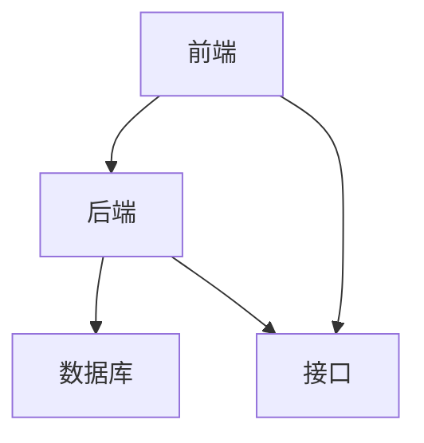
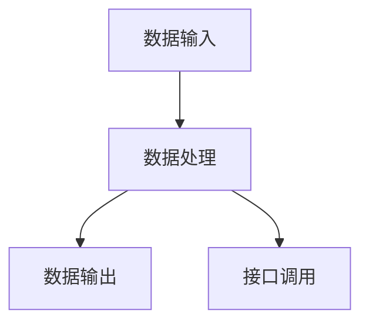

                 

# 股市估值高低对企业数字化转型速度的影响

> 关键词：股市估值、企业数字化转型、资本运作、研发投入、人才激励、系统架构、案例分析

> 摘要：股市估值是企业在资本市场上的价值体现，而企业数字化转型则是企业在数字时代的核心竞争力。本文通过分析股市估值高低对企业数字化转型速度的影响，揭示了高估值与低估值对企业转型的不同路径。从资本运作、研发投入、人才激励等角度，深入探讨了股市估值对企业数字化转型的推动与制约机制。通过实际案例分析，本文提出了企业在不同估值环境下的转型策略，并为投资者提供了评估企业数字化潜力的参考框架。

---

## 第一部分：股市估值与企业数字化转型的背景与核心概念

### 第1章：股市估值与企业数字化转型概述

#### 1.1 股市估值的基本概念

股市估值是衡量企业市场价值的核心指标，通常以市值（Market Value）和市盈率（P/E Ratio）等指标来衡量。市值是企业股票的市场价格乘以总股本，反映了市场对企业价值的总体判断。市盈率则是企业股价与每股收益（EPS）的比率，用于评估企业股票的相对估值水平。

企业数字化转型则是指企业利用数字技术（如大数据、人工智能、云计算等）重构业务流程、组织架构和商业模式的过程。这一过程通常包括技术升级、流程优化、数据驱动决策等关键步骤。

股市估值与企业数字化转型之间存在密切关系。高估值的企业往往有更多的资金支持和市场压力，而低估值的企业则可能面临融资困难和转型动力不足的问题。

#### 1.2 企业数字化转型的背景与现状

数字化转型已成为企业应对市场竞争的核心战略。随着技术的快速发展，企业需要通过数字化手段提升效率、降低成本，并创造新的业务模式。然而，数字化转型不仅需要技术投入，还需要企业文化的转变和组织架构的调整。

当前，许多企业已经意识到数字化转型的重要性，并将其纳入发展战略。然而，不同企业的转型速度和效果差异显著。股市估值的高低往往成为影响企业数字化转型速度的重要因素。

#### 1.3 两者关系的初步探讨

股市估值的高低反映了市场对企业未来发展的预期。高估值意味着市场对企业有较高的期望，但也可能带来更大的压力；低估值则可能为企业提供更多的转型空间，但同时也面临资金不足的挑战。因此，股市估值不仅是企业数字化转型的外部驱动因素，也是内部转型动力的重要来源。

---

### 第2章：股市估值与企业数字化转型的核心概念

#### 2.1 股市估值的核心要素

股市估值的核心要素包括企业的财务状况、行业地位、管理团队、市场前景等。其中，财务状况是影响估值的基础，而市场前景则是决定估值的关键因素。高估值的企业通常具有较高的成长潜力和市场竞争力，而低估值的企业则可能面临较大的经营压力。

#### 2.2 企业数字化转型的关键特征

企业数字化转型的关键特征包括：

1. **技术驱动**：利用新兴技术（如人工智能、大数据）重构业务流程。
2. **数据驱动**：通过数据收集和分析优化决策。
3. **组织变革**：调整组织架构和文化以适应数字化需求。
4. **客户导向**：通过数字化手段提升客户体验。

#### 2.3 企业数字化转型的外部与内部驱动

外部驱动因素包括市场竞争压力、客户需求变化、技术进步等；内部驱动因素包括企业战略调整、效率提升需求等。股市估值的高低往往通过外部驱动因素影响企业的内部转型动力。

---

## 第二部分：股市估值对企业数字化转型的影响机制

### 第3章：高估值对企业数字化转型的推动作用

#### 3.1 高估值带来的资金支持

高估值企业通常具有较高的市值和市盈率，这为企业提供了更多的资金支持。企业可以通过发行股票、增加债务融资等方式筹集资金，用于数字化转型的相关投入。

#### 3.2 高估值对企业研发投入的促进

高估值企业往往具有较高的研发投入能力。市场对企业的高估值意味着投资者对企业未来增长潜力的认可，这也为企业提供了更多的研发资金和资源。

#### 3.3 高估值对管理层激励的影响

高估值企业通常会采用股票期权、限制性股票等激励机制，吸引和留住优秀管理人才。管理层的利益与企业价值紧密相关，这有助于推动企业数字化转型。

---

### 第4章：低估值对企业数字化转型的制约作用

#### 4.1 低估值对企业融资能力的限制

低估值企业往往面临融资困难，难以获得足够的资金支持。这可能限制企业在数字化转型中的技术投入和组织变革能力。

#### 4.2 低估值对管理层创新动力的抑制

低估值可能导致管理层对创新持保守态度。管理层可能更倾向于追求短期收益，而非投入长期的数字化转型项目。

#### 4.3 低估值对员工积极性的影响

低估值可能影响员工的积极性和创造力。员工可能缺乏对企业未来发展的信心，从而降低对数字化转型的支持力度。

---

## 第三部分：股市估值与企业数字化转型的动态关系

### 第5章：数字化转型对股市估值的反向影响

#### 5.1 数字化转型如何提升企业价值

企业通过数字化转型可以提高效率、降低成本、创造新的收入来源。这些因素都会提升企业的市场价值，从而推动股市估值的上升。

#### 5.2 数字化转型对企业未来增长潜力的影响

数字化转型的成功可以增强企业的核心竞争力，提升市场地位。这将被市场反映为企业未来增长潜力的增加，从而推动股市估值的提升。

#### 5.3 投资者对数字化转型的预期与估值调整

投资者对数字化转型的预期会影响股市估值。如果投资者认为企业的数字化转型能够带来更高的收益，他们可能会提高对企业估值的预期。

---

### 第6章：股市估值波动对企业数字化转型的短期与长期影响

#### 6.1 短期估值波动对企业转型节奏的调整

短期估值波动可能导致企业调整数字化转型的节奏。高估值可能促使企业加快转型速度，而低估值可能迫使企业放缓转型。

#### 6.2 长期估值趋势对企业转型战略的影响

长期估值趋势决定了企业数字化转型的长期战略。高估值趋势可能促使企业采取激进的转型策略，而低估值趋势可能促使企业采取保守的转型策略。

#### 6.3 企业如何应对估值波动带来的挑战

企业需要建立灵活的转型机制，以应对估值波动带来的挑战。这包括制定灵活的转型目标、优化资本结构、加强与投资者的沟通等。

---

## 第四部分：案例分析与系统设计

### 第7章：高估值企业的数字化转型实践

#### 7.1 高估值企业的特点与转型路径

高估值企业通常具有较高的市场地位和资金实力，能够快速推动数字化转型。它们通常采用技术创新、业务模式创新等策略，以实现持续增长。

#### 7.2 典型案例分析

以某互联网公司为例，该公司通过高估值获得了大量的资金支持，迅速推进数字化转型。通过引入人工智能技术，该公司成功提升了用户体验，进一步巩固了市场地位。

---

### 第8章：低估值企业的数字化转型策略

#### 8.1 低估值企业的特点与转型挑战

低估值企业通常面临资金不足、市场竞争力较弱等挑战。它们需要通过低成本的数字化手段实现转型，同时优化组织架构和管理效率。

#### 8.2 典型案例分析

以某制造企业为例，该公司通过低估值环境下的内部优化，逐步推进数字化转型。通过引入自动化技术，该公司成功降低了生产成本，提升了效率。

---

## 第五部分：系统分析与架构设计

### 第9章：数字化转型的系统架构设计

#### 9.1 系统功能设计

企业数字化转型的系统功能设计包括数据采集、数据分析、业务优化、用户交互等模块。

#### 9.2 系统架构设计

企业数字化转型的系统架构设计通常包括前端（用户界面）、后端（数据分析）、数据库、接口等部分。以下是系统架构的 Mermaid 图：

#### 9.3 系统接口设计

系统接口设计需要考虑数据的输入与输出，以及与其他系统的集成。以下是系统接口的 Mermaid 图：

---

## 第六部分：解决方案与最佳实践

### 第10章：企业应对估值波动的策略

#### 10.1 优化资本结构

企业可以通过优化资本结构，降低对股市估值的依赖。这包括合理分配债务与股权、引入战略投资者等。

#### 10.2 提升核心竞争力

企业需要通过技术创新、管理优化等方式提升核心竞争力，以应对估值波动带来的挑战。

#### 10.3 加强与投资者的沟通

企业应加强与投资者的沟通，传递数字化转型的信心和进展，以提升市场对企业的估值预期。

---

## 结论

股市估值的高低对企业数字化转型的速度和效果具有重要影响。高估值企业通常能够获得更多的资金支持和市场压力，推动数字化转型的快速实施；而低估值企业则面临更多的挑战，需要通过内部优化和创新应对。企业需要根据自身的估值环境制定灵活的转型策略，同时加强与投资者的沟通，提升市场对企业的估值预期。

未来的研究可以进一步探讨数字化转型对企业估值的具体影响路径，以及不同行业在数字化转型中的差异化表现。

