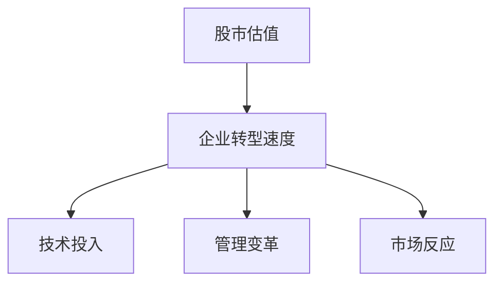

                 


# 股市估值高低对企业数字化转型速度的影响

## 关键词
股市估值、数字化转型、企业战略、数据分析、机器学习

## 摘要
股市估值作为企业价值的重要指标，对企业数字化转型的速度和方向具有显著影响。本文通过分析股市估值与数字化转型的关系，探讨如何利用数据分析和机器学习模型预测和优化企业的数字化转型策略，帮助企业制定更有效的战略决策。

---

## 正文

### 第一部分: 背景介绍

#### 第1章: 股市估值与数字化转型概述

##### 1.1 问题背景

###### 1.1.1 股市估值的定义与影响因素
股市估值是衡量企业价值的重要指标，通常通过市盈率（P/E）、市净率（P/B）等指标来衡量。这些指标反映了市场对企业未来盈利能力的预期。

###### 1.1.2 数字化转型的定义与核心要素
数字化转型是指企业利用数字技术（如云计算、大数据、人工智能）改造业务流程、商业模式和决策方式，以提高效率和竞争力。

###### 1.1.3 问题提出的背景与现实意义
随着全球经济数字化的加速，企业数字化转型已成为必然趋势。然而，股市估值的高低直接影响企业的资金投入和转型能力，因此研究其影响具有重要的现实意义。

##### 1.2 问题描述

###### 1.2.1 股市估值对企业战略决策的影响
股市估值的高低会影响企业的投资决策，高估值可能促使企业加快转型步伐，而低估值可能限制转型投入。

###### 1.2.2 数字化转型的挑战与机遇
数字化转型需要技术和组织变革，但也带来了新的市场机会。如何在有限资源下实现高效转型是企业面临的关键问题。

###### 1.2.3 问题解决的必要性与目标
通过分析股市估值与数字化转型的关系，帮助企业制定科学的转型策略，优化资源配置。

##### 1.3 问题解决路径

###### 1.3.1 数据驱动的分析方法
通过收集和分析企业财务数据、市场数据等，找出股市估值与数字化转型速度之间的关联性。

###### 1.3.2 统计与机器学习模型的应用
利用回归分析、时间序列分析等统计方法，以及机器学习算法（如随机森林、神经网络）进行预测和优化。

###### 1.3.3 结构化的企业转型策略
结合数据分析结果，制定分阶段的转型计划，确保资源合理分配和风险控制。

##### 1.4 边界与外延

###### 1.4.1 股市估值的边界条件
考虑市场波动、行业差异等因素，明确股市估值分析的适用范围。

###### 1.4.2 数字化转型的适用范围
适用于各行业，但不同行业的转型重点和影响因素有所不同。

###### 1.4.3 相关概念的对比与区分
与企业绩效、技术创新等其他因素进行对比，明确股市估值的独特作用。

##### 1.5 概念结构与核心要素

###### 1.5.1 股市估值的核心要素
市盈率、市净率、股息率等。

###### 1.5.2 数字化转型的关键因素
技术、管理、文化、战略等。

###### 1.5.3 两者关系的结构化分析
股市估值影响企业转型投入，而数字化转型又反过来影响股市估值。

---

### 第二部分: 核心概念与联系

#### 第2章: 核心概念原理

##### 2.1 股市估值的理论基础

###### 2.1.1 市盈率与市净率的计算公式
- 市盈率（P/E）= 股价 / 每股收益
- 市净率（P/B）= 股价 / 每股净资产

###### 2.1.2 股东权益与企业价值的关系
股东权益是企业价值的重要组成部分，影响股市估值。

##### 2.2 数字化转型的驱动因素

###### 2.2.1 技术驱动：云计算、大数据、AI
技术进步是数字化转型的核心动力。

###### 2.2.2 组织驱动：管理与文化变革
组织结构和文化变革是确保转型成功的关键。

##### 2.3 核心概念属性对比表

| 概念       | 属性         | 描述                                   |
|------------|--------------|--------------------------------------|
| 股市估值   | 计量方式     | 市盈率、市净率等                     |
| 数字化转型 | 实施难度     | 高，需要技术、组织、文化的整合       |

##### 2.4 ER实体关系图


---

### 第三部分: 算法原理讲解

#### 第3章: 数据分析与预测模型

##### 3.1 数据分析方法

###### 3.1.1 数据采集与预处理
- 数据来源：企业财务数据、市场数据。
- 数据清洗：处理缺失值、异常值。

##### 3.2 机器学习模型

###### 3.2.1 线性回归模型
$$y = \beta_0 + \beta_1x + \epsilon$$
其中，y为转型速度，x为股市估值。

###### 3.2.2 时间序列分析
使用ARIMA模型预测股市估值的变化趋势。

##### 3.3 模型实现

###### 3.3.1 Python代码实现
```python
import pandas as pd
from sklearn.linear_model import LinearRegression
from sklearn.metrics import mean_squared_error

# 数据加载
data = pd.read_csv('data.csv')

# 模型训练
model = LinearRegression()
model.fit(data[['市盈率', '市净率']], data['转型速度'])

# 模型预测
predictions = model.predict(data[['市盈率', '市净率']])
print(mean_squared_error(data['转型速度'], predictions))
```

---

### 第四部分: 系统分析与架构设计

#### 第4章: 系统架构设计

##### 4.1 问题场景介绍
企业希望通过数字化转型提升竞争力，但受限于股市估值的高低，需要制定科学的转型策略。

##### 4.2 系统功能设计

###### 4.2.1 领域模型


##### 4.3 系统架构设计

###### 4.3.1 分层架构


---

### 第五部分: 项目实战

#### 第5章: 项目实战

##### 5.1 环境安装

###### 5.1.1 安装Python和相关库
```bash
pip install numpy pandas scikit-learn
```

##### 5.2 核心代码实现

###### 5.2.1 数据分析代码
```python
import pandas as pd
import numpy as np
from sklearn.linear_model import LinearRegression

data = pd.read_csv('data.csv')
X = data[['市盈率', '市净率']]
y = data['转型速度']

model = LinearRegression()
model.fit(X, y)
print(model.coef_)
```

##### 5.3 案例分析

###### 5.3.1 实际案例
分析某企业的历史数据，预测其数字化转型速度，并制定相应的战略。

##### 5.4 项目小结
通过项目实战，验证了数据分析和机器学习模型的有效性，为企业提供科学的转型建议。

---

### 第六部分: 最佳实践

#### 第6章: 最佳实践

##### 6.1 小结
股市估值与数字化转型密切相关，企业应通过数据分析和机器学习优化转型策略。

##### 6.2 注意事项
- 数据质量是关键。
- 模型需要定期更新。
- 考虑外部因素的影响。

##### 6.3 拓展阅读
推荐阅读《数据分析实战》和《机器学习算法详解》等书籍。

---

通过以上步骤，我们可以系统地分析和解决股市估值对企业数字化转型速度的影响问题，帮助企业制定更有效的战略决策。

