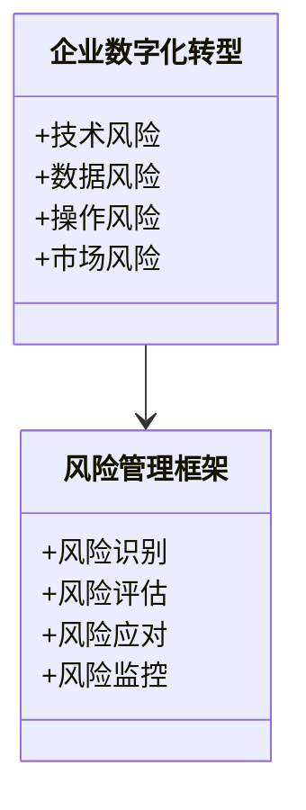
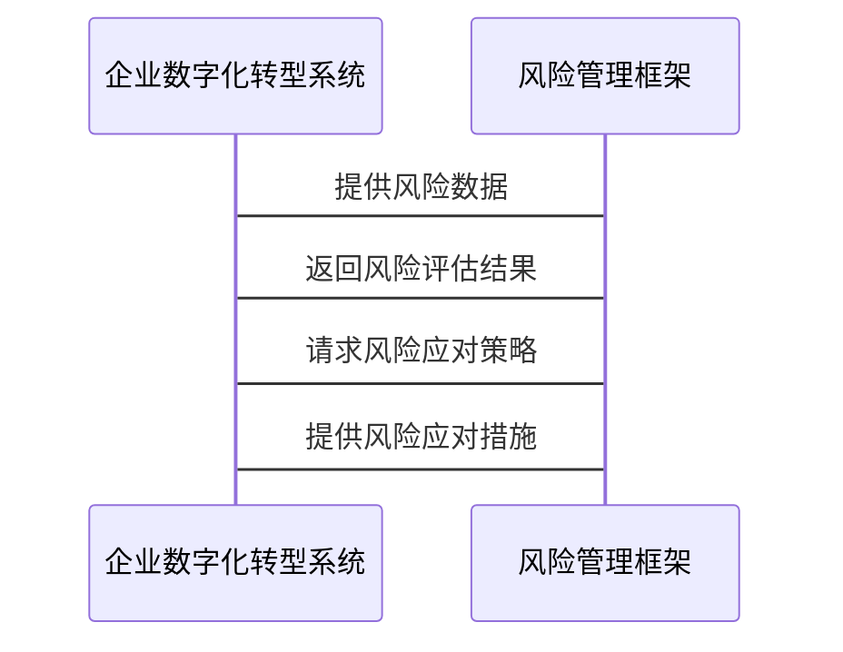

                 


# 股市估值高低对企业数字化转型风险管理的影响

> 关键词：股市估值、企业数字化转型、风险管理、数字化转型风险管理、风险管理框架

> 摘要：股市估值的高低对企业数字化转型的风险管理具有重要影响。高估值可能带来市场压力和投资风险，而低估值可能提供市场机会和转型动力。本文通过分析股市估值与企业数字化转型的关系，探讨如何构建有效的风险管理框架，以应对数字化转型中的各种风险挑战。文章从背景、理论、方法、案例等多个角度展开，为企业提供切实可行的风险管理策略。

---

## 第一部分: 股市估值与企业数字化转型风险管理的背景与概念

### 第1章: 股市估值与企业数字化转型概述

#### 1.1 股市估值的基本概念
- **1.1.1 什么是股市估值**
  - 股市估值是指通过对企业的财务状况、市场表现、行业地位等多方面因素进行分析，估算其股票的合理价格区间。
  - 常见的估值方法包括市盈率（P/E）、市净率（P/B）、EV/EBITDA等。

- **1.1.2 股市估值的常见方法**
  - 市盈率（P/E）：市价与每股收益的比率，衡量股票的估值水平。
  - 市净率（P/B）：市价与每股净资产的比率，适用于重资产行业的估值。
  - EV/EBITDA：企业价值与息税折旧及摊销前利润的比率，适用于整体估值。

- **1.1.3 股市估值对企业经营的影响**
  - 高估值可能导致市场过度关注短期业绩，增加企业转型压力。
  - 低估值可能为企业提供低成本融资机会，支持数字化转型投资。

#### 1.2 企业数字化转型的定义与特点
- **1.2.1 数字化转型的定义**
  - 数字化转型是指企业利用数字技术（如人工智能、大数据、云计算等）重构业务流程、商业模式和客户体验的过程。

- **1.2.2 数字化转型的核心特征**
  - 数据驱动：利用数据进行决策和优化。
  - 智能化：通过AI和自动化提升效率。
  - 个性化：提供定制化的产品和服务。

- **1.2.3 数字化转型与传统企业运营的区别**
  - 传统企业依赖人工操作，数字化转型企业依赖自动化和智能化。
  - 传统企业以产品为中心，数字化转型企业以客户体验为中心。

#### 1.3 股市估值与企业数字化转型的关系
- **1.3.1 股市估值对企业数字化转型的驱动作用**
  - 高估值驱动企业加速数字化转型，以应对市场期望。
  - 低估值为企业提供喘息空间，逐步推进转型。

- **1.3.2 数字化转型对股市估值的影响**
  - 成功的数字化转型提升企业竞争力，推动股价上涨。
  - 失败的转型可能导致股价下跌，影响市场信心。

- **1.3.3 两者的相互作用机制**
  - 股市估值反映市场对企业转型能力的信心。
  - 数字化转型能力影响企业的估值水平。

### 第2章: 企业数字化转型中的风险管理

#### 2.1 风险管理的基本概念
- **2.1.1 什么是风险管理**
  - 风险管理是指识别、评估和应对可能影响企业目标的不确定因素的过程。

- **2.1.2 风险管理的目标与原则**
  - 目标：降低风险对企业的影响，确保目标的实现。
  - 原则：全面性、科学性、经济性。

- **2.1.3 风险管理的流程与方法**
  - 流程：识别、评估、应对、监控。
  - 方法：定量分析、定性分析、情景分析。

#### 2.2 企业数字化转型中的主要风险
- **2.2.1 技术风险**
  - 技术选型不当、技术更新换代快、技术实施难度大。

- **2.2.2 数据风险**
  - 数据隐私泄露、数据质量管理、数据安全威胁。

- **2.2.3 操作风险**
  - 业务流程中断、员工适应性不足、操作失误。

- **2.2.4 市场风险**
  - 市场需求变化、竞争加剧、政策法规变化。

#### 2.3 数字化转型风险管理的策略与方法
- **2.3.1 风险识别与评估**
  - 使用SWOT分析法识别内部优势和劣势，外部机会和威胁。
  - 通过概率-影响矩阵对风险进行优先级排序。

- **2.3.2 风险应对策略**
  - 避免策略：避免高风险项目。
  - 缓解策略：采取措施降低风险影响。
  - 接受策略：接受可能的风险后果。
  - 转移策略：通过保险或外包将风险转移。

- **2.3.3 风险监控与反馈**
  - 建立风险监控机制，定期评估风险应对效果。
  - 根据监控结果调整风险管理策略。

### 第3章: 股市估值高低对企业数字化转型的影响

#### 3.1 高估值对企业数字化转型的影响
- **3.1.1 高估值带来的市场压力**
  - 市场对高估值企业有更高期望，可能迫使企业在短期内实现业绩增长。
  - 高估值可能掩盖企业潜在问题，导致转型风险加大。

- **3.1.2 高估值对企业投资行为的驱动**
  - 高估值可能促使企业加大研发投入，推动数字化转型。
  - 高估值可能导致企业过度投资，引发财务风险。

- **3.1.3 高估值与企业数字化转型的潜在风险**
  - 高估值企业可能面临更高的债务压力，影响转型资金投入。
  - 高估值可能导致管理层决策短视，忽视长期转型规划。

#### 3.2 低估值对企业数字化转型的影响
- **3.2.1 低估值带来的市场机会**
  - 低估值企业可能在市场中更具吸引力，吸引投资者关注。
  - 低估值企业可能有更多的融资空间，支持数字化转型。

- **3.2.2 低估值对企业转型动力的激发**
  - 低估值可能促使企业寻求创新突破，推动数字化转型。
  - 低估值可能降低员工和管理层的压力，为企业转型提供更好的内部环境。

- **3.2.3 低估值与企业数字化转型的潜在优势**
  - 低估值企业可能更容易吸引优秀人才，推动转型。
  - 低估值企业可能在转型初期面临更少的竞争压力。

#### 3.3 股市估值与企业数字化转型的动态关系
- **3.3.1 股市估值对企业数字化转型的长期影响**
  - 长期高估值可能推动企业持续创新，巩固市场地位。
  - 长期低估值可能限制企业转型投入，影响长期发展。

- **3.3.2 数字化转型对股市估值的反向作用**
  - 成功的数字化转型可能提升企业估值。
  - 失败的转型可能导致估值下降，影响市场信心。

- **3.3.3 两者关系的复杂性与多样性**
  - 不同行业、不同企业规模的股市估值与数字化转型的影响机制不同。
  - 经济周期、政策环境等因素也会影响股市估值与数字化转型的关系。

### 第4章: 数字化转型中的风险管理框架

#### 4.1 风险管理框架的构建
- **4.1.1 风险管理框架的组成**
  - 风险识别、风险评估、风险应对、风险监控。

- **4.1.2 风险管理框架的设计原则**
  - 全面性：覆盖所有可能的风险。
  - 适应性：根据企业实际情况调整框架。
  - 可持续性：确保框架能够长期有效。

- **4.1.3 风险管理框架的实施步骤**
  - 制定风险管理策略。
  - 建立风险管理组织。
  - 实施风险管理措施。
  - 监控和评估风险管理效果。

#### 4.2 数字化转型中的风险
- **4.2.1 技术风险**
  - 技术选型错误、技术实施困难、技术更新换代快。

- **4.2.2 数据风险**
  - 数据隐私泄露、数据质量管理、数据安全威胁。

- **4.2.3 操作风险**
  - 业务流程中断、员工适应性不足、操作失误。

- **4.2.4 市场风险**
  - 市场需求变化、竞争加剧、政策法规变化。

#### 4.3 风险管理框架的实施
- **4.3.1 风险识别与评估**
  - 使用SWOT分析法识别内部优势和劣势，外部机会和威胁。
  - 通过概率-影响矩阵对风险进行优先级排序。

- **4.3.2 风险应对策略**
  - 避免策略：避免高风险项目。
  - 缓解策略：采取措施降低风险影响。
  - 接受策略：接受可能的风险后果。
  - 转移策略：通过保险或外包将风险转移。

- **4.3.3 风险监控与反馈**
  - 建立风险监控机制，定期评估风险应对效果。
  - 根据监控结果调整风险管理策略。

---

## 第二部分: 数字化转型风险管理的系统架构与实现

### 第5章: 数字化转型风险管理的系统架构设计

#### 5.1 问题场景介绍
- 企业数字化转型过程中可能面临多种风险，如技术风险、数据风险、操作风险和市场风险。
- 需要构建一个系统化的风险管理框架，覆盖从风险识别到监控的全过程。

#### 5.2 系统功能设计（领域模型）


#### 5.3 系统架构设计（架构图）
```mermaid
architectural
    风险管理框架
    +-- 技术模块
    +-- 数据模块
    +-- 操作模块
    +-- 市场模块
    [与企业数字化转型系统集成]
```

#### 5.4 系统接口设计
- **输入接口：**
  - 风险识别数据：来自企业内部和外部的风险因素。
- **输出接口：**
  - 风险评估报告：包括风险的优先级和影响程度。
  - 风险应对策略：针对不同风险的具体措施。

#### 5.5 系统交互设计（序列图）


### 第6章: 项目实战与案例分析

#### 6.1 环境安装
- **技术环境：**
  - 操作系统：Linux/Windows
  - 开发工具：Eclipse/IntelliJ
  - 数据库：MySQL/PostgreSQL
  - 云平台：AWS/Azure

- **软件依赖：**
  - Java/Python开发语言
  - Spring Boot/Django框架
  - Maven/PyPI依赖管理

#### 6.2 系统核心实现源代码
```python
# 示例代码：风险管理框架的核心逻辑
def risk_assessment(risk_factors):
    # 风险评估函数
    risk_score = 0
    for factor in risk_factors:
        # 根据每个风险因素的权重计算总分
        risk_score += factor['weight'] * factor['impact']
    return risk_score

def risk_management(risk_score):
    # 根据风险评分制定应对策略
    if risk_score > 80:
        return "高风险，建议采取规避策略"
    elif 50 < risk_score < 80:
        return "中风险，建议采取缓解策略"
    else:
        return "低风险，建议采取接受策略"

# 使用示例
risk_factors = [
    {'name': '技术风险', 'weight': 0.3, 'impact': 0.7},
    {'name': '数据风险', 'weight': 0.4, 'impact': 0.6},
    {'name': '操作风险', 'weight': 0.2, 'impact': 0.5}
]
score = risk_assessment(risk_factors)
recommendation = risk_management(score)
print(f"风险评分为：{score}，建议：{recommendation}")
```

#### 6.3 代码应用解读与分析
- **风险评估函数：** 根据每个风险因素的权重和影响程度计算总分，帮助识别高风险领域。
- **风险管理函数：** 根据评分制定应对策略，指导企业采取规避、缓解或接受措施。

#### 6.4 实际案例分析
- **案例背景：**
  - 某企业计划进行数字化转型，面临技术、数据、操作和市场等多方面的风险。
- **案例分析：**
  - 使用上述代码对风险因素进行评估，发现技术风险和数据风险评分较高。
  - 制定相应的风险应对策略，如加大技术投入、加强数据安全措施。

#### 6.5 项目小结
- 成功构建了一个系统化的风险管理框架，能够有效识别和应对数字化转型中的各种风险。
- 通过实际案例验证了框架的有效性，为企业提供了可参考的实践方案。

### 第7章: 总结与展望

#### 7.1 总结
- 股市估值的高低对企业数字化转型的风险管理具有重要影响。
- 高估值可能带来市场压力，低估值可能提供转型机会。
- 构建有效的风险管理框架是应对数字化转型挑战的关键。

#### 7.2 展望
- 随着数字化转型的深入，风险管理的复杂性将不断增加。
- 未来需要更加智能化的风险管理工具和方法，如AI驱动的风险预测和优化。
- 建议企业结合自身实际情况，制定个性化的风险管理策略。

---

## 第三部分: 最佳实践与拓展阅读

### 7.1 最佳实践 tips
- **定期评估风险：** 定期进行风险评估，及时调整风险管理策略。
- **加强风险管理团队：** 建立专业的风险管理团队，提升风险识别和应对能力。
- **利用技术工具：** 利用大数据和AI技术，提高风险管理的效率和准确性。

### 7.2 小结
- 企业数字化转型是一项复杂的系统工程，风险管理是其中的重要环节。
- 高低估值的股市环境为企业提供了不同的转型机会和挑战。
- 构建科学的风险管理框架，能够有效降低转型风险，提升企业竞争力。

### 7.3 注意事项
- 风险管理需要结合企业的实际情况，避免一刀切。
- 在实施风险管理框架时，要注意与企业现有系统和流程的兼容性。
- 风险管理是一个动态过程，需要持续优化和调整。

### 7.4 拓展阅读
- **相关书籍：** 《风险管理与企业战略》、《数字化转型的挑战与机遇》。
- **在线资源：** 企业风险管理协会（IRM）、国际内部审计协会（IIA）的官方网站。
- **行业报告：** McKinsey、波士顿咨询（BCG）等咨询机构发布的数字化转型与风险管理报告。

---

通过以上目录大纲，我们可以清晰地看到，文章从背景、理论、方法、案例等多个角度，系统地探讨了股市估值高低对企业数字化转型风险管理的影响。文章不仅提供了理论支持，还通过实际案例和代码示例，帮助企业更好地理解和实施风险管理框架，确保数字化转型的顺利进行。

