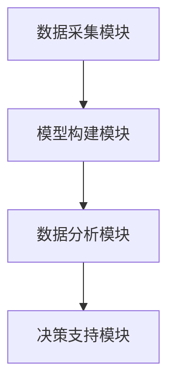

                 

# 股市估值高低对企业数字孪生技术应用的影响

> **关键词**：数字孪生、股市估值、企业运营、数据驱动决策、技术应用、投资价值、市场信心

> **摘要**：数字孪生技术作为一种新兴的企业数字化工具，正在改变企业的运营模式和决策方式。本文将探讨数字孪生技术如何影响企业的股市估值，从技术原理到实际应用，分析其对企业价值和市场信心的深远影响。通过详细的技术分析和案例研究，本文揭示了数字孪生技术在提升企业效率、优化决策、增强竞争力方面的独特优势，及其对股市估值的积极影响。

---

## 第一章：引言

### 1.1 背景介绍

数字孪生（Digital Twin）是一种在虚拟空间中建立与物理世界对应模型的技术，通过实时数据更新和智能分析，帮助企业实现更高效的运营和决策。随着企业数字化转型的推进，数字孪生技术逐渐成为企业提升竞争力的重要工具。与此同时，股市估值反映了市场对企业价值的判断，是企业经营状况的重要指标。数字孪生技术的应用不仅优化了企业的内部管理，还可能通过提升企业绩效间接影响其股市估值。

### 1.2 问题描述

数字孪生技术的应用如何影响企业的股市估值？具体来说，数字孪生技术如何通过优化企业运营、提升决策效率、增强市场竞争力等方面，进而影响企业的财务表现和市场信心？这些问题需要从技术原理、应用场景和实际案例等多个维度进行分析。

### 1.3 研究意义

本文旨在探讨数字孪生技术在企业中的应用对企业股市估值的影响，为企业投资者和管理层提供参考。通过分析数字孪生技术的核心原理及其对企业的实际影响，本文试图揭示数字孪生技术在提升企业价值方面的潜力。

---

## 第二章：数字孪生技术的核心原理与实现

### 2.1 数字孪生技术的定义与背景

数字孪生技术是一种通过构建虚拟模型与物理系统实时互动的技术，其核心在于数据的实时采集、分析和反馈。数字孪生技术的应用可以帮助企业实现对设备、流程和系统的实时监控与优化。

#### 2.1.1 数字孪生技术的基本概念

数字孪生技术是通过物理实体的数字映射，结合实时数据，构建一个动态更新的虚拟模型。这种模型不仅可以反映物理系统的当前状态，还可以通过模拟和预测，帮助企业在决策时考虑多种可能性。

#### 2.1.2 数字孪生技术的核心特征

- **实时性**：数字孪生模型能够实时反映物理系统的状态。
- **交互性**：用户可以通过虚拟模型与物理系统进行交互。
- **智能性**：数字孪生技术结合人工智能算法，能够实现自动化的分析和优化。

#### 2.1.3 数字孪生技术在企业中的应用场景

- **设备维护**：通过数字孪生技术实时监控设备状态，预测故障，减少停机时间。
- **流程优化**：通过虚拟模型模拟生产流程，优化资源配置，提高效率。
- **产品设计**：利用数字孪生技术进行产品原型设计和测试，降低开发成本。

### 2.2 数字孪生技术的实现步骤

#### 2.2.1 数据采集与处理

数字孪生技术的第一步是数据采集，通过传感器、数据库等渠道获取物理系统的实时数据。数据采集后需要进行清洗和预处理，确保数据的准确性和完整性。

#### 2.2.2 模型构建与优化

基于采集到的数据，构建物理系统的虚拟模型。模型构建需要考虑系统的各个组成部分及其之间的关系。构建完成后，通过算法优化模型，使其能够准确反映物理系统的状态。

#### 2.2.3 系统集成与部署

将数字孪生模型与企业的信息系统集成，确保数据的实时更新和系统的协同运行。部署过程中需要考虑系统的可扩展性和安全性。

---

## 第三章：股市估值的影响因素分析

### 3.1 股市估值的主要影响因素

股市估值主要受以下几个因素的影响：

- **财务指标**：如净利润、营业收入、资产负债率等。
- **市场情绪**：投资者的心理预期和市场波动。
- **行业环境**：行业发展趋势、政策法规等。

### 3.2 数字孪生技术对企业运营的影响

#### 3.2.1 运营效率的提升

数字孪生技术通过实时监控和优化，帮助企业提高运营效率，降低运营成本。

#### 3.2.2 决策能力的增强

数字孪生技术提供了实时数据和预测模型，帮助企业做出更科学的决策。

#### 3.2.3 企业竞争力的优化

通过数字孪生技术的应用，企业可以更快地响应市场需求，提升产品和服务的质量，从而增强竞争力。

### 3.3 数字孪生技术对股市估值的间接影响

#### 3.3.1 通过提升企业效率影响估值

数字孪生技术的应用可以帮助企业降低运营成本，提高生产效率，从而提升企业的盈利能力，进而提高股市估值。

#### 3.3.2 通过优化决策能力影响估值

数字孪生技术提供的实时数据和预测模型可以帮助企业在决策时更加精准，降低决策风险，从而提升市场对企业的信心，提高估值。

#### 3.3.3 通过创新商业模式影响估值

数字孪生技术可以推动企业创新商业模式，例如通过数字孪生技术实现产品的远程监控和维护，从而为企业创造新的收入来源，提升估值。

---

## 第四章：数字孪生技术在股市估值中的应用案例

### 4.1 案例一：某制造企业应用数字孪生技术优化生产流程

#### 4.1.1 项目背景

某制造企业生产过程中存在设备故障率高、生产效率低的问题，导致企业成本增加，利润下降，股市估值受到影响。

#### 4.1.2 数字孪生技术的应用

企业通过数字孪生技术构建生产设备的虚拟模型，实时监控设备运行状态，预测设备故障，优化生产流程。

#### 4.1.3 实施效果

通过数字孪生技术的应用，企业的设备故障率降低了30%，生产效率提高了20%，企业的净利润增长了15%，股市估值也随之提升。

### 4.2 案例二：某零售企业应用数字孪生技术优化供应链管理

#### 4.2.1 项目背景

某零售企业供应链管理混乱，库存积压严重，导致资金占用高，库存周转率低，影响企业财务状况，进而影响股市估值。

#### 4.2.2 数字孪生技术的应用

企业通过数字孪生技术构建供应链虚拟模型，实时监控库存状态，预测销售需求，优化供应链管理。

#### 4.2.3 实施效果

通过数字孪生技术的应用，企业的库存周转率提高了25%，资金占用降低了20%，企业的净利润增长了10%，股市估值有所提升。

---

## 第五章：系统架构与实现

### 5.1 系统架构设计

#### 5.1.1 系统功能模块

- **数据采集模块**：负责采集物理系统的实时数据。
- **模型构建模块**：负责构建物理系统的虚拟模型。
- **数据分析模块**：负责对数据进行分析和预测。
- **决策支持模块**：负责提供决策支持。

#### 5.1.2 系统架构图

### 5.2 数据流分析

#### 5.2.1 数据采集流程

1. 传感器采集数据。
2. 数据传输到数据处理模块。
3. 数据清洗和预处理。
4. 数据存储到数据库。

#### 5.2.2 数据分析流程

1. 数据从数据库中提取。
2. 数据进行特征提取。
3. 数据进行预测分析。
4. 分析结果反馈到决策支持模块。

---

## 第六章：结论与展望

### 6.1 研究结论

数字孪生技术的应用可以显著提升企业的运营效率和决策能力，进而影响企业的股市估值。通过优化企业效率、增强市场竞争力和创新商业模式，数字孪生技术能够为企业带来更高的利润和更好的市场表现，从而提升股市估值。

### 6.2 未来展望

随着数字孪生技术的不断发展和成熟，其在企业中的应用将更加广泛和深入。未来，数字孪生技术可能会与人工智能、大数据等技术结合，为企业提供更加智能化的解决方案，进一步提升企业的股市估值。

---

**本文通过详细分析数字孪生技术的核心原理、应用场景及其对股市估值的影响，为企业投资者和管理层提供了重要的参考。数字孪生技术的应用不仅能够优化企业的内部管理，还能够通过提升企业绩效间接影响其股市估值，为企业创造更大的价值。**

--- 

**注**：由于篇幅限制，上述内容仅为文章的部分章节，完整文章可根据上述大纲进一步扩展和细化。

