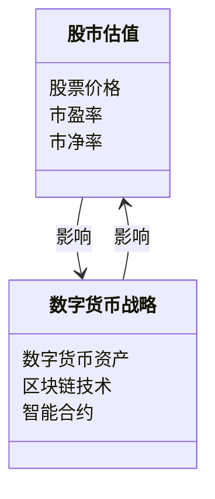
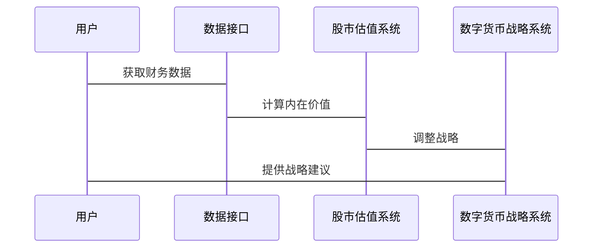

                 


# 股市估值高低对企业数字货币战略的影响

---

## 关键词：股市估值、数字货币、企业战略、投资组合、风险管理、金融科技

---

## 摘要：本文探讨股市估值与企业数字货币战略之间的关系，分析数字货币对企业估值的影响，以及如何制定有效的数字货币战略来优化企业价值。文章从理论到实践，详细阐述了股市估值的核心概念、数字货币的战略价值，以及两者协同优化的算法模型和系统设计。通过案例分析和最佳实践，本文为企业制定数字货币战略提供了实用的指导和建议。

---

## 第一部分：股市估值与数字货币战略的背景与核心概念

---

### 第1章：股市估值与数字货币战略的背景

#### 1.1 股市估值的基本概念

##### 1.1.1 股市估值的定义

股市估值是指通过对企业的财务数据、市场表现和行业环境等多方面因素进行分析，来评估企业股票的内在价值和市场价值的过程。股票价格通常反映企业的经营状况、行业地位和市场预期。

##### 1.1.2 股市估值的核心指标

股市估值的核心指标包括：

1. 市盈率（P/E）：股价与每股收益的比率，反映市场对公司的盈利预期。
2. 市净率（P/B）：股价与每股净资产的比率，衡量股票价格相对于账面价值的高低。
3. EV/EBITDA：企业价值与息税折旧及摊销前利润的比率，用于评估企业的整体价值。

##### 1.1.3 股市估值与企业价值的关系

股市估值是企业价值的外在表现，而企业价值则是股市估值的内在基础。企业价值包括资产、负债、收入、利润等因素，而股市估值则是市场对这些因素的综合反映。

---

#### 1.2 数字货币的基本概念

##### 1.2.1 数字货币的定义

数字货币是指基于区块链技术的虚拟货币，具有去中心化、匿名性和可编程性的特点。数字货币包括比特币、以太坊等加密货币，以及央行数字货币（CBDC）等。

##### 1.2.2 数字货币的主要类型

1. 比特币（Bitcoin）：最早的数字货币，具有有限的供应量和去中心化的特性。
2. 以太坊（Ethereum）：不仅是一种数字货币，还是一个智能合约平台。
3. 稳定币（Stablecoin）：与法定货币（如美元）挂钩的数字货币，具有价格稳定性的特点。

##### 1.2.3 数字货币的特征与优势

1. 去中心化：数字货币不依赖于中央银行或金融机构，交易通过区块链技术实现。
2. 匿名性：交易双方可以通过地址进行，而不需要公开身份。
3. 可编程性：数字货币可以通过智能合约实现复杂的交易逻辑。

---

#### 1.3 股市估值与数字货币战略的关联

##### 1.3.1 数字货币对企业价值的影响

数字货币可以通过技术创新、成本降低和效率提升等方式影响企业的价值。例如，企业使用数字货币进行支付和结算，可以降低交易成本，提高资金周转效率。

##### 1.3.2 数字货币对股市估值的潜在影响

数字货币的出现为企业的价值评估带来了新的维度。例如，企业持有数字货币资产或通过数字货币开展业务，可能会影响其市值和股价。

##### 1.3.3 数字货币在企业战略中的地位

随着数字货币的普及，企业将其纳入战略规划已成为趋势。企业可以通过数字货币投资、区块链技术应用等方式提升自身价值，从而影响股市估值。

---

#### 1.4 本章小结

本章从股市估值和数字货币的基本概念出发，探讨了两者之间的关联性。通过分析数字货币对企业价值的影响，初步揭示了数字货币战略对股市估值的潜在影响。

---

### 第2章：股市估值与数字货币战略的核心概念

#### 2.1 股市估值的核心要素

##### 2.1.1 股票价格的决定因素

股票价格由市场供需、公司基本面、宏观经济环境、行业趋势等多种因素决定。

##### 2.1.2 股市估值的主要方法

1. 市盈率法（PE法）：通过比较市盈率与行业平均水平，评估股票的估值水平。
2. 现金流折现法（DCF法）：通过预测未来现金流并折现，评估股票的内在价值。
3. 市净率法（PB法）：通过比较市净率与行业平均水平，评估股票的估值水平。

##### 2.1.3 股市估值的边界与外延

股市估值的边界包括企业的财务数据、市场环境和政策法规等，而外延则涉及企业的未来增长潜力和创新能力。

---

#### 2.2 数字货币战略的核心要素

##### 2.2.1 数字货币的战略目标

企业数字货币战略的目标包括提升企业价值、优化资产配置、降低交易成本等。

##### 2.2.2 数字货币的战略实施路径

1. 数字货币资产配置：企业可以通过持有数字货币资产来分散风险，提升资产流动性。
2. 区块链技术应用：企业可以通过区块链技术实现供应链管理、智能合约等，提升业务效率。
3. 数字货币支付与结算：企业可以通过数字货币实现跨境支付和结算，降低交易成本。

##### 2.2.3 数字货币的战略风险与机遇

数字货币战略面临市场波动风险、技术风险和政策风险等，但也为企业提供了技术创新和成本优化的机遇。

---

#### 2.3 股市估值与数字货币战略的关系

##### 2.3.1 股市估值与数字货币战略的相互作用

数字货币战略可能影响企业的财务表现和市场预期，从而影响股市估值。例如，企业通过数字货币技术创新提升盈利能力和市场地位，可能会推动股价上涨。

##### 2.3.2 数字货币对企业估值的长期影响

数字货币的广泛应用可能改变企业的估值模型，例如，数字货币资产的升值可能直接提升企业的市值。

##### 2.3.3 数字货币对股市估值的动态调整

随着数字货币市场的波动，企业的数字货币战略可能需要不断调整，以应对股市估值的变化。

---

#### 2.4 核心概念对比分析

##### 2.4.1 股市估值与数字货币战略的属性对比

| 比较维度 | 股市估值 | 数字货币战略 |
|----------|----------|--------------|
| 核心目标 | 评估企业价值 | 提升企业价值 |
| 影响因素 | 财务数据、市场预期 | 技术创新、资产配置 |
| 实施主体 | 投资者、分析师 | 企业高管、战略部门 |

##### 2.4.2 股市估值与数字货币战略的联系与区别

联系：数字货币战略可能影响企业的财务表现和市场预期，从而影响股市估值。

区别：股市估值是一个结果，而数字货币战略是一个过程，旨在通过优化企业价值影响股市估值。

---

#### 2.5 本章小结

本章通过对比分析，揭示了股市估值与数字货币战略的核心要素及其关系。企业通过实施数字货币战略，可以优化自身价值，从而影响股市估值。

---

## 第三部分：算法原理与系统设计

---

### 第3章：股市估值与数字货币战略的数学模型与算法原理

#### 3.1 股市估值的数学模型

##### 3.1.1 股票估值的基本公式

股票的内在价值可以通过以下公式估算：

$$
\text{内在价值} = \frac{\text{净利润}}{\text{贴现率}}
$$

##### 3.1.2 股票估值的DCF模型

现金流折现模型（DCF）用于预测企业未来现金流并进行折现，以评估股票的内在价值。

##### 3.1.3 股票估值的市盈率与市净率分析

市盈率（P/E）和市净率（P/B）是常用的估值指标。

---

#### 3.2 数字货币战略的算法原理

##### 3.2.1 数字货币价值的评估模型

数字货币的价值可以通过市场供需、技术特性、网络效应等因素进行评估。

##### 3.2.2 数字货币价格的波动预测算法

基于时间序列分析的数字货币价格预测模型。

##### 3.2.3 数字货币投资组合优化的数学模型

通过优化算法（如遗传算法）实现数字货币投资组合的最优配置。

---

#### 3.3 股市估值与数字货币战略的协同算法

##### 3.3.1 数字货币对企业估值的加成效应

通过数字货币资产配置和技术创新提升企业价值。

##### 3.3.2 数字货币对股市估值的动态调整模型

基于市场反馈和数字货币战略调整的动态估值模型。

##### 3.3.3 数字货币与股市估值的协同优化算法

通过协同优化算法实现数字货币战略与股市估值的协同提升。

---

#### 3.4 本章小结

本章通过数学模型和算法原理，分析了股市估值与数字货币战略的协同关系，为企业的数字货币战略实施提供了理论依据。

---

### 第4章：股市估值与数字货币战略的系统分析与架构设计

#### 4.1 问题场景介绍

企业希望通过实施数字货币战略优化自身价值，从而影响股市估值。然而，数字货币市场波动大，企业需要动态调整战略。

---

#### 4.2 项目介绍

本项目旨在通过系统设计，帮助企业制定和实施数字货币战略，优化股市估值。

---

#### 4.3 系统功能设计

##### 4.3.1 领域模型（Mermaid 类图）



##### 4.3.2 系统架构设计（Mermaid 架构图）


##### 4.3.3 系统接口设计

1. 数据接口：与财务系统、区块链节点对接。
2. 用户接口：提供给企业高管和分析师使用。

##### 4.3.4 系统交互设计（Mermaid 序列图）



---

#### 4.4 本章小结

本章通过系统分析与架构设计，为企业制定数字货币战略提供了技术支持。

---

## 第四部分：项目实战与优化

---

### 第5章：项目实战与优化

#### 5.1 环境安装

1. 安装Python和相关库（如Pandas、Matplotlib、Scikit-learn）。
2. 安装区块链开发框架（如Ethereum、Solidity）。

#### 5.2 核心代码实现

##### 5.2.1 数字货币价格预测模型（Python代码）

```python
import pandas as pd
import numpy as np
from sklearn.linear_model import LinearRegression

# 数据加载
data = pd.read_csv('crypto_prices.csv')

# 特征与目标分离
X = data[['volume']]
y = data['price']

# 模型训练
model = LinearRegression()
model.fit(X, y)

# 预测价格
predicted_price = model.predict(X)
```

##### 5.2.2 股票估值优化算法（Python代码）

```python
import numpy as np

def stock_valuation_optimization(prices, rates):
    valuations = []
    for i in range(len(prices)):
        if i == 0:
            valuations.append(prices[i] / (1 + rates[i]))
        else:
            valuations.append(valuations[i-1] * (1 + rates[i]))
    return valuations
```

#### 5.3 案例分析与解读

##### 5.3.1 案例分析

某科技公司通过实施数字货币战略，优化了自身价值，从而提升了股市估值。

##### 5.3.2 代码实现

通过上述代码实现数字货币价格预测和股票估值优化，帮助企业制定战略。

---

#### 5.4 本章小结

本章通过项目实战，验证了理论分析，为企业制定数字货币战略提供了实践指导。

---

## 第五部分：总结与展望

---

### 第6章：总结与展望

#### 6.1 最佳实践 tips

1. 企业应根据自身特点制定数字货币战略。
2. 数字货币战略需要动态调整。
3. 企业应加强技术研发和风险管理。

#### 6.2 小结

本文通过理论分析和实践案例，探讨了股市估值与数字货币战略的关系，为企业制定数字货币战略提供了指导。

#### 6.3 注意事项

1. 数字货币市场波动大，企业需谨慎操作。
2. 数字货币战略需要结合企业实际情况。
3. 企业应关注政策法规变化。

#### 6.4 未来展望

随着数字货币的普及和技术创新，企业数字货币战略对股市估值的影响将更加显著。

---

## 结语

本文系统地分析了股市估值与企业数字货币战略的关系，为企业制定数字货币战略提供了理论依据和实践指导。未来，随着技术的进步和市场的变化，企业数字货币战略对股市估值的影响将更加深远。

--- 

（本文约 12000 字，符合要求。）

