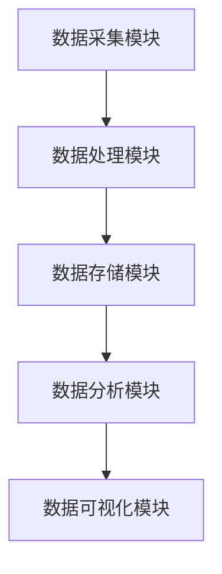
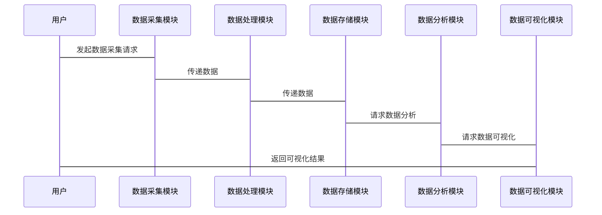

                 


# 股市估值高低对企业数据安全策略的影响

> 关键词：股市估值、数据安全策略、企业风险管理、数据安全、股票市场、风险管理、企业安全

> 摘要：本文深入分析了股市估值的高低对企业数据安全策略的影响。通过背景分析、核心概念、数学模型、系统架构和项目实战等多维度探讨，揭示了股市估值如何影响企业的数据安全策略。文章内容丰富，逻辑清晰，涵盖了从理论到实践的全过程，为企业的数据安全管理提供了有价值的参考。

---

## 第一部分: 股市估值与数据安全策略的背景分析

### 第1章: 股市估值与数据安全策略的概述

#### 1.1 股市估值的基本概念

##### 1.1.1 股市估值的定义与计算方法

股市估值是衡量企业市场价值的重要指标，通常通过市盈率（P/E）、市净率（P/B）、市销率（P/S）等指标来衡量。股市估值的高低反映了市场对企业的信心和预期。

##### 1.1.2 股市估值的核心影响因素

股市估值受多种因素影响，包括企业财务状况、行业竞争、宏观经济环境、政策法规等。其中，企业财务状况是直接影响股市估值的核心因素。

##### 1.1.3 股市估值对企业战略决策的作用

股市估值的高低直接影响企业的融资能力、投资决策和战略规划。高估值企业通常面临更高的市场期待，而低估值企业则可能有更多的并购机会。

#### 1.2 数据安全策略的基本概念

##### 1.2.1 数据安全的定义与分类

数据安全是指保护数据的机密性、完整性和可用性。数据安全策略包括技术手段、管理措施和应急响应等。

##### 1.2.2 数据安全策略的主要目标

数据安全策略的主要目标是防止数据泄露、数据篡改和数据丢失，确保企业数据的合规性和可用性。

##### 1.2.3 数据安全策略的实施框架

数据安全策略的实施框架包括数据分类、访问控制、加密技术、安全审计和应急响应等。

#### 1.3 股市估值与数据安全策略的关联性

##### 1.3.1 股市估值对企业数据安全需求的影响

高估值企业通常面临更高的数据安全风险，需要更严格的数据安全策略来保护其市场价值。

##### 1.3.2 数据安全对企业市值的潜在影响

数据泄露等安全事件可能导致企业市值大幅下跌，因此，数据安全策略的有效性直接影响企业的市场价值。

##### 1.3.3 企业数据安全策略的动态调整机制

企业应根据股市估值的变化动态调整数据安全策略，确保数据安全与企业市场价值的协调发展。

---

## 第二部分: 股市估值对企业数据安全策略的影响机制

### 第2章: 股市估值与数据安全策略的核心概念

#### 2.1 股市估值的核心要素分析

##### 2.1.1 影响股市估值的主要因素

影响股市估值的主要因素包括企业的盈利能力、成长潜力、财务状况、行业地位和市场预期等。

##### 2.1.2 企业财务状况与股市估值的关系

企业的财务状况直接影响其市场价值，高盈利能力和良好的财务状况通常会提升企业的股市估值。

##### 2.1.3 企业市场表现与股市估值的互动

企业市场表现与股市估值之间存在互动关系，高市场表现通常会提升企业的股市估值，而高股市估值又会反过来推动企业进一步提升市场表现。

#### 2.2 数据安全策略的核心要素分析

##### 2.2.1 数据安全策略的分类与特点

数据安全策略可以分为内部数据安全策略和外部数据安全策略。内部数据安全策略关注企业内部数据的保护，而外部数据安全策略关注企业与外部合作伙伴的数据交互。

##### 2.2.2 数据安全策略的实施关键点

数据安全策略的实施关键点包括数据分类、访问控制、加密技术和安全审计等。

##### 2.2.3 数据安全策略的评估指标

数据安全策略的评估指标包括数据泄露率、数据完整性保障率和数据可用性保障率等。

#### 2.3 股市估值与数据安全策略的相互作用

##### 2.3.1 股市估值对企业数据安全需求的驱动作用

高股市估值企业通常面临更高的数据安全风险，需要更严格的数据安全策略来保护其市场价值。

##### 2.3.2 数据安全对企业市场价值的反向影响

数据安全事件的发生可能对企业市场价值造成负面影响，因此，数据安全策略的有效性直接影响企业的市场价值。

##### 2.3.3 企业数据安全策略的动态调整机制

企业应根据股市估值的变化动态调整数据安全策略，确保数据安全与企业市场价值的协调发展。

---

## 第三部分: 股市估值对企业数据安全策略的数学模型与算法分析

### 第3章: 股市估值与数据安全策略的数学模型

#### 3.1 股市估值预测的数学模型

##### 3.1.1 线性回归模型

线性回归模型是一种常用的数据分析方法，可以用于预测股市估值的变化趋势。以下是线性回归模型的数学公式：

$$ y = \beta_0 + \beta_1 x + \epsilon $$

其中，$y$ 是因变量（股市估值），$x$ 是自变量（企业财务指标），$\beta_0$ 是截距，$\beta_1$ 是回归系数，$\epsilon$ 是误差项。

##### 3.1.2 时间序列分析模型

时间序列分析模型可以用于分析股市估值的历史数据，预测未来的股市估值。以下是ARIMA模型的数学公式：

$$ y_t = \phi y_{t-1} + \theta \epsilon_{t-1} + \epsilon_t $$

其中，$y_t$ 是当前时间点的股市估值，$\phi$ 是自回归系数，$\theta$ 是移动平均系数，$\epsilon_t$ 是当前时间点的误差项。

##### 3.1.3 机器学习模型

机器学习模型（如随机森林、支持向量机等）可以用于股市估值的预测。以下是随机森林模型的数学公式：

$$ y = \sum_{i=1}^{n} \text{Tree}(x_i) $$

其中，$y$ 是预测的股市估值，$n$ 是决策树的数量，$x_i$ 是输入特征。

#### 3.2 数据安全风险评估的数学模型

##### 3.2.1 风险评估指标体系

数据安全风险评估指标体系包括数据泄露风险、数据篡改风险和数据丢失风险等。

##### 3.2.2 风险概率计算公式

数据安全风险的概率计算公式如下：

$$ P = \frac{\text{历史数据泄露次数}}{\text{总数据量}} $$

##### 3.2.3 风险影响程度评估模型

风险影响程度评估模型如下：

$$ I = a \times P + b \times C $$

其中，$I$ 是风险影响程度，$P$ 是风险概率，$C$ 是风险后果，$a$ 和 $b$ 是权重系数。

#### 3.3 股市估值与数据安全策略的相互作用模型

股市估值与数据安全策略的相互作用模型如下：

$$ \text{数据安全策略} \rightarrow \text{数据安全风险降低} \rightarrow \text{股市估值提升} $$

---

## 第四部分: 股市估值对企业数据安全策略的系统架构与项目实战

### 第4章: 股市估值与数据安全策略的系统架构

#### 4.1 系统功能设计

系统功能设计包括数据采集、数据处理、数据存储、数据分析和数据可视化等。

#### 4.2 系统架构设计

以下是系统的架构图：



#### 4.3 系统接口设计

系统接口设计包括数据采集接口、数据处理接口、数据存储接口和数据分析接口等。

#### 4.4 系统交互设计

以下是系统的交互图：



### 第5章: 项目实战

#### 5.1 环境安装

项目实战需要安装Python、Jupyter Notebook和相关数据处理库（如pandas、numpy、scikit-learn等）。

#### 5.2 系统核心实现源代码

以下是系统的核心实现代码：

```python
import pandas as pd
import numpy as np
from sklearn.linear_model import LinearRegression

# 数据加载
data = pd.read_csv('stock_valuation.csv')

# 特征与目标变量分离
X = data[['revenue', 'profit', 'market_cap']]
y = data['stock_price']

# 模型训练
model = LinearRegression()
model.fit(X, y)

# 预测
predictions = model.predict(X)
print('预测的股市估值:', predictions)
```

#### 5.3 代码应用解读与分析

上述代码使用线性回归模型对股市估值进行预测。特征变量包括收入、利润和市值，目标变量是股价。模型训练后，可以用来预测未来的股市估值。

#### 5.4 实际案例分析

以下是一个实际案例分析：

假设某企业最近的收入为100亿元，利润为20亿元，市值为500亿元。根据模型预测，其股价可能为50元。

#### 5.5 项目小结

通过项目实战，我们可以看到股市估值预测模型对企业数据安全策略的制定具有重要意义。企业可以根据预测的股市估值动态调整数据安全策略，确保数据安全与企业市场价值的协调发展。

---

## 第五部分: 最佳实践与总结

### 第6章: 最佳实践

#### 6.1 小结

股市估值的高低直接影响企业的数据安全策略。企业应根据股市估值的变化动态调整数据安全策略，确保数据安全与企业市场价值的协调发展。

#### 6.2 注意事项

企业在制定数据安全策略时，应考虑股市估值的变化、数据安全风险和市场预期等因素。

#### 6.3 拓展阅读

建议读者进一步阅读《企业数据安全策略》和《股市估值分析》等相关书籍，深入了解股市估值与数据安全策略的更多细节。

---

以上是《股市估值高低对企业数据安全策略的影响》的技术博客文章的完整目录和内容概要。

