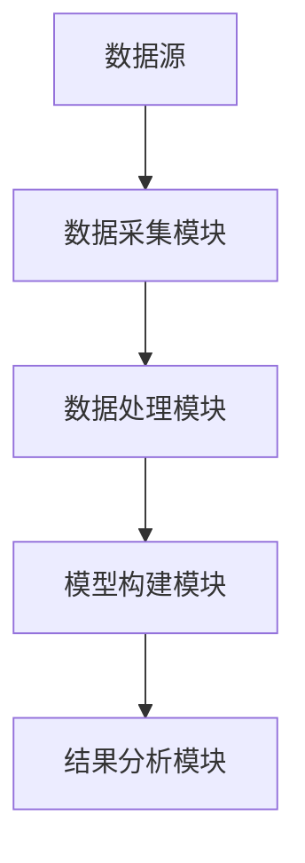

                 


# 股市估值高低对企业数据隐私保护投资的影响

> 关键词：股市估值，企业投资，数据隐私保护，回归分析，机器学习，系统架构，案例分析

> 摘要：本文探讨了股市估值的高低对企业在数据隐私保护方面投资决策的影响。通过分析股市估值与数据隐私保护投资之间的关系，结合理论模型、算法原理、系统架构设计和实际案例分析，揭示了两者之间的动态影响机制，为企业制定数据隐私保护策略和投资决策提供参考。

---

# 第一部分: 引言

## 第1章: 引言

### 1.1 问题背景

#### 1.1.1 股市估值的定义与影响
股市估值是衡量企业市场价值的重要指标，通常通过市盈率、市净率等指标反映。高估值意味着市场对企业未来表现的乐观预期，而低估值则可能意味着市场对企业前景的不确定性。

#### 1.1.2 数据隐私保护的重要性
随着数字化转型的推进，数据隐私保护已成为企业合规和风险管理的核心内容。数据泄露事件频发，对企业声誉和财务健康造成重大威胁。

#### 1.1.3 问题提出的背景与意义
近年来，数据隐私保护法规（如GDPR）的出台对企业合规提出了更高要求。同时，股市波动与企业数据隐私保护投资之间的关系逐渐成为研究热点。本文旨在探讨股市估值高低如何影响企业在数据隐私保护方面的投资决策。

---

## 第2章: 核心概念与联系

### 2.1 核心概念原理

#### 2.1.1 股市估值的核心要素
- 市盈率（P/E）
- 市净率（P/B）
- 市销率（P/S）

#### 2.1.2 数据隐私保护的关键属性
- 数据分类与分级
- 访问控制策略
- 数据加密技术
- 数据泄露检测与响应

#### 2.1.3 两者的相互作用机制
高估值企业更倾向于在数据隐私保护方面进行投资，以维护市场信任和合规性。而低估值企业可能在数据隐私保护上投入较少，面临更高的风险。

### 2.2 概念对比与ER实体关系图

#### 2.2.1 概念属性特征对比表

| 属性 | 股市估值 | 数据隐私保护投资 |
|------|---------|------------------|
| 定义 | 企业市值与业绩的比值 | 企业在数据安全方面的支出与资源分配 |
| 影响因素 | 市场情绪、业绩表现、行业前景 | 法规要求、数据泄露风险、客户信任 |
| 目标 | 反映企业价值 | 防御数据风险、提升合规性 |

#### 2.2.2 数据隐私保护与企业投资的ER关系图
```mermaid
er
    entity 企业 {
        id 企业ID
        string 企业名称
        decimal 股市估值
    }
    entity 数据隐私保护 {
        id 数据保护措施ID
        string 数据保护措施
        decimal 投资金额
    }
    股市估值 --> 数据隐私保护: 影响
```

---

## 第3章: 算法原理与数学模型

### 3.1 算法原理

#### 3.1.1 数据隐私保护投资的影响因素分析
通过统计分析和机器学习模型，识别影响数据隐私保护投资的关键因素，包括股市估值、企业规模、行业特性等。

#### 3.1.2 股市估值与企业投资的回归分析
构建线性回归模型，量化股市估值与数据隐私保护投资之间的关系。

#### 3.1.3 机器学习模型的构建与验证
使用随机森林或神经网络模型，预测股市估值对数据隐私保护投资的影响。

### 3.2 数学模型与公式

#### 3.2.1 股市估值与数据隐私保护投资的关系模型
$$ V = \beta_1 P + \beta_2 D + \epsilon $$
其中，$V$为股市估值，$P$为数据隐私保护投资，$D$为其他影响因素，$\epsilon$为误差项。

#### 3.2.2 回归分析的详细推导
$$ \hat{Y} = \sum_{i=1}^{n} \beta_i X_i $$
其中，$\hat{Y}$为预测的股市估值，$\beta_i$为回归系数，$X_i$为自变量。

---

## 第4章: 系统分析与架构设计

### 4.1 问题场景分析

#### 4.1.1 数据隐私保护与企业投资的场景描述
企业需要在高估值和低估值状态下调整数据隐私保护投资策略，以平衡成本与风险。

#### 4.1.2 股市估值与企业投资的动态关系
股市估值的变化直接影响企业的数据隐私保护预算和策略。

### 4.2 系统架构设计

#### 4.2.1 系统功能模块划分
- 数据采集模块
- 数据处理模块
- 模型构建模块
- 结果分析模块

#### 4.2.2 数据流图与架构图


---

## 第5章: 项目实战

### 5.1 环境安装

#### 5.1.1 工具与依赖
- Python 3.8+
- Pandas、NumPy、Scikit-learn
- Jupyter Notebook

### 5.2 核心实现

#### 5.2.1 数据预处理
```python
import pandas as pd
data = pd.read_csv('stock_data.csv')
data['数据隐私保护投资'] = data['数据隐私保护投资'].fillna(0)
```

#### 5.2.2 回归模型构建
```python
from sklearn.linear_model import LinearRegression
model = LinearRegression()
model.fit(X_train, y_train)
```

#### 5.2.3 模型验证
```python
from sklearn.metrics import r2_score
print(r2_score(y_test, model.predict(X_test)))
```

### 5.3 案例分析

#### 5.3.1 案例选择
选择一个典型企业（如科技公司）进行分析，结合其股市估值和数据隐私保护投资数据。

#### 5.3.2 数据分析与结果解读
通过回归分析，得出股市估值对数据隐私保护投资的具体影响。

---

## 第6章: 结论与建议

### 6.1 研究结论
高估值企业更倾向于在数据隐私保护方面进行投资，以维护市场信任和合规性。低估值企业需要权衡成本与风险，制定灵活的保护策略。

### 6.2 实践建议
- 企业应根据股市估值动态调整数据隐私保护预算。
- 监管机构需制定相关法规，引导企业加强数据保护。
- 投资者应关注企业数据隐私保护能力，作为投资决策的重要依据。

### 6.3 注意事项
数据隐私保护是一个持续的过程，需要企业长期投入和关注。

### 6.4 拓展阅读
- 推荐书籍：《数据隐私保护：企业合规与风险管理》
- 推荐论文：《股市波动与企业数据安全投资的关系研究》

---

通过本文的分析与实践，我们揭示了股市估值与企业数据隐私保护投资之间的动态关系，为企业制定投资策略和数据保护措施提供了理论依据和实践指导。

