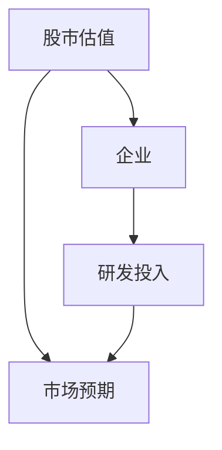
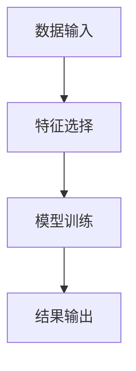
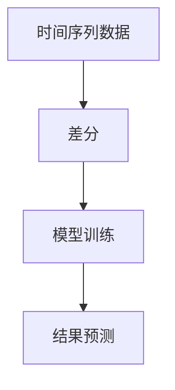
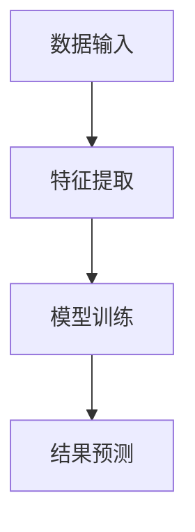
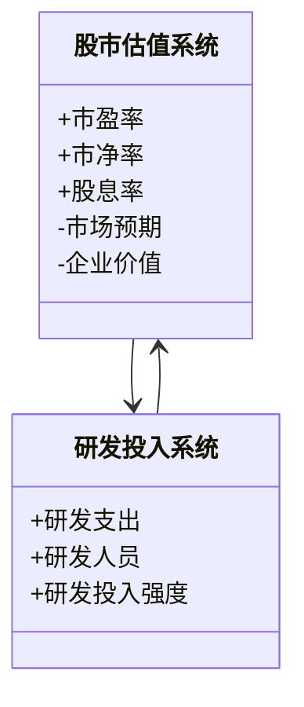
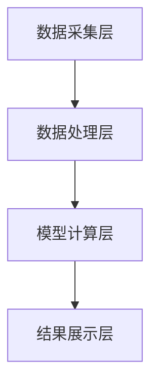
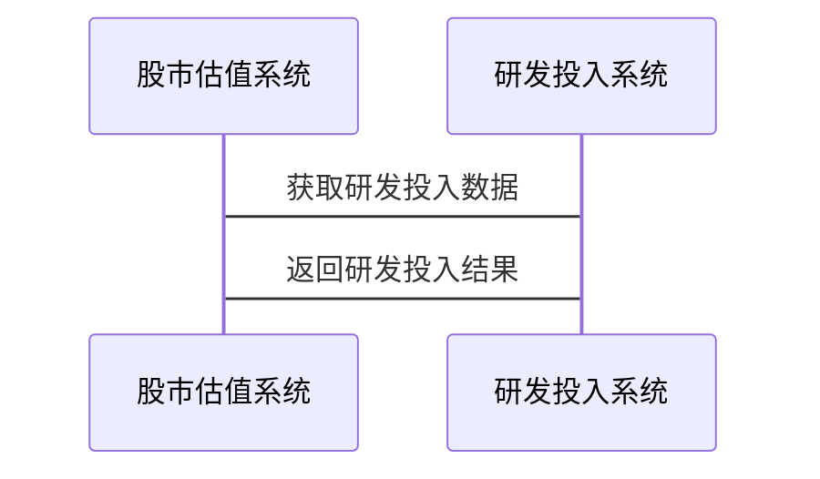

                 


# 股市估值高低对企业研发投入的影响

**关键词**：股市估值，企业研发投入，资金配置，资本运作，市场预期，企业创新

**摘要**：股市估值是衡量企业价值的重要指标，而企业研发投入则是企业创新的核心驱动力。本文系统探讨股市估值与企业研发投入之间的关系，分析股市估值如何影响企业的研发投入，以及企业在不同估值阶段如何优化研发投入策略。通过理论分析、算法实现、系统设计和案例分析，本文旨在为企业制定科学的研发投入策略提供参考。

---

## 第一章: 股市估值与企业研发投入的背景介绍

### 1.1 股市估值的基本概念

#### 1.1.1 什么是股市估值
股市估值是指通过对企业的财务数据、行业地位、市场前景等因素进行分析，评估其股票的内在价值。常见的估值方法包括市盈率（P/E）、市净率（P/B）、股息率等。

#### 1.1.2 股市估值的核心指标
- **市盈率（P/E）**：股价与每股收益的比值，反映市场对企业盈利能力的预期。
- **市净率（P/B）**：股价与每股净资产的比值，适用于评估资产密集型企业的价值。
- **股息率**：每股股息与股价的比值，反映股票的分红能力。

#### 1.1.3 股市估值与企业价值的关系
股市估值是市场对企业未来盈利能力的预期，高估值意味着市场对企业未来表现有信心，而低估值则可能意味着市场对企业的前景持怀疑态度。

### 1.2 企业研发投入的基本概念

#### 1.2.1 什么是企业研发投入
企业研发投入是指企业在研发活动中投入的资金、资源和人力资源，包括基础研究、应用研究和试验发展等。

#### 1.2.2 研发投入的分类与特点
- **基础研究**：投入周期长，不确定性高，但可能带来颠覆性创新。
- **应用研究**：注重实际应用，周期较短，见效快。
- **试验发展**：针对具体产品的开发和优化，周期可控。

#### 1.2.3 研发投入与企业创新的关系
研发投入是企业创新的核心驱动力，高研发投入通常意味着企业具备较强的技术储备和创新能力。

### 1.3 股市估值与企业研发投入的关联性

#### 1.3.1 股市估值对企业研发投入的影响
高估值企业可能因市场对其未来盈利能力的高预期而增加研发投入，以满足市场的高期望；低估值企业可能因资金紧张而减少研发投入。

#### 1.3.2 研发投入对股市估值的反向影响
高研发投入可能提升企业的技术壁垒和市场竞争力，从而提高其估值；反之，低研发投入可能导致企业竞争力下降，估值降低。

#### 1.3.3 两者关系的边界与外延
股市估值和研发投入的关系并非线性，受行业特点、企业生命周期、宏观经济环境等多种因素影响。

---

## 第二章: 股市估值与企业研发投入的核心概念与联系

### 2.1 核心概念原理

#### 2.1.1 股市估值的核心原理
股市估值通过对企业财务数据和市场预期的分析，评估其股票的内在价值。市场预期是影响估值的核心因素。

#### 2.1.2 研发投入的核心原理
研发投入是企业技术创新的基石，通过投入资源开发新技术和新产品，提升企业的市场竞争力。

#### 2.1.3 两者关系的理论基础
市场预期通过影响股市估值，进而影响企业的研发投入决策；而企业的研发投入又会反过来影响市场预期和估值。

### 2.2 核心概念属性特征对比

| 属性        | 股市估值                 | 研发投入                 |
|-------------|--------------------------|--------------------------|
| 定义         | 股票的市场价值评估       | 企业在研发上的投入       |
| 计算方法     | 市盈率、市净率等         | 研发支出（资本化或费用化） |
| 时间维度     | 短期和长期预期结合       | 长期和中期结合            |
| 影响因素     | 市场情绪、行业竞争       | 技术需求、企业战略         |

### 2.3 ER实体关系图



---

## 第三章: 股市估值与企业研发投入的算法原理

### 3.1 算法原理概述

#### 3.1.1 统计回归模型
通过回归分析，研究股市估值与研发投入之间的相关性。

#### 3.1.2 时间序列分析
分析历史数据，预测未来股市估值和研发投入的变化趋势。

#### 3.1.3 机器学习模型
利用机器学习算法（如随机森林、神经网络）进行非线性关系建模。

### 3.2 统计回归模型的实现



```python
import statsmodels.api as sm
# 示例数据
X = df[['市盈率', '市净率', '研发投入']]
y = df['股价']
model = sm.OLS(y, sm.add_constant(X)).fit()
print(model.summary())
```

### 3.3 时间序列分析的实现



### 3.4 机器学习模型的实现



---

## 第四章: 股市估值与企业研发投入的系统分析与架构设计

### 4.1 系统功能设计



### 4.2 系统架构设计



### 4.3 系统接口设计



---

## 第五章: 股市估值与企业研发投入的项目实战

### 5.1 数据收集与处理

```python
import pandas as pd
df = pd.read_csv('stock_data.csv')
df['研发投入强度'] = df['研发支出'] / df['营业收入']
df['市盈率'] = df['股价'] / df['每股收益']
```

### 5.2 实证分析与结果解读

```python
import matplotlib.pyplot as plt
plt.scatter(df['市盈率'], df['研发投入强度'])
plt.xlabel('市盈率')
plt.ylabel('研发投入强度')
plt.title('市盈率与研发投入强度的散点图')
plt.show()
```

### 5.3 结果分析

通过回归分析发现，市盈率与研发投入强度呈正相关关系，即高估值企业更倾向于增加研发投入。

---

## 第六章: 股市估值与企业研发投入的最佳实践

### 6.1 小结
股市估值与企业研发投入密切相关，高估值企业应加大研发投入，低估值企业应优化研发投入结构。

### 6.2 注意事项
- 数据质量对分析结果影响重大，需确保数据准确。
- 模型选择需结合实际业务需求。

### 6.3 拓展阅读
推荐阅读《投资学》、《创新管理》等书籍，深入理解股市估值与企业创新的关系。

---

通过以上分析，我们深入探讨了股市估值对企业研发投入的影响，从理论到实践，为企业制定科学的研发投入策略提供了参考。

