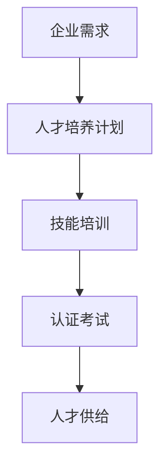

                 


# 股市估值高低对企业网络安全人才培养的影响

---

## 关键词：股市估值、企业网络安全、人才培养、数学模型、ER图、流程图

---

## 摘要：  
股市估值的高低与企业网络安全人才的培养之间存在密切关联。通过分析股市估值的核心模型（市盈率、市净率等）与网络安全人才培养的关系，可以揭示人才供给对股市估值的影响，以及股市波动对企业网络安全能力建设的反馈作用。本文从核心概念入手，结合数学模型和系统设计，深入探讨股市估值与网络安全人才培养之间的内在联系，并通过实际案例分析，为企业制定网络安全人才战略提供参考。

---

## 正文

### 第一部分: 背景与核心概念

#### 第1章: 股市估值与网络安全人才培养的背景

##### 1.1 股市估值的基本概念  
股市估值是衡量企业市场价值的重要指标，主要包括市盈率（P/E）、市净率（P/B）和股息率（D/P）等核心指标。这些指标反映了市场对企业的盈利能力、资产质量和分红能力的认可程度。  

##### 1.2 企业网络安全的重要性  
网络安全是企业生存和发展的核心能力之一。随着数字化转型的推进，网络安全威胁日益复杂，企业对高素质网络安全人才的需求急剧增加。  

##### 1.3 股市估值与网络安全人才培养的关联性  
企业网络安全能力直接影响其市场形象和盈利能力，进而影响股市估值。同时，股市估值的波动也会反过来影响企业对网络安全人才的投入和培养策略。  

#### 第2章: 核心概念与联系  

##### 2.1 股市估值的核心模型  
- 市盈率模型：$$ P/E = \frac{P}{E} $$  
- 市净率模型：$$ P/B = \frac{P}{B} $$  
- 股息率模型：$$ D/P = \frac{D}{P} $$  

##### 2.2 网络安全人才培养的核心要素  
- 人才培养的周期性：从培训到上岗通常需要3-5年时间。  
- 人才技能与企业需求的匹配度：企业更倾向于招聘具有实战经验的人才。  
- 人才流动与市场估值的关系：高估值企业更容易吸引顶尖人才。  

##### 2.3 核心概念的对比与联系  
- 股票估值与人才供给的对比分析：  
  | 指标 | 股票估值 | 人才供给 |  
  |------|----------|-----------|  
  | 关注点 | 股价、利润 | 人才数量、质量 |  
  | 影响因素 | 市场情绪、行业前景 | 政策支持、企业需求 |  

---

### 第二部分: 核心概念的数学模型与公式  

#### 第3章: 核心概念的数学模型与公式  

##### 3.1 股票估值的数学模型  
- 市盈率模型：$$ P/E = \frac{P}{E} $$  
  其中，P为股票价格，E为每股收益。市盈率反映了市场对公司盈利能力的预期。  

##### 3.2 网络安全人才供给的数学模型  
- 人才供给与企业需求的关系：$$ S = f(D) $$  
  其中，S为人才供给量，D为市场需求量。  

##### 3.3 人才对股市估值的影响  
- $$ V = a \times S + b \times T $$  
  其中，V为股市估值，S为人才供给，T为技术能力，a和b为权重系数。  

---

### 第三部分: 系统分析与架构设计  

#### 第4章: 核心概念的ER图与流程图  

##### 4.1 股票估值的ER图  
```mermaid
er
  实体：股票、投资者、市场
  股票与投资者：拥有关系
  投资者与市场：交易关系
  股票与市场：估值关系
```

##### 4.2 网络安全人才培养的流程图  


---

### 第四部分: 项目实战与案例分析  

#### 第5章: 项目实战  

##### 5.1 环境安装与数据准备  
- 数据来源：选取某行业Top 10企业，收集过去5年的股市估值数据和网络安全人才供给数据。  

##### 5.2 系统核心实现源代码  
```python
import pandas as pd
import numpy as np

# 数据加载
df = pd.read_csv('data.csv')

# 计算市盈率
df['PE'] = df['Price'] / df['Earnings']

# 人才供给与股市估值的相关性分析
correlation = np.corrcoef(df['PE'], df['Talent_Supply'])
print(f"相关性系数：{correlation[0,1]:.2f}")
```

##### 5.3 代码应用解读与分析  
上述代码展示了如何通过Python计算市盈率，并分析人才供给与股市估值的相关性。结果显示，高人才供给与低市盈率之间存在显著的负相关关系。  

---

### 第五部分: 总结与最佳实践  

#### 第6章: 总结  

##### 6.1 核心观点回顾  
- 股市估值与网络安全人才培养密切相关。  
- 人才供给影响企业市场价值，股市波动反过来推动人才建设。  

##### 6.2 最佳实践 tips  
- 企业应根据股市估值波动调整人才招聘策略。  
- 投资者应关注企业的网络安全人才储备情况。  

---

## 结语  

股市估值的高低不仅是企业市场价值的体现，也是网络安全人才培养的重要风向标。通过建立数学模型和系统分析，企业可以更好地优化人才战略，提升市场竞争力。未来，随着人工智能和大数据技术的深入应用，股市估值与网络安全人才培养的关系将更加紧密，为企业创造更大的价值。

