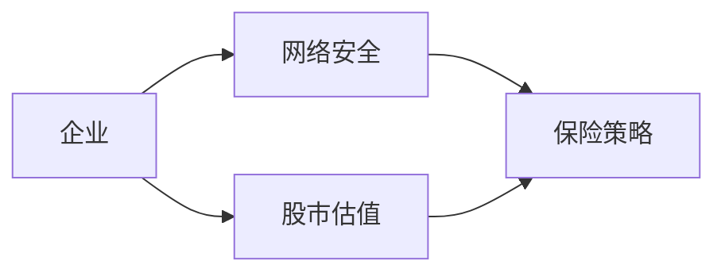

                 


# 股市估值高低对企业网络安全保险策略的影响

## 关键词：股市估值，网络安全，保险策略，企业安全，风险管理

## 摘要：本文探讨股市估值变化如何影响企业的网络安全保险策略。通过分析股市估值的基本概念、网络安全保险的核心原理，以及两者之间的关系，结合数学模型和实际案例，详细讲解企业如何根据股市估值调整网络安全保险策略，以优化风险管理。

---

# 第一部分：股市估值与网络安全保险策略的背景分析

## 第1章：股市估值与网络安全保险策略的背景介绍

### 1.1 问题背景

#### 1.1.1 股市估值的基本概念

股市估值是评估企业价值的重要指标，常用的指标包括市盈率（P/E）、市净率（P/B）和企业价值与息税折旧及摊销前利润之比（EV/EBITDA）。这些指标反映了市场对企业未来盈利能力的预期。

#### 1.1.2 网络安全保险的基本概念

网络安全保险是为企业提供因网络安全事件导致的财务损失提供保障的一种保险。它覆盖的风险包括数据泄露、网络攻击、系统中断等。保险金额通常基于企业的风险评估结果。

#### 1.1.3 问题的提出与研究意义

随着企业对网络安全的重视程度不断提高，股市估值的变化直接影响企业的风险承受能力和投资决策。企业需要根据当前的股市估值调整其网络安全保险策略，以应对可能的风险事件。

### 1.2 问题描述

#### 1.2.1 股市估值对企业网络安全的影响

高估值时，企业可能面临更大的压力，因为市场对其未来表现的期望较高，可能需要投入更多资源来维护网络安全。低估值时，企业可能更倾向于控制成本，减少对网络安全的投入。

#### 1.2.2 网络安全保险策略的制定与实施

企业需要根据自身的风险承受能力和财务状况制定保险策略，包括选择合适的保险产品、确定保险金额和调整保险覆盖范围。

#### 1.2.3 问题的边界与外延

本文仅关注企业层面的网络安全保险策略，不涉及个人或其他领域。

### 1.3 核心概念与联系

#### 1.3.1 核心概念的定义与属性

- 股市估值：反映市场对企业价值的评估。
- 网络安全保险：保障企业因网络安全事件造成的损失。

#### 1.3.2 核心概念的对比分析

通过表格比较股市估值和网络安全保险的属性，如流动性、风险类型、定价方式等。

| 比较维度 | 股市估值 | 网络安全保险 |
|----------|----------|--------------|
| 目标     | 评估企业价值 | 评估网络安全风险 |
| 方法     | 财务指标分析 | 风险评估模型 |
| 影响因素 | 市场供需、宏观经济 | 风险事件、企业安全措施 |

#### 1.3.3 实体关系图（ER图）



---

## 第2章：核心概念与联系

### 2.1 核心概念的原理

#### 2.1.1 股市估值的核心原理

股市估值基于企业的财务状况和市场预期。高估值可能意味着市场对企业未来表现的乐观预期，但也可能增加企业的财务压力。

#### 2.1.2 网络安全保险的核心原理

网络安全保险通过风险评估模型确定保险金额，覆盖因网络安全事件造成的直接和间接损失。

### 2.2 核心概念的对比分析

通过表格对比股市估值和网络安全保险的属性，如目标、方法、影响因素等。

---

# 第二部分：股市估值与网络安全保险策略的算法原理

## 第3章：算法原理讲解

### 3.1 算法概述

#### 3.1.1 股市估值预测算法

使用历史数据预测未来估值，常用的方法包括线性回归、时间序列分析等。

#### 3.1.2 网络安全风险评估算法

基于历史数据和行业标准，评估企业的网络安全风险等级。

### 3.2 算法流程图


### 3.3 算法实现代码

使用Python的机器学习库（如scikit-learn）进行股市估值预测。

```python
import pandas as pd
from sklearn.linear_model import LinearRegression

# 数据加载
data = pd.read_csv('stock_data.csv')

# 模型训练
model = LinearRegression()
model.fit(data[['市盈率', '市净率']], data['股价'])

# 预测
predicted_prices = model.predict(data[['市盈率', '市净率']])
```

### 3.4 数学模型与公式

#### 3.4.1 股市估值预测模型

线性回归模型：$$ y = \beta_0 + \beta_1x + \epsilon $$

#### 3.4.2 网络安全风险评估模型

综合风险评估公式：$$ Risk = 0.4 \times Market\_Value + 0.3 \times Security\_Measures + 0.3 \times Past\_Incidents $$

---

## 第4章：数学模型与公式

### 4.1 股市估值预测模型

详细推导线性回归模型，包括特征选择、模型训练、评估指标（如R²、均方误差）。

### 4.2 网络安全风险评估模型

使用层次分析法（AHP）确定各因素的权重，构建综合风险评估公式。

---

## 第5章：系统分析与架构设计方案

### 5.1 问题场景介绍

企业根据当前股市估值调整网络安全保险策略。

### 5.2 系统功能设计

- 数据采集模块：收集股市数据和网络安全数据。
- 数据分析模块：应用机器学习模型进行预测。
- 策略生成模块：基于分析结果生成保险策略建议。

### 5.3 系统架构设计


### 5.4 系统接口设计

- API接口：提供数据获取、模型调用等功能。

### 5.5 系统交互设计


---

# 第三部分：项目实战

## 第6章：项目实战

### 6.1 环境安装

安装Python、Pandas、Scikit-learn等库。

### 6.2 核心代码实现

```python
import pandas as pd
from sklearn.model_selection import train_test_split
from sklearn.metrics import mean_squared_error

# 加载数据
data = pd.read_csv('security_data.csv')

# 分割数据
X = data[['市盈率', '市净率']]
y = data['保险成本']

X_train, X_test, y_train, y_test = train_test_split(X, y, test_size=0.2)

# 训练模型
model = LinearRegression()
model.fit(X_train, y_train)

# 预测
y_pred = model.predict(X_test)

# 评估
mse = mean_squared_error(y_test, y_pred)
print(f'均方误差: {mse}')
```

### 6.3 实际案例分析

通过具体企业的案例，展示如何根据股市估值调整保险策略。

### 6.4 项目小结

总结项目实现的关键点和经验教训。

---

# 第四部分：最佳实践与总结

## 第7章：最佳实践

### 7.1 小结

回顾文章的主要内容，强调股市估值与保险策略之间的关系。

### 7.2 注意事项

- 数据的准确性和完整性的重要性。
- 模型的适用性和可解释性。

### 7.3 拓展阅读

推荐相关领域的书籍和论文，供读者深入学习。

---

# 结语

股市估值的变化直接影响企业的网络安全保险策略。通过合理利用数学模型和系统架构设计，企业可以根据当前的股市估值调整保险策略，优化风险管理，降低因网络安全事件带来的损失。

