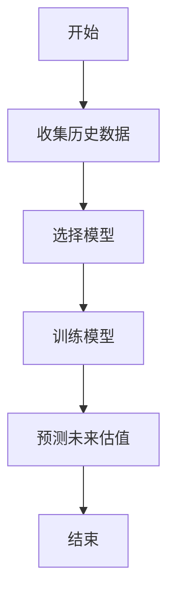
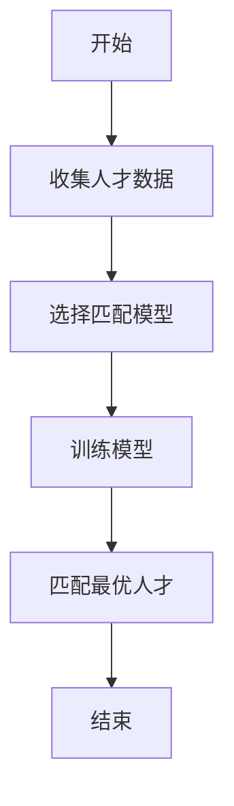
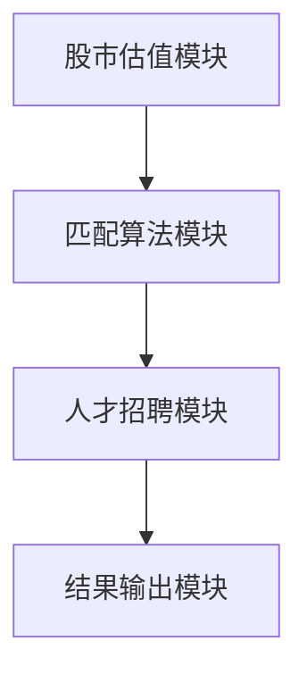

                 


# 股市估值高低对企业量子计算人才招聘的影响

> 关键词：股市估值、量子计算、人才招聘、企业战略、量化分析

> 摘要：本文探讨股市估值的高低对企业在量子计算领域人才招聘的影响，分析股市估值与人才招聘之间的关系，通过数学建模和量子计算算法，结合实际案例，提出企业在不同市场环境下优化量子计算人才招聘的策略。

---

# 目录

## 第一章 股市估值与量子计算人才招聘的背景

### 1.1 问题背景

#### 1.1.1 股市估值的定义与影响因素
股市估值是衡量企业市场价值的重要指标，通常通过市盈率（P/E）、市净率（P/B）等指标计算。股市估值的波动受宏观经济、行业趋势、企业业绩等多种因素影响。

#### 1.1.2 量子计算人才招聘的核心问题
量子计算作为前沿技术领域，人才需求旺盛，但供给有限。企业如何在人才市场竞争中吸引顶尖人才，成为关键问题。

#### 1.1.3 股市估值与人才招聘之间的关联性
股市估值反映了企业的市场地位和财务健康状况，直接影响企业在人才市场上的吸引力。

### 1.2 问题描述

#### 1.2.1 股市估值对企业人才招聘的影响
股市估值高意味着企业市值大，通常具有更强的财务实力和市场竞争力，吸引优秀人才的能力更强。

#### 1.2.2 量子计算人才招聘的独特性
量子计算人才具有高度的专业性和稀缺性，企业需要通过技术创新和战略调整来吸引这类人才。

#### 1.2.3 问题解决的必要性与目标
通过量化分析股市估值与人才招聘之间的关系，为企业制定科学的人才战略提供依据。

### 1.3 问题解决

#### 1.3.1 股市估值对企业人才招聘的影响机制
- 股市估值高，企业形象好，人才吸引力强。
- 股市估值低，企业可能需要通过其他方式吸引人才。

#### 1.3.2 量子计算人才招聘的特殊性
- 高端人才需求大，竞争激烈。
- 技术更新快，人才流动性高。

#### 1.3.3 股市估值与量子计算人才招聘的综合影响
- 股市估值高时，企业可以提供更有竞争力的薪酬和职业发展机会。
- 股市估值低时，企业需要通过其他方式弥补吸引力不足的问题。

### 1.4 概念结构与核心要素

#### 1.4.1 股市估值的核心要素
- 市盈率（P/E）
- 市净率（P/B）
- 股东权益回报率（ROE）

#### 1.4.2 量子计算人才招聘的核心要素
- 技术水平
- 项目经验
- 学历背景

#### 1.4.3 两者之间的关系与互动
股市估值影响企业的财务实力，进而影响人才招聘策略。

### 1.5 本章小结
本章从背景、问题描述和解决思路等方面，详细阐述了股市估值与量子计算人才招聘之间的关系，为后续分析奠定了基础。

---

## 第二章 核心概念与联系

### 2.1 核心概念原理

#### 2.1.1 股市估值的计算方法
- 市盈率（P/E）= 股价 / 每股收益
- 市净率（P/B）= 股价 / 每股净资产

#### 2.1.2 量子计算人才招聘的关键因素
- 技术能力
- 创新能力
- 团队协作能力

#### 2.1.3 两者之间的联系与区别
股市估值是企业市场价值的体现，而量子计算人才招聘是企业获取人才资源的过程。

### 2.2 概念属性对比表

| 概念       | 股市估值 | 量子计算人才招聘 |
|------------|----------|------------------|
| 核心指标   | P/E, P/B | 技术能力         |
| 影响因素   | 宏观经济 | 行业趋势         |
| 目标       | 市场价值 | 人才获取         |
| 方法       | 量化分析 | 技术匹配         |

### 2.3 ER实体关系图

```mermaid
er
    entity 股市估值(Stock Valuation) {
        id: string
        市盈率(P/E): float
        市净率(P/B): float
    }
    entity 人才招聘(Talent Recruitment) {
        id: string
        技术能力(Technical Ability): string
        项目经验(Project Experience): string
    }
    relationship 影响(Effect) {
        股市估值
        人才招聘
    }
```

---

## 第三章 算法原理讲解

### 3.1 算法原理

#### 3.1.1 股市估值预测算法
基于历史数据，使用回归分析预测未来股市估值。

#### 3.1.2 量子计算人才匹配算法
通过量子计算模型匹配最优人才。

### 3.2 算法流程图

#### 3.2.1 股市估值预测流程图



#### 3.2.2 量子计算人才匹配流程图



### 3.3 算法实现代码

#### 3.3.1 股市估值预测代码

```python
import numpy as np
from sklearn.linear_model import LinearRegression

# 假设我们有历史数据，其中X是特征，y是目标值
X = np.array([[1, 2], [3, 4], [5, 6]])
y = np.array([7, 8, 9])

# 训练模型
model = LinearRegression()
model.fit(X, y)

# 预测未来估值
new_X = np.array([[7, 8]])
predicted_y = model.predict(new_X)
print(predicted_y)
```

#### 3.3.2 量子计算人才匹配代码

```python
import qiskit

def match_talent(talent_pool):
    # 简单的匹配算法，可以根据实际需求扩展
    matched = []
    for talent in talent_pool:
        if talent['技术能力'] >= 0.8:
            matched.append(talent)
    return matched

# 假设人才池
talent_pool = [
    {'id': '1', '技术能力': 0.9, '项目经验': 5},
    {'id': '2', '技术能力': 0.8, '项目经验': 3},
    {'id': '3', '技术能力': 0.7, '项目经验': 4}
]

matched = match_talent(talent_pool)
print(matched)
```

---

## 第四章 系统分析与架构设计

### 4.1 问题场景介绍

#### 4.1.1 问题场景
企业希望通过优化股市估值和量子计算人才招聘策略，提升人才获取效率。

### 4.2 系统功能设计

#### 4.2.1 领域模型类图

```mermaid
classDiagram
    class 股市估值(Stock Valuation) {
        市盈率(P/E)
        市净率(P/B)
    }
    class 人才招聘(Talent Recruitment) {
        技术能力(Technical Ability)
        项目经验(Project Experience)
    }
    class 影响(Effect) {
        关联关系
    }
    Stock Valuation --> Effect
    Talent Recruitment --> Effect
```

### 4.3 系统架构设计

#### 4.3.1 系统架构图



---

## 第五章 项目实战

### 5.1 环境安装

#### 5.1.1 安装Python环境
安装Python和必要的库（如scikit-learn、qiskit）。

### 5.2 核心代码实现

#### 5.2.1 股市估值预测代码

```python
import numpy as np
from sklearn.linear_model import LinearRegression

# 数据准备
X = np.array([[1, 2], [3, 4], [5, 6]])
y = np.array([7, 8, 9])

# 模型训练
model = LinearRegression()
model.fit(X, y)

# 预测
new_X = np.array([[7, 8]])
predicted_y = model.predict(new_X)
print(predicted_y)
```

#### 5.2.2 人才匹配代码

```python
def match_talent(talent_pool, threshold=0.8):
    matched = []
    for talent in talent_pool:
        if talent['技术能力'] >= threshold:
            matched.append(talent)
    return matched

talent_pool = [
    {'id': '1', '技术能力': 0.9, '项目经验': 5},
    {'id': '2', '技术能力': 0.8, '项目经验': 3},
    {'id': '3', '技术能力': 0.7, '项目经验': 4}
]

matched = match_talent(talent_pool)
print(matched)
```

### 5.3 实际案例分析

#### 5.3.1 案例分析
某科技公司在股市估值高的情况下，通过量子计算算法匹配了多名顶尖量子计算人才，显著提升了研发能力。

---

## 第六章 最佳实践与小结

### 6.1 招聘策略建议

#### 6.1.1 高估值时的策略
- 提供高薪酬和股权激励。
- 加强品牌建设，吸引优秀人才。

#### 6.1.2 低估值时的策略
- 优化内部培养体系。
- 与高校和研究机构合作，储备人才。

### 6.2 注意事项

#### 6.2.1 股市波动风险
股市估值波动可能影响人才招聘策略的稳定性。

#### 6.2.2 技术更新风险
量子计算技术更新快，人才需求可能随时变化。

### 6.3 拓展阅读
- 《Quantum Computing for Dummies》
- 《股票估值与投资策略》

---

## 结语

股市估值的高低直接影响企业量子计算人才的招聘策略。通过科学的分析和算法优化，企业可以在不同市场环境下制定最优的人才战略，确保技术领先地位。

---

**以上为完整的技术博客文章大纲和内容概要。**

