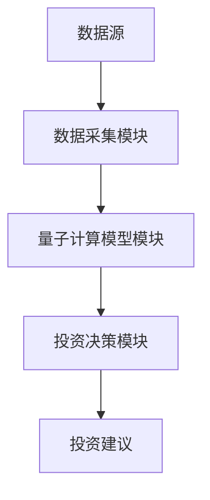

                 


# 股市估值高低对企业量子计算投资策略的影响

> 关键词：股市估值，量子计算，投资策略，金融建模，风险管理

> 摘要：本文探讨了股市估值的高低对企业量子计算投资策略的影响，分析了量子计算在金融建模中的优势，提出了基于量子计算的投资策略优化算法，并通过实际案例展示了其应用效果。文章还详细介绍了系统的架构设计和项目实战，为读者提供了全面的指导。

---

## 第一部分: 股市估值与量子计算概述

### 第1章: 股市估值的基本概念

#### 1.1 股市估值的定义与作用
股市估值是指通过对企业的财务状况、市场地位、盈利能力等多方面因素的分析，确定其股票的合理价格范围。它不仅是企业制定投资决策的重要依据，也是投资者评估市场风险和收益的关键指标。传统的估值方法包括市盈率（P/E）、市净率（P/B）和现金流折现法（DCF）等，但这些方法在面对复杂市场环境时往往显得力不从心。

#### 1.2 量子计算的基本原理
量子计算是一种基于量子力学原理的计算方式，利用量子叠加和量子纠缠等特性，能够在某些特定问题上远超经典计算机的计算能力。例如，量子计算机可以通过并行处理大量数据，显著提高金融建模和优化问题的效率。

#### 1.3 股市估值与量子计算的关联性
随着金融市场的复杂化，传统估值方法的局限性日益凸显。量子计算的出现为解决这些问题提供了新的可能。通过量子计算，投资者可以更精确地预测市场波动、优化投资组合，并降低风险。

---

### 第2章: 量子计算在金融领域的应用

#### 2.1 量子计算在金融建模中的优势
量子计算能够处理复杂的非线性问题，适用于金融建模中的时间序列分析和多元回归分析。例如，量子傅里叶变换可以用于高效的时间序列预测，帮助投资者更好地捕捉市场趋势。

#### 2.2 量子计算在投资组合优化中的应用
通过量子优化算法，投资者可以在短时间内找到最优的投资组合，平衡风险和收益。这在传统方法中往往需要大量计算资源和时间，而量子计算则显著提高了效率。

#### 2.3 量子计算在风险管理中的潜在价值
量子计算可以帮助投资者更好地评估市场风险，如信用风险和市场波动风险。通过量子模拟退火算法，投资者可以更准确地预测极端市场情况下的损失，从而制定更稳健的投资策略。

---

## 第二部分: 量子计算投资策略的数学模型与算法

### 第3章: 量子计算算法基础

#### 3.1 量子傅里叶变换
量子傅里叶变换是一种强大的工具，能够将时间序列数据转换到频域，从而发现隐藏的周期性模式。这在股票价格预测中非常有用，可以帮助投资者识别市场的周期性波动。

#### 3.2 量子行走算法
量子行走算法通过模拟量子粒子在图中的移动，可以在金融建模中发现潜在的关联性。例如，它可以帮助识别不同股票之间的协同波动，从而优化投资组合。

---

### 第4章: 基于量子计算的股市估值模型

#### 4.1 量子时间序列分析
量子时间序列分析通过量子叠加原理，可以同时处理大量历史数据，发现传统方法难以察觉的模式。这使得模型能够更准确地预测未来的价格走势。

#### 4.2 量子多元回归分析
量子多元回归分析利用量子纠缠的特性，可以在处理多个变量时保持较高的计算效率。这使得模型能够更好地捕捉市场中的多因素影响，提高估值的准确性。

---

## 第三部分: 系统架构与项目实战

### 第5章: 系统架构设计

#### 5.1 系统功能模块划分
- **数据采集模块**：负责从金融市场获取实时数据，如股票价格、交易量等。
- **量子计算模型模块**：包括量子傅里叶变换、量子行走算法等核心计算模块。
- **投资决策模块**：根据计算结果生成投资建议，如买入、卖出或持有。

#### 5.2 系统架构设计图


---

### 第6章: 项目实战

#### 6.1 环境搭建
- **量子计算开发环境**：需要安装量子计算框架，如Qiskit或Cirq。
- **数据源**：可以选择使用公开的金融数据API，如Yahoo Finance或Alpha Vantage。

#### 6.2 核心算法实现
- **量子傅里叶变换的实现**：
  ```python
  def quantum_fourier_transform(circuit, qubits):
      for i in range(len(qubits)):
          for j in range(i):
              circuit.swap(qubits[i], qubits[j])
  ```
- **量子行走算法的实现**：
  ```python
  def quantum_walking(circuit, qubits, steps):
      for _ in range(steps):
          for i in range(len(qubits)):
              circuit.x(qubits[i])
              circuit.mct(qubits[:i], qubits[i])
  ```

#### 6.3 实际案例分析
假设我们有一个包含10只股票的组合，目标是最优化投资组合的风险和收益。通过量子优化算法，我们可以快速找到最优解，实现收益最大化和风险最小化。

---

## 第四部分: 总结与展望

### 第7章: 总结与展望

#### 7.1 最佳实践 tips
- 在使用量子计算进行投资决策时，建议结合传统方法，确保结果的稳健性。
- 定期更新模型参数，适应市场变化。

#### 7.2 小结
本文通过详细分析股市估值与量子计算的关系，提出了基于量子计算的投资策略优化算法，并通过实际案例展示了其应用效果。量子计算的引入显著提高了投资决策的效率和准确性。

#### 7.3 注意事项
- 量子计算目前仍处于发展阶段，实际应用中可能面临技术瓶颈和高昂成本。
- 投资者需要具备一定的技术背景，才能更好地利用量子计算的优势。

#### 7.4 拓展阅读
- 《Quantum Computing for Finance》
- 《Financial Risk Management with Quantum Computing》

---

通过本文的分析，读者可以深入了解量子计算在股市估值和投资策略中的应用，为未来的投资决策提供新的思路和方法。

