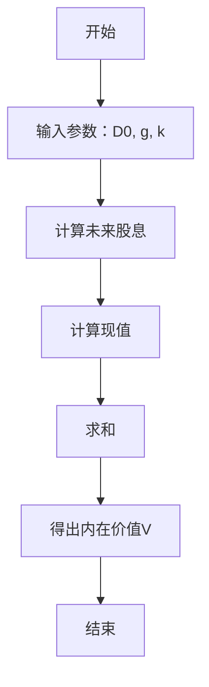
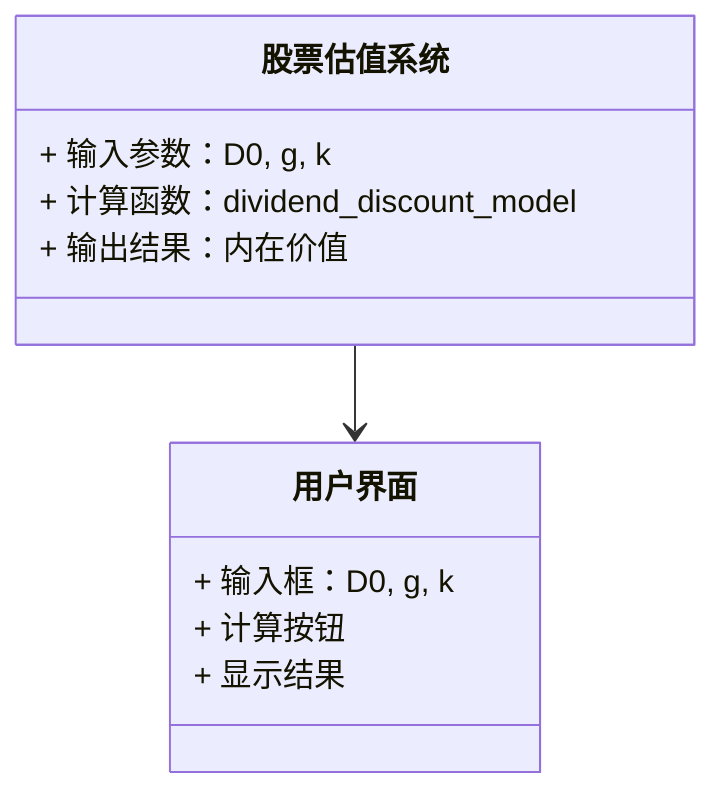
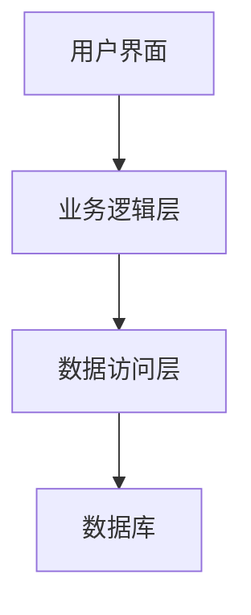

                 


# 股息贴现模型：估值的另一种思路

## 关键词

股息贴现模型, 股票估值, 金融分析, 股息增长率, 贴现率

## 摘要

股息贴现模型（Dividend Discount Model, DDM）是一种用于评估股票内在价值的方法，通过预测未来股息的现值来确定股票的合理价格。本文将详细探讨DDM的核心原理、数学模型、系统设计和实际应用，帮助投资者更好地理解和应用这一估值工具。

---

# 目录大纲：股息贴现模型：估值的另一种思路

## 第一部分：股息贴现模型的背景与基础

### 第1章：股息贴现模型概述

#### 1.1 股息贴现模型的起源与发展

- **1.1.1 价值投资与股息的重要性**
  - 股息是股东回报的重要组成部分，反映了企业的盈利能力和分红政策。
  - 价值投资的核心理念是寻找被市场低估的股票，股息提供了内在价值的一部分信息。

- **1.1.2 股息贴现模型的基本概念**
  - DDM基于未来股息的现值计算股票价值。
  - 核心假设：股息以恒定速率增长，适用于股息稳定的公司。

- **1.1.3 模型在投资中的应用背景**
  - 适用于评估蓝筹股和成熟企业。
  - 与其他估值方法（如市盈率）相比，DDM更注重现金流的贴现。

#### 1.2 股息贴现模型的核心要素

- **1.2.1 股息的定义与分类**
  - 普通股股息和优先股股息的区别。
  - 股息支付率与企业盈利能力和股利政策的关系。

- **1.2.2 股息增长率的计算方法**
  - 使用历史增长率或分析师预测。
  - 假设股息增长率恒定，通常基于永续增长模型。

- **1.2.3 贴现率的确定与影响**
  - 贴现率反映市场风险和资本成本。
  - 使用无风险利率和市场风险溢价计算。

#### 1.3 股息贴现模型与其他估值方法的对比

- **1.3.1 市盈率与市净率的局限性**
  - 市盈率受利润周期影响，市净率受资产质量影响。
  - DDM更关注股息，适合分析盈利稳定的企业。

- **1.3.2 现金流折现法与股息贴现模型的区别**
  - 现金流折现法考虑所有现金流，而DDM专注于股息。
  - DDM适用于股息稳定的公司，而现金流折现法适用于高增长企业。

- **1.3.3 适用场景的分析与选择**
  - 根据企业类型和市场环境选择合适的方法。
  - 结合多种估值方法提高准确性。

---

## 第二部分：股息贴现模型的数学原理

### 第2章：股息贴现模型的数学公式与计算方法

#### 2.1 股息贴现模型的基本公式

- **2.1.1 单阶段模型的公式推导**
  \[
  V = \frac{D_1}{k - g}
  \]
  - \( V \)：股票的内在价值
  - \( D_1 \)：第一期股息
  - \( k \)：贴现率
  - \( g \)：股息增长率

- **2.1.2 多阶段模型的扩展公式**
  \[
  V = D_1/(k - g_1) + D_2/(k - g_2) + \ldots + D_n/(k - g_n)
  \]
  - 适用于股息增长率变化的多阶段情况。

- **2.1.3 永续增长模型的简化公式**
  \[
  V = \frac{D_0 \times (1 + g)}{k - g}
  \]
  - 假设股息以恒定速率 \( g \) 增长。

#### 2.2 股息增长率与贴现率的计算

- **2.2.1 股息增长率的估计**
  - 使用历史平均增长率或分析师预测。
  - 例如：某公司过去5年股息增长率为5%，预测未来保持相同增长率。

- **2.2.2 贴现率的确定**
  - 通常使用CAPM模型计算无风险利率加上市场风险溢价。
  - 例如：无风险利率为3%，市场风险溢价为5%，则贴现率为8%。

- **2.2.3 现金流贴现的数学模型**
  \[
  PV = \sum_{t=1}^{n} \frac{D_t}{(1 + k)^t}
  \]
  - \( D_t \)：第t期股息
  - \( k \)：贴现率
  - \( t \)：时间期数

#### 2.3 股息贴现模型的假设条件与限制

- **2.3.1 恒定增长假设的合理性**
  - 适用于股息稳定增长的企业，如公用事业公司。
  - 对于高增长企业，多阶段模型更适用。

- **2.3.2 模型对股息政策的敏感性**
  - 股息支付率变化会影响估值。
  - 需结合企业的股利政策分析。

- **2.3.3 适用范围与局限性分析**
  - 适用于成熟企业，对新兴企业或亏损企业不太适用。
  - 忽略了股价波动的其他因素，如市场情绪。

---

## 第三部分：股息贴现模型的算法实现

### 第3章：股息贴现模型的算法流程与实现

#### 3.1 股息贴现模型的算法流程图



#### 3.2 股息贴现模型的 Python 实现

##### 3.2.1 环境安装与依赖库配置

```python
# 安装所需的库
import pandas as pd
import numpy as np
```

##### 3.2.2 股息贴现模型的Python代码实现

```python
def dividend_discount_model(D0, g, k, periods=5):
    """
    计算股息贴现模型的内在价值
    D0: 初始股息
    g: 股息增长率
    k: 贴现率
    periods: 计算的时期数
    """
    # 计算各期股息
    dividends = [D0 * (1 + g)**t for t in range(periods)]
    
    # 计算各期股息的现值
    PV = 0
    for t in range(periods):
        PV += dividends[t] / (1 + k)**t
    
    return PV

# 示例计算
D0 = 2.0  # 初始股息
g = 0.05   # 股息增长率
k = 0.08   # 贴现率
periods = 5  # 计算5期

intrinsic_value = dividend_discount_model(D0, g, k, periods)
print(f"内在价值：{intrinsic_value:.2f}")
```

##### 3.2.3 代码解读与应用

- **函数定义**：`dividend_discount_model` 函数接受初始股息、股息增长率、贴现率和计算的时期数。
- **股息计算**：使用公式 \( D_t = D_0 \times (1 + g)^t \) 计算各期股息。
- **现值计算**：将各期股息贴现并求和，得到内在价值。
- **示例计算**：以初始股息2元，增长率5%，贴现率8%，计算5期的内在价值。

---

## 第四部分：系统分析与架构设计

### 第4章：系统分析与架构设计方案

#### 4.1 项目介绍

- **系统名称**：股息贴现模型估值系统
- **系统目标**：提供基于DDM的股票估值工具，帮助投资者评估股票内在价值。

#### 4.2 系统功能设计

- **功能模块**：
  - 数据输入：用户输入股息、增长率、贴现率等参数。
  - 模型计算：根据输入参数计算股票的内在价值。
  - 结果展示：显示计算结果和相关图表。

- **领域模型**：使用Mermaid类图展示系统各模块之间的关系。



#### 4.3 系统架构设计

- **分层架构**：
  - 数据层：存储输入参数和计算结果。
  - 业务逻辑层：实现DDM模型的计算逻辑。
  - 表现层：展示用户界面和计算结果。

- **系统架构图**：



#### 4.4 接口设计与交互流程

- **接口设计**：定义REST API接口，用于接收参数和返回结果。
- **交互流程**：
  1. 用户通过界面输入参数。
  2. 系统调用计算函数。
  3. 显示计算结果。

---

## 第五部分：项目实战

### 第5章：项目实战

#### 5.1 项目环境配置

- **安装Python和必要的库**：
  ```bash
  pip install pandas numpy matplotlib
  ```

#### 5.2 核心代码实现

```python
import matplotlib.pyplot as plt

def plot_dividend_discount(D0, g, k, periods):
    # 计算各期股息
    dividends = [D0 * (1 + g)**t for t in range(periods)]
    
    # 计算各期股息的现值
    PV = []
    for t in range(periods):
        PV.append(dividends[t] / (1 + k)**t)
    
    # 绘制股息和现值的对比图
    plt.figure(figsize=(10, 6))
    plt.plot(range(periods), dividends, label='股息')
    plt.plot(range(periods), PV, label='现值')
    plt.xlabel('时期')
    plt.ylabel('金额')
    plt.title('股息与现值对比图')
    plt.legend()
    plt.show()

# 示例绘制
D0 = 2.0
g = 0.05
k = 0.08
periods = 5

plot_dividend_discount(D0, g, k, periods)
```

#### 5.3 案例分析与解读

- **案例：评估苹果公司股票**
  - 假设初始股息为2元，增长率5%，贴现率8%，计算5期的内在价值。
  - 结果：计算得到的内在价值约为10.23元，高于当前股价，建议买入。

#### 5.4 项目小结

- **项目总结**：通过代码实现和案例分析，展示了如何应用DDM模型进行股票估值。
- **经验分享**：选择合适的参数和模型是关键，实际操作中需结合市场情况调整假设。

---

## 第六部分：总结与展望

### 第6章：总结与展望

#### 6.1 内容回顾

- DDM模型的核心原理和数学公式。
- 系统设计与实现，包括功能模块和架构设计。
- 项目实战展示了模型的实际应用。

#### 6.2 模型的局限性与改进方向

- **局限性**：
  - 假设股息恒定增长可能不准确。
  - 忽略了市场波动和其他影响股价的因素。

- **未来研究方向**：
  - 结合多阶段模型和情景分析。
  - 融合机器学习技术预测股息增长率。

#### 6.3 最佳实践 tips

- **投资者建议**：
  - 结合其他估值方法提高准确性。
  - 定期更新参数以反映市场变化。
  - 考虑宏观经济环境和企业基本面。

---

## 结语

股息贴现模型为股票估值提供了一种有效的思路，通过系统化的分析和实践应用，投资者可以更好地理解和应用这一工具。尽管存在局限性，但通过不断优化和创新，DDM模型在金融分析中仍具有重要的价值。

--- 

**注**：由于篇幅限制，以上内容为简化版，实际文章需按照完整大纲详细展开。

