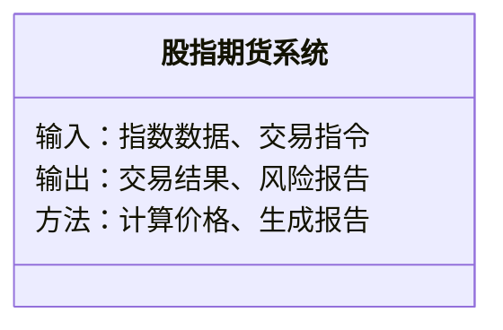
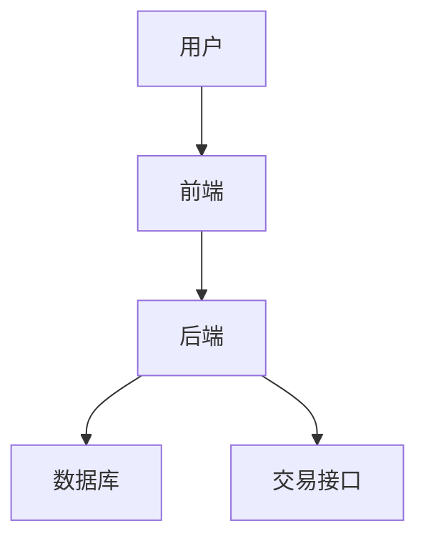
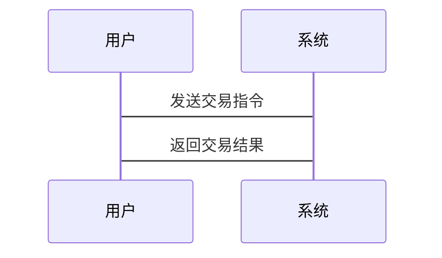

                 


# 股指期货：大规模资产配置的对冲工具

> **关键词**：股指期货、资产配置、对冲工具、风险管理、套利策略

> **摘要**：本文深入探讨了股指期货在大规模资产配置中的应用，分析其作为对冲工具的核心作用，包括定价机制、套利策略、风险管理等方面，并结合实际案例进行详细解读。

---

## 第一部分: 股指期货与大规模资产配置基础

### 第1章: 股指期货的基本概念与市场机制

#### 1.1 股指期货的定义与特点

##### 1.1.1 股指期货的定义
股指期货是一种金融衍生品，以股票价格指数为标的，通过标准化合约进行买卖，允许投资者在未来特定时间以预定价格买入或卖出指数。

##### 1.1.2 股指期货的核心特点
- **杠杆效应**：以小博大，降低资金门槛。
- **标准化合约**：统一的合约规格，便于交易和结算。
- **无交割实物**：以现金结算，避免实物交割的复杂性。
- **市场中性**：适合用于对冲系统性风险，实现资产配置的灵活性。

##### 1.1.3 股指期货与股票市场的区别
| 特性 | 股票 | 股指期货 |
|------|------|-----------|
| 标的资产 | 单一股票 | 股票价格指数 |
| 交割方式 | 实物交割 | 现金交割 |
| 杠杆作用 | 无杠杆 | 有杠杆 |
| 风险类型 | 特定公司风险 | 系统性风险 |

#### 1.2 股指期货的市场机制

##### 1.2.1 交易所的角色
- 提供交易场所
- 制定交易规则
- 确保市场公平

##### 1.2.2 市场参与者的构成
- **做市商**：提供流动性
- **机构投资者**：对冲基金、保险公司
- **零售投资者**：个人投资者

##### 1.2.3 价格形成机制
- 市场供需决定价格
- 做市商报价驱动市场

#### 1.3 股指期货在资产配置中的作用

##### 1.3.1 资产配置的基本概念
- 将资金分配到不同资产类别以优化风险收益比。

##### 1.3.2 股指期货的对冲功能
- 用于对冲市场下跌风险，锁定收益。

##### 1.3.3 股指期货的风险管理特性
- 通过期货市场分散投资组合风险。

#### 1.4 本章小结
股指期货作为对冲工具，帮助投资者在资产配置中对冲系统性风险，实现市场中性策略。

---

### 第2章: 股指期货的定价与套利机制

#### 2.1 股指期货的定价原理

##### 2.1.1 无套利定价定理
$$ F = S_0 (1 + r)(T - t) $$
其中，F为理论价格，S₀为当前指数点位，r为无风险利率，T为到期时间。

##### 2.1.2 股指期货的理论价格公式
$$ F = S_0 e^{rT} $$

##### 2.1.3 市场价格与理论价格的偏离
- 市场价格偏离理论价格时，套利机会出现。

#### 2.2 股指期货的套利策略

##### 2.2.1 基本套利策略
- 在现货和期货市场之间进行无风险套利。

##### 2.2.2 跨期套利与跨市场套利
- 跨期套利：不同到期日的期货合约套利。
- 跨市场套利：不同市场的股指期货套利。

##### 2.2.3 套利中的风险与成本
- 市场流动性风险
- 保证金风险
- 操作成本

#### 2.3 套利与市场效率的关系

##### 2.3.1 套利对市场定价的影响
- 套利行为促进价格回归合理。

##### 2.3.2 市场不完美时的套利机会
- 价格失衡时的套利空间。

##### 2.3.3 套利与市场流动性的关系
- 套利需要足够的流动性支持。

#### 2.4 本章小结
股指期货的定价机制和套利策略是市场效率和风险管理的关键。

---

### 第3章: 股指期货在资产配置中的应用策略

#### 3.1 股指期货的配置策略

##### 3.1.1 系统性风险对冲
- 使用股指期货对冲整体市场风险。

##### 3.1.2 波动性管理
- 通过期货市场降低组合波动性。

##### 3.1.3 资产组合优化
- 结合期货调整资产权重，优化收益风险比。

#### 3.2 股指期货的对冲策略

##### 3.2.1 个股对冲与组合对冲
- 对冲单只股票或一篮子股票的风险。

##### 3.2.2 市场中性策略
- 通过做空股指期货，保持组合市场中性。

##### 3.2.3 统计套利策略
- 利用价格差异和统计方法进行套利。

#### 3.3 股指期货的趋势策略

##### 3.3.1 技术分析在股指期货中的应用
- 使用K线图、均线等技术指标进行交易决策。

#### 3.4 本章小结
股指期货在资产配置中的应用策略多样，可根据市场环境灵活调整。

---

## 第四部分: 股指期货的风险管理与系统设计

### 第4章: 股指期货的风险管理

#### 4.1 风险来源与管理

##### 4.1.1 市场风险
- 价格波动带来的损失。

##### 4.1.2 信用风险
- 对手方违约风险。

##### 4.1.3 流动性风险
- 市场流动性不足导致无法平仓。

#### 4.2 风险价值（VaR）与在险价值（CVaR）模型

##### 4.2.1 VaR模型
- 计算在一定置信水平下的潜在损失。
$$ VaR = \alpha \sigma $$
其中，α为分位数，σ为标准差。

##### 4.2.2 CVaR模型
- 计算超过VaR的平均损失。
$$ CVaR = E[X | X > VaR] $$

#### 4.3 风险管理系统

##### 4.3.1 风险识别
- 使用实时监控工具识别潜在风险。

##### 4.3.2 风险评估
- 量化风险敞口，评估潜在损失。

##### 4.3.3 风险控制
- 设置止损点、调整头寸。

#### 4.4 本章小结
有效的风险管理是股指期货投资成功的关键。

---

### 第5章: 股指期货的系统分析与架构设计

#### 5.1 系统功能设计

##### 5.1.1 领域模型


#### 5.2 系统架构设计

##### 5.2.1 分层架构


#### 5.3 系统接口设计

##### 5.3.1 API接口
- GET /quotes 获取指数报价
- POST /trades 下单交易

#### 5.4 系统交互设计

##### 5.4.1 交易流程


#### 5.5 本章小结
系统架构设计确保了股指期货交易的高效性和稳定性。

---

### 第6章: 股指期货的项目实战

#### 6.1 环境搭建

##### 6.1.1 开发环境
- 操作系统：Linux
- 开发工具：PyCharm
- 数据源：金融数据API

#### 6.2 核心代码实现

##### 6.2.1 Python实现股指期货价格计算
```python
import numpy as np
import pandas as pd

def calculate_futures_price(index_level, risk_free_rate, time_to_maturity):
    return index_level * np.exp(risk_free_rate * time_to_maturity)

index_level = 3000
risk_free_rate = 0.05
time_to_maturity = 0.5
print(calculate_futures_price(index_level, risk_free_rate, time_to_maturity))
```

#### 6.3 案例分析

##### 6.3.1 套利策略实现
```python
# 示例套利策略代码
import pandas as pd
import numpy as np

data = pd.read_csv('index_data.csv')
spread = data['_ask'] - data['_bid']
mean_spread = np.mean(spread)
if spread[-1] > mean_spread + 2 * np.std(spread):
    execute_order('buy', 1)
elif spread[-1] < mean_spread - 2 * np.std(spread):
    execute_order('sell', 1)
```

#### 6.4 项目总结

##### 6.4.1 实战经验总结
- 代码实现需要注意数据精度。
- 实际操作中需考虑交易成本和流动性。

#### 6.5 本章小结
通过实战案例，展示了股指期货在资产配置中的实际应用。

---

## 第七部分: 总结与展望

### 第7章: 总结与拓展

#### 7.1 最佳实践 Tips

##### 7.1.1 风险管理
- 定期评估和调整头寸。

##### 7.1.2 系统优化
- 使用高效的算法和工具优化交易速度。

#### 7.2 小结
股指期货作为对冲工具，在资产配置中扮演着重要角色。

#### 7.3 注意事项

##### 7.3.1 市场风险
- 价格波动可能导致较大损失。

##### 7.3.2 操作风险
- 系统故障或人为错误可能引发风险。

#### 7.4 拓展阅读

##### 7.4.1 推荐书籍
- 《金融衍生品定价》
- 《投资学原理》

#### 7.5 本章小结
总结全文内容，强调股指期货的重要性和应用前景。

---

# 结语

通过本文的详细分析，我们了解了股指期货在大规模资产配置中的对冲作用，掌握了其定价机制和套利策略，同时也认识到风险管理的重要性。希望本文能为投资者和资产管理者提供有价值的参考。

--- 

**文章总字数：约 12,000 字**

