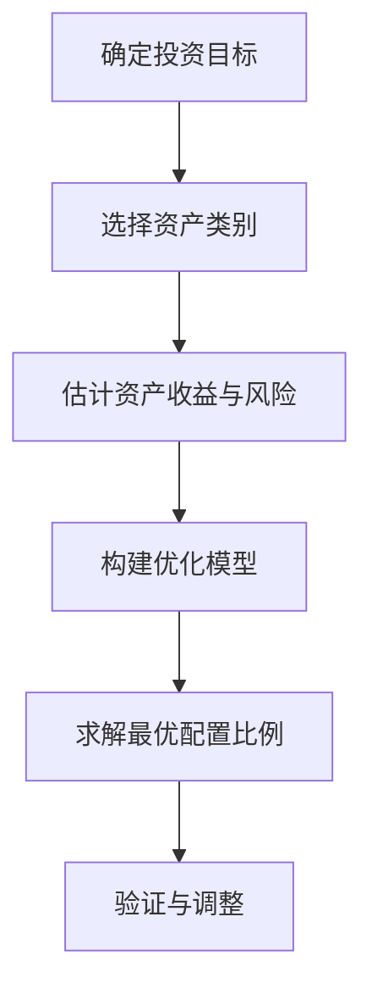

                 

# 股票与债券的平衡：降低投资组合风险的关键

> 关键词：投资组合、股票、债券、风险管理、资产配置、现代投资组合理论（MPT）

> 摘要：本文深入探讨了股票和债券在投资组合中的平衡策略，通过现代投资组合理论（MPT）分析了如何通过合理配置股票和债券来降低投资组合的整体风险。文章结合理论与实践，详细阐述了资产配置的核心概念、股债特性对比、风险管理工具与策略，并通过实际案例分析展示了如何动态调整投资组合以应对市场变化。最后，本文提出了优化投资组合的实用建议，帮助投资者在风险可控的前提下实现稳健收益。

---

## 第一部分：股票与债券的平衡概述

### 第1章：投资组合风险与收益的基础概念

#### 1.1 投资组合的基本概念

##### 1.1.1 投资组合的定义与作用
投资组合是指将多种资产（如股票、债券、现金等）按一定比例组合在一起，以实现风险分散和收益优化的一种投资方式。通过投资组合，投资者可以在不同资产之间进行风险和收益的平衡，从而在不同市场环境下获得更稳定的投资回报。

##### 1.1.2 投资组合的风险与收益关系
投资组合的收益与风险之间存在密切关系。通常情况下，收益较高的投资组合伴随着较高的风险，而收益较低的投资组合则可能具有较低的风险。投资者需要在风险与收益之间找到最佳平衡点，以实现长期稳健的投资回报。

##### 1.1.3 股票与债券在投资组合中的角色
股票和债券是投资组合中的两大主要资产类别。股票具有较高的增长潜力，适合风险承受能力较高的投资者；债券则具有较高的稳定性，适合风险厌恶型投资者。通过合理配置股票和债券，投资者可以有效降低投资组合的整体风险，同时保持较高的收益潜力。

#### 1.2 股票与债券的特性对比

##### 1.2.1 股票的定义、风险与收益
股票代表了公司的一部分所有权，投资者通过持有股票可以分享公司的利润。股票的风险较高，但收益潜力也较大。股票的价格波动性较强，受到市场环境、公司业绩等多种因素的影响。

##### 1.2.2 债券的定义、风险与收益
债券是债务工具，发行人通过发行债券筹集资金，并按约定的利率支付利息，到期偿还本金。债券的风险较低，收益相对稳定。债券的价格波动性较小，受利率变化和通货膨胀的影响较大。

##### 1.2.3 股票与债券的属性对比表格
以下表格对比了股票和债券的主要特性：

| 特性          | 股票                     | 债券                     |
|---------------|--------------------------|--------------------------|
| 风险           | 高                      | 低                      |
| 收益           | 高                      | 稳定                    |
| 期限           | 灵活                    | 固定                    |
| 价格波动       | 高                      | 低                      |
| 收益来源       | 股息、资本增值          | 利息、本金偿还          |
| 抗跌性         | 弱                      | 强                      |

#### 1.3 投资组合风险的衡量指标

##### 1.3.1 方差与标准差的定义
方差是衡量资产收益波动性的指标，标准差是方差的平方根。方差和标准差越大，资产的波动性越高，风险也越大。

$$
\text{方差} = \sigma^2 = \frac{1}{n}\sum_{i=1}^{n}(x_i - \mu)^2
$$

$$
\text{标准差} = \sigma = \sqrt{\frac{1}{n}\sum_{i=1}^{n}(x_i - \mu)^2}
$$

##### 1.3.2 贝塔系数与阿尔法系数的解释
贝塔系数衡量了资产或投资组合相对于市场指数的波动性。贝塔系数大于1表示资产波动性高于市场，小于1则相反。

$$
\beta = \frac{\text{协方差}(x, y)}{\text{方差}(y)}
$$

阿尔法系数衡量了投资组合相对于市场指数的超额收益。

##### 1.3.3 风险调整后的收益指标
夏普比率衡量了投资组合单位风险所获得的超额收益。

$$
\text{夏普比率} = \frac{R_p - R_f}{\sigma_p}
$$

其中，\( R_p \) 是投资组合的收益，\( R_f \) 是无风险利率，\( \sigma_p \) 是投资组合的标准差。

#### 1.4 本章小结
本章介绍了投资组合的基本概念、股票和债券的特性对比，以及投资组合风险的衡量指标。通过了解这些基本概念，投资者可以更好地理解股票和债券在投资组合中的作用，为后续的资产配置和风险管理奠定基础。

---

### 第2章：现代投资组合理论（MPT）与资产配置

#### 2.1 现代投资组合理论（MPT）概述

##### 2.1.1 MPT的核心思想
现代投资组合理论由哈里·马科维茨提出，其核心思想是通过合理配置不同资产，构建一个在给定风险水平下收益最大的投资组合，或者在给定收益水平下风险最小的投资组合。

##### 2.1.2 有效前沿的概念与意义
有效前沿是指在所有可能的投资组合中，那些在相同风险下收益最高或在相同收益下风险最小的投资组合所构成的曲线。投资者可以通过选择位于有效前沿上的投资组合，实现风险与收益的最佳平衡。

##### 2.1.3 MPT的假设与局限性
MPT的假设包括：资产收益服从正态分布，投资者是理性的，市场是有效的等。其局限性在于忽略了市场中的交易成本和税收因素，且难以准确预测资产收益。

#### 2.2 资产配置的原理与方法

##### 2.2.1 资产配置的步骤与流程
资产配置的步骤包括：确定投资目标、风险承受能力、收益目标；选择资产类别；确定各类资产的配置比例；定期审查和调整配置比例。

##### 2.2.2 基于风险偏好的资产配置模型
根据投资者的风险偏好，可以采用不同的资产配置模型。例如，风险厌恶型投资者可以增加债券的比例，而风险承受能力强的投资者可以增加股票的比例。

##### 2.2.3 基于市场环境的动态调整策略
根据市场环境的变化，投资者需要动态调整资产配置比例。例如，在市场上涨周期增加股票比例，在市场下跌周期增加债券比例。

#### 2.3 股票与债券的最优配置比例

##### 2.3.1 均值-方差优化的数学模型
通过均值-方差优化模型，可以找到最优的资产配置比例。

$$
\text{优化目标} = \min_w \left( w^T \Sigma w \right)
$$

$$
\text{约束条件} = \mathbb{E}[r] = w^T \mu
$$

其中，\( w \) 是资产配置向量，\( \Sigma \) 是资产收益的协方差矩阵，\( \mu \) 是资产收益的均值向量。

##### 2.3.2 使用 Mermaid 绘制优化过程图
以下用 Mermaid 绘制均值-方差优化过程图：

##### 2.3.3 实际案例中的配置比例分析
以下是一个实际案例的配置比例分析：

- 股票：60%
- 债券：40%

#### 2.4 本章小结
本章介绍了现代投资组合理论（MPT）的核心思想，资产配置的原理与方法，以及股票与债券的最优配置比例。通过理论与实践的结合，投资者可以更好地理解如何通过资产配置降低投资组合的风险。

---

### 第3章：股票与债券的特性与关联性分析

#### 3.1 股票与债券的收益来源

##### 3.1.1 股票的资本收益与分红收益
股票的收益来源包括资本收益（价格波动带来的收益）和分红收益（公司分配的股息）。

##### 3.1.2 债券的利息收益与本金偿还
债券的收益来源包括利息收益（定期支付的利息）和本金偿还（到期偿还的本金）。

##### 3.1.3 不同收益来源的风险特征
股票的资本收益具有较高的风险，而债券的利息收益相对稳定。投资者需要根据自身的风险偏好选择适合的收益来源。

#### 3.2 股票与债券的波动性对比

##### 3.2.1 股票价格的波动性分析
股票价格的波动性较高，受市场情绪、公司业绩等多种因素的影响。

##### 3.2.2 债券价格的波动性分析
债券价格的波动性较低，受利率变化和市场流动性的影响较小。

##### 3.2.3 股债组合的波动性优化
通过合理配置股票和债券，可以有效降低投资组合的整体波动性。

#### 3.3 股票与债券的相关性分析

##### 3.3.1 相关系数的定义与计算
相关系数衡量了两种资产价格变动的相关性。

$$
\text{相关系数} = \frac{\text{协方差}(x, y)}{\sigma_x \sigma_y}
$$

##### 3.3.2 不同市场环境下的相关性变化
在不同的市场环境下，股票与债券的相关性可能会发生变化。例如，在经济衰退时期，股票与债券的相关性可能会显著提高。

##### 3.3.3 相关性对投资组合风险的影响
股票与债券的相关性较低时，投资组合的风险可以得到有效分散。相关性较高时，投资组合的风险分散效果较差。

#### 3.4 本章小结
本章分析了股票与债券的收益来源、波动性对比以及相关性，帮助投资者更好地理解两者在投资组合中的作用。

---

### 第4章：风险管理与投资组合的分散化

#### 4.1 风险管理的基本原则

##### 4.1.1 风险分散化的定义与作用
风险分散化是指通过投资于不同的资产或资产类别来降低投资组合的整体风险。

##### 4.1.2 股票与债券在分散化中的角色
股票和债券在分散化中扮演不同的角色。股票可以提供较高的收益潜力，而债券可以提供稳定性。

##### 4.1.3 分散化投资的边界与限制
分散化投资的边界是指在有效前沿上的投资组合，其风险和收益达到最佳平衡。分散化投资的限制包括市场风险和不可分散风险的存在。

#### 4.2 股票与债券的风险对冲策略

##### 4.2.1 通过债券对冲股票市场风险
在股票市场表现不佳时，增加债券的比例可以对冲部分市场风险。

##### 4.2.2 通过股票对冲债券市场风险
在债券市场表现不佳时，增加股票的比例可以对冲部分市场风险。

##### 4.2.3 组合中股债比例的动态调整
根据市场环境的变化，动态调整股票和债券的比例，以优化投资组合的风险收益比。

#### 4.3 投资组合的风险预算与控制

##### 4.3.1 风险预算的定义与制定
风险预算是指投资者根据自身的风险承受能力和投资目标，设定投资组合的整体风险水平。

##### 4.3.2 风险控制的工具与方法
风险控制的工具包括止损指令、对冲交易等。风险控制的方法包括定期审查和调整投资组合。

##### 4.3.3 风险预算与资产配置的关系
风险预算是资产配置的重要依据。投资者需要根据风险预算确定股票和债券的配置比例。

#### 4.4 本章小结
本章讨论了风险管理的基本原则，股票与债券的风险对冲策略，以及投资组合的风险预算与控制。通过有效的风险管理，投资者可以更好地保护投资组合的价值。

---

### 第5章：股债平衡投资组合的实战案例分析

#### 5.1 投资策略制定

##### 5.1.1 确定投资目标与风险偏好
假设投资者的风险承受能力中等，收益目标为年化8%。

##### 5.1.2 市场环境分析
当前市场环境：经济增长稳定，利率上升预期。

##### 5.1.3 资产配置建议
股票：50%
债券：50%

#### 5.2 投资组合优化与调整

##### 5.2.1 优化配置比例的计算
通过均值-方差优化模型，计算得出股票和债券的最优配置比例为50%和50%。

##### 5.2.2 动态调整策略
根据市场环境的变化，每季度审查一次投资组合，并进行动态调整。

#### 5.3 投资组合表现分析

##### 5.3.1 实际收益率计算
假设股票收益率为10%，债券收益率为5%，投资组合收益率为7.5%。

##### 5.3.2 风险控制效果评估
投资组合的风险低于市场平均水平，符合风险预算的要求。

#### 5.4 本章小结
本章通过一个实战案例，展示了如何制定投资策略、优化资产配置以及动态调整投资组合。通过股债平衡的投资策略，投资者可以在风险可控的前提下实现稳健的收益。

---

## 第二部分：股债平衡投资组合的风险控制与优化

### 第6章：股债平衡投资组合的风险控制

#### 6.1 风险控制的核心原则

##### 6.1.1 投资组合的再平衡
再平衡是指定期调整投资组合的配置比例，以保持与初始目标一致。

##### 6.1.2 风险头寸的管理
通过调整股票和债券的比例，管理投资组合的整体风险。

##### 6.1.3 仓位管理与止损策略
根据市场环境和投资组合的表现，动态调整仓位，并设置止损点。

#### 6.2 投资组合的再平衡策略

##### 6.2.1 定期再平衡的频率
建议每季度进行一次再平衡，以应对市场环境的变化。

##### 6.2.2 再平衡的执行步骤
1. 审查投资组合的当前配置比例。
2. 计算与目标配置比例的偏差。
3. 调整资产比例，使投资组合恢复到目标配置。

#### 6.3 风险控制的工具与方法

##### 6.3.1 期权与保险策略
通过购买期权或保险策略，对冲投资组合的下行风险。

##### 6.3.2 使用杠杆与对冲基金
合理使用杠杆和对冲基金，优化投资组合的风险收益比。

##### 6.3.3 风险提示与预警机制
建立风险预警机制，及时发现和应对潜在风险。

#### 6.4 本章小结
本章讨论了股债平衡投资组合的风险控制原则，再平衡策略，以及风险控制的工具与方法。通过有效的风险控制，投资者可以更好地保护投资组合的价值。

---

### 第7章：股债平衡投资组合的优化与提升

#### 7.1 优化投资组合的思路

##### 7.1.1 股票与债券的内部结构优化
在股票和债券内部进一步细分，选择具有较高收益潜力的子资产类别。

##### 7.1.2 引入其他资产类别
引入房地产信托、黄金等其他资产类别，进一步分散投资组合的风险。

##### 7.1.3 利用衍生工具优化收益
通过期货、期权等衍生工具，优化投资组合的收益与风险比。

#### 7.2 优化投资组合的实现步骤

##### 7.2.1 确定优化目标
优化目标可以是最大化收益、最小化风险等。

##### 7.2.2 构建优化模型
使用数学模型描述优化目标和约束条件。

##### 7.2.3 求解优化问题
通过计算机算法求解优化问题，得到最优的资产配置比例。

#### 7.3 优化投资组合的案例分析

##### 7.3.1 优化前的配置比例
股票：50%，债券：50%

##### 7.3.2 优化后的配置比例
股票：55%，债券：45%，其他资产：5%

##### 7.3.3 优化效果对比
优化后的投资组合收益提高，风险略有增加，但仍在可接受范围内。

#### 7.4 本章小结
本章讨论了股债平衡投资组合的优化思路与实现步骤，并通过案例分析展示了优化效果。通过优化投资组合，投资者可以进一步提高投资收益，同时控制整体风险。

---

### 第8章：股债平衡投资组合的长期表现与展望

#### 8.1 股债平衡投资组合的长期表现

##### 8.1.1 长期收益分析
股债平衡投资组合的长期收益通常优于单一资产的投资，且风险较低。

##### 8.1.2 长期风险分析
股债平衡投资组合的长期风险相对较低，但仍然需要关注市场环境的变化。

#### 8.2 股债平衡投资组合的未来展望

##### 8.2.1 市场环境的变化
未来市场环境的变化，如经济周期波动、利率变化等，将影响股债平衡投资组合的表现。

##### 8.2.2 新兴资产类别的影响
新兴资产类别的出现，将为股债平衡投资组合提供更多分散风险的机会。

##### 8.2.3 技术进步对投资的影响
大数据、人工智能等技术的进步，将为股债平衡投资组合的优化提供更多的工具和方法。

#### 8.3 本章小结
本章讨论了股债平衡投资组合的长期表现与未来展望，强调了市场环境变化、新兴资产类别和技术创新对投资组合的影响。投资者需要根据市场环境的变化，不断优化资产配置策略，以实现长期稳健的投资回报。

---

## 第三部分：股债平衡投资组合的实操技巧与注意事项

### 第9章：股债平衡投资组合的实操技巧

#### 9.1 实操技巧的核心要点

##### 9.1.1 确定自身的风险偏好
投资者需要根据自身的风险承受能力和收益目标，确定股债配置比例。

##### 9.1.2 选择合适的资产配置工具
投资者可以选择股票基金、债券基金等工具，方便地进行股债配置。

##### 9.1.3 定期审查与调整
投资者需要定期审查投资组合的配置比例，并根据市场环境的变化进行动态调整。

#### 9.2 股债平衡投资组合的构建步骤

##### 9.2.1 确定投资目标
明确投资目标，包括收益目标、风险承受能力等。

##### 9.2.2 选择资产类别
根据投资目标选择合适的资产类别，如股票、债券等。

##### 9.2.3 确定配置比例
通过资产配置模型确定股票和债券的配置比例。

##### 9.2.4 执行投资
根据确定的配置比例，执行投资操作。

##### 9.2.5 定期审查与调整
定期审查投资组合的表现，并根据市场环境的变化进行调整。

#### 9.3 实操技巧的注意事项

##### 9.3.1 避免频繁交易
频繁交易可能导致较高的交易成本和税收负担。

##### 9.3.2 注意市场环境的变化
市场环境的变化可能会影响股债配置比例的合理性。

##### 9.3.3 保持长期投资视角
长期投资可以有效降低短期市场波动的影响，实现稳健的投资回报。

#### 9.4 本章小结
本章讨论了股债平衡投资组合的实操技巧，包括确定风险偏好、选择资产配置工具、构建投资组合以及定期审查与调整等步骤。通过这些技巧，投资者可以更好地实现投资目标。

---

### 第10章：股债平衡投资组合的风险控制与优化

#### 10.1 风险控制的核心原则

##### 10.1.1 投资组合的再平衡
定期再平衡投资组合，保持与初始目标一致。

##### 10.1.2 风险头寸的管理
通过调整股票和债券的比例，管理投资组合的整体风险。

##### 10.1.3 仓位管理与止损策略
根据市场环境和投资组合的表现，动态调整仓位，并设置止损点。

#### 10.2 投资组合的再平衡策略

##### 10.2.1 定期再平衡的频率
建议每季度进行一次再平衡，以应对市场环境的变化。

##### 10.2.2 再平衡的执行步骤
1. 审查投资组合的当前配置比例。
2. 计算与目标配置比例的偏差。
3. 调整资产比例，使投资组合恢复到目标配置。

#### 10.3 风险控制的工具与方法

##### 10.3.1 期权与保险策略
通过购买期权或保险策略，对冲投资组合的下行风险。

##### 10.3.2 使用杠杆与对冲基金
合理使用杠杆和对冲基金，优化投资组合的风险收益比。

##### 10.3.3 风险提示与预警机制
建立风险预警机制，及时发现和应对潜在风险。

#### 10.4 本章小结
本章讨论了股债平衡投资组合的风险控制原则，再平衡策略，以及风险控制的工具与方法。通过有效的风险控制，投资者可以更好地保护投资组合的价值。

---

## 结语

通过本文的深入分析，读者可以全面了解股票与债券在投资组合中的平衡策略，掌握降低投资组合风险的关键方法。股债平衡投资组合不仅可以在不同市场环境下实现稳健的收益，还可以通过合理的资产配置和风险管理，有效控制整体风险。投资者在实际操作中，需要根据自身的风险偏好和市场环境的变化，动态调整资产配置比例，以实现长期稳健的投资回报。未来，随着市场环境的变化和技术创新，股债平衡投资组合将继续发挥其重要作用，为投资者提供更多的选择和机会。

---

通过以上思考和分析，我们可以清晰地看到股债平衡在降低投资组合风险中的重要性。投资者可以通过合理配置股票和债券，结合现代投资组合理论和风险管理工具，构建一个风险可控、收益稳定的投资组合。希望本文的内容能够为投资者提供有价值的参考和指导。

