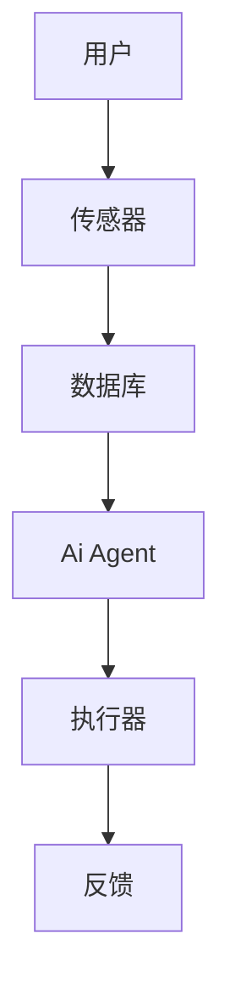
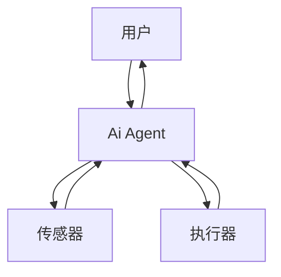

                 


# 能源行业AI Agent解决方案

## 关键词
能源行业，AI Agent，智能电网，碳中和，能源管理，数字化转型

## 摘要
能源行业正在经历一场深刻的数字化转型，人工智能（AI）技术的应用正在改变传统的能源管理模式。AI Agent（智能代理）作为一种能够感知环境、自主决策并执行任务的智能系统，正在能源行业展现出巨大的潜力。本文将从AI Agent的核心概念、数学模型、系统架构设计以及实际应用等方面，详细探讨AI Agent在能源行业的解决方案，旨在为能源行业的数字化转型提供理论支持和实践指导。

---

## 第1章: 能源行业与AI Agent的背景与现状

### 1.1 能源行业的数字化转型
#### 1.1.1 能源行业的传统模式与痛点
传统能源行业依赖于人工管理，存在效率低、资源浪费、数据孤岛等问题。例如，电力系统的调度和分配需要大量的人工干预，难以实现实时优化。

#### 1.1.2 数字化转型的必要性
随着能源结构的变化（如可再生能源的普及）和用户需求的多样化，数字化转型成为能源行业提高效率、降低成本和增强灵活性的必然选择。

#### 1.1.3 AI技术在能源行业的应用前景
AI技术可以帮助能源行业实现智能监测、预测分析、优化决策等功能，尤其是在智能电网、能源管理和碳中和等领域具有广泛的应用潜力。

### 1.2 AI Agent的基本概念与特点
#### 1.2.1 AI Agent的定义与分类
AI Agent是一种能够感知环境、自主决策并执行任务的智能系统，根据智能水平可分为简单反射型、基于模型的、基于效用的和学习型四种类型。

#### 1.2.2 AI Agent的核心能力
- **感知能力**：通过传感器或数据源获取环境信息。
- **决策能力**：基于感知信息进行分析和决策。
- **执行能力**：根据决策结果执行具体操作。

#### 1.2.3 AI Agent与传统自动化系统的区别
AI Agent具有自主性和智能性，能够根据环境动态调整行为，而传统自动化系统通常是基于固定的规则运行。

### 1.3 能源行业AI Agent的应用场景
#### 1.3.1 智能电网
AI Agent可以用于电力系统的实时监测、负荷预测和优化调度。

#### 1.3.2 智能能源管理
通过AI Agent实现能源的智能化管理，例如家庭能源管理、企业能源消耗优化等。

#### 1.3.3 碳中和与可持续发展
AI Agent可以帮助能源行业实现碳排放的实时监测和优化，推动绿色能源的使用。

---

## 第2章: AI Agent的核心概念与联系

### 2.1 AI Agent的核心原理
#### 2.1.1 感知层
AI Agent通过传感器、数据库等获取环境信息，例如温度、压力、电量等。

#### 2.1.2 决策层
基于感知信息，AI Agent利用算法（如Q-learning）进行决策。例如，在智能电网中，AI Agent可以根据负荷预测结果决定是否启动备用电源。

#### 2.1.3 执行层
根据决策结果，AI Agent执行具体操作，例如调节阀门、开关设备等。

### 2.2 AI Agent的实体关系图


### 2.3 AI Agent的算法原理
#### 2.3.1 感知层的数学模型
- **特征提取**：通过主成分分析（PCA）提取关键特征。
- **概率模型**：使用贝叶斯定理进行分类。

#### 2.3.2 决策层的算法
- **Q-learning算法**：
  $$ Q(s, a) = r + \gamma \max Q(s', a') $$
  其中，$s$是当前状态，$a$是动作，$r$是奖励，$\gamma$是折扣因子。

#### 2.3.3 执行层的优化算法
- **强化学习**：
  $$ R = r_1 + r_2 + ... + r_n $$
  其中，$R$是总奖励，$r_i$是每一步的奖励。

---

## 第3章: AI Agent的数学模型与算法

### 3.1 感知层的数学模型
#### 3.1.1 数据预处理
- **数据清洗**：去除异常值和缺失值。
- **特征提取**：使用主成分分析（PCA）提取关键特征。

#### 3.1.2 概率模型
- **贝叶斯定理**：
  $$ P(A|B) = \frac{P(B|A)P(A)}{P(B)} $$
  例如，预测某设备发生故障的概率。

### 3.2 决策层的算法原理
#### 3.2.1 Q-learning算法
- **状态转移**：
  $$ s' = f(s, a) $$
  其中，$s$是当前状态，$a$是动作，$s'$是下一个状态。
- **奖励函数**：
  $$ r = g(s, a, s') $$
  根据状态转移结果计算奖励。

### 3.3 执行层的优化算法
#### 3.3.1 强化学习
- **策略函数**：
  $$ \pi(a|s) = P(a|s) $$
  例如，在智能电网中，AI Agent根据当前状态选择是否启动备用电源。

---

## 第4章: 能源行业AI Agent的系统架构设计

### 4.1 系统功能设计
#### 4.1.1 数据采集与处理模块
- 通过传感器采集环境数据，如温度、压力、电量等。
- 对数据进行预处理，提取关键特征。

#### 4.1.2 智能决策模块
- 使用Q-learning算法进行决策，输出动作。

#### 4.1.3 系统执行模块
- 根据决策结果，执行具体操作，如调节阀门、开关设备等。

#### 4.1.4 反馈优化模块
- 根据执行结果反馈优化决策模型。

### 4.2 系统架构图


### 4.3 系统接口设计
- **输入接口**：传感器数据、用户请求。
- **输出接口**：执行器指令、反馈信息。

### 4.4 系统交互流程图


---

## 第5章: 项目实战

### 5.1 智能电网优化项目
#### 5.1.1 项目背景
- 目标：优化电力系统的负荷预测和调度。

#### 5.1.2 环境配置
- **Python 3.8+**
- **TensorFlow 2.0+**
- **Scikit-learn 0.24+**

#### 5.1.3 核心代码实现
```python
import numpy as np
from sklearn.decomposition import PCA
import tensorflow as tf

# 数据预处理
def preprocess(data):
    # 去除缺失值
    data = data.dropna()
    # 标准化
    data = (data - data.mean()) / data.std()
    return data

# 特征提取
def extract_features(data):
    pca = PCA(n_components=5)
    features = pca.fit_transform(data)
    return features

# Q-learning算法
class QLearning:
    def __init__(self, state_space, action_space):
        self.state_space = state_space
        self.action_space = action_space
        self.Q = np.zeros((state_space, action_space))
    
    def choose_action(self, state, epsilon=0.1):
        if np.random.random() < epsilon:
            return np.random.randint(self.action_space)
        else:
            return np.argmax(self.Q[state, :])
    
    def update_Q(self, state, action, reward, next_state, alpha=0.1):
        self.Q[state, action] += alpha * (reward + np.max(self.Q[next_state, :]) - self.Q[state, action])

# 强化学习模型
class ReinforcementLearning:
    def __init__(self, state_dim, action_dim):
        self.model = self.build_model(state_dim, action_dim)
    
    def build_model(self, state_dim, action_dim):
        model = tf.keras.Sequential([
            tf.keras.layers.Dense(32, activation='relu', input_dim=state_dim),
            tf.keras.layers.Dense(action_dim, activation='linear')
        ])
        model.compile(optimizer='adam', loss='mse')
        return model
    
    def train(self, states, actions, rewards):
        y = rewards
        self.model.fit(states, y, epochs=100, batch_size=32)
```

#### 5.1.4 实际案例分析
- **案例背景**：某地区电力系统负荷预测与优化。
- **数据来源**：历史用电数据、天气数据。
- **算法实现**：
  - 使用PCA提取特征。
  - 使用Q-learning算法进行负荷预测和优化。

#### 5.1.5 结果展示
- 预测结果与实际负荷对比图。
- 节能优化效果分析。

---

## 第6章: 总结与展望

### 6.1 总结
本文详细探讨了AI Agent在能源行业的解决方案，从理论到实践，展示了AI Agent在智能电网、能源管理和碳中和中的应用潜力。通过具体的项目实战，验证了AI Agent在能源行业的实际效果。

### 6.2 展望
未来，随着AI技术的不断发展，AI Agent在能源行业的应用将更加广泛。例如，结合多模态模型和边缘计算，AI Agent可以在能源行业的各个领域实现更高效的管理和优化。

---

## 最佳实践 Tips

1. **数据质量**：确保数据的准确性和完整性，数据预处理是关键。
2. **模型可解释性**：在实际应用中，模型的可解释性非常重要，尤其是在能源行业的安全性和可靠性要求较高的场景。
3. **持续优化**：AI Agent需要根据环境的变化不断优化，建议定期更新模型和算法。

---

通过本文的详细讲解，读者可以深入了解AI Agent在能源行业的应用，掌握AI Agent的核心概念和实现方法，为能源行业的数字化转型提供有力的技术支持。

