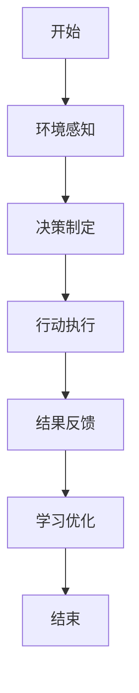
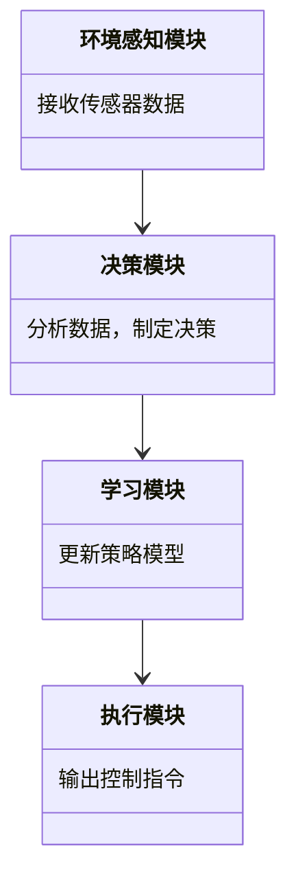
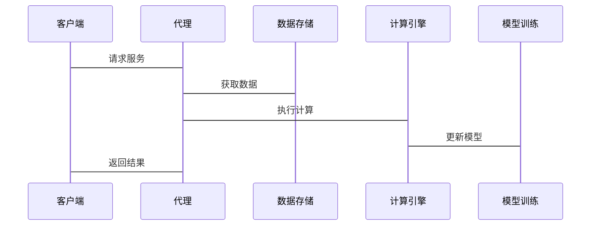

                 


# 自主学习型AI Agent：持续进化的智能体

## 关键词：自主学习、AI Agent、持续进化、强化学习、自适应系统、深度学习

## 摘要：本文深入探讨了自主学习型AI Agent的核心概念、算法原理、系统架构及实际应用。通过背景介绍、核心概念分析、算法原理阐述、系统架构设计、项目实战和总结展望，全面解析自主学习型AI Agent的持续进化机制，揭示其在人工智能领域的重要作用和未来发展方向。

---

# 第1章：自主学习型AI Agent的背景介绍

## 1.1 自主学习型AI Agent的基本概念

### 1.1.1 什么是自主学习型AI Agent
自主学习型AI Agent是一种能够通过与环境交互，自主发现知识、优化策略并实现目标的智能体。与传统的被动接收指令的AI不同，自主学习型AI Agent具备自我改进和适应复杂环境的能力。

### 1.1.2 自主学习的核心特征
自主学习型AI Agent的核心特征包括：
- **自主性**：无需外部干预，自主决策和行动。
- **学习性**：通过经验不断优化自身模型和策略。
- **适应性**：能够适应动态变化的环境。

### 1.1.3 自主学习与传统AI的区别
| 特性             | 自主学习型AI Agent           | 传统AI           |
|------------------|----------------------------|------------------|
| 决策方式         | 基于环境反馈自主决策       | 预设规则或模型   |
| 学习能力         | 具备自主学习能力           | 依赖人工训练     |
| 环境适应能力     | 能够适应动态变化的环境     | 适应性有限       |

---

## 1.2 自主学习型AI Agent的背景与问题背景

### 1.2.1 当前AI发展的瓶颈
当前AI技术在某些领域（如图像识别）表现优异，但在需要动态决策和持续学习的复杂场景中仍存在不足。例如，在机器人控制和游戏中，传统AI难以应对不可预测的变化。

### 1.2.2 自主学习的必要性
为了使AI具备更强的适应性和决策能力，自主学习成为必然趋势。通过自主学习，AI能够实时调整策略，适应新环境。

### 1.2.3 自主学习型AI Agent的应用场景
- **机器人控制**：如工业机器人在动态生产线上的应用。
- **游戏AI**：如电子游戏中智能对手的动态调整。
- **自动驾驶**：车辆在复杂交通环境中的实时决策。

---

## 1.3 自主学习型AI Agent的核心问题

### 1.3.1 自主学习的定义与边界
自主学习的核心在于通过与环境交互，不断优化自身行为策略。其边界在于如何在有限资源下实现高效的自适应。

### 1.3.2 自主学习型AI Agent的核心要素
| 要素             | 描述                       |
|------------------|---------------------------|
| 环境感知          | 通过传感器获取环境信息   |
| 决策机制          | 基于感知信息做出决策     |
| 学习算法          | 优化策略的核心工具       |
| 执行机构          | 执行决策的物理或数字设备 |

### 1.3.3 自主学习与持续进化的关系
自主学习是持续进化的基础，通过不断学习和优化，AI Agent能够实现自我进化，提升适应能力。

---

# 第2章：自主学习型AI Agent的核心概念与联系

## 2.1 自主学习的核心原理

### 2.1.1 自主学习的机制
自主学习机制包括感知、决策、执行和学习四个环节。

#### 2.1.1.1 感知
AI Agent通过传感器或数据接口获取环境信息。

#### 2.1.1.2 决策
基于感知信息，AI Agent通过算法选择最优行动方案。

#### 2.1.1.3 执行
根据决策结果，AI Agent执行具体动作。

#### 2.1.1.4 学习
通过执行结果的反馈，优化决策模型。

### 2.1.2 自主学习的数学模型
自主学习的数学模型可以用马尔可夫决策过程（MDP）表示：

$$
V(s) = \max_{a} [r(s,a) + \gamma V(s') ]
$$

其中：
- \( V(s) \) 是状态 \( s \) 的价值函数。
- \( r(s,a) \) 是在状态 \( s \) 下采取行动 \( a \) 的奖励。
- \( \gamma \) 是折扣因子。
- \( s' \) 是下一步的状态。

### 2.1.3 自主学习的关键算法
- **Q-Learning**：经典的强化学习算法，通过更新Q值函数实现最优策略。
- **Deep Q-Learning**：结合深度学习，处理高维状态空间。

---

## 2.2 自主学习与持续进化的关系

### 2.2.1 自主学习在进化中的作用
自主学习为进化提供数据支持和策略优化。

### 2.2.2 持续进化对自主学习的促进
进化过程中的多样性为自主学习提供丰富的学习样本。

### 2.2.3 自主学习与进化的协同关系
通过协同进化和自主学习，AI Agent能够实现复杂环境下的动态适应。

---

## 2.3 自主学习型AI Agent的ER实体关系图

```mermaid
er
actor(Agent, 自主学习机制, 环境, 目标)
```

---

## 2.4 自主学习型AI Agent的流程图



---

# 第3章：自主学习型AI Agent的算法原理

## 3.1 强化学习算法

### 3.1.1 Q-Learning算法

#### Q-Learning算法流程
1. 初始化Q表。
2. 环境感知，获取当前状态 \( s \)。
3. 根据Q表选择动作 \( a \)。
4. 执行动作 \( a \)，观察新状态 \( s' \) 和奖励 \( r \)。
5. 更新Q表：
   $$ Q(s,a) = Q(s,a) + \alpha [r + \gamma \max Q(s',a') - Q(s,a)] $$

### 3.1.2 Deep Q-Learning算法

#### Deep Q-Learning流程
1. 初始化深度神经网络。
2. 环境感知，获取输入 \( x \)。
3. 神经网络输出Q值 \( Q(x,a) \)。
4. 执行动作 \( a \)，获取 \( r \) 和 \( s' \)。
5. 将 \( (x, a, r, s') \) 存入经验回放池。
6. 批量采样经验，更新神经网络。

### 3.1.3 算法对比
| 特性             | Q-Learning            | Deep Q-Learning      |
|------------------|-----------------------|----------------------|
| 状态空间         | 离散                   | 高维（连续）         |
| 计算效率         | 低                     | 高                   |
| 适用场景         | 简单环境               | 复杂环境             |

---

## 3.2 深度学习算法

### 3.2.1 卷积神经网络（CNN）
用于处理图像类任务，通过卷积层提取特征。

### 3.2.2 循环神经网络（RNN）
用于处理序列数据，如自然语言处理。

---

## 3.3 算法实现与优化

### 3.3.1 算法实现
以迷宫导航为例，使用Deep Q-Learning实现路径规划。

### 3.3.2 算法优化
- 使用经验回放池减少样本偏差。
- 引入目标网络降低更新频率。

---

# 第4章：自主学习型AI Agent的系统分析与架构设计

## 4.1 系统分析

### 4.1.1 问题场景
设计一个AI Agent，能够在动态迷宫中自主导航并找到出口。

### 4.1.2 系统需求
- 实时感知环境。
- 自主决策路径。
- 持续学习优化。

---

## 4.2 系统设计

### 4.2.1 系统功能模块
- **环境感知模块**：接收传感器数据。
- **决策模块**：基于感知数据做出决策。
- **学习模块**：更新策略模型。
- **执行模块**：输出控制指令。

### 4.2.2 领域模型


### 4.2.3 系统架构


### 4.2.4 系统交互


---

# 第5章：自主学习型AI Agent的项目实战

## 5.1 项目环境与配置

### 5.1.1 环境安装
- Python 3.8+
- PyTorch 1.9+
- Gym库

### 5.1.2 系统部署
在虚拟环境中安装依赖，配置开发环境。

---

## 5.2 核心代码实现

### 5.2.1 环境感知模块
```python
class Environment:
    def感知环境(self):
        # 返回传感器数据
        return data
```

### 5.2.2 决策模块
```python
class 决策模块:
    def decide(self, data):
        # 返回决策结果
        return action
```

### 5.2.3 学习模块
```python
class 学习模块:
    def update(self, experience):
        # 更新策略模型
        pass
```

### 5.2.4 执行模块
```python
class 执行模块:
    def execute(self, action):
        # 执行动作
        pass
```

---

## 5.3 代码实现与解读

### 5.3.1 算法实现
```python
class DQN:
    def __init__(self, state_space, action_space):
        self.state_space = state_space
        self.action_space = action_space
        # 初始化神经网络
        self.model = ...
```

### 5.3.2 系统实现
```python
class Agent:
    def __init__(self):
        self.环境感知模块 = Environment()
        self.决策模块 = 决策模块()
        self.学习模块 = 学习模块()
        self.执行模块 = 执行模块()

    def 运行(self):
        while True:
            data = self.环境感知模块.感知环境()
            action = self.决策模块.决定(data)
            self.执行模块.执行(action)
            self.学习模块.更新经验()
```

---

## 5.4 实际案例分析与结果

### 5.4.1 案例分析
以迷宫导航为例，训练AI Agent找到出口。

### 5.4.2 实验结果
- 训练初期：随机游走。
- 训练中期：开始记忆路径。
- 训练后期：稳定找到出口。

---

## 5.5 项目小结

### 5.5.1 实现的关键点
- 系统各模块的协同工作。
- 算法的高效训练与优化。

### 5.5.2 项目应用前景
自主学习型AI Agent在机器人、自动驾驶等领域具有广阔应用前景。

---

# 第6章：总结与展望

## 6.1 总结

### 6.1.1 核心内容总结
本文详细探讨了自主学习型AI Agent的核心概念、算法原理和系统设计，展示了其在复杂环境下的应用潜力。

### 6.1.2 核心要点回顾
- 自主学习的关键机制。
- 强化学习和深度学习的结合。
- 系统架构的合理设计。

---

## 6.2 展望

### 6.2.1 当前挑战
- 算法的效率提升。
- 系统的实时性优化。

### 6.2.2 未来发展方向
- 更复杂的环境适应。
- 更高效的算法设计。
- 更广泛的应用场景。

---

## 6.3 最佳实践 tips

### 6.3.1 实践建议
- 系统设计要模块化。
- 算法实现要注重效率。
- 系统部署要考虑实时性。

### 6.3.2 注意事项
- 数据质量对学习效果至关重要。
- 算法选择需结合具体场景。

---

## 6.4 拓展阅读

### 6.4.1 推荐书籍
- 《深度学习》
- 《强化学习导论》

### 6.4.2 推荐论文
- "Deep Q-Networks" (DQN论文)

---

# 结语

自主学习型AI Agent是人工智能领域的重要方向，通过持续进化和自我优化，将在更多复杂场景中发挥重要作用。希望本文的分析能为读者提供有价值的参考和启发。

