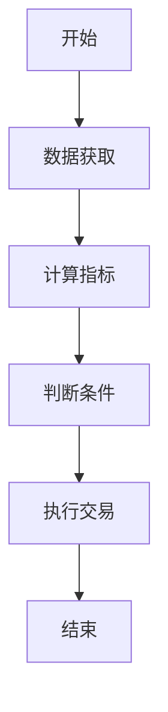
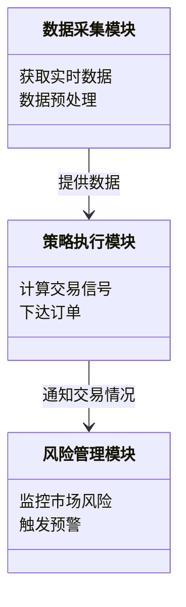

                 


# 自动化交易系统的集成

## 关键词：自动化交易系统、集成、算法、系统架构、风险管理、数学模型

## 摘要：  
本文详细探讨了自动化交易系统的集成过程，涵盖其背景、核心概念、算法原理、系统架构设计、项目实战及总结。通过分析交易策略、风险管理、数据处理等关键模块，结合实际案例和数学模型，为读者提供从理论到实践的全面指导。

---

# 第一部分: 自动化交易系统的背景与核心概念

## 第1章: 自动化交易系统概述

### 1.1 自动化交易系统的定义与背景

#### 1.1.1 传统交易方式的局限性  
传统交易方式依赖人工决策，效率低、误差大，难以应对高频交易和复杂市场环境。  

#### 1.1.2 自动化交易的起源与发展  
自动化交易起源于20世纪70年代，随着计算机技术的发展，逐渐成为现代金融的重要组成部分。  

#### 1.1.3 自动化交易在现代金融中的地位  
自动化交易通过算法和系统实现高频交易，优化决策，降低人为干扰，提升市场流动性。  

---

### 1.2 自动化交易系统的核心概念

#### 1.2.1 问题背景与问题描述  
- 问题背景：金融市场数据复杂，交易机会瞬息万变，人工决策难以高效应对。  
- 问题描述：如何通过自动化系统实现高效、精准的交易决策。  

#### 1.2.2 核心问题的解决思路  
- 数据实时处理：从数据源获取实时市场数据，进行分析和预测。  
- 交易策略执行：基于算法生成交易信号，自动下单。  
- 风险管理：实时监控交易风险，确保系统稳定运行。  

#### 1.2.3 系统边界与外延  
- 数据源：市场数据、历史数据、新闻数据等。  
- 交易执行：连接交易接口，执行订单。  
- 风险监控：实时监控市场和交易风险。  

#### 1.2.4 核心概念的结构与组成要素  
- 数据处理模块：数据清洗、特征提取。  
- 交易策略模块：算法设计、信号生成。  
- 风险管理模块：风险评估、止损设置。  

---

## 第2章: 自动化交易系统的核心概念与联系

### 2.1 核心概念原理

#### 2.1.1 数据源与数据处理  
- 数据源：市场数据（如股票价格、指数等）、新闻数据、社交媒体数据等。  
- 数据处理：清洗、标准化、特征提取。  

#### 2.1.2 交易策略与执行  
- 策略设计：基于技术指标、机器学习模型等。  
- 策略执行：自动下单，实时跟踪。  

#### 2.1.3 风险管理与监控  
- 风险评估：计算VaR、最大回撤等风险指标。  
- 监控：实时跟踪市场和交易情况，触发预警。  

---

### 2.2 核心概念属性特征对比表格  

| 概念         | 属性特征         |  
|--------------|------------------|  
| 数据源       | 实时性、多样性    |  
| 交易策略     | 灵活性、高效性    |  
| 风险管理     | 预测性、实时性    |  

---

### 2.3 ER实体关系图  

```mermaid  
er  
  actor(用户)  
  system(自动化交易系统)  
  database(数据源)  
  strategy(交易策略)  
  order(订单)  
  risk_management(风险管理模块)  
  actor --|> system: 使用系统  
  system --|> database: 读取数据  
  system --|> strategy: 执行策略  
  system --|> order: 下达订单  
  system --|> risk_management: 管理风险  
```

---

# 第三部分: 自动化交易系统的算法原理  

## 第3章: 交易策略算法  

### 3.1 常见交易策略算法  

#### 3.1.1 移动平均线策略  

- 原理：计算短期和长期移动平均线，当短期线突破长期线时，触发买入信号；反之，触发卖出信号。  
- 优缺点：简单易懂，但可能错过最佳交易时机。  

#### 3.1.2 布林带策略  

- 原理：计算价格的波动范围，当价格突破布林带上轨时，触发卖出信号；价格突破布林带下轨时，触发买入信号。  

#### 3.1.3 马柯维茨均值-方差模型  

- 原理：通过优化资产配置，降低风险，提高收益。  

---

### 3.2 算法流程图  



---

### 3.3 算法实现代码  

```python  
def moving_average_strategy(price_data, short_window, long_window):  
    # 计算短期和长期移动平均线  
    short_ma = price_data.rolling(short_window).mean()  
    long_ma = price_data.rolling(long_window).mean()  
    # 判断交易信号  
    signal = 0  
    if short_ma[-1] > long_ma[-1]:  
        signal = 1  # 买入信号  
    elif short_ma[-1] < long_ma[-1]:  
        signal = -1  # 卖出信号  
    return signal  
```

---

## 第4章: 数学模型和公式  

### 4.1 时间序列分析  

#### 4.1.1 自回归模型（AR模型）  

- 公式：  
  $$ y_t = \alpha y_{t-1} + \beta y_{t-2} + \epsilon_t $$  

---

#### 4.1.2 平稳性检验  

- 使用ADF检验判断数据是否平稳。  

---

### 4.2 回归模型  

#### 4.2.1 线性回归  

- 公式：  
  $$ y = \beta x + \epsilon $$  

#### 4.2.2 逻辑回归  

- 公式：  
  $$ P(y=1|x) = \frac{e^{\beta x}}{1 + e^{\beta x}} $$  

---

## 第5章: 系统分析与架构设计  

### 5.1 问题场景介绍  

#### 5.1.1 典型交易场景  

- 高频交易：快速响应市场变化。  
- 跨市场交易：同时监控多个市场的数据和机会。  

---

### 5.2 系统功能设计  

#### 5.2.1 功能模块  

- 数据采集模块：实时获取市场数据。  
- 策略执行模块：根据算法生成交易信号。  
- 风险管理模块：监控交易风险。  

---

#### 5.2.2 领域模型  



---

### 5.3 系统架构设计  

#### 5.3.1 架构图  


---

## 第6章: 项目实战  

### 6.1 环境安装  

#### 6.1.1 Python环境  

- 安装Python、Jupyter Notebook、Pandas、NumPy、Matplotlib。  

#### 6.1.2 第三方库  

- 安装Yahoo Finance API、Pandas DataReader、Matplotlib。  

---

### 6.2 系统核心实现源代码  

```python  
# 数据采集模块  
import pandas_datareader as pdr  
from datetime import datetime  

def get_data(ticker, start, end):  
    data = pdr.get_data_yahoo(ticker, start, end)  
    return data  

# 交易策略模块  
def strategy(data):  
    # 计算移动平均线  
    short_window = 50  
    long_window = 100  
    short_ma = data['Close'].rolling(short_window).mean()  
    long_ma = data['Close'].rolling(long_window).mean()  
    signal = 0  
    if short_ma[-1] > long_ma[-1]:  
        signal = 1  
    elif short_ma[-1] < long_ma[-1]:  
        signal = -1  
    return signal  

# 系统架构设计  
class TradingSystem:  
    def __init__(self, ticker, start, end):  
        self.ticker = ticker  
        self.start = start  
        self.end = end  
        self.data = self.get_data()  
        self.signal = self.generate_signal()  

    def get_data(self):  
        return get_data(self.ticker, self.start, self.end)  

    def generate_signal(self):  
        return strategy(self.data)  

    def execute_order(self):  
        # 简化版：假设信号为1时买入，-1时卖出  
        print(f"交易信号：{self.signal}")  
```

---

### 6.3 案例分析  

#### 6.3.1 数据分析与可视化  

```python  
import matplotlib.pyplot as plt  

data = get_data('AAPL', '2020-01-01', '2023-01-01')  
plt.figure(figsize=(12, 6))  
plt.plot(data['Close'], label='AAPL价格')  
plt.xlabel('日期')  
plt.ylabel('价格')  
plt.title('AAPL股价走势')  
plt.legend()  
plt.show()  
```

---

## 第七部分: 总结  

### 7.1 最佳实践  

- 定期回测策略，优化参数。  
- 设置合理的风险管理机制，避免过度杠杆。  
- 使用可靠的第三方库和API，确保数据来源的准确性。  

---

### 7.2 小结  

自动化交易系统通过算法和系统实现高效、精准的交易决策，结合数据处理、交易策略和风险管理，为现代金融提供了强大的工具支持。  

---

### 7.3 注意事项  

- 系统运行依赖网络和API接口，需确保稳定性。  
- 策略需定期更新，以适应市场变化。  

---

### 7.4 拓展阅读  

- 《算法交易：复杂策略与其实现》  
- 《机器学习在金融中的应用》  
- 《量化投资：算法与实践》  

--- 

**全文完。**

