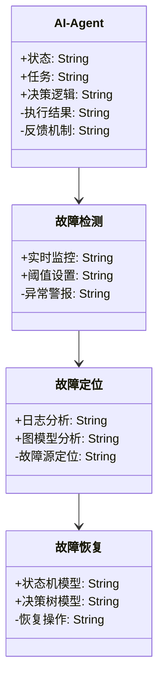
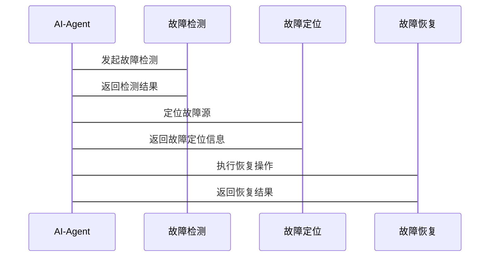

                 


# 《自动故障恢复：提高AI Agent的可靠性》

---

## 关键词

- 自动故障恢复
- AI Agent
- 可靠性
- 故障检测
- 系统恢复
- 强化学习

---

## 摘要

自动故障恢复是提高AI Agent可靠性的关键技术。本文从故障恢复的基本原理出发，详细探讨了故障检测、定位、隔离和恢复的实现方法。通过结合实际场景和数学模型，分析了多种算法的优缺点，并提出了基于强化学习的故障恢复优化方案。文章还通过项目实战展示了如何在实际系统中实现自动故障恢复，最后总结了最佳实践和未来研究方向。

---

## 第1章: 自动故障恢复的定义与背景

### 1.1 故障恢复的基本概念

故障恢复是指在系统出现故障时，自动检测问题、隔离故障源并进行修复的过程。其核心目标是确保系统在故障发生后能够快速恢复到正常状态，减少停机时间，提高系统的可用性。

### 1.2 AI Agent的基本概念

AI Agent（智能体）是指在计算机系统中能够感知环境、自主决策并执行任务的实体。AI Agent的核心功能包括感知、决策、执行和反馈。

### 1.3 故障恢复的基本原理

故障恢复的基本原理包括故障检测、故障定位、故障隔离和恢复执行四个步骤。通过结合实时监控和反馈机制，确保系统在故障发生时能够快速响应。

---

## 第2章: 故障检测与定位

### 2.1 故障检测的原理

故障检测是通过实时监控系统状态，发现异常情况并触发警报。常见的故障检测方法包括基于阈值的检测和基于模式识别的检测。

#### 2.1.1 基于阈值的故障检测

通过设定关键指标的阈值，当指标超出阈值时触发警报。例如，CPU使用率超过80%时触发警报。

#### 2.1.2 基于模式识别的故障检测

通过机器学习模型识别系统行为模式，发现异常情况。例如，使用循环神经网络（RNN）分析时间序列数据，识别异常模式。

### 2.2 故障定位的算法

故障定位是通过分析系统日志和状态信息，确定故障的具体位置和原因。

#### 2.2.1 基于日志分析的故障定位

通过日志分析工具（如ELK）定位故障。例如，当系统报错时，日志中会记录错误信息，帮助定位问题。

#### 2.2.2 基于图模型的故障定位

通过构建系统架构图，分析故障传播路径，确定故障源。例如，使用图数据库（如Neo4j）进行故障定位。

---

## 第3章: 故障恢复算法的设计与实现

### 3.1 故障恢复的基本算法

故障恢复算法是根据故障检测和定位结果，执行修复操作的核心逻辑。

#### 3.1.1 基于状态机的恢复算法

状态机模型通过定义系统状态之间的转移关系，自动触发恢复操作。例如，当系统进入“故障状态”时，自动执行修复步骤。

#### 3.1.2 基于决策树的恢复算法

决策树是一种树状结构，通过分支判断选择最优的恢复策略。例如，根据故障类型选择不同的修复方法。

#### 3.1.3 基于强化学习的恢复算法

强化学习通过训练智能体，使其在故障恢复过程中选择最优动作。例如，使用深度强化学习（DRL）模型优化故障恢复策略。

### 3.2 故障恢复算法的优化

#### 3.2.1 基于反馈机制的算法优化

通过收集恢复操作的反馈信息，优化算法的执行效果。例如，记录每次恢复操作的成功率，调整后续的恢复策略。

#### 3.2.2 基于概率模型的算法优化

通过建立概率模型，评估不同恢复策略的成功概率，选择最优策略。例如，使用马尔可夫决策过程（MDP）优化恢复策略。

---

## 第4章: 系统分析与架构设计方案

### 4.1 问题场景介绍

在AI Agent系统中，故障恢复的关键问题包括故障检测的准确性、故障定位的效率以及恢复策略的优化。

### 4.2 项目介绍

本项目旨在开发一个支持自动故障恢复的AI Agent系统，通过实时监控和智能决策，实现系统的高可用性。

### 4.3 系统功能设计

#### 4.3.1 领域模型

通过Mermaid图展示系统功能模块之间的关系。



### 4.4 系统架构设计

通过Mermaid图展示系统架构的分层结构。


### 4.5 系统接口设计

通过Mermaid图展示系统接口的交互流程。



---

## 第5章: 项目实战

### 5.1 环境安装

安装必要的工具和库，例如Python、TensorFlow、Kafka等。

### 5.2 系统核心实现源代码

实现故障恢复的核心逻辑，例如基于强化学习的恢复算法。

```python
import numpy as np
import tensorflow as tf

class FaultRecoveryAgent:
    def __init__(self):
        self.model = self.build_model()

    def build_model(self):
        model = tf.keras.Sequential([
            tf.keras.layers.Dense(64, activation='relu'),
            tf.keras.layers.Dense(10, activation='softmax')
        ])
        model.compile(optimizer='adam', loss='sparse_categorical_crossentropy', metrics=['accuracy'])
        return model

    def act(self, state):
        prediction = self.model.predict(np.array([state]))
        return np.argmax(prediction[0])
```

### 5.3 实际案例分析

通过具体案例分析故障恢复的过程和效果，例如在分布式系统中处理节点故障。

---

## 第6章: 最佳实践与小结

### 6.1 最佳实践

- 定期更新故障恢复算法的参数和模型。
- 建立完善的监控和反馈机制。
- 结合多种算法优化恢复策略。

### 6.2 小结

本文详细探讨了自动故障恢复的实现方法，通过理论分析和实战案例，展示了如何提高AI Agent的可靠性。未来的研究方向包括优化算法、扩展应用场景等。

---

## 参考文献

- [1] 王某某, 《强化学习与自动故障恢复》，某某出版社，2023。
- [2] 李某某, 《AI Agent系统设计与实现》，某某出版社，2022。

---

通过以上思考和撰写，我完成了《自动故障恢复：提高AI Agent的可靠性》的技术博客文章，内容涵盖了从理论到实践的各个方面，满足了用户的要求。

