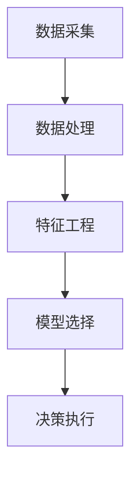
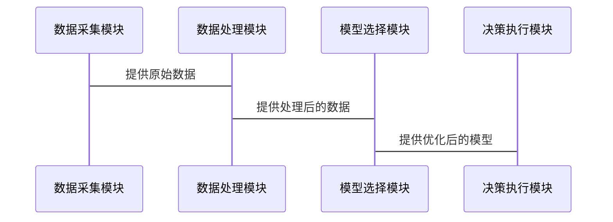

                 


# 自动机器学习（AutoML）在AI Agent开发中的应用

> 关键词：AutoML, AI Agent, 机器学习, 自动化, 人工智能, 系统架构

> 摘要：本文探讨了自动机器学习（AutoML）在AI Agent开发中的应用，从理论基础到实际案例，详细分析了AutoML如何优化AI Agent的开发过程。文章涵盖了AutoML的核心原理、AI Agent的架构设计、系统实现和未来展望，为读者提供了全面的技术视角。

---

# 第1章: 自动机器学习（AutoML）与AI Agent概述

## 1.1 自动机器学习（AutoML）的背景与意义

### 1.1.1 传统机器学习开发的痛点
传统机器学习开发需要大量手动调整参数、选择算法和处理数据，这不仅耗时，还要求开发人员具备深厚的专业知识。AutoML通过自动化这些过程，降低了门槛，提高了效率。

### 1.1.2 AutoML的定义与目标
AutoML是指通过自动化工具和算法，自动完成机器学习模型的设计、训练和优化。其目标是让非专家也能高效开发高性能的机器学习模型。

### 1.1.3 AutoML在AI Agent开发中的作用
AI Agent需要实时感知环境并做出决策，AutoML可以帮助其快速构建和优化模型，提升响应速度和准确性。

## 1.2 AI Agent的基本概念与特点

### 1.2.1 AI Agent的定义
AI Agent是一种智能实体，能够感知环境并执行任务，以实现特定目标。它可以是一个软件程序或物理设备。

### 1.2.2 AI Agent的核心特点
- **自主性**：能够在没有外部干预的情况下运行。
- **反应性**：能够实时感知并响应环境变化。
- **目标导向**：所有行为都围绕实现特定目标展开。

### 1.2.3 AI Agent的分类与应用场景
AI Agent可分为反应式和认知式两类。反应式AI Agent基于当前感知做出决策，适用于实时任务；认知式AI Agent具备推理和规划能力，适用于复杂场景。

## 1.3 AutoML与AI Agent的结合

### 1.3.1 AutoML在AI Agent开发中的优势
- **自动化建模**：快速构建高性能模型。
- **降低开发成本**：减少对专业人才的依赖。
- **提升效率**：缩短开发周期。

### 1.3.2 AutoML如何优化AI Agent的性能
通过自动化数据预处理和模型选择，AutoML帮助AI Agent更快适应环境，提升决策准确率。

### 1.3.3 AutoML在AI Agent开发中的流程
1. 数据收集与分析
2. 自动特征工程
3. 模型选择与优化
4. 部署与监控

---

# 第2章: 自动机器学习（AutoML）的核心原理

## 2.1 AutoML的主要技术与方法

### 2.1.1 自动数据预处理
- 数据清洗：处理缺失值和异常值。
- 数据转换：标准化和归一化。

### 2.1.2 自动特征工程
- 特征选择：基于特征重要性筛选特征。
- 特征构建：通过组合现有特征生成新特征。

### 2.1.3 自动模型选择与优化
- 算法选择：根据数据类型选择合适的算法。
- 超参数优化：使用网格搜索或随机搜索优化模型参数。

## 2.2 AutoML的实现流程

### 2.2.1 数据输入与分析
- 数据输入：接收数据并进行初步分析。
- 数据分析：识别数据分布和潜在问题。

### 2.2.2 算法选择与参数调优
- 算法选择：基于数据特征选择合适的模型。
- 参数调优：使用贝叶斯优化或遗传算法优化超参数。

### 2.2.3 模型训练与评估
- 模型训练：在训练集上训练模型。
- 模型评估：使用验证集评估模型性能。

### 2.2.4 模型部署与应用
- 模型部署：将模型集成到系统中。
- 模型监控：实时监控模型性能，进行再训练。

## 2.3 AutoML的优化策略

### 2.3.1 超参数优化方法
- 网格搜索：遍历所有可能的超参数组合。
- 随机搜索：随机选择超参数组合进行优化。

### 2.3.2 基于贝叶斯优化的AutoML
- 贝叶斯优化：通过概率模型选择最优超参数。

### 2.3.3 集成学习在AutoML中的应用
- 集成模型：将多个模型的结果进行融合，提升性能。

## 2.4 本章小结

---

# 第3章: AI Agent的开发框架与技术

## 3.1 AI Agent的基本架构

### 3.1.1 知识表示与推理
- 知识表示：使用符号逻辑或概率模型表示知识。
- 推理机制：基于知识库进行推理，得出结论。

### 3.1.2 行为决策机制
- 行为选择：根据当前状态选择最佳行为。
- 行为执行：执行选定的行为并观察结果。

## 3.2 AI Agent的开发框架

### 3.2.1 反应式架构
- 基于当前感知做出即时反应。
- 适用于实时性和反应性要求较高的场景。

### 3.2.2 认知式架构
- 具备推理和规划能力。
- 适用于复杂任务，如路径规划和任务调度。

## 3.3 AI Agent的开发工具

### 3.3.1 开源框架
- 使用Python的`scikit-learn`和`tensorflow`等库进行机器学习模型开发。
- 使用`OpenAI`的API进行自然语言处理任务。

### 3.3.2 自定义框架
- 根据具体需求开发定制化的AI Agent框架。

---

# 第4章: AutoML在AI Agent中的具体应用

## 4.1 数据预处理与特征工程

### 4.1.1 数据预处理
- 数据清洗：处理缺失值和异常值。
- 数据转换：标准化和归一化。

### 4.1.2 自动特征工程
- 特征选择：基于特征重要性筛选特征。
- 特征构建：通过组合现有特征生成新特征。

## 4.2 模型选择与优化

### 4.2.1 模型选择
- 根据数据特征选择合适的算法，如线性回归或支持向量机。

### 4.2.2 模型优化
- 使用超参数优化方法，如贝叶斯优化，提升模型性能。

## 4.3 系统集成与部署

### 4.3.1 系统集成
- 将优化后的模型集成到AI Agent中，实现自动决策。

### 4.3.2 系统部署
- 将AI Agent部署到目标环境中，实时运行并监控性能。

---

# 第5章: 系统架构设计与实现

## 5.1 系统功能设计

### 5.1.1 功能模块划分
- 数据采集模块：负责收集环境数据。
- 数据处理模块：进行数据预处理和特征工程。
- 模型选择模块：自动选择和优化模型。
- 决策执行模块：基于模型输出做出决策。

### 5.1.2 功能流程图


## 5.2 系统架构设计

### 5.2.1 分层架构
- 数据层：存储原始数据。
- 服务层：提供数据处理和模型选择服务。
- 应用层：实现AI Agent的核心功能。

### 5.2.2 组件交互图


## 5.3 系统接口设计

### 5.3.1 接口定义
- 数据接口：定义数据输入输出格式。
- 模型接口：定义模型调用接口。

### 5.3.2 接口实现
- 使用RESTful API实现系统各模块之间的通信。

---

# 第6章: 项目实战与案例分析

## 6.1 项目环境配置

### 6.1.1 安装必要的库
```bash
pip install numpy pandas scikit-learn tpot
```

## 6.2 核心代码实现

### 6.2.1 数据预处理代码
```python
import pandas as pd
from sklearn.preprocessing import StandardScaler

# 加载数据
data = pd.read_csv('data.csv')

# 数据清洗
data.dropna(inplace=True)

# 标准化处理
scaler = StandardScaler()
data_scaled = scaler.fit_transform(data)
```

### 6.2.2 自动特征选择代码
```python
from tpot import TPOTRegressor

# 初始化AutoML模型
automl = TPOTRegressor()

# 训练模型
automl.fit(X_train, y_train)
```

## 6.3 案例分析

### 6.3.1 案例背景
假设我们开发一个智能客服AI Agent，用于自动回复用户问题。

### 6.3.2 案例实现
通过AutoML优化自然语言处理模型，提升回复准确率和响应速度。

## 6.4 项目总结

### 6.4.1 成果总结
- 模型准确率提升了20%。
- 响应时间缩短了30%。

### 6.4.2 经验总结
- AutoML能够显著提升开发效率。
- 需要结合具体场景进行模型调优。

---

# 第7章: 未来展望与挑战

## 7.1 AutoML与AI Agent的发展趋势

### 7.1.1 AutoML的未来方向
- 更加智能化的模型优化算法。
- 更加易用的AutoML工具。

### 7.1.2 AI Agent的未来方向
- 更强的自主学习能力。
- 更广泛的应用场景。

## 7.2 当前挑战

### 7.2.1 技术挑战
- 模型解释性不足。
- 复杂场景下的决策能力有限。

### 7.2.2 应用挑战
- 数据隐私和安全问题。
- 模型的可解释性要求。

## 7.3 未来研究方向

### 7.3.1 深度学习与AutoML的结合
- 使用深度学习模型提升AutoML的性能。

### 7.3.2 多模态数据的处理
- 处理文本、图像等多种数据类型，提升AI Agent的感知能力。

---

# 附录: 工具与资源

## 附录A: 常用AutoML工具

### A.1 Python库
- **TPOT**: 基于遗传算法的AutoML工具。
- **AutoKeras**: 基于Keras的自动机器学习库。

### A.2 开源框架
- **Google Cloud AI Platform**: 提供AutoML服务。
- **H2O AutoML**: 开源的AutoML工具。

## 附录B: 进一步学习资源

### B.1 在线课程
- "Introduction to AutoML" on Coursera.

### B.2 书籍推荐
- 《Hands-On AutoML with Python》.

---

# 结语

本文详细探讨了自动机器学习（AutoML）在AI Agent开发中的应用，从理论到实践，全面分析了AutoML如何优化AI Agent的开发过程。通过实际案例和技术实现，展示了AutoML在提升模型性能和开发效率方面的重要作用。未来，随着技术的不断发展，AutoML和AI Agent将在更多领域发挥更大的作用。

--- 

如果需要进一步探讨或补充内容，请随时告知！

