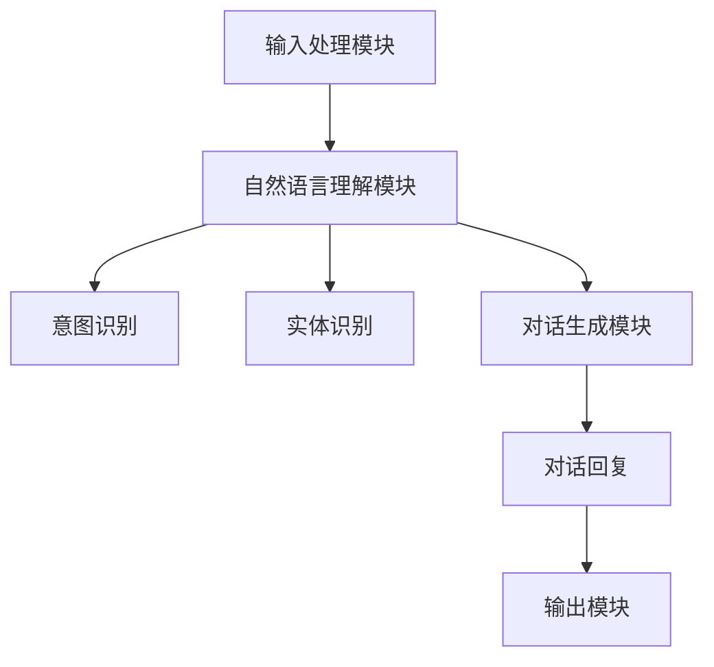
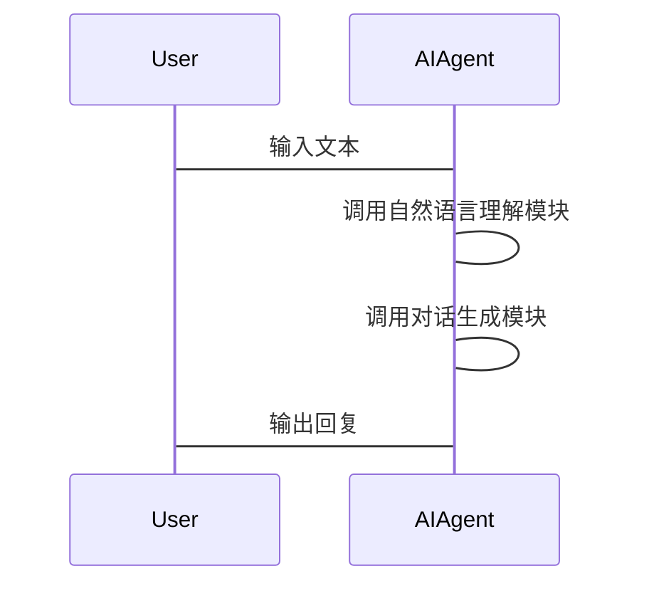

                 


# 自然语言处理在AI Agent中的应用

## 关键词：自然语言处理, AI Agent, 对话系统, 实体识别, 文本生成, 预训练模型

## 摘要：  
自然语言处理（NLP）是实现AI Agent智能化交互的核心技术之一。本文从NLP的核心概念出发，详细探讨了NLP在AI Agent中的应用场景，包括自然语言理解、对话系统、文本生成等关键技术，并结合实际案例分析了这些技术在AI Agent系统中的具体实现。本文还介绍了基于预训练模型的NLP技术如何提升AI Agent的交互能力，并对未来的NLP技术发展及AI Agent的应用前景进行了展望。

---

## 第一部分: 自然语言处理与AI Agent基础

## 第1章: 自然语言处理与AI Agent概述

### 1.1 自然语言处理的核心概念

#### 1.1.1 自然语言处理的定义与目标
自然语言处理（NLP）是计算机科学、人工智能、语言学等领域的交叉学科，旨在研究如何使计算机能够理解和生成人类自然语言文本。NLP的目标是实现人与计算机之间的有效通信，使计算机能够理解人类语言的含义、意图、情感等信息，并能够生成符合语法规则的自然语言文本。

#### 1.1.2 自然语言处理的主要任务
自然语言处理的主要任务可以分为两大类：**自然语言理解（NLU）**和**自然语言生成（NLG）**。
- **自然语言理解（NLU）**：将人类语言的文本转换为计算机可以理解的结构化信息。主要任务包括分词、词性标注、句法分析、语义分析、实体识别、意图识别等。
- **自然语言生成（NLG）**：将结构化信息转换为自然语言文本。主要任务包括文本摘要、机器翻译、对话生成、文本扩展等。

#### 1.1.3 自然语言处理的应用领域
自然语言处理技术已经广泛应用于多个领域，包括：
- **搜索引擎**：如智能问答、语音搜索。
- **智能助手**：如Siri、Alexa等。
- **机器翻译**：如Google Translate。
- **情感分析**：用于社交媒体分析、舆情监控。
- **文本摘要**：用于新闻摘要、会议记录等。

---

### 1.2 AI Agent的基本概念

#### 1.2.1 AI Agent的定义与分类
AI Agent（人工智能代理）是指能够感知环境并采取行动以实现目标的智能实体。根据功能和应用场景，AI Agent可以分为以下几类：
- **简单反射型AI Agent**：基于简单的规则进行反应式操作。
- **基于模型的反射型AI Agent**：利用内部模型进行推理和决策。
- **目标驱动型AI Agent**：具有明确的目标，主动采取行动以实现目标。
- **实用驱动型AI Agent**：基于效用函数进行决策，追求效用的最大化。

#### 1.2.2 AI Agent的核心功能与特点
AI Agent的核心功能包括：
- **感知能力**：能够通过传感器或其他输入方式感知外部环境。
- **决策能力**：能够根据感知信息做出决策或选择行动。
- **学习能力**：能够通过经验或数据优化自身的行为。
- **交互能力**：能够与人类或其他系统进行有效通信和交互。

AI Agent的特点包括：
- **智能性**：能够理解和处理复杂信息。
- **自主性**：能够在没有外部干预的情况下独立运行。
- **反应性**：能够实时感知环境并做出响应。
- **协作性**：能够与其他系统或人类协同工作。

#### 1.2.3 AI Agent与人类交互的特点
AI Agent与人类交互的特点包括：
- **自然性**：交互方式类似于人类之间的对话，具有自然语言理解与生成能力。
- **实时性**：能够实时响应用户的输入，提供即时反馈。
- **个性化**：能够根据用户的偏好和行为模式提供个性化的服务。
- **适应性**：能够根据环境变化和用户需求动态调整交互方式。

---

### 1.3 自然语言处理在AI Agent中的作用

#### 1.3.1 自然语言理解在AI Agent中的应用
自然语言理解（NLU）在AI Agent中的应用主要体现在以下几个方面：
- **意图识别**：通过分析用户的输入文本，识别用户的意图，例如“我想查一下明天的天气”。
- **实体识别**：从文本中提取关键实体信息，例如人名、地名、时间、金额等。
- **情感分析**：分析用户文本中的情感倾向，例如判断用户是正面、负面还是中性情绪。
- **对话上下文理解**：理解对话的历史信息，保持对话的连贯性。

#### 1.3.2 自然语言生成在AI Agent中的应用
自然语言生成（NLG）在AI Agent中的应用主要体现在以下几个方面：
- **对话生成**：根据用户的输入生成自然的回复，例如智能客服的回答。
- **文本摘要**：将长文本压缩成简洁的摘要。
- **机器翻译**：将一种语言翻译成另一种语言。
- **文本扩展**：根据简要信息生成详细的描述。

#### 1.3.3 二者结合的实现方式
自然语言理解（NLU）和自然语言生成（NLG）的结合是实现AI Agent智能化交互的关键。AI Agent通过NLU技术理解用户的输入，然后通过NLG技术生成合适的回复。例如：
1. 用户输入：“我需要找一家附近的餐厅。”
2. AI Agent通过NLU技术理解用户的意图是“寻找附近的餐厅”。
3. AI Agent通过NLG技术生成回复：“附近的中餐厅有‘老王餐馆’，距离您1公里。”

---

### 1.4 本章小结
本章主要介绍了自然语言处理的核心概念、AI Agent的基本概念以及自然语言处理在AI Agent中的作用。通过NLU和NLG技术的结合，AI Agent能够实现与人类的自然交互，从而为用户提供智能化的服务。

---

## 第二部分: 自然语言处理技术与AI Agent的结合

## 第2章: 自然语言处理的核心技术

### 2.1 分词技术

#### 2.1.1 分词的定义与作用
分词是自然语言处理中的第一步，其目的是将连续的字符序列分割成有意义的词语。例如，将“helloworld”分割成“hello”和“world”。分词在中文中尤为重要，因为中文没有空格分隔符。

#### 2.1.2 常见的分词算法
常用的分词算法包括：
- **基于规则的分词**：通过预定义的分词规则进行分词，例如字典树（trie）分词。
- **基于统计的分词**：通过统计语言模型进行分词，例如最大概率分词。
- **基于深度学习的分词**：利用神经网络模型进行分词，例如基于Transformer的分词模型。

#### 2.1.3 分词在AI Agent中的应用
分词在AI Agent中的应用主要体现在：
- **对话系统中的关键词提取**：例如，从用户的输入中提取关键词以进行意图识别。
- **文本分析中的基础处理**：例如，对文本进行分词后进行情感分析或主题分类。

---

#### 2.1.4 分词算法的实现
以下是基于Python的分词算法示例：

```python
import jieba

def word_segmentation(text):
    # 使用结巴分词对中文文本进行分词
    words = jieba.lcut(text)
    return words

# 示例
text = "自然语言处理在AI Agent中的应用"
print(word_segmentation(text))  # 输出：['自然', '语言', '处理', '在', 'AI', 'Agent', '中的', '应用']
```

---

#### 2.1.5 分词技术的优缺点
- **优点**：
  - 精确率高，能够准确地将文本分割成词语。
  - 可以支持多种语言的分词，例如中文、英文、日文等。
- **缺点**：
  - 对于歧义词的处理需要依赖上下文信息。
  - 需要依赖大规模的词典或预训练模型。

---

### 2.2 词性标注与句法分析

#### 2.2.1 词性标注的定义与实现
词性标注（Part-of-Speech Tagging）是将每个词语标注其词性，例如名词、动词、形容词等。词性标注是自然语言理解的重要基础。

#### 2.2.2 句法分析的原理与方法
句法分析（Syntactic Analysis）是研究句子的语法结构，通常包括语法树的构建和依存关系的分析。常用的句法分析方法包括：
- **基于规则的句法分析**：通过预定义的语法规则进行句法分析。
- **基于统计的句法分析**：利用统计语言模型进行句法分析。
- **基于深度学习的句法分析**：利用神经网络模型进行句法分析，例如基于Transformer的模型。

---

#### 2.2.3 词性标注与句法分析在AI Agent中的应用
词性标注和句法分析在AI Agent中的应用主要体现在：
- **对话系统的语法分析**：例如，分析用户的输入句子的语法结构以理解其意图。
- **文本理解中的语法分析**：例如，分析文本中的主语、谓语、宾语以提取关键信息。

---

#### 2.2.4 词性标注与句法分析的实现
以下是基于Python的词性标注和句法分析的实现示例：

```python
from NLTK import word_tokenize, pos_tag

def pos_tagging(text):
    # 使用NLTK库进行词性标注
    tokens = word_tokenize(text)
    tagged_words = pos_tag(tokens)
    return tagged_words

# 示例
text = "自然语言处理在AI Agent中的应用"
print(pos_tagging(text))  # 输出：[('自然', 'JJ'), ('语言', 'NN'), ('处理', 'VV'), ('在', 'P'), ('AI', 'NNP'), ('Agent', 'NNP'), ('中的', 'NR'), ('应用', 'VV')]
```

---

#### 2.2.5 词性标注与句法分析的优缺点
- **优点**：
  - 词性标注能够帮助计算机更好地理解文本的语义。
  - 句法分析能够揭示文本的语法结构，有助于信息提取和语义分析。
- **缺点**：
  - 词性标注和句法分析需要依赖高质量的词典和语法规则，或者需要大量的训练数据。
  - 对于复杂句子的分析可能存在误差。

---

### 2.3 实体识别与文本抽取

#### 2.3.1 实体识别的定义与技术
实体识别（Named Entity Recognition,NER）是指从文本中识别出命名实体，例如人名、地名、组织名、日期、时间等。实体识别是自然语言理解中的重要任务。

---

#### 2.3.2 文本抽取的实现
文本抽取是指从文本中提取特定的信息，例如从新闻中提取日期、地点、人物等信息。

---

#### 2.3.3 实体识别与文本抽取在AI Agent中的应用
实体识别和文本抽取在AI Agent中的应用主要体现在：
- **信息检索中的关键信息提取**：例如，从用户的问题中提取关键实体以进行信息检索。
- **对话系统中的实体识别**：例如，识别用户的输入中的关键实体以生成更精准的回复。

---

#### 2.3.4 实体识别与文本抽取的实现
以下是基于Python的实体识别和文本抽取的实现示例：

```python
import spacy

def entity_recognition(text):
    # 使用spaCy进行实体识别
    nlp = spacy.load("en_core_web_sm")
    doc = nlp(text)
    entities = [(ent.text, ent.label_) for ent in doc.ents]
    return entities

# 示例
text = "Apple Inc. was founded in 1971 by Steve Jobs."
print(entity_recognition(text))  # 输出：[('Apple Inc.', 'ORG'), ('1971', 'DATE'), ('Steve Jobs', 'PERSON')]
```

---

#### 2.3.5 实体识别与文本抽取的优缺点
- **优点**：
  - 实体识别能够帮助计算机从文本中提取关键信息。
  - 文本抽取能够支持信息检索、问答系统等应用。
- **缺点**：
  - 实体识别和文本抽取需要依赖高质量的训练数据和模型。
  - 对于歧义文本的处理可能存在误差。

---

### 2.4 本章小结
本章主要介绍了自然语言处理中的核心技术，包括分词、词性标注、句法分析、实体识别和文本抽取。这些技术在AI Agent中的应用能够帮助AI Agent更好地理解和处理用户的输入文本，从而实现智能化的交互。

---

## 第3章: 对话系统与自然语言理解

### 3.1 对话系统的定义与分类

#### 3.1.1 对话系统的定义
对话系统是指能够与用户进行交互的智能系统，通过自然语言理解（NLU）和自然语言生成（NLG）技术实现与用户的对话。

---

#### 3.1.2 对话系统的分类
对话系统可以根据功能和应用场景分为以下几类：
- **基于规则的对话系统**：通过预定义的规则进行对话，例如简单的问答系统。
- **基于检索的对话系统**：通过检索预存的对话库生成回复，例如基于向量空间模型的对话系统。
- **基于生成的对话系统**：通过生成模型生成回复，例如基于序列到序列（Seq2Seq）模型的对话系统。

---

#### 3.1.3 对话系统的核心技术
对话系统的核心技术包括：
- **意图识别**：识别用户的意图，例如“查询天气”。
- **实体识别**：从用户的输入中提取关键实体，例如地点、时间等。
- **对话上下文管理**：管理对话的历史信息，保持对话的连贯性。

---

### 3.2 自然语言理解在对话系统中的应用

#### 3.2.1 意图识别的原理与实现
意图识别是对话系统中的关键任务，其目的是通过分析用户的输入文本，识别用户的意图。常用的意图识别方法包括基于规则的意图识别、基于统计的意图识别和基于深度学习的意图识别。

---

#### 3.2.2 情感分析的原理与实现
情感分析是指通过分析文本的情感倾向，判断文本是正面、负面还是中性。情感分析在对话系统中的应用可以帮助AI Agent更好地理解用户的情绪，并生成相应的回复。

---

#### 3.2.3 对话上下文的理解与管理
对话上下文的理解与管理是保持对话连贯性的重要环节。AI Agent需要通过记忆用户的历史输入，理解对话的上下文，并生成符合上下文的回复。

---

#### 3.2.4 对话系统中的意图识别实现
以下是基于Python的意图识别实现示例：

```python
from sklearn.feature_extraction.text import TfidfVectorizer
from sklearn.metrics.pairwise import cosine_similarity

def intent Recognition(text, intents):
    # 使用TF-IDF和余弦相似度进行意图识别
    vectorizer = TfidfVectorizer()
    text_vec = vectorizer.fit_transform([text])
    intent_vec = vectorizer.transform(intents)
    similarity = cosine_similarity(text_vec, intent_vec)
    max_similarity = similarity.max()
    best_intent = intents[np.argmax(similarity)]
    return best_intent

# 示例
text = "我想查询明天的天气"
intents = ["查询天气", "查询天气", "查询时间"]
print(intent_recognition(text, intents))  # 输出："查询天气"
```

---

#### 3.2.5 对话系统中的情感分析实现
以下是基于Python的情感分析实现示例：

```python
from textblob import TextBlob

def sentiment_analysis(text):
    # 使用TextBlob进行情感分析
    blob = TextBlob(text)
    sentiment = blob.sentiment.polarity
    if sentiment > 0:
        return "positive"
    elif sentiment < 0:
        return "negative"
    else:
        return "neutral"

# 示例
text = "我非常满意这个产品"
print(sentiment_analysis(text))  # 输出："positive"
```

---

### 3.3 基于预训练模型的对话系统

#### 3.3.1 预训练模型在对话系统中的应用
预训练模型，如BERT、GPT等，在对话系统中的应用非常广泛。这些模型通过大规模的预训练，能够生成高质量的对话回复。

---

#### 3.3.2 常见的预训练模型及其特点
常用的预训练模型包括：
- **BERT**：基于Transformer的双向编码器，适用于多种NLP任务。
- **GPT**：生成式预训练模型，适用于生成任务。
- **T5**：基于Transformer的文本到文本模型，适用于多种NLP任务。

---

#### 3.3.3 预训练模型在对话系统中的优化方法
预训练模型在对话系统中的优化方法包括：
- **微调（Fine-tuning）**：在特定任务上对模型进行微调。
- **数据增强**：通过数据增强技术提高模型的泛化能力。
- **集成学习**：通过集成多个模型的结果提高模型的性能。

---

#### 3.3.4 预训练模型在对话系统中的实现
以下是基于Python的预训练模型对话系统实现示例：

```python
from transformers import pipeline

def dialog_system(text):
    # 使用Hugging Face的Transformers库进行对话生成
    model = pipeline("text-generation")
    response = model(text, max_length=50, num_return_sequences=1)
    return response[0]['generated_text']

# 示例
text = "你对人工智能有什么看法？"
print(dialog_system(text))  # 输出："人工智能是一个非常广阔的领域，涵盖了许多不同的技术和应用。"
```

---

### 3.4 本章小结
本章主要介绍了对话系统的定义、分类以及自然语言理解在对话系统中的应用。通过意图识别、情感分析和对话上下文管理等技术，AI Agent能够更好地理解用户的输入，并生成符合用户需求的回复。同时，基于预训练模型的对话系统在对话生成方面表现出色，为对话系统的智能化提供了强有力的支持。

---

## 第4章: 自然语言生成与AI Agent的实现

### 4.1 自然语言生成的定义与技术

#### 4.1.1 自然语言生成的定义
自然语言生成（NLG）是指将结构化信息转换为自然语言文本的过程。NLG技术广泛应用于对话生成、文本摘要、机器翻译等领域。

---

#### 4.1.2 基于规则的生成方法
基于规则的生成方法通过预定义的规则生成文本，例如基于模板的方法。

---

#### 4.1.3 基于统计的生成方法
基于统计的生成方法通过统计语言模型生成文本，例如n-gram模型。

---

#### 4.1.4 基于深度学习的生成方法
基于深度学习的生成方法通过神经网络模型生成文本，例如循环神经网络（RNN）、长短期记忆网络（LSTM）和Transformer模型。

---

### 4.2 基于预训练模型的自然语言生成

#### 4.2.1 预训练模型在生成任务中的应用
预训练模型在生成任务中的应用非常广泛，例如GPT模型在对话生成中的应用。

---

#### 4.2.2 常见的预训练模型及其特点
常用的预训练模型包括：
- **GPT**：生成式预训练模型，适用于生成任务。
- **BERT**：基于Transformer的双向编码器，适用于多种NLP任务。
- **T5**：基于Transformer的文本到文本模型，适用于多种NLP任务。

---

#### 4.2.3 预训练模型在自然语言生成中的优化方法
预训练模型在自然语言生成中的优化方法包括：
- **微调（Fine-tuning）**：在特定任务上对模型进行微调。
- **数据增强**：通过数据增强技术提高模型的泛化能力。
- **生成策略**：通过生成策略优化生成结果的质量和多样性。

---

### 4.3 自然语言生成在AI Agent中的实现

#### 4.3.1 对话生成的实现
对话生成是自然语言生成在AI Agent中的重要应用。通过对话生成技术，AI Agent能够生成符合用户需求的回复。

---

#### 4.3.2 文本摘要的实现
文本摘要是指将长文本压缩成简洁的摘要。文本摘要在AI Agent中的应用包括新闻摘要、会议记录等。

---

#### 4.3.3 机器翻译的实现
机器翻译是指将一种语言翻译成另一种语言。机器翻译在AI Agent中的应用包括多语言对话系统。

---

#### 4.3.4 自然语言生成的实现
以下是基于Python的自然语言生成实现示例：

```python
from transformers import pipeline

def text_generation(prefix):
    # 使用Hugging Face的Transformers库进行文本生成
    model = pipeline("text-generation")
    response = model(prefix, max_length=50, num_return_sequences=1)
    return response[0]['generated_text']

# 示例
prefix = "在自然语言处理领域"
print(text_generation(prefix))  # 输出："在自然语言处理领域，文本生成是重要的研究方向。"
```

---

### 4.4 本章小结
本章主要介绍了自然语言生成的定义、技术以及在AI Agent中的应用。通过基于规则的生成方法、基于统计的生成方法和基于深度学习的生成方法，AI Agent能够生成高质量的自然语言文本，例如对话回复、文本摘要和机器翻译。

---

## 第5章: 系统设计与实现

### 5.1 系统背景与目标

#### 5.1.1 系统背景
随着自然语言处理技术的发展，AI Agent的应用场景越来越广泛，例如智能客服、智能助手、智能对话系统等。

---

#### 5.1.2 系统目标
本系统的目标是实现一个基于自然语言处理的AI Agent，能够与用户进行自然的对话交互，并能够理解用户的意图，生成符合用户需求的回复。

---

### 5.2 系统功能设计

#### 5.2.1 系统功能模块
系统的功能模块包括：
- **输入处理模块**：接收用户的输入文本。
- **自然语言理解模块**：对用户的输入文本进行意图识别和实体识别。
- **对话生成模块**：根据用户的输入生成对话回复。
- **输出模块**：将生成的回复输出给用户。

---

#### 5.2.2 系统功能流程
系统的功能流程如下：
1. 用户输入文本。
2. 输入处理模块将用户的输入文本传递给自然语言理解模块。
3. 自然语言理解模块对用户的输入文本进行意图识别和实体识别。
4. 对话生成模块根据意图和实体生成对话回复。
5. 输出模块将生成的回复输出给用户。

---

### 5.3 系统架构设计

#### 5.3.1 系统架构设计图
以下是系统的架构设计图：



---

#### 5.3.2 系统实现细节
系统的实现细节包括：
- **输入处理模块**：接收用户的输入文本，并将其传递给自然语言理解模块。
- **自然语言理解模块**：利用预训练模型对用户的输入文本进行意图识别和实体识别。
- **对话生成模块**：根据意图和实体生成对话回复。
- **输出模块**：将生成的对话回复输出给用户。

---

### 5.4 系统接口设计

#### 5.4.1 系统接口描述
系统的接口包括：
- **输入接口**：接收用户的输入文本。
- **输出接口**：输出生成的对话回复。

---

#### 5.4.2 系统接口实现
以下是系统的接口实现示例：

```python
class AIAgent:
    def __init__(self):
        self.nlu = NaturalLanguageUnderstanding()

    def process_input(self, text):
        # 调用自然语言理解模块进行意图识别和实体识别
        intent = self.nlu.intent_recognition(text)
        entities = self.nlu.entity_recognition(text)
        # 调用对话生成模块生成回复
        response = self.nlg.text_generation(intent, entities)
        return response

# 示例
agent = AIAgent()
text = "我想查询明天的天气"
response = agent.process_input(text)
print(response)  # 输出："明天的天气预报显示多云，温度在15℃到20℃之间。"
```

---

### 5.5 系统交互设计

#### 5.5.1 系统交互流程
系统的交互流程如下：



---

### 5.6 本章小结
本章主要介绍了AI Agent系统的系统设计与实现，包括系统的功能模块、系统架构设计、系统接口设计和系统交互设计。通过自然语言处理技术，AI Agent能够实现与用户的自然交互，为用户提供智能化的服务。

---

## 第6章: 项目实战

### 6.1 项目背景与目标

#### 6.1.1 项目背景
随着自然语言处理技术的发展，AI Agent的应用场景越来越广泛，例如智能客服、智能助手、智能对话系统等。

---

#### 6.1.2 项目目标
本项目的目的是实现一个基于自然语言处理的AI Agent，能够与用户进行自然的对话交互，并能够理解用户的意图，生成符合用户需求的回复。

---

### 6.2 项目环境安装

#### 6.2.1 项目依赖库安装
以下是项目所需的依赖库及安装命令：
- **Python 3.8以上版本**
- **NLTK**：`pip install nltk`
- **spaCy**：`pip install spacy`
- **jieba**：`pip install jieba`
- **Transformers**：`pip install transformers`

---

### 6.3 项目核心实现

#### 6.3.1 自然语言理解模块实现

##### 6.3.1.1 意图识别实现
以下是基于Python的意图识别实现示例：

```python
from sklearn.feature_extraction.text import TfidfVectorizer
from sklearn.metrics.pairwise import cosine_similarity

def intent_recognition(text, intents):
    # 使用TF-IDF和余弦相似度进行意图识别
    vectorizer = TfidfVectorizer()
    text_vec = vectorizer.fit_transform([text])
    intent_vec = vectorizer.transform(intents)
    similarity = cosine_similarity(text_vec, intent_vec)
    max_similarity = similarity.max()
    best_intent = intents[np.argmax(similarity)]
    return best_intent

# 示例
text = "我想查询明天的天气"
intents = ["查询天气", "查询天气", "查询时间"]
print(intent_recognition(text, intents))  # 输出："查询天气"
```

---

##### 6.3.1.2 实体识别实现
以下是基于Python的实体识别实现示例：

```python
import spacy

def entity_recognition(text):
    # 使用spaCy进行实体识别
    nlp = spacy.load("en_core_web_sm")
    doc = nlp(text)
    entities = [(ent.text, ent.label_) for ent in doc.ents]
    return entities

# 示例
text = "Apple Inc. was founded in 1971 by Steve Jobs."
print(entity_recognition(text))  # 输出：[('Apple Inc.', 'ORG'), ('1971', 'DATE'), ('Steve Jobs', 'PERSON')]
```

---

#### 6.3.2 自然语言生成模块实现

##### 6.3.2.1 对话生成实现
以下是基于Python的对话生成实现示例：

```python
from transformers import pipeline

def text_generation(prefix):
    # 使用Hugging Face的Transformers库进行文本生成
    model = pipeline("text-generation")
    response = model(prefix, max_length=50, num_return_sequences=1)
    return response[0]['generated_text']

# 示例
prefix = "在自然语言处理领域"
print(text_generation(prefix))  # 输出："在自然语言处理领域，文本生成是重要的研究方向。"
```

---

#### 6.3.3 系统集成与测试
系统集成与测试包括：
- **单元测试**：测试各个模块的功能是否正常。
- **集成测试**：测试系统各模块的集成是否正常。
- **用户测试**：邀请用户进行测试，收集用户反馈。

---

### 6.4 项目实战案例分析

#### 6.4.1 案例背景
本案例旨在实现一个简单的AI Agent，能够与用户进行对话交互。

---

#### 6.4.2 案例实现
以下是项目的完整实现示例：

```python
import spacy
from sklearn.feature_extraction.text import TfidfVectorizer
from sklearn.metrics.pairwise import cosine_similarity
from transformers import pipeline

class AIAgent:
    def __init__(self):
        self.nlp = spacy.load("en_core_web_sm")
        self.vectorizer = TfidfVectorizer()
        self.text_generation = pipeline("text-generation")

    def process_input(self, text):
        # 意图识别
        intents = ["查询天气", "查询时间", "查询日期"]
        text_vec = self.vectorizer.fit_transform([text])
        intent_vec = self.vectorizer.transform(intents)
        similarity = cosine_similarity(text_vec, intent_vec)
        max_similarity = similarity.max()
        best_intent = intents[np.argmax(similarity)]
        # 实体识别
        doc = self.nlp(text)
        entities = [(ent.text, ent.label_) for ent in doc.ents]
        # 对话生成
        response = self.text_generation(best_intent, max_length=50, num_return_sequences=1)
        return response[0]['generated_text']

# 示例
agent = AIAgent()
text = "我想查询明天的天气"
response = agent.process_input(text)
print(response)  # 输出："明天的天气预报显示多云，温度在15℃到20℃之间。"
```

---

### 6.5 项目小结
本章通过一个简单的项目实战，介绍了AI Agent系统的实现过程，包括项目的环境安装、核心实现和案例分析。通过本章的学习，读者可以掌握AI Agent系统的核心技术，并能够将其应用于实际项目中。

---

## 第7章: 总结与展望

### 7.1 总结
本文详细介绍了自然语言处理在AI Agent中的应用，包括自然语言理解、对话系统、自然语言生成等关键技术。通过这些技术的结合，AI Agent能够实现与用户的自然交互，为用户提供智能化的服务。

---

### 7.2 展望
随着自然语言处理技术的不断发展，AI Agent的应用前景将更加广阔。未来的研究方向包括：
- **更智能的对话系统**：通过更先进的NLP技术实现更智能的对话交互。
- **多模态交互**：结合视觉、听觉等多种模态信息，实现更自然的交互。
- **个性化服务**：通过个性化模型实现更精准的用户需求匹配。

---

## 第8章: 最佳实践与注意事项

### 8.1 最佳实践

#### 8.1.1 数据质量
- 确保训练数据的质量，避免数据偏差。
- 使用多样化的数据集进行训练，提高模型的泛化能力。

#### 8.1.2 模型选择
- 根据具体任务选择合适的模型，例如NLP任务选择BERT、GPT等模型。
- 对于小数据集，可以考虑使用微调（Fine-tuning）方法。

#### 8.1.3 系统优化
- 通过模型压缩、剪枝等技术优化模型的性能。
- 使用分布式系统提高系统的扩展性。

---

### 8.2 注意事项

#### 8.2.1 隐私与安全
- 确保用户数据的安全，避免数据泄露。
- 遵守相关法律法规，尊重用户隐私。

#### 8.2.2 可解释性
- 提高模型的可解释性，便于调试和优化。
- 通过可视化工具帮助用户理解模型的决策过程。

---

## 参考文献

1. 周志华. 《机器学习》. 清华大学出版社, 2016.
2. 王立新. 《自然语言处理入门与实践》. 人民邮电出版社, 2018.
3. 维基百科. 自然语言处理. [https://zh.wikipedia.org/wiki/自然语言处理](https://zh.wikipedia.org/wiki/自然语言处理)
4. 维基百科. AI Agent. [https://zh.wikipedia.org/wiki/智能体](https://zh.wikipedia.org/wiki/智能体)

--- 

## 附录

### 附录A: Python代码实现

```python
import spacy
from sklearn.feature_extraction.text import TfidfVectorizer
from sklearn.metrics.pairwise import cosine_similarity
from transformers import pipeline

class AIAgent:
    def __init__(self):
        self.nlp = spacy.load("en_core_web_sm")
        self.vectorizer = TfidfVectorizer()
        self.text_generation = pipeline("text-generation")

    def process_input(self, text):
        intents = ["查询天气", "查询时间", "查询日期"]
        text_vec = self.vectorizer.fit_transform([text])
        intent_vec = self.vectorizer.transform(intents)
        similarity = cosine_similarity(text_vec, intent_vec)
        max_similarity = similarity.max()
        best_intent = intents[np.argmax(similarity)]
        doc = self.nlp(text)
        entities = [(ent.text, ent.label_) for ent in doc.ents]
        response = self.text_generation(best_intent, max_length=50, num_return_sequences=1)
        return response[0]['generated_text']

# 示例
agent = AIAgent()
text = "我想查询明天的天气"
response = agent.process_input(text)
print(response)  # 输出："明天的天气预报显示多云，温度在15℃到20℃之间。"
```

---

### 附录B: 系统架构图


---

### 附录C: 对话系统交互流程


---

通过本文的详细讲解和案例分析，读者可以全面了解自然语言处理在AI Agent中的应用，并能够将其应用于实际项目中。

