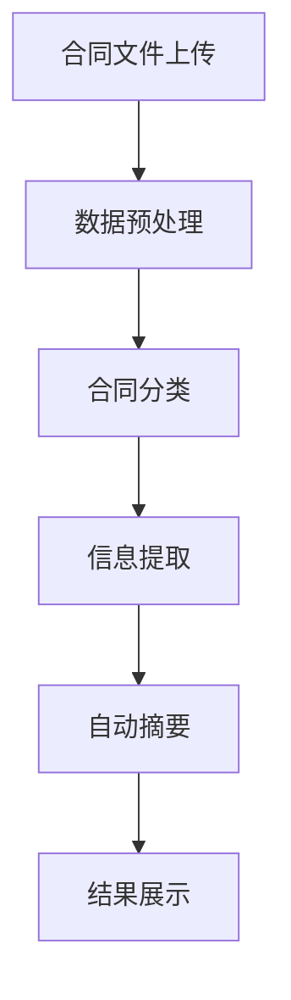
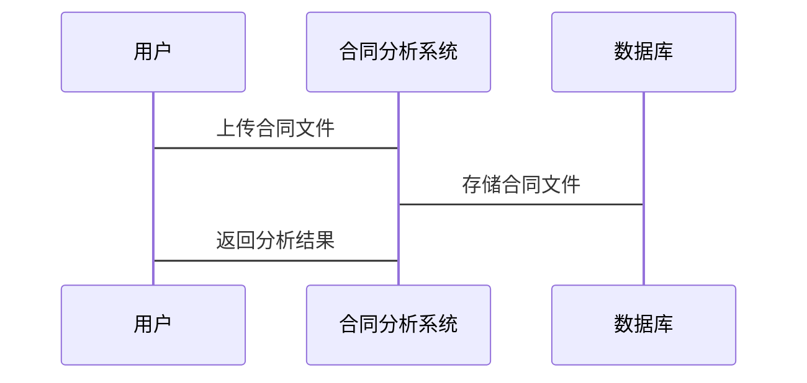

                 


# 自然语言处理在合同文件分析中的应用

> **关键词**：自然语言处理，合同分析，信息提取，机器学习，深度学习

> **摘要**：  
自然语言处理（NLP）技术在合同文件分析中的应用日益广泛。合同文件作为法律和商业领域的重要文档，其内容复杂、格式多样，传统的人工分析效率低下且容易出错。通过自然语言处理技术，可以实现合同文件的自动分类、信息提取、条款识别和关系分析等功能。本文将从合同文件分析的背景与意义出发，详细探讨NLP技术的核心原理、算法实现、系统架构设计及实际应用案例，为读者提供全面的理论与实践指导。

---

# 第一部分: 自然语言处理与合同文件分析基础

## 第1章: 自然语言处理与合同文件分析概述

### 1.1 合同文件分析的背景与意义

#### 1.1.1 合同文件分析的背景

合同文件是法律和商业领域的重要文档，通常包含大量的法律条款、责任说明和权利义务等内容。传统的合同分析依赖于人工阅读和理解，这种方式不仅效率低下，而且容易出错。随着企业规模的扩大和合同数量的增加，人工分析的局限性愈发明显。因此，如何利用技术手段提高合同分析的效率和准确性，成为亟待解决的问题。

#### 1.1.2 合同文件分析的描述

合同文件分析的目标是将非结构化的文本信息转化为结构化的数据，以便于计算机处理和分析。这包括合同的分类、信息提取、条款识别和关系分析等多个方面。例如，可以从合同中提取关键信息如合同金额、履行期限、违约责任等，为企业的决策提供支持。

#### 1.1.3 自然语言处理在合同分析中的作用

自然语言处理技术通过文本分词、句法分析、实体识别和机器学习等手段，能够自动提取合同中的关键信息，并进行分类和总结。NLP技术的引入，不仅提高了合同分析的效率，还能减少人为错误，为企业提供更加精准的分析结果。

#### 1.1.4 合同文件分析的边界与外延

合同文件分析的边界主要集中在文本处理和信息提取方面，而其外延则涉及合同管理、法律咨询和商业决策等多个领域。通过NLP技术，合同分析可以与企业管理系统、法律数据库等其他系统无缝对接，形成一个完整的合同生命周期管理平台。

---

## 1.2 合同文件分析的核心问题

### 1.2.1 合同文件的结构化与非结构化问题

合同文件通常以非结构化的文本形式存在，这使得信息提取变得复杂。如何将非结构化的文本转化为结构化的数据，是合同分析中的核心问题之一。

### 1.2.2 合同信息提取的关键挑战

合同信息提取需要准确识别和提取关键信息，如合同主题、金额、期限等。然而，合同文本中可能存在大量冗余信息和复杂句式，这增加了信息提取的难度。

### 1.2.3 自然语言处理在合同分析中的应用范围

NLP技术在合同分析中的应用范围包括合同分类、信息提取、条款识别和自动摘要等。这些技术可以单独使用，也可以组合应用，以实现更复杂的分析任务。

---

## 1.3 本章小结

本章主要介绍了合同文件分析的背景、意义和核心问题。通过分析合同文件的特点和NLP技术的作用，我们明确了合同分析的目标和应用范围。接下来的章节将深入探讨NLP技术在合同分析中的具体实现和应用。

---

# 第二部分: 自然语言处理技术在合同分析中的应用

## 第2章: 自然语言处理技术基础

### 2.1 分词与词性标注

#### 2.1.1 分词的基本原理

分词是将连续的文本分割成有意义的词语。在合同分析中，分词是后续处理的基础，例如信息提取和关键词匹配。

#### 2.1.2 词性标注的意义与方法

词性标注是将每个词语标注为名词、动词、形容词等。这有助于后续的句法分析和语义理解。常用方法包括基于规则的标注和基于统计的标注。

### 2.2 句法分析与语义理解

#### 2.2.1 句法分析的作用

句法分析通过分析句子的结构，确定词语之间的关系。这有助于理解合同文本的语法结构，从而提高信息提取的准确性。

#### 2.2.2 语义理解的挑战

语义理解是通过上下文理解词语和句子的含义。合同文本中可能存在大量专业术语和复杂句式，这增加了语义理解的难度。

### 2.3 常见的自然语言处理工具与库

#### 2.3.1 NLTK库的介绍

NLTK是Python中常用的语言处理库，提供了分词、词性标注和句法分析等功能。

#### 2.3.2 SpaCy的特征与优势

SpaCy是一个高效的NLP工具，支持多种语言处理，具有高性能和易用性。

#### 2.3.3 Stanford NLP工具的功能

Stanford NLP工具提供了强大的句法分析和语义理解功能，广泛应用于学术研究和工业应用。

### 2.4 本章小结

本章介绍了NLP技术的基础，包括分词、词性标注、句法分析和语义理解。这些技术为合同分析提供了基础支持。接下来的章节将探讨NLP技术在合同分析中的具体应用。

---

## 第3章: 合同分类与主题识别

### 3.1 合同分类的原理与方法

#### 3.1.1 基于传统机器学习的合同分类

传统机器学习方法如支持向量机（SVM）和朴素贝叶斯（Naive Bayes）常用于合同分类。这些方法简单易用，但在处理复杂任务时效果有限。

#### 3.1.2 基于深度学习的合同分类

深度学习模型如循环神经网络（RNN）和长短期记忆网络（LSTM）在合同分类中表现优异，能够处理复杂的文本结构。

#### 3.1.3 分类模型的评估与优化

评估合同分类模型的性能指标包括准确率、召回率和F1值。通过交叉验证和超参数优化，可以进一步提升模型性能。

### 3.2 合同主题识别的技术

#### 3.2.1 主题识别的定义与目标

合同主题识别旨在从合同文本中提取主要主题，例如“合同金额”、“履行期限”等。

#### 3.2.2 基于关键词提取的主题识别

通过提取合同文本中的关键词，可以快速识别合同的主题。

#### 3.2.3 基于主题模型的主题识别

主题模型如LDA（Latent Dirichlet Allocation）可以自动提取合同文本的主题，无需人工干预。

### 3.3 本章小结

本章详细探讨了合同分类和主题识别的技术。通过对比传统机器学习和深度学习方法，我们明确了不同场景下的适用方法。接下来的章节将探讨合同信息提取和条款识别的具体实现。

---

## 第4章: 合同信息提取与关键条款识别

### 4.1 信息提取的基本原理

#### 4.1.1 基于规则的信息提取

通过预定义的规则，可以从合同文本中提取特定信息，例如金额和期限。

#### 4.1.2 基于模式匹配的信息提取

模式匹配方法通过正则表达式匹配特定模式，适用于结构化的合同文本。

#### 4.1.3 基于机器学习的信息提取

机器学习方法通过训练模型自动提取信息，适用于非结构化的合同文本。

### 4.2 关键条款识别的技术

#### 4.2.1 关键条款的定义与分类

关键条款是指合同中重要的法律条款，如违约责任和保密条款。

#### 4.2.2 基于上下文理解的条款识别

通过分析上下文，可以准确识别合同中的关键条款。

#### 4.2.3 基于模板匹配的条款识别

模板匹配方法通过预定义的模板匹配合同中的条款，适用于结构化的合同文本。

### 4.3 本章小结

本章探讨了合同信息提取和关键条款识别的技术。通过对比不同的方法，我们明确了不同场景下的适用方法。接下来的章节将探讨合同关系分析和自动摘要的具体实现。

---

## 第5章: 合同关系分析与自动摘要

### 5.1 合同关系分析的原理

#### 5.1.1 实体识别与关系抽取

实体识别通过识别合同中的实体（如公司名称和金额）来分析合同关系。关系抽取则通过分析实体之间的关系，如“供应商向买方提供服务”。

#### 5.1.2 基于上下文理解的关系分析

通过分析上下文，可以更准确地理解合同中的关系。

### 5.2 合同自动摘要的技术

#### 5.2.1 自动摘要的定义与目标

合同自动摘要旨在从合同文本中提取关键信息并生成摘要。

#### 5.2.2 基于关键词提取的自动摘要

通过提取关键词生成合同摘要，适用于简单的合同文本。

#### 5.2.3 基于文本压缩的自动摘要

文本压缩方法通过删除冗余信息生成摘要，适用于复杂的合同文本。

### 5.3 本章小结

本章探讨了合同关系分析和自动摘要的技术。通过分析合同中的实体和关系，可以更好地理解合同内容。自动摘要技术可以为用户提供简洁的合同摘要。

---

# 第三部分: 系统分析与架构设计方案

## 第6章: 系统分析与架构设计

### 6.1 项目场景介绍

本项目旨在开发一个基于NLP技术的合同分析系统，实现合同分类、信息提取和自动摘要等功能。

### 6.2 系统功能设计

#### 6.2.1 领域模型设计

领域模型包括合同文件、合同分类、信息提取和自动摘要等模块。

#### 6.2.2 系统架构设计

系统架构采用分层设计，包括数据层、业务逻辑层和用户界面层。

#### 6.2.3 系统接口设计

系统接口包括文件上传接口、合同分类接口和信息提取接口。

### 6.3 系统架构图



### 6.4 系统交互图



### 6.5 本章小结

本章详细探讨了合同分析系统的架构设计，包括功能模块、系统接口和系统交互。接下来的章节将探讨系统的具体实现和应用案例。

---

## 第7章: 项目实战

### 7.1 环境安装

#### 7.1.1 安装Python和相关库

```bash
pip install python
pip install numpy
pip install scikit-learn
pip install spacy
```

#### 7.1.2 安装自然语言处理库

```bash
pip install nltk
pip install spacy
pip install transformers
```

### 7.2 系统核心实现源代码

#### 7.2.1 合同分类实现

```python
from sklearn.feature_extraction.text import TfidfVectorizer
from sklearn.svm import SVC
from sklearn.metrics import accuracy_score

vectorizer = TfidfVectorizer()
model = SVC()
model.fit(vectorizer.fit_transform(train_texts), train_labels)
predicted_labels = model.predict(vectorizer.transform(test_texts))
print("Accuracy:", accuracy_score(test_labels, predicted_labels))
```

#### 7.2.2 信息提取实现

```python
import spacy

nlp = spacy.load("en_core_web_sm")
doc = nlp(text)
for token in doc:
    if token.pos_ == "NOUN":
        print(token.text)
```

### 7.3 代码应用解读与分析

#### 7.3.1 合同分类代码解读

上述代码使用TF-IDF向量化和SVM模型进行合同分类。首先，将训练文本向量化，然后训练模型，最后对测试文本进行预测。

#### 7.3.2 信息提取代码解读

上述代码使用SpaCy进行信息提取，通过词性标注筛选出名词，从而提取合同文本中的关键实体。

### 7.4 实际案例分析

以一份采购合同为例，展示如何使用上述代码进行合同分类和信息提取。

### 7.5 本章小结

本章通过具体的代码实现，展示了合同分析系统的实际应用。通过项目实战，读者可以更好地理解NLP技术在合同分析中的具体实现。

---

## 第8章: 最佳实践与总结

### 8.1 小结

本篇文章详细探讨了自然语言处理在合同文件分析中的应用，包括合同分类、信息提取和自动摘要等技术。通过对比不同的方法和工具，我们明确了不同场景下的适用方法。

### 8.2 注意事项

在实际应用中，需要注意合同文本的多样性和复杂性，选择合适的技术和工具。同时，还需要关注模型的准确性和效率。

### 8.3 未来趋势

随着NLP技术的不断发展，合同分析系统将更加智能化和自动化。未来的研究方向包括更准确的信息提取技术和更高效的模型优化方法。

### 8.4 拓展阅读

推荐读者阅读以下书籍和论文：

- 《自然语言处理入门》
- 《深度学习实战》
- 《合同分析系统的构建与优化》

---

**全文小结**

本文系统地探讨了自然语言处理在合同文件分析中的应用，从基础的NLP技术到具体的系统设计和项目实战，为读者提供了全面的理论与实践指导。通过本文的学习，读者可以掌握合同分析的核心技术，并能够实际应用这些技术解决实际问题。未来，随着NLP技术的不断发展，合同分析系统将更加智能化和高效化，为企业和社会创造更大的价值。

