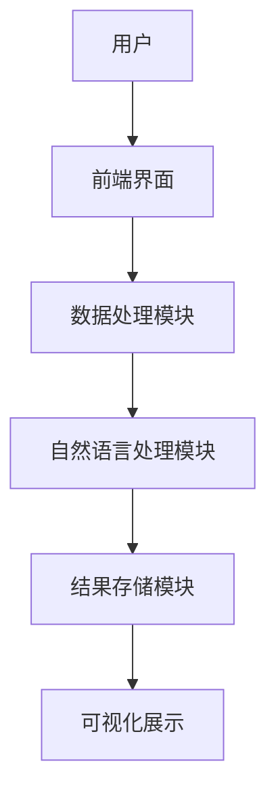

                 


# 自然语言处理在合规风险管理中的应用

> 关键词：自然语言处理，合规风险管理，文本挖掘，机器学习，金融监管

> 摘要：本文探讨了自然语言处理技术在合规风险管理中的应用，从背景、核心概念、算法原理、系统架构到项目实战，全面分析了NLP如何助力合规管理，提升企业风险管理能力。

---

## 第一部分：合规风险管理概述

### 第1章：合规风险管理的背景与意义

#### 1.1 合规风险管理的定义与重要性
合规风险管理是指识别、评估和应对与企业经营相关的法律法规、行业标准和内部政策风险的过程。其重要性体现在企业的合法运营、避免罚款和声誉损失，以及提升客户信任度。

#### 1.2 自然语言处理的定义与技术特点
自然语言处理（NLP）是计算机科学中的技术，旨在使计算机能够理解、处理和生成人类语言。其特点包括文本分析、语义理解、多语言支持等。

#### 1.3 合规风险管理与自然语言处理的结合
NLP在合规管理中的应用，能够自动处理大量文本数据，发现潜在风险，提高效率和准确性。

---

## 第二部分：自然语言处理的核心技术

### 第2章：自然语言处理的关键技术

#### 2.1 词法分析
- **分词技术**：将文本分割成词语，如中文分词。
- **词性标注**：给每个词语标注词性，如名词、动词。
- **命名实体识别（NER）**：识别文本中的专有名词，如人名、组织名。

#### 2.2 句法分析
- **依存句法分析**：分析句子中词语之间的关系。
- **语法树构建**：构建句法结构树，理解句子的语法关系。

#### 2.3 文本表示与语义分析
- **词向量表示（Word2Vec）**：通过词嵌入技术将词语转化为向量。
- **句子向量表示（如BERT）**：利用深度学习模型生成句子向量，捕捉语义信息。

---

## 第三部分：合规风险管理中的自然语言处理应用

### 第3章：合规风险管理中的NLP应用

#### 3.1 合规风险识别
- **合同审查**：利用NLP自动识别合同中的关键条款，如违约责任。
- **法律法规匹配**：将企业文档与相关法规进行匹配，识别潜在违规点。

#### 3.2 文本分类与主题分析
- **分类模型**：使用文本分类技术将合规文本归类，如将合同分为不同类别。
- **主题分析**：提取合规文本的主题，如识别财务报告中的风险点。

#### 3.3 实体识别与链接
- **识别关键实体**：在合规文本中识别公司名称、日期等实体。
- **实体链接**：将实体与外部知识库中的实体进行关联，如链接公司名称到其详细信息。

---

## 第四部分：算法原理与实现

### 第4章：自然语言处理算法原理

#### 4.1 BERT模型
- **模型结构**：基于Transformer的双向编码器。
- **应用场景**：文本分类、问答系统、实体识别。

#### 4.2 词嵌入
- **Word2Vec**：通过上下文预测单词，生成词向量。
- **GloVe**：全局向量词嵌入，基于全局文本统计生成词向量。

#### 4.3 文本分类
- **训练过程**：将文本输入模型，训练分类器，输出类别概率。
- **数学公式**：交叉熵损失函数用于训练模型。

---

## 第五部分：系统架构与设计

### 第5章：合规风险管理系统的架构设计

#### 5.1 系统功能设计
- **数据输入**：接收合规文本数据。
- **数据处理**：清洗、分词、实体识别。
- **模型推理**：使用NLP模型进行分析，输出结果。
- **结果展示**：以可视化方式呈现分析结果。

#### 5.2 系统架构图


---

## 第六部分：项目实战

### 第6章：合规风险管理系统的实现

#### 6.1 环境安装
- 安装Python、TensorFlow、Keras、spaCy等库。

#### 6.2 核心代码实现
```python
import spacy
nlp = spacy.load("en_core_web_sm")
doc = nlp("This is a test document.")
for token in doc:
    print(token.text, token.pos_)
```

#### 6.3 案例分析
- **案例背景**：分析一份财务报告，识别潜在的合规风险。
- **分析过程**：使用NLP模型识别关键词和实体，生成风险报告。

---

## 第七部分：总结与展望

### 第7章：总结与未来趋势

#### 7.1 总结
自然语言处理技术为合规风险管理提供了强大的工具，能够提升效率和准确性。

#### 7.2 未来趋势
- 更智能的NLP模型：如更大规模的预训练模型。
- 多模态分析：结合图像、语音等多模态数据进行分析。
- 自适应系统：根据实时数据动态调整合规策略。

---

## 结语

自然语言处理在合规风险管理中的应用前景广阔，随着技术的不断进步，NLP将为企业合规管理带来更大的价值和效率提升。

