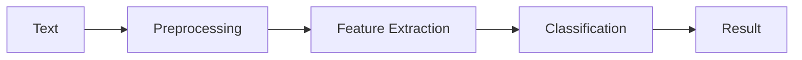
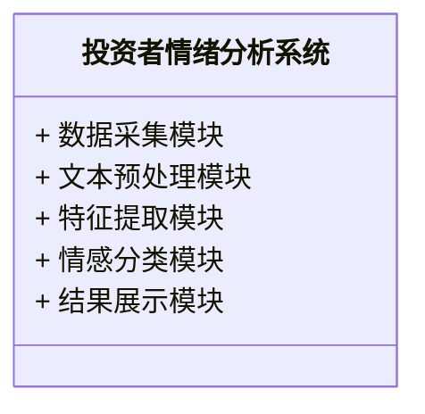

                 


# 自然语言处理在投资者情绪分析中的应用

> 关键词：自然语言处理，投资者情绪分析，文本挖掘，机器学习，金融情绪预测

> 摘要：本文详细探讨了自然语言处理（NLP）在投资者情绪分析中的应用，从基础概念到核心算法，再到实际项目实现，全面解析投资者情绪分析的原理、技术实现和应用案例。通过本文，读者可以深入了解如何利用NLP技术分析投资者情绪，并将其应用于金融市场预测和投资决策中。

---

# 第一部分: 自然语言处理与投资者情绪分析基础

## 第1章: 自然语言处理与投资者情绪分析概述

### 1.1 投资者情绪分析的定义与重要性

#### 1.1.1 投资者情绪分析的定义  
投资者情绪分析是通过对文本数据（如新闻、社交媒体评论、分析师报告等）进行处理，识别文本中的情感倾向（如正面、负面、中性）的过程。情绪分析可以帮助投资者理解市场参与者的心理状态，进而预测市场行为和价格波动。

#### 1.1.2 投资者情绪分析的重要性  
情绪分析在金融市场中具有重要意义。投资者的情绪往往会影响市场走势，例如，负面情绪可能导致股价下跌，而正面情绪则可能推动股价上涨。通过分析投资者情绪，投资者可以做出更明智的决策，机构也可以利用情绪数据进行市场预测。

#### 1.1.3 情绪分析在金融领域的应用前景  
随着NLP技术的快速发展，情绪分析在金融领域的应用前景广阔。从实时监控市场情绪到历史数据分析，情绪分析可以帮助投资者捕捉市场趋势，优化投资策略。

---

### 1.2 自然语言处理技术简介

#### 1.2.1 自然语言处理的定义与核心任务  
自然语言处理（NLP）是计算机科学、人工智能和语言学的交叉领域，旨在让计算机能够理解和处理人类语言。核心任务包括文本分类、信息抽取、情感分析、机器翻译等。

#### 1.2.2 自然语言处理在金融领域的应用  
在金融领域，NLP技术广泛应用于新闻情感分析、公司财报分析、社交媒体监控等领域。例如，通过分析新闻标题的情绪，投资者可以快速了解市场动态。

#### 1.2.3 投资者情绪分析与自然语言处理的关系  
投资者情绪分析是NLP在金融领域的一个重要应用，它依赖于NLP技术来提取文本特征、训练分类模型，并最终预测情绪。

---

### 1.3 投资者情绪分析的技术背景

#### 1.3.1 文本预处理技术  
文本预处理是情绪分析的第一步，包括分词、去除停用词、词干提取等。例如，将“stocks are great”处理为“stock great”。

#### 1.3.2 文本特征提取方法  
特征提取是将文本转化为可计算形式的过程。常用方法包括TF-IDF、词袋模型和词嵌入（如Word2Vec）。例如，TF-IDF可以提取文本中最重要的关键词。

#### 1.3.3 机器学习与深度学习在情绪分析中的应用  
机器学习（如SVM、随机森林）和深度学习（如RNN、LSTM）是情绪分析的两大类算法。深度学习在处理复杂语义时表现更优，而机器学习则在小数据场景下表现稳定。

---

## 第2章: 投资者情绪分析的核心概念与联系

### 2.1 投资者情绪分析的原理

#### 2.1.1 情感分类的基本原理  
情感分类是通过训练数据让模型学习情感特征，最终对未见文本进行分类的过程。例如，训练一个模型来区分“积极”、“消极”和“中性”情绪。

#### 2.1.2 文本特征提取的实现方式  
特征提取是情绪分析的关键步骤。除了传统的TF-IDF，深度学习模型（如BERT）可以直接处理文本，提取上下文特征。

#### 2.1.3 上下文理解的重要性  
上下文理解是区分“bullish”（牛市）和“bearish”（熊市）情绪的关键。例如，相同的单词在不同上下文中可能表示不同的情绪。

---

### 2.2 核心概念对比分析

#### 2.2.1 传统NLP与深度学习NLP的对比  
传统NLP依赖特征工程，而深度学习通过端到端训练自动提取特征。例如，使用Word2Vec提取词向量，而BERT可以直接编码整个句子。

#### 2.2.2 情感分析与文本分类的异同  
情感分析是一种特殊的文本分类任务，其目标是分类文本的情绪，而文本分类的目标更广泛，可以是主题分类、实体识别等。

#### 2.2.3 投资者情绪与市场行为的关系  
投资者情绪是市场行为的重要驱动因素。例如，恐慌情绪可能导致抛售，而乐观情绪可能导致买入。

---

### 2.3 实体关系图


---

## 第3章: 投资者情绪分析的算法原理

### 3.1 文本预处理算法

#### 3.1.1 分词与词干提取  
分词是将文本分割成单词或短语的过程。例如，将“trading stocks”分割为“trading”和“stocks”。

#### 3.1.2 去除停用词  
停用词包括“is”、“am”、“the”等常见词汇，它们对情感分析的贡献较小。例如，从“the stock is great”中去除“is”和“the”。

---

### 3.2 特征提取与分类算法

#### 3.2.1 TF-IDF特征提取  
TF-IDF（Term Frequency-Inverse Document Frequency）是一种常用的特征提取方法。例如，对于文本“stocks are great”，TF-IDF会计算每个词的重要程度。

#### 3.2.2 机器学习分类算法  
常用的机器学习算法包括SVM、随机森林等。例如，使用SVM对文本进行二分类（积极/消极）。

#### 3.2.3 深度学习模型  
深度学习模型（如LSTM、BERT）在处理复杂语义时表现更优。例如，BERT可以捕捉句子的上下文信息。

---

### 3.3 情感分类算法实现

#### 3.3.1 算法流程  


#### 3.3.2 代码实现  
```python
from sklearn.feature_extraction.text import TfidfVectorizer
from sklearn.svm import SVC

# 示例文本
texts = ["stocks are great", "market is down"]

# 特征提取
vectorizer = TfidfVectorizer()
X = vectorizer.fit_transform(texts)

# 模型训练
model = SVC()
model.fit(X, [1, 0])  # 1表示积极，0表示消极

# 预测
print(model.predict(vectorizer.transform(["market is up"])))
```

---

## 第4章: 投资者情绪分析的系统分析与架构设计

### 4.1 问题场景介绍

#### 4.1.1 投资者情绪分析的应用场景  
投资者情绪分析可以应用于实时市场监控、新闻情感分析、社交媒体情绪分析等场景。例如，实时监控社交媒体上的投资者情绪，预测市场走势。

#### 4.1.2 系统功能设计  
系统需要实现以下功能：  
- 数据采集：获取新闻、社交媒体数据  
- 文本预处理：分词、去除停用词  
- 特征提取：TF-IDF、Word2Vec  
- 情感分类：SVM、LSTM  
- 结果展示：可视化情绪分布、趋势分析

---

### 4.2 系统架构设计

#### 4.2.1 领域模型  


#### 4.2.2 系统架构  


---

## 第5章: 投资者情绪分析的项目实战

### 5.1 环境安装

#### 5.1.1 安装Python与相关库  
```bash
pip install scikit-learn
pip install tensorflow
pip install transformers
```

#### 5.1.2 数据集准备  
使用社交媒体评论或新闻标题作为训练数据。

---

### 5.2 核心代码实现

#### 5.2.1 数据预处理  
```python
import nltk
from nltk.corpus import stopwords

def preprocess(text):
    words = nltk.word_tokenize(text.lower())
    words = [word for word in words if word not in stopwords.words('english')]
    return ' '.join(words)
```

#### 5.2.2 情感分类模型  
```python
from transformers import BertTokenizer, BertModel
from sklearn.metrics import accuracy_score

tokenizer = BertTokenizer.from_pretrained('bert-base-uncased')
model = BertModel.from_pretrained('bert-base-uncased')

def classify_emotion(texts, labels):
    inputs = tokenizer(texts, padding=True, truncation=True, return_tensors='np')
    outputs = model(**inputs)
    features = outputs.last_hidden_state[:, 0, :]
    # 使用SVM进行分类
    from sklearn.svm import SVC
    clf = SVC()
    clf.fit(features, labels)
    return clf

# 训练模型
model = classify_emotion(train_texts, train_labels)

# 预测
test_inputs = tokenizer(test_texts, padding=True, truncation=True, return_tensors='np')
test_outputs = model(**test_inputs)
test_features = test_outputs.last_hidden_state[:, 0, :]
print(accuracy_score(model.predict(test_features), test_labels))
```

---

### 5.3 案例分析

#### 5.3.1 情感分析案例  
分析新闻标题：“Market crashes as investors panic sell”。模型预测情绪为负面。

#### 5.3.2 情绪强度预测  
通过词嵌入模型，计算情感强度，例如，使用情感词汇的权重进行加权平均。

---

## 第6章: 投资者情绪分析的最佳实践

### 6.1 实践小贴士

#### 6.1.1 数据质量的重要性  
确保数据来源可靠，例如，使用权威媒体的新闻数据。

#### 6.1.2 模型调优技巧  
尝试不同的模型（如BERT、SVM）和优化参数，选择表现最佳的模型。

#### 6.1.3 情绪分析的局限性  
情绪分析仅是辅助工具，不能完全替代人类判断。

---

### 6.2 总结与展望

#### 6.2.1 总结  
本文详细介绍了自然语言处理在投资者情绪分析中的应用，从理论到实践，全面解析了情绪分析的实现过程。

#### 6.2.2 展望  
未来，随着NLP技术的发展，投资者情绪分析将更加智能化和精准化，为金融决策提供更强大的支持。

---

## 第7章: 参考文献与拓展阅读

### 7.1 参考文献  
- [1] Manning, C. D., et al. *Introduction to Information Retrieval*.  
- [2] Liu, Y. *Sentiment Analysis: A Comprehensive Survey.*  
- [3] Vaswani, A., et al. *Attention Is All You Need.*  

### 7.2 拓展阅读  
- 推荐阅读《自然语言处理实战：基于Python的机器学习和深度学习》，《金融数据分析实战：基于Python和机器学习》。

---

通过以上结构，您可以根据需要逐步撰写完整的文章。每一章的内容都可以进一步展开，详细讲解技术细节和实际应用案例。

