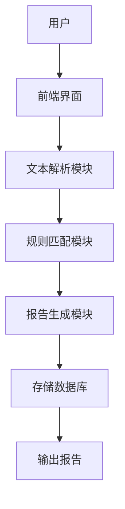

                 


# 自然语言处理在监管合规自动化中的应用

## 关键词：自然语言处理、监管合规、自动化、文本挖掘、机器学习

## 摘要：  
自然语言处理（NLP）技术在监管合规自动化中发挥着越来越重要的作用。通过对大量监管文本的自动解析和分析，NLP能够帮助企业和组织高效地识别合规风险、生成合规报告，并实现自动化监控。本文将深入探讨NLP在监管合规自动化中的核心应用，包括文本挖掘、实体识别、文本分类等关键技术，并结合实际案例分析其在金融、医疗等领域的具体应用场景。通过系统化的分析和实践，本文旨在为企业提供一套基于NLP的监管合规自动化解决方案，提升合规效率和准确性。

---

# 第一部分: 背景介绍

## 第1章: 监管合规自动化背景介绍

### 1.1 问题背景  
在当今高度监管的商业环境中，企业需要遵守越来越多的法律法规。然而，传统的人工合规审查方法效率低下，容易出错，且难以应对海量的监管文本。企业合规部门通常需要处理大量的法律文档、报告和通知，这些文档通常是非结构化的文本数据，难以通过传统的方法进行自动化处理。

### 1.2 问题描述  
监管合规的核心问题在于如何快速、准确地从非结构化文本中提取关键信息，例如合规条款、风险点、责任分配等。传统的人工审查方法不仅耗时，还容易因为主观因素导致错误。因此，如何利用技术手段实现监管合规的自动化，成为企业亟需解决的问题。

### 1.3 问题解决方法  
自然语言处理（NLP）技术可以通过对文本进行分词、实体识别、文本分类等操作，自动提取关键信息。这些技术可以帮助企业快速生成合规报告、识别潜在风险，并实现自动化监控。此外，结合机器学习算法，NLP还可以对监管文本进行模式识别和趋势预测，进一步提升合规效率。

### 1.4 边界与外延  
NLP在监管合规自动化中的应用范围包括但不限于：  
- **文本解析**：从监管文件中提取关键信息。  
- **合规报告生成**：自动生成符合监管要求的报告。  
- **风险预警**：基于文本分析识别潜在违规行为。  

### 1.5 核心要素与概念结构  
监管合规自动化的核心要素包括：  
- **监管文本**：法律法规、行业标准等文本数据。  
- **NLP技术**：文本分词、实体识别、文本分类等技术。  
- **合规规则**：企业的内部合规要求。  
- **自动化系统**：整合NLP技术的合规管理平台。

---

# 第二部分: 核心概念与联系

## 第2章: 自然语言处理与监管合规的核心概念

### 2.1 自然语言处理的定义与特点  
- **定义**：NLP是研究如何让计算机理解和生成人类语言的科学。  
- **特点**：  
  - 处理非结构化数据。  
  - 需要结合上下文理解。  
  - 结果具有不确定性。  

### 2.2 监管合规的核心概念  
- **定义**：企业为了遵守法律法规而采取的一系列措施。  
- **特点**：  
  - 文本密集型。  
  - 需要快速响应。  
  - 规则复杂多变。  

### 2.3 自然语言处理与监管合规的联系  
- **联系**：  
  - NLP可以帮助企业从监管文本中提取关键信息。  
  - 自动化生成合规报告。  
  - 实现实时风险预警。  

### 2.4 对比分析  
| 概念       | NLP特点                 | 监管合规特点               |
|------------|--------------------------|-----------------------------|
| 数据类型   | 非结构化文本             | 非结构化法律文本           |
| 目标       | 理解和生成人类语言         | 遵守法律法规               |
| 应用场景   | 文本分类、实体识别       | 合规审查、风险预警         |

### 2.5 实体关系图  
```mermaid
erDiagram
    reg_text [监管文本] {
        id
        text
        timestamp
    }
    reg_rule [合规规则] {
        id
        rule_content
        source
    }
    nlp_model [NLP模型] {
        model_id
        training_data
        parameters
    }
    compliance_report [合规报告] {
        report_id
        content
        status
    }
    reg_text --> reg_rule : "触发规则"
    nlp_model --> reg_text : "解析文本"
    nlp_model --> reg_rule : "匹配规则"
    reg_rule --> compliance_report : "生成报告"
```

---

# 第三部分: 算法原理

## 第3章: 自然语言处理的关键算法

### 3.1 分词算法  
- **定义**：将连续的文本分割成独立的词语或短语。  
- **实现流程**：  
  1. 预处理：去除停用词、分词。  
  2. 基于词典或统计模型进行分词。  
  3. 返回结果。  

### 3.2 实体识别  
- **定义**：识别文本中的命名实体，例如人名、地名、组织名等。  
- **实现流程**：  
  1. 使用预训练模型（如spaCy）进行实体识别。  
  2. 根据上下文调整识别结果。  

### 3.3 文本分类  
- **定义**：将文本分类到预定义的类别中。  
- **实现流程**：  
  1. 特征提取：将文本转换为数值特征。  
  2. 训练分类器（如SVM、随机森林）。  
  3. 预测分类结果。  

### 3.4 数学模型  
- **条件概率公式**：  
  $$ P(A|B) = \frac{P(B|A)P(A)}{P(B)} $$  
- **马尔可夫链模型**：  
  $$ P(X_i | X_{i-1}) $$  

---

## 第4章: 算法实现与优化

### 4.1 分词算法实现  
```python
import jieba

text = "自然语言处理在监管合规自动化中的应用"
words = jieba.lcut(text)
print(words)
```

### 4.2 实体识别实现  
```python
import spacy

nlp = spacy.load("zh_core_web_sm")
text = "中国银行必须遵守2023年新出台的金融法规。"
doc = nlp(text)
for ent in doc.ents:
    print(ent.text, ent.label_)
```

### 4.3 文本分类实现  
```python
from sklearn.feature_extraction.text import TfidfVectorizer
from sklearn.svm import SVC

vectorizer = TfidfVectorizer()
X = vectorizer.fit_transform(corpus)
model = SVC()
model.fit(X, y)
```

---

# 第四部分: 系统分析与架构设计

## 第5章: 系统架构设计

### 5.1 问题场景介绍  
监管合规自动化系统需要处理海量的监管文本，快速提取关键信息并生成合规报告。系统需要支持多种语言和复杂的文本格式。

### 5.2 系统功能设计  
- **文本解析模块**：对监管文本进行分词和实体识别。  
- **规则匹配模块**：将解析结果与合规规则进行匹配。  
- **报告生成模块**：根据匹配结果生成合规报告。  

### 5.3 系统架构图  


### 5.4 接口设计  
- **输入接口**：接收监管文本和合规规则。  
- **输出接口**：生成合规报告和风险预警。  

---

# 第五部分: 项目实战

## 第6章: 项目实现与案例分析

### 6.1 环境安装  
```bash
pip install jieba spacy transformers
python -m spacy download zh_core_web_sm
```

### 6.2 核心代码实现  
```python
import jieba
import spacy
from sklearn.feature_extraction.text import TfidfVectorizer
from sklearn.svm import SVC

# 分词示例
text = "中国银行必须遵守2023年新出台的金融法规。"
words = jieba.lcut(text)
print(words)

# 实体识别示例
nlp = spacy.load("zh_core_web_sm")
doc = nlp(text)
for ent in doc.ents:
    print(ent.text, ent.label_)

# 文本分类示例
corpus = ["合规文本1", "合规文本2", "非合规文本1"]
y = [0, 0, 1]
vectorizer = TfidfVectorizer()
X = vectorizer.fit_transform(corpus)
model = SVC()
model.fit(X, y)
```

### 6.3 案例分析  
以金融行业为例，分析如何利用NLP技术实现合规报告的自动生成。通过实际代码和案例，展示如何从监管文本中提取关键信息并生成报告。

---

# 第六部分: 最佳实践与总结

## 第7章: 最佳实践与总结

### 7.1 小结  
自然语言处理技术在监管合规自动化中具有重要应用价值。通过分词、实体识别、文本分类等技术，企业可以高效地处理监管文本，提升合规效率。

### 7.2 注意事项  
- 数据质量对结果影响重大。  
- 需要结合业务场景进行模型优化。  
- 注意数据隐私和合规性问题。  

### 7.3 拓展阅读  
- [spaCy官方文档](https://spacy.io/zh)  
- [jieba分词库](https://github.com/fxsjy/jieba)  
- [自然语言处理书籍推荐](https://www.amazon.com/)

---

# 结语  
通过本文的系统化分析和实践，读者可以深入了解自然语言处理在监管合规自动化中的应用。从理论到实践，逐步掌握如何利用NLP技术提升企业的合规效率和准确性。希望本文能为企业提供有价值的参考，推动监管合规自动化的发展。

