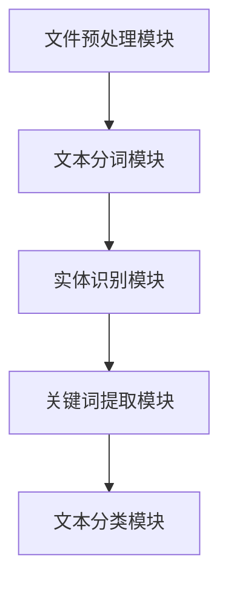

                 


# 自然语言处理在监管文件分析中的应用

> 关键词：自然语言处理，监管文件分析，文本挖掘，实体识别，文本分类

> 摘要：本文深入探讨了自然语言处理技术在监管文件分析中的应用，详细介绍了监管文件分析的背景、挑战与机遇，自然语言处理的核心技术及其在监管文件分析中的具体应用。文章通过实际案例分析，展示了如何利用自然语言处理技术实现监管文件的自动化分析，包括分词、实体识别、关键词提取和自动摘要等任务。同时，本文还探讨了系统架构设计、项目实战以及最佳实践，为读者提供了全面的技术指导和实践参考。

---

## 第1章: 监管文件分析的背景与意义

### 1.1 监管文件分析的背景

#### 1.1.1 监管文件的定义与特点
监管文件是指政府机构、企业或组织发布的正式文件，用于规范行为、发布政策或披露信息。监管文件通常具有以下特点：
- **正式性**：监管文件通常具有法律效力或权威性。
- **复杂性**：监管文件内容往往涉及复杂的法律术语和专业领域知识。
- **多样性**：监管文件的形式多样，包括法规、规章、政策文件等。

#### 1.1.2 监管文件分析的重要性
监管文件分析是理解和执行政策、法规的重要手段。通过分析监管文件，企业和组织可以更好地遵守法规，避免法律风险，同时也能利用监管文件中的信息进行业务决策。

#### 1.1.3 自然语言处理在监管文件分析中的作用
自然语言处理（NLP）技术可以帮助我们从监管文件中提取关键信息，如关键词、实体、关系等，从而实现监管文件的自动化分析和处理。

---

### 1.2 监管文件分析的挑战

#### 1.2.1 监管文件的复杂性
监管文件通常包含大量复杂的法律术语和专业领域知识，这使得传统的文本处理技术难以直接应用。

#### 1.2.2 数据量与多样性
监管文件的数量庞大且类型多样，如何高效地处理和分析这些文件是一个重要的挑战。

#### 1.2.3 精准度要求高
监管文件的分析需要高度的准确性和可靠性，尤其是在法律和合规领域，任何错误都可能带来严重后果。

---

## 第2章: 自然语言处理的核心技术与监管文件分析的结合

### 2.1 分词技术

#### 2.1.1 分词的基本概念
分词是将连续的文本分割成有意义的词语或短语的过程。在监管文件分析中，分词技术可以帮助我们识别关键词和主题。

#### 2.1.2 分词在监管文件分析中的应用
通过分词技术，我们可以从监管文件中提取出重要的关键词，如法律术语、政策名称等。

#### 2.1.3 常见的分词算法
- **基于统计的分词算法**：如最大匹配法、最小生成法等。
- **基于规则的分词算法**：如基于词典的分词算法。

---

### 2.2 实体识别与标注

#### 2.2.1 实体识别的基本概念
实体识别（NER）是指从文本中识别出命名实体，如人名、地名、组织名、时间等。

#### 2.2.2 实体识别在监管文件分析中的应用
在监管文件分析中，实体识别可以帮助我们识别出文件中的关键实体，如公司名称、法规名称等。

#### 2.2.3 常见的实体识别算法
- **CRF（条件随机场）模型**：基于统计学习的实体识别算法。
- **BERT模型**：基于深度学习的实体识别算法。

---

### 2.3 情感分析与文本分类

#### 2.3.1 情感分析的基本概念
情感分析是指从文本中识别出作者的情感倾向，如积极、消极或中性。

#### 2.3.2 情感分析在监管文件分析中的应用
在监管文件分析中，情感分析可以帮助我们识别文件中的语气和态度，如政策的严厉程度等。

#### 2.3.3 常见的情感分析算法
- **基于词袋模型的分类算法**：如朴素贝叶斯、支持向量机（SVM）等。
- **基于深度学习的分类算法**：如循环神经网络（RNN）、长短期记忆网络（LSTM）等。

---

## 第3章: 监管文件分析的系统架构与实现

### 3.1 系统架构设计

#### 3.1.1 系统功能模块
监管文件分析系统通常包括以下几个功能模块：
- **文件预处理模块**：对监管文件进行清洗和预处理。
- **文本分词模块**：对文本进行分词处理。
- **实体识别模块**：识别文本中的命名实体。
- **关键词提取模块**：提取文本中的关键词。
- **文本分类模块**：对文本进行分类。

#### 3.1.2 系统架构图
以下是监管文件分析系统的架构图：



---

### 3.2 系统实现

#### 3.2.1 环境安装
在实现监管文件分析系统之前，需要安装以下环境：
- **Python**：3.6及以上版本。
- **NLP库**：如spaCy、NLTK、HanLP等。
- **深度学习框架**：如TensorFlow、Keras等。

#### 3.2.2 核心代码实现
以下是监管文件分析系统的核心代码示例：

```python
import spacy

nlp = spacy.load("en_core_web_sm")

text = "This is a regulatory document. It contains important information."

doc = nlp(text)

for token in doc:
    print(token.text, token.pos_, token.lemma_)
```

---

## 第4章: 项目实战与案例分析

### 4.1 项目实战

#### 4.1.1 项目背景
假设我们有一个监管文件的集合，需要从中提取关键词和实体。

#### 4.1.2 项目实现
以下是项目的实现步骤：
1. **数据预处理**：清洗和标准化监管文件。
2. **文本分词**：使用spaCy对文本进行分词。
3. **实体识别**：识别文本中的命名实体。
4. **关键词提取**：提取文本中的关键词。
5. **结果可视化**：将提取的关键词和实体进行可视化展示。

#### 4.1.3 项目代码示例
以下是项目的代码示例：

```python
import spacy
from spacy import displacy

nlp = spacy.load("en_core_web_sm")

text = "The new regulation on data protection will be implemented next month."

doc = nlp(text)

# 实体识别
ents = [(ent.label_, ent.text) for ent in doc.ents]
print("Entities:", ents)

# 关键词提取
keywords = [token.lemma_ for token in doc if token.pos_ in ["NOUN", "ADJ", "VERB"]]
print("Keywords:", keywords)

# 结果可视化
displacy.render(doc, style="ent")
```

---

## 第5章: 最佳实践与总结

### 5.1 最佳实践

#### 5.1.1 选择合适的NLP工具
在选择NLP工具时，需要考虑工具的性能、易用性和支持的语言。

#### 5.1.2 数据预处理的重要性
数据预处理是监管文件分析的关键步骤，需要仔细清洗和标准化数据。

#### 5.1.3 模型调优与优化
在模型训练和调优过程中，需要不断优化模型的准确性和效率。

---

### 5.2 小结

通过本文的探讨，我们了解了自然语言处理技术在监管文件分析中的应用，包括分词、实体识别、关键词提取和文本分类等任务。同时，我们还通过实际案例分析，展示了如何利用这些技术实现监管文件的自动化分析。未来，随着NLP技术的不断发展，监管文件分析将更加智能化和高效化。

--- 

以上就是《自然语言处理在监管文件分析中的应用》的完整目录和文章内容。

