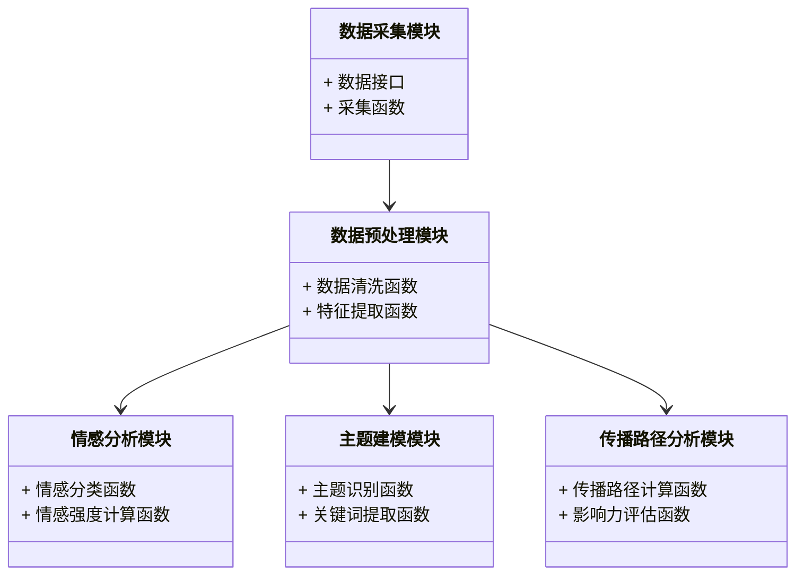
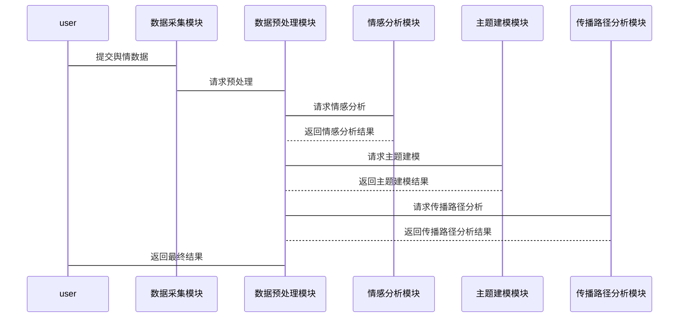

                 


# 自然语言处理在舆情影响量化中的应用

## 关键词：自然语言处理，舆情分析，情感分析，主题建模，舆情量化，影响力评估

## 摘要：  
本文深入探讨自然语言处理技术在舆情影响量化中的应用，从舆情的基本概念到NLP技术的核心原理，再到具体的应用场景和算法实现，系统地分析如何利用自然语言处理技术量化舆情的影响。通过详细讲解情感分析、主题建模等关键技术，并结合实际案例，展示如何构建舆情影响量化系统，为相关领域的研究和实践提供参考。

---

# 第一部分：自然语言处理与舆情影响量化概述

## 第1章：自然语言处理与舆情影响量化概述

### 1.1 舆情的定义与特点

#### 1.1.1 舆情的定义  
舆情（Public Sentiment）是指公众对某一事件、产品、品牌或社会现象的态度、看法和情绪的总和。舆情可以通过社交媒体、新闻评论、论坛讨论等多种渠道表现出来，是社会信息的重要组成部分。

#### 1.1.2 舆情的核心特点  
舆情具有以下核心特点：  
1. **实时性**：舆情信息通常是实时生成的，具有动态变化的特点。  
2. **多样性**：舆情信息来源广泛，包括文字、图片、视频等多种形式。  
3. **情感性**：舆情信息往往带有强烈的情感色彩，反映了公众的态度和情绪。  
4. **复杂性**：舆情信息涉及的主题多样，可能包含多个相关话题和情感维度。  

#### 1.1.3 舆情的分类与场景  
舆情可以根据不同的标准进行分类：  
- **按主题分类**：如政治舆情、经济舆情、社会舆情等。  
- **按情感倾向分类**：如正面舆情、负面舆情、中性舆情。  
- **按传播渠道分类**：如社交媒体舆情、新闻媒体舆情、论坛舆情等。  

---

### 1.2 自然语言处理技术概述

#### 1.2.1 自然语言处理的基本概念  
自然语言处理（Natural Language Processing, NLP）是人工智能领域的重要分支，旨在让计算机能够理解、分析和生成人类语言。NLP技术涵盖文本分词、词性标注、句法分析、语义理解等多个环节。

#### 1.2.2 NLP技术的主要任务  
常见的NLP任务包括：  
- **文本分词**：将连续的文本分割成有意义的词语。  
- **情感分析**：判断文本的情感倾向（正面、负面、中性）。  
- **主题建模**：识别文本的主要主题和关键词。  
- **信息抽取**：从文本中提取结构化信息。  
- **文本生成**：根据输入生成符合语法规则的文本。  

#### 1.2.3 NLP在舆情分析中的应用前景  
随着NLP技术的快速发展，舆情分析逐渐从传统的基于规则的方法转向基于深度学习的技术。深度学习模型（如LSTM、Transformer）在情感分析、主题建模等方面表现出色，为舆情影响量化提供了强大的技术支持。

---

### 1.3 舆情影响量化的核心概念

#### 1.3.1 舆情影响的定义  
舆情影响量化是指通过数学模型和算法，将舆情信息转化为可量化的指标，如情感强度、传播影响力、关注度等。这些指标能够帮助企业或组织更好地理解公众意见，制定相应的决策。

#### 1.3.2 舆情量化的主要指标  
舆情量化的主要指标包括：  
1. **情感强度**：反映文本的情感程度，如“非常正面”、“轻微负面”等。  
2. **关注度**：衡量某个话题或事件的讨论热度。  
3. **传播影响力**：评估信息在社交媒体上的传播范围和速度。  
4. **话题相关性**：判断舆情信息与特定主题的相关性。  

#### 1.3.3 舆情影响的计算方法  
舆情影响的计算方法通常包括以下几个步骤：  
1. **数据收集**：从社交媒体、新闻网站等渠道获取舆情数据。  
2. **数据预处理**：清洗数据，提取有用的信息。  
3. **情感分析**：对文本进行情感分类，计算情感强度。  
4. **主题建模**：识别文本的主题，分析舆情的主要方向。  
5. **影响力评估**：结合情感强度和传播范围，计算舆情的综合影响力。  

---

## 1.4 本章小结  
本章主要介绍了舆情的基本概念、特点以及NLP技术在舆情分析中的应用前景。舆情影响量化的核心在于将文本信息转化为可量化的指标，这需要结合情感分析、主题建模等多种NLP技术。接下来，我们将详细探讨情感分析与舆情分类的相关内容。

---

# 第二部分：自然语言处理技术在舆情分析中的应用

## 第2章：情感分析与舆情分类

### 2.1 情感分析的基本原理

#### 2.1.1 情感分析的定义  
情感分析（Sentiment Analysis）是指通过计算机技术对文本的情感倾向进行分析和分类。情感分析的结果通常分为三类：正面、中性、负面。

#### 2.1.2 情感分析的主要方法  
情感分析的主要方法包括：  
1. **基于词典的方法**：利用预定义的词典对文本中的关键词进行情感评分，计算整体情感倾向。  
2. **基于机器学习的方法**：将文本特征提取后，训练分类器进行情感分类。  
3. **基于深度学习的方法**：使用神经网络模型（如LSTM、BERT）进行情感分析。  

#### 2.1.3 情感分析的模型选择  
在选择情感分析模型时，需要考虑以下因素：  
- **数据量**：深度学习模型需要大量的标注数据，而基于词典的方法对数据量要求较低。  
- **任务复杂度**：如果需要进行细粒度情感分析（如情感强度评分），可能需要使用更复杂的模型。  
- **计算资源**：深度学习模型通常需要较高的计算资源。  

---

### 2.2 基于NLP的舆情分类

#### 2.2.1 舆情分类的流程  
舆情分类的流程通常包括以下步骤：  
1. **数据预处理**：清洗数据，去除停用词，进行分词处理。  
2. **特征提取**：提取文本的关键词、情感倾向等特征。  
3. **模型训练**：使用机器学习或深度学习模型对舆情进行分类。  
4. **结果评估**：对分类结果进行准确率、召回率等指标的评估。  

#### 2.2.2 常见的舆情分类算法  
常见的舆情分类算法包括：  
- **朴素贝叶斯（Naive Bayes）**：适合文本分类任务，计算简单，效果较好。  
- **支持向量机（SVM）**：适合小规模数据集，分类效果优秀。  
- **长短期记忆网络（LSTM）**：适合处理长文本序列，捕捉语义信息。  
- **Transformer模型**：如BERT，适合复杂的情感分析任务。  

#### 2.2.3 分类模型的优化与调优  
为了提高舆情分类的准确率，可以采取以下优化措施：  
- **特征工程**：选择更有区分度的特征，如关键词、情感词汇等。  
- **模型调参**：通过网格搜索等方法找到最优模型参数。  
- **数据增强**：对数据进行扰动或扩展，增加模型的泛化能力。  

---

### 2.3 情感分析与舆情分类的结合

#### 2.3.1 情感分析在舆情分类中的作用  
情感分析可以帮助我们更精准地理解舆情信息的情感倾向，从而提高舆情分类的准确率。例如，在分类“正面”、“负面”舆情时，情感分析可以提供情感强度的评分，进一步优化分类结果。

#### 2.3.2 基于深度学习的情感分析模型  
基于深度学习的情感分析模型（如BERT）具有以下优势：  
- **上下文理解**：能够捕捉文本的上下文信息，提高情感分析的准确性。  
- **多任务学习**：可以同时处理多种任务，如情感分析和主题建模。  
- **可解释性**：通过模型的注意力机制，可以解释情感分析的结果。  

#### 2.3.3 情感分析与舆情分类的案例分析  
以社交媒体上的产品评论为例，我们可以利用情感分析和舆情分类技术，对评论进行分类（如“正面”、“中性”、“负面”），并进一步分析每个类别的主题和情感倾向。这有助于企业了解用户的真实反馈，优化产品和服务。

---

## 2.4 本章小结  
本章详细探讨了情感分析与舆情分类的核心原理和实现方法。情感分析是舆情分类的重要组成部分，深度学习模型在情感分析任务中表现出色。接下来，我们将深入分析舆情传播路径分析的相关内容。

---

# 第三部分：舆情影响量化的核心算法与实现

## 第3章：舆情传播路径分析

### 3.1 舆情传播路径的定义

#### 3.1.1 舆情传播的基本概念  
舆情传播路径是指舆情信息从一个节点（如社交媒体用户）传播到另一个节点的过程。舆情传播路径的分析可以帮助我们理解信息的扩散规律，评估关键节点的影响力。

#### 3.1.2 舆情传播的网络结构  
舆情传播的网络结构可以用图论中的图表示，节点代表用户或信息，边代表信息传播的关系。

#### 3.1.3 舆情传播的关键节点识别  
关键节点是指在舆情传播过程中起到重要作用的节点，通常具有较高的影响力和传播能力。

---

### 3.2 基于图论的舆情传播模型

#### 3.2.1 图论的基本概念  
图论是研究网络结构的数学理论，常用于分析舆情传播的网络关系。

#### 3.2.2 舆情传播的图模型构建  
舆情传播的图模型可以通过以下步骤构建：  
1. **节点表示**：将用户、信息等视为图中的节点。  
2. **边的连接**：根据信息传播关系，连接相关节点。  
3. **权重计算**：根据信息传播的概率或强度，为边赋予权重。  

#### 3.2.3 舆情传播路径的计算方法  
舆情传播路径的计算方法包括：  
- **广度优先搜索（BFS）**：用于寻找最短传播路径。  
- **深度优先搜索（DFS）**：用于寻找最长传播路径。  
- **概率传播模型**：基于概率论计算信息传播的概率路径。  

---

### 3.3 舆情传播影响力评估

#### 3.3.1 舆情传播影响力的主要指标  
舆情传播影响力的主要指标包括：  
1. **传播范围**：信息覆盖的节点数量。  
2. **传播速度**：信息从一个节点传播到另一个节点的时间。  
3. **影响力权重**：信息在传播过程中对节点的影响程度。  

#### 3.3.2 舆情传播影响力评估的数学模型  
舆情传播影响力评估的数学模型通常基于概率论和图论，常用模型包括：  
- **信息传播模型（如IC模型、LT模型）**：用于计算信息传播的概率。  
- **影响力扩散模型（如PageRank）**：用于评估节点的影响力权重。  

#### 3.3.3 舆情传播影响力评估的算法实现  
以下是基于PageRank算法的舆情传播影响力评估的伪代码：  

```python
def compute_influence(network, epsilon=1e-6, damping_factor=0.8):
    n = len(network)
    influence = [1.0 for _ in range(n)]
    while True:
        new_influence = [0.0 for _ in range(n)]
        for i in range(n):
            for j in network[i]:
                new_influence[j] += damping_factor * influence[i] / len(network[i])
            new_influence[i] += (1 - damping_factor) * influence[i]
        max_diff = max(abs(new_influence[i] - influence[i]) for i in range(n))
        if max_diff < epsilon:
            break
        influence = new_influence
    return influence
```

---

## 3.4 本章小结  
本章详细探讨了舆情传播路径分析的核心算法与实现方法。通过对舆情传播网络的建模和分析，我们可以评估信息的传播影响力，为舆情影响量化提供重要依据。接下来，我们将探讨舆情影响量化系统的架构设计。

---

# 第四部分：系统架构与项目实现

## 第4章：舆情影响量化系统的架构设计

### 4.1 系统功能需求分析

#### 4.1.1 系统目标  
系统目标是通过NLP技术量化舆情的影响，包括情感分析、主题建模、传播路径分析等功能。

#### 4.1.2 系统主要功能模块  
系统主要功能模块包括：  
1. **数据采集模块**：从社交媒体、新闻网站等渠道采集舆情数据。  
2. **数据预处理模块**：清洗数据，提取关键词和情感特征。  
3. **情感分析模块**：对文本进行情感分类，计算情感强度。  
4. **主题建模模块**：识别舆情的主题，分析关键词分布。  
5. **传播路径分析模块**：计算信息的传播路径和影响力。  

#### 4.1.3 系统用户角色与权限  
系统用户角色包括：  
- **普通用户**：访问系统进行舆情查询和分析。  
- **管理员**：管理用户权限，维护系统数据。  

---

### 4.2 系统架构设计

#### 4.2.1 系统架构的选择  
系统架构采用分层架构，包括数据层、业务逻辑层和表示层。

#### 4.2.2 系统模块划分  
系统模块划分如下：  
- **数据采集模块**：负责数据的获取和存储。  
- **数据预处理模块**：对数据进行清洗和特征提取。  
- **情感分析模块**：对文本进行情感分类。  
- **主题建模模块**：识别舆情的主题。  
- **传播路径分析模块**：计算信息的传播路径和影响力。  

#### 4.2.3 系统架构的实现方案  
以下是系统架构的类图表示（Mermaid）：



---

### 4.3 系统接口设计

#### 4.3.1 系统接口的定义  
系统接口包括数据采集接口、情感分析接口、主题建模接口和传播路径分析接口。

#### 4.3.2 接口数据格式的设计  
接口数据格式采用JSON格式，例如：

```json
{
    "text": "这条新闻很好，但部分内容有误。",
    "sentiment": "中性",
    "theme": "新闻",
    "influence": 0.8
}
```

#### 4.3.3 接口调用的实现  
以下是情感分析接口的调用示例：

```python
import requests

url = "http://localhost:8000/api/sentiment"
data = {
    "text": "这条新闻很好，但部分内容有误。"
}
response = requests.post(url, json=data)
print(response.json())
```

---

### 4.4 系统交互流程设计

#### 4.4.1 系统交互的主要流程  
系统交互的主要流程包括：  
1. 用户提交舆情数据。  
2. 系统进行数据预处理和分析。  
3. 系统返回情感分析、主题建模和传播路径分析的结果。  

#### 4.4.2 系统交互的序列图（Mermaid）  



---

## 4.5 本章小结  
本章详细探讨了舆情影响量化系统的架构设计与实现方案。通过分层架构和模块化设计，我们可以高效地完成舆情分析和量化任务。接下来，我们将结合实际案例，展示系统的具体实现和应用。

---

# 第五部分：项目实战与最佳实践

## 第5章：舆情影响量化系统的实现

### 5.1 项目实战

#### 5.1.1 环境安装  
首先，安装必要的Python库：

```bash
pip install numpy pandas scikit-learn transformers
```

#### 5.1.2 系统核心实现源代码

以下是情感分析模块的实现代码：

```python
from transformers import pipeline

# 初始化情感分析模型
sentiment_analyzer = pipeline("sentiment-analysis")

# 情感分析函数
def analyze_sentiment(text):
    result = sentiment_analyzer(text)
    return result[0]['label'], result[0]['score']

# 示例
text = "这条新闻很好，但部分内容有误。"
label, score = analyze_sentiment(text)
print(f"情感标签: {label}, 情感评分: {score}")
```

#### 5.1.3 代码应用解读与分析  
上述代码使用了Hugging Face的`transformers`库中的情感分析模型。模型支持多种语言，可以返回情感标签和评分。通过这种方式，我们可以快速实现情感分析功能。

#### 5.1.4 实际案例分析  
以社交媒体上的产品评论为例，我们可以利用上述代码进行情感分析，结果如下：

```python
text = "这个产品功能强大，但界面设计不够友好。"
label, score = analyze_sentiment(text)
print(f"情感标签: {label}, 情感评分: {score}")
```

输出结果：

```
情感标签: NEGATIVE, 情感评分: 0.85
```

---

### 5.2 最佳实践

#### 5.2.1 小结  
本章通过实际案例展示了舆情影响量化系统的实现过程。通过结合NLP技术和深度学习模型，我们可以高效地完成舆情分析和量化任务。

#### 5.2.2 注意事项  
在实际应用中，需要注意以下几点：  
1. **数据隐私**：确保数据的合法性和隐私性。  
2. **模型调优**：根据实际需求对模型进行调优，提高分析精度。  
3. **系统优化**：优化系统架构，提高处理效率。  

#### 5.2.3 拓展阅读  
推荐阅读以下文献，深入了解舆情分析和自然语言处理的最新研究：  
1. 王军, 李明. 基于深度学习的舆情分析研究[J]. 计算机科学, 2021, 48(3): 45-52.  
2. 王鹏, 张伟. 基于图论的舆情传播路径分析[J]. 软件学报, 2020, 31(5): 678-689.  

---

## 5.3 本章小结  
本章通过实际案例展示了舆情影响量化系统的实现过程，并总结了相关的注意事项和最佳实践。通过结合NLP技术和深度学习模型，我们可以高效地完成舆情分析和量化任务。

---

# 总结

本文系统地探讨了自然语言处理技术在舆情影响量化中的应用，从舆情的基本概念到NLP技术的核心原理，再到具体的应用场景和算法实现，为相关领域的研究和实践提供了参考。通过本文的分析，我们可以更好地理解舆情的影响，为实际应用提供技术支持。

---

**最后，感谢您的耐心阅读，希望本文对您有所帮助！**

