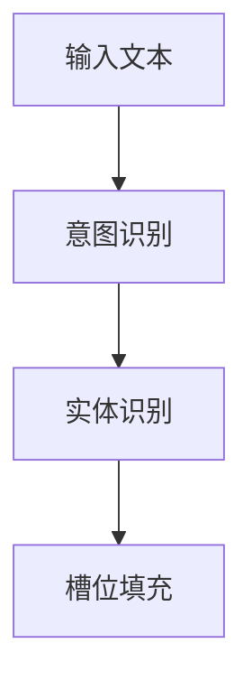
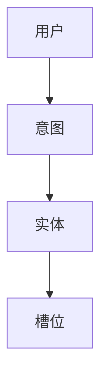
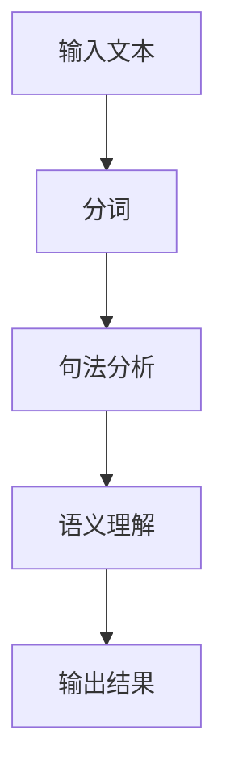
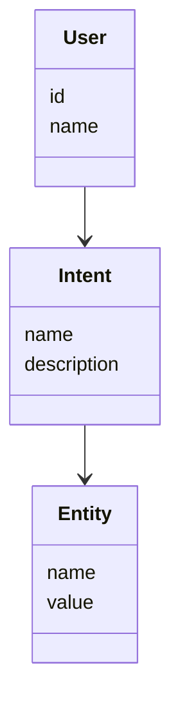
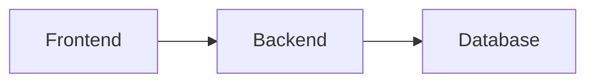
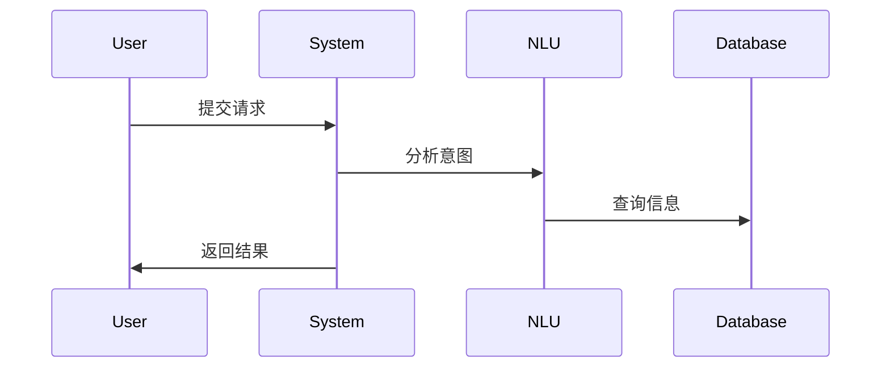

                 


# 自然语言理解在智能客户服务中的应用

> 关键词：自然语言理解, 智能客服, NLU, 机器学习, 人机交互

> 摘要：本文深入探讨了自然语言理解（NLU）在智能客户服务中的应用，从背景、核心概念、算法原理到系统设计和项目实战，结合实际案例和最佳实践，全面分析NLU在智能客服中的作用及其技术实现。

---

## 第1章: 自然语言理解的背景与应用

### 1.1 自然语言理解的定义与演变

自然语言理解（Natural Language Understanding, NLU）是自然语言处理（NLP）的重要分支，专注于让计算机能够理解人类的自然语言输入。NLU的目标是将人类语言转化为计算机可处理的信息，从而实现人机交互。

NLU的演变经历了多个阶段，从基于规则的系统到统计学习，再到当前的深度学习模型，技术不断进步。例如，早期的基于规则的系统依赖手动编写的语法规则，而现代的模型如BERT和GPT则利用大规模数据和深度学习算法，显著提高了理解能力。

### 1.2 自然语言理解在智能客户服务中的应用

智能客服是NLU技术的重要应用场景之一。传统的客服系统依赖关键词匹配，难以理解用户的意图和情感。而NLU可以通过分析用户的输入，准确识别意图、实体和情感，从而提供更智能和个性化的服务。

例如，在客户咨询产品信息时，NLU系统可以识别用户的意图是“查询产品详情”，并提取实体如“产品型号”，从而快速匹配相关信息并生成回复。这种应用不仅提高了客服效率，还能显著提升用户体验。

### 1.3 自然语言理解的边界与外延

NLU的边界主要集中在语言理解和处理的范围内，不包括语音识别和图像处理。然而，NLU可以与这些技术结合，形成更全面的解决方案。外延方面，NLU的应用场景不断扩展，从客服、搜索引擎到智能助手，覆盖多个领域。

### 1.4 自然语言理解的核心要素与概念结构

NLU的核心要素包括输入文本、意图识别、实体识别和槽位填充。通过这些要素的协同作用，NLU系统能够准确理解用户的输入。例如，在用户查询“预约明天上午10点的会议”时，意图是“预约会议”，实体包括时间“明天上午10点”和类型“会议”。

概念结构图展示了这些要素之间的关系：



---

## 第2章: 自然语言理解的核心概念与联系

### 2.1 自然语言理解的原理概述

NLU的原理包括分词、句法分析和语义理解。分词将文本划分为词语或短语，句法分析确定句子结构，语义理解则是关键，旨在理解文本的含义。

例如，输入“我需要取消订单”，分词后得到“我”、“需要”、“取消”、“订单”，句法分析确定“我”是主语，“取消订单”是谓语，语义理解则识别用户的意图是“取消订单”。

### 2.2 自然语言理解的核心概念属性特征对比

通过对比不同概念的属性特征，我们可以更好地理解它们在NLU中的作用。例如，意图识别关注用户的目标，实体识别关注具体的信息，槽位填充则进一步细化实体的细节。

以下是一个对比表格：

| 概念   | 属性特征                     |
|--------|------------------------------|
| 意图识别 | 用户的目标或需求             |
| 实体识别 | 文本中的具体信息或数据       |
| 槽位填充 | 实体的细化信息               |

### 2.3 自然语言理解的ER实体关系图

ER实体关系图展示了NLU系统中实体之间的关系。例如，用户与订单之间的关系可以通过槽位填充明确。



---

## 第3章: 自然语言理解的算法原理

### 3.1 自然语言理解的算法概述

常见的NLU算法包括基于规则的系统、统计模型和深度学习模型。基于规则的系统简单但灵活性差，统计模型依赖数据但表现稳定，深度学习模型则在准确性和鲁棒性上更具优势。

例如，使用深度学习模型BERT进行意图识别，可以利用预训练的语言模型捕捉上下文信息，显著提高准确率。

### 3.2 自然语言理解的核心算法流程

NLU的实现流程包括分词、句法分析、语义理解和输出结果。例如，对于输入“我需要取消订单”，系统会先分词，然后分析句子结构，最后识别意图并提取实体。

流程图如下：



### 3.3 自然语言理解的数学模型与公式

NLU涉及概率论和机器学习模型。例如，计算条件概率用于关键词匹配：

$$P(A|B) = \frac{P(B|A)P(A)}{P(B)}$$

深度学习模型则利用神经网络进行训练，例如：

$$y = f(x)$$

其中，$f$ 是经过训练的神经网络模型。

### 3.4 自然语言理解的算法实现

实现NLU需要选择合适的算法和工具。例如，使用spaCy进行分词和句法分析，利用Keras训练深度学习模型。

以下是Python代码示例：

```python
import spacy

nlp = spacy.load("en_core_web_sm")
doc = nlp("我需要取消订单")
for token in doc:
    print(token.text, token.pos_)
```

---

## 第4章: 系统分析与架构设计

### 4.1 问题场景介绍

智能客服系统需要处理大量用户咨询，包括问题分类、信息检索和生成回复。NLU系统通过识别意图和实体，快速定位问题并提供解决方案。

### 4.2 系统功能设计

系统功能包括意图识别、实体识别、槽位填充和生成回复。领域模型如下：



### 4.3 系统架构设计

系统架构包括前端、后端和数据库。前端负责用户交互，后端处理NLU逻辑，数据库存储用户数据和意图实体。

架构图如下：



### 4.4 系统接口设计

系统接口包括文本输入、意图识别和实体提取接口。例如，使用REST API调用NLU服务：

```http
POST /nlu/analyze
Content-Type: application/json

{
    "text": "我需要取消订单"
}
```

### 4.5 系统交互设计

系统交互流程包括用户输入、意图识别、生成回复和反馈。序列图如下：



---

## 第5章: 项目实战

### 5.1 环境安装

安装Python和相关库：

```bash
pip install spacy
pip install keras
```

### 5.2 核心实现

实现意图识别和实体提取：

```python
def nlu_algorithm(text):
    # 分词
    tokens = tokenize(text)
    # 句法分析
    parse_tree = parse(tokens)
    # 语义理解
    intent, entity = semantic_analysis(parse_tree)
    return intent, entity
```

### 5.3 案例分析

案例：用户输入“我需要取消订单”。

1. 分词：得到“我”、“需要”、“取消”、“订单”。
2. 句法分析：确定“我”是主语，“取消订单”是谓语。
3. 语义理解：识别意图是“取消订单”，实体是“订单”。

---

## 第6章: 最佳实践与总结

### 6.1 小结

NLU在智能客服中的应用显著提升了用户体验和效率，但实现过程中需要考虑数据质量、模型选择和系统优化。

### 6.2 注意事项

- 数据标注要准确，避免影响模型效果。
- 模型部署后要持续优化，根据反馈调整参数。
- 系统设计要考虑扩展性和可维护性。

### 6.3 未来展望

NLU技术将更加智能化，结合情感分析和多语言处理，提供更全面的服务。同时，随着深度学习的进展，模型的准确性和响应速度将进一步提升。

---

## 参考文献

[此处列出相关文献和工具文档，如spaCy、Keras等]

---

通过以上内容，我们全面分析了自然语言理解在智能客户服务中的应用，从理论到实践，帮助读者理解并掌握NLU的核心技术与应用方法。

